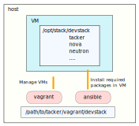

..
      Copyright (C) 2022 Nippon Telegraph and Telephone Corporation
      All Rights Reserved.

      Licensed under the Apache License, Version 2.0 (the "License"); you may
      not use this file except in compliance with the License. You may obtain
      a copy of the License at

          http://www.apache.org/licenses/LICENSE-2.0

      Unless required by applicable law or agreed to in writing, software
      distributed under the License is distributed on an "AS IS" BASIS, WITHOUT
      WARRANTIES OR CONDITIONS OF ANY KIND, either express or implied. See the
      License for the specific language governing permissions and limitations
      under the License.

Devstack Installation with Vagrant
==================================

This documentation is for introducing a deployment tool for Tacker.

You can find a :doc:`basic installation </install/devstack>` for deploying
OpenStack environment using ``devstack`` as a part of
:doc:`Tacker Installation Guide</install/index>`.
This guide expects you have already setup your VMs and installed all
packages required to run OpenStack.

However, it's something annoying for beginners, or developers frequently
cleanup their environment. You may want to use a tool to shortcut such a
tasks. This tool enables you to deploy several usecases with minimal effort.

How to Use
----------

Install Required Tools
~~~~~~~~~~~~~~~~~~~~~~

This installer consists of ``vagrant`` and ``ansible``.
Please follow instructions on official sites for installation.

* `vagrant <https://learn.hashicorp.com/tutorials/vagrant/getting-started-install>`_
* `ansible <https://docs.ansible.com/ansible/latest/installation_guide/intro_installation.html>`_

.. note::

    In this documentation, it's supposed you use
    `VirtualBox <https://www.virtualbox.org/>`_, but you can use any other
    hypervisor supported by ``vagrant``.

You should install plugin ``vagrant-disksize`` before launching your VMs
to enable to expand size of volume of VMs. It is because the default size
of box is fixed and not enough for deploying Tacker.

.. code-block:: console

    $ vagrant plugin install vagrant-disksize

Setup Configuration File
~~~~~~~~~~~~~~~~~~~~~~~~

.. note::

   Create your ssh key before running this tool to enable to direct login
   with auto-generated ssh config although you can still do two step login
   starts from ``vagrant ssh``. You can login to ``controller`` host with
   auto-generated config ``ssh_config`` as below.

   .. code-block:: console

       $ ssh -F ssh_config controller

Setup ``machines.yml`` which is a config file defines parameters of each
VM you deploy.
You can find some templates of ``machines.yml`` in ``samples`` directory.
This config file should be placed at ``/path/to/tacker/vagrant/devstack``
while running ``vagrant up``, or failed to run the command.

.. code-block:: console

    $ cd /path/to/tacker/vagrant/devstack
    $ cp samples/machines.yml ./
    $ YOUR_FAVORITE_EDITOR machines.yml

As named as ``machines.yml``, it defines parameters of each VMs.
There are two top sections in the file, ``global`` and ``machines``.
The former one defines common parameters among the VMs, and later one
is for each VM.

.. note::
   ``global`` is optional currently and only one parameter under the section
   is ``ssh_pub_key`` for specifying its location explicitly. You don't need
   to use it if your public key is ``$HOME/.ssh/id_rsa.pub``.

Here is an example of ``machine.yml``. It's is for single node usecase
and ``machines`` has only one entry.

.. literalinclude:: ../../../vagrant/devstack/samples/machines.yml
    :language: yaml

There are several parameters for each VM supported in this tool.

.. list-table::
   :widths: 30 125
   :header-rows: 1

   * - Attribute
     - Description
   * - hostname
     - Any hostname for convenience, such as ``controller`` or ``compute``.
   * - provider
     - Vagrant box provider.
   * - box
     - Name of the box.
   * - nof_cpus
     - The number of CPUs assigned to the VM.
   * - mem_size
     - The size of memory assigned to the VM.
   * - disk_size
     - The size of disk assigned to the VM.
   * - private_ips
     - Series of private IPs.
   * - public_ips
     - Series of public IPs.
   * - fwd_port_list
     - Series of combination of ``guest`` and ``host`` ports for port
       forwarding.

You also update entries of IP addresses in the inventory file
``hosts`` as you defined each ``private_ips`` in ``machines.yml``.

Now, you are ready to fire up the VMs and deploying OpenStack with
``ansible``.

Deploy OpenStack with Devstack
~~~~~~~~~~~~~~~~~~~~~~~~~~~~~~

Run ``vagrant up`` so that launches VMs and create ``stack`` user on them.

.. code-block:: console

    $ vagrant up

If ``vagrant up`` is completed successfully, you can login to the VMs as
``stack`` user with your ssh public key.

This tool provides ``ansible`` playbooks for setting up ``devstack``
installation. You don't need to modify the playbooks usually, but
configurable in ``group_vars/all.yml``. See :ref:`optional_config`
describing how you configure the file.

.. code-block:: console

    $ ansible-playbook -i hosts site.yml

After finished all tasks, you can login to the launched VMs. So, login to
controller node and run ``stack.sh`` for installing OpenStack.
You will find out that ``local.conf`` is already prepared for your
environment.
See instruction how to configure ``local.conf`` described in
`DevStack Quick Start <https://docs.openstack.org/devstack/latest/>`_
if you customize it furthermore by yourself.

.. code-block:: console

    $ ssh stack@192.168.33.11
    $ cd devstack
    $ YOUR_FAVORITE_EDITOR local.conf
    $ ./stack.sh

.. _optional_config:

Options Configuration
~~~~~~~~~~~~~~~~~~~~~

There some parameters in ``group_vars/all.yml`` such as password on
devstack or optional configurations. You don't need to update it usually.

.. literalinclude:: ../../../vagrant/devstack/group_vars/all.yml
    :language: yaml

Developer Tools
---------------

In the playbools, installation of vim and some extra packages is included
for developers. If you exclude such a developer tools, modify
``group_vars/all.yml`` before running ``ansible-playbook`` command.

.. list-table::
   :widths: 30 125
   :header-rows: 1

   * - Parameter
     - Description
   * - use_vim_latest
     - (Only for ubuntu) ``true`` or ``false`` for using the latest vim.
   * - use_vim_extra_plugins
     - ``true`` or ``false`` for installing vim packages including
       language servers for python and bash.
   * - use_extra_tools
     - | ``true`` or ``false`` for using extra packages bellow.
       | - jq
       | - htop (Ubuntu only)
       | - lnav (Ubuntu only)
