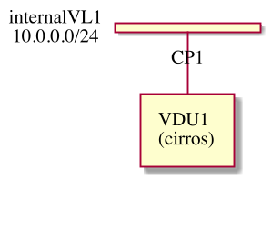

..
      Copyright 2014-2015 OpenStack Foundation
      All Rights Reserved.

      Licensed under the Apache License, Version 2.0 (the "License"); you may
      not use this file except in compliance with the License. You may obtain
      a copy of the License at

          http://www.apache.org/licenses/LICENSE-2.0

      Unless required by applicable law or agreed to in writing, software
      distributed under the License is distributed on an "AS IS" BASIS, WITHOUT
      WARRANTIES OR CONDITIONS OF ANY KIND, either express or implied. See the
      License for the specific language governing permissions and limitations
      under the License.

========================================
Getting Started with ETSI NFV-SOL Tacker
========================================

Summary
-------

This lecture enables you to:

-  create & delete a sample VNF on the OpenStack with Tacker

Following two types of VNF deployment supported by Tacker are introduced in
this lecture.

- VNF Deployment with TOSCA [#f1]_
- VNF Deployment with LCM Operation User Data (optional) [#f2]_

"VNF Deployment with LCM Operation User Data" is optional.
The part will be clarified with the notation [This is UserData specific part].

The following figure shows a sample VNF used in this lecture.

.. note::

  VIM config, a VNF package, and instantiation parameters used in this tutorial are placed at the repository.

  - VNF Deployment with TOSCA [#f3]_
  - VNF Deployment with LCM Operation User Data [#f4]_

.. note::

  You can see logs of Tacker with this command:

  .. code-block:: console

    $ sudo journalctl -u devstack@tacker.service
    $ sudo journalctl -u devstack@tacker-conductor.service

Prerequisites
-------------

The following packages should be installed [#f5]_:

* tacker
* python-tackerclient

Configuration
^^^^^^^^^^^^^

Load credentials for client operations
""""""""""""""""""""""""""""""""""""""

Before any Tacker commands can be run, your credentials need to be sourced
[#f6]_.

You can confirm that Tacker is available by checking this command works without
error:

.. code-block:: console

  $ openstack vim list

.. note::

  See CLI reference [#f7]_ to find all the available commands.

Register VIM
------------

#. Prepare VIM configuration file:

   You can use a setup script for generating VIM configuration or edit it from
   scratch as described in :doc:`here </reference/vim_config>`.
   This script finds parameters for the configuration, such as user
   name or password, from your environment variables.
   Here is an example of generating OpenStack VIM configuration as
   ``vim_config.yaml``. In this document, ``TACKER_ROOT`` is the root of
   tacker's repository on your server.

   .. code-block:: console

     $ bash TACKER_ROOT/tools/gen_vim_config.sh
     Config for OpenStack VIM 'vim_config.yaml' generated.

   There are several options for configuring parameters from command
   line supported. Refer help with ``-h`` for details.

   You can also use a sample configuration file `vim_config.yaml`_ instead of
   using the script.

   .. code-block:: console

     $ cp TACKER_ROOT/samples/etsi_getting_started/tosca/vim/vim_config.yaml ./
     $ vi vim_config.yaml

   .. literalinclude:: ../../../samples/etsi_getting_started/tosca/vim/vim_config.yaml
      :language: yaml

#. Register Default VIM:

   Once you setup VIM configuration file, you register default VIM via
   ``openstack`` command with ``--is-default`` option.

   .. code-block:: console

     $ openstack vim register --config-file ./vim_config.yaml \
       --is-default --fit-width openstack-admin-vim

     +----------------+-------------------------------------------------+
     | Field          | Value                                           |
     +----------------+-------------------------------------------------+
     | auth_cred      | {                                               |
     |                |     "username": "admin",                        |
     |                |     "user_domain_name": "Default",              |
     |                |     "cert_verify": "True",                      |
     |                |     "project_id": null,                         |
     |                |     "project_name": "admin",                    |
     |                |     "project_domain_name": "Default",           |
     |                |     "auth_url": "http://127.0.0.1/identity/v3", |
     |                |     "key_type": "barbican_key",                 |
     |                |     "secret_uuid": "***",                       |
     |                |     "password": "***"                           |
     |                | }                                               |
     | auth_url       | http://127.0.0.1/identity/v3                    |
     | created_at     | 2020-05-24 07:00:25.923831                      |
     | description    |                                                 |
     | id             | 4bb57004-9e33-4c52-b5f9-629f876b4168            |
     | is_default     | True                                            |
     | name           | openstack-admin-vim                             |
     | placement_attr | {                                               |
     |                |     "regions": [                                |
     |                |         "RegionOne"                             |
     |                |     ]                                           |
     |                | }                                               |
     | project_id     | d413421abf074c9b8f54a1403857038c                |
     | status         | PENDING                                         |
     | type           | openstack                                       |
     | updated_at     | None                                            |
     | vim_project    | {                                               |
     |                |     "name": "admin",                            |
     |                |     "project_domain_name": "Default"            |
     |                | }                                               |
     +----------------+-------------------------------------------------+

#. Confirm that the status of registered VIM is ``REACHABLE`` as ready to use:

   .. code-block:: console

     $ openstack vim list

     +------------+------------+------------+-----------+------------+-----------+
     | ID         | Name       | Tenant_id  | Type      | Is Default | Status    |
     +------------+------------+------------+-----------+------------+-----------+
     | 4bb57004-9 | openstack- | d413421abf | openstack | True       | REACHABLE |
     | e33-4c52-b | admin-vim  | 074c9b8f54 |           |            |           |
     | 5f9-629f87 |            | a140385703 |           |            |           |
     | 6b4168     |            | 8c         |           |            |           |
     +------------+------------+------------+-----------+------------+-----------+

Create and Upload VNF Package
-----------------------------

Prepare VNF Package
^^^^^^^^^^^^^^^^^^^

#. Create VNF Package CSAR directories:

   .. code-block:: console

     $ mkdir -p ./sample_vnf_package_csar/TOSCA-Metadata \
         ./sample_vnf_package_csar/Definitions \
         ./sample_vnf_package_csar/Files

   [This is UserData specific part] When using UserData, create the following directories in addition.

   .. code-block:: console

     $ mkdir -p ./sample_vnf_package_csar/BaseHOT/simple \
         ./sample_vnf_package_csar/UserData

#. Create a ``TOSCA.meta`` file:

   .. code-block:: console

     $ vi ./sample_vnf_package_csar/TOSCA-Metadata/TOSCA.meta

   .. literalinclude:: ../../../samples/etsi_getting_started/tosca/sample_vnf_package_csar/TOSCA-Metadata/TOSCA.meta
     :language: text

#. Download ETSI definition files:

   You should set ``${TOSCA_VERSION}`` to one of the appropriate TOSCA service
   template versions [#f8]_, e.g., ``export TOSCA_VERSION=v2.6.1``.

   .. important::

     You should also check if the version of TOSCA service template is
     supported by tacker [#f9]_.

   .. code-block:: console

     $ cd ./sample_vnf_package_csar/Definitions
     $ wget https://forge.etsi.org/rep/nfv/SOL001/raw/${TOSCA_VERSION}/etsi_nfv_sol001_common_types.yaml
     $ wget https://forge.etsi.org/rep/nfv/SOL001/raw/${TOSCA_VERSION}/etsi_nfv_sol001_vnfd_types.yaml

#. Create VNFD files:

   -  Create ``sample_vnfd_top.yaml``

      .. code-block:: console

        $ vi ./sample_vnfd_top.yaml

      .. literalinclude:: ../../../samples/etsi_getting_started/tosca/sample_vnf_package_csar/Definitions/sample_vnfd_top.yaml
         :language: yaml

   -  Create ``sample_vnfd_types.yaml``

      .. code-block:: console

        $ vi ./sample_vnfd_types.yaml

      .. literalinclude:: ../../../samples/etsi_getting_started/tosca/sample_vnf_package_csar/Definitions/sample_vnfd_types.yaml
        :language: yaml

      .. note::

        ``description_id`` shall be globally unique, i.e., you cannot create
        multiple VNFDs with the same ``description_id``.

   -  Create ``sample_vnfd_df_simple.yaml``

      .. code-block:: console

        $ vi ./sample_vnfd_df_simple.yaml

      .. literalinclude:: ../../../samples/etsi_getting_started/tosca/sample_vnf_package_csar/Definitions/sample_vnfd_df_simple.yaml
        :language: yaml

      .. note::

        The ``flavour_description`` should be updated by the property in "VNF" but
        Tacker cannot handle it. After the instantiation, the default value in
        ``sample_vnfd_types.yaml`` is always used.

#. [This is UserData specific part] Create BaseHOT files:

   .. code-block:: console

     $ cd -
     $ vi ./sample_vnf_package_csar/BaseHOT/simple/sample_lcm_with_user_data_hot.yaml

   .. literalinclude:: ../../../samples/etsi_getting_started/userdata/sample_vnf_package_csar/BaseHOT/simple/sample_lcm_with_user_data_hot.yaml
     :language: yaml

#. [This is UserData specific part] Create UserData files:

   .. code-block:: console

     $ cd ./sample_vnf_package_csar/UserData/
     $ touch ./__init__.py
     $ vi ./lcm_user_data.py

   .. literalinclude:: ../../../samples/etsi_getting_started/userdata/sample_vnf_package_csar/UserData/lcm_user_data.py
     :language: python

#. Compress the VNF Package CSAR to zip:

   .. code-block:: console

     $ cd -
     $ cd ./sample_vnf_package_csar
     $ zip sample_vnf_package_csar.zip -r Definitions/ Files/ TOSCA-Metadata/

   The contents of the zip file should look something like this.

   .. code-block:: console

     $ unzip -Z -1 sample_vnf_package_csar.zip
     Definitions/
     Definitions/etsi_nfv_sol001_vnfd_types.yaml
     Definitions/sample_vnfd_top.yaml
     Definitions/etsi_nfv_sol001_common_types.yaml
     Definitions/sample_vnfd_types.yaml
     Definitions/sample_vnfd_df_simple.yaml
     Files/
     Files/images/
     Files/images/cirros-0.5.2-x86_64-disk.img
     TOSCA-Metadata/
     TOSCA-Metadata/TOSCA.meta

   - [This is UserData specific part] When using UserData, add ``BaseHOT`` and ``UserData`` directories.

     .. code-block:: console

       $ zip sample_vnf_package_csar.zip -r BaseHOT/ UserData/

     The contents of the zip file should look something like this.

     .. code-block:: console

       $ unzip -Z -1 sample_vnf_package_csar.zip
       BaseHOT/
       BaseHOT/simple/
       BaseHOT/simple/sample_lcm_with_user_data_hot.yaml
       Definitions/
       Definitions/etsi_nfv_sol001_vnfd_types.yaml
       Definitions/sample_vnfd_top.yaml
       Definitions/etsi_nfv_sol001_common_types.yaml
       Definitions/sample_vnfd_types.yaml
       Definitions/sample_vnfd_df_simple.yaml
       Files/
       Files/images/
       Files/images/cirros-0.5.2-x86_64-disk.img
       TOSCA-Metadata/
       TOSCA-Metadata/TOSCA.meta
       UserData/
       UserData/lcm_user_data.py
       UserData/__init__.py

   Here, you can find the structure of the sample VNF Package CSAR as a
   zip file.

.. _Create VNF Package:

Create VNF Package
^^^^^^^^^^^^^^^^^^

#. Execute vnfpkgm create:

   Take a note of "VNF Package ID" as it will be used in the next step.

   .. code-block:: console

     $ cd -

   .. code-block:: console

     $ openstack vnf package create --fit-width

     +-------------------+----------------------------------------------------------------------------------------------------------------+
     | Field             | Value                                                                                                          |
     +-------------------+----------------------------------------------------------------------------------------------------------------+
     | ID                | e712a702-741f-4093-a971-b3ad69411ac1                                                                           |
     | Links             | packageContent=href=/vnfpkgm/v1/vnf_packages/e712a702-741f-4093-a971-b3ad69411ac1/package_content,             |
     |                   | self=href=/vnfpkgm/v1/vnf_packages/e712a702-741f-4093-a971-b3ad69411ac1                                        |
     | Onboarding State  | CREATED                                                                                                        |
     | Operational State | DISABLED                                                                                                       |
     | Usage State       | NOT_IN_USE                                                                                                     |
     | User Defined Data |                                                                                                                |
     +-------------------+----------------------------------------------------------------------------------------------------------------+

Upload VNF Package
^^^^^^^^^^^^^^^^^^

#. Execute vnfpkgm upload:

   The "VNF Package ID" ``e712a702-741f-4093-a971-b3ad69411ac1`` needs to be
   replaced with the appropriate one that was obtained from :ref:`Create VNF
   Package`.

   .. code-block:: console

     $ openstack vnf package upload \
         --path ./sample_vnf_package_csar/sample_vnf_package_csar.zip \
         e712a702-741f-4093-a971-b3ad69411ac1

     Upload request for VNF package e712a702-741f-4093-a971-b3ad69411ac1 has been accepted.

Check the created VNF Package
^^^^^^^^^^^^^^^^^^^^^^^^^^^^^

#. Confirm the "Onboarding State" to be ``ONBOARDED`` (it may take more than 30
   seconds):

   .. code-block:: console

     $ openstack vnf package list

     +--------------------------------------+------------------+------------------+-------------+-------------------+
     | Id                                   | Vnf Product Name | Onboarding State | Usage State | Operational State |
     +--------------------------------------+------------------+------------------+-------------+-------------------+
     | e712a702-741f-4093-a971-b3ad69411ac1 |                  | PROCESSING       | NOT_IN_USE  | DISABLED          |
     +--------------------------------------+------------------+------------------+-------------+-------------------+

     $ openstack vnf package list

     +--------------------------------------+------------------+------------------+-------------+-------------------+
     | Id                                   | Vnf Product Name | Onboarding State | Usage State | Operational State |
     +--------------------------------------+------------------+------------------+-------------+-------------------+
     | e712a702-741f-4093-a971-b3ad69411ac1 | Sample VNF       | ONBOARDED        | NOT_IN_USE  | ENABLED           |
     +--------------------------------------+------------------+------------------+-------------+-------------------+

Create & Instantiate VNF
------------------------

Create VNF
^^^^^^^^^^

#. Find "VNFD ID" to create VNF:

   The "VNFD-ID" can be found to be ``b1bb0ce7-ebca-4fa7-95ed-4840d70a1177`` in
   the example.

   .. code-block:: console

     $ openstack vnf package show \
         e712a702-741f-4093-a971-b3ad69411ac1 -c 'VNFD ID'

     +---------+--------------------------------------+
     | Field   | Value                                |
     +---------+--------------------------------------+
     | VNFD ID | b1bb0ce7-ebca-4fa7-95ed-4840d70a1177 |
     +---------+--------------------------------------+

#. Create VNF:

   The "VNFD ID" ``b1bb0ce7-ebca-4fa7-95ed-4840d70a1177`` needs to be replaced
   with the appropriate one.

   .. code-block:: console

     $ openstack vnflcm create \
         b1bb0ce7-ebca-4fa7-95ed-4840d70a1177 --fit-width

     +--------------------------+-------------------------------------------------------------------------------------------------------------------------------------------------------------+
     | Field                    | Value                                                                                                                                                       |
     +--------------------------+-------------------------------------------------------------------------------------------------------------------------------------------------------------+
     | ID                       | 725f625e-f6b7-4bcd-b1b7-7184039fde45                                                                                                                        |
     | Instantiation State      | NOT_INSTANTIATED                                                                                                                                            |
     | Links                    | instantiate=href=/vnflcm/v1/vnf_instances/725f625e-f6b7-4bcd-b1b7-7184039fde45/instantiate,                                                                 |
     |                          | self=href=/vnflcm/v1/vnf_instances/725f625e-f6b7-4bcd-b1b7-7184039fde45                                                                                     |
     | VNF Instance Description | None                                                                                                                                                        |
     | VNF Instance Name        | None                                                                                                                                                        |
     | VNF Product Name         | Sample VNF                                                                                                                                                  |
     | VNF Provider             | Company                                                                                                                                                     |
     | VNF Software Version     | 1.0                                                                                                                                                         |
     | VNFD ID                  | b1bb0ce7-ebca-4fa7-95ed-4840d70a1177                                                                                                                        |
     | VNFD Version             | 1.0                                                                                                                                                         |
     +--------------------------+-------------------------------------------------------------------------------------------------------------------------------------------------------------+

Instantiate VNF
^^^^^^^^^^^^^^^

#. Create ``<param-file>``:

   Required parameter:

   -  flavourID

   Optional parametes:

   -  instantiationLevelId
   -  extVirtualLinks
   -  extManagedVirtualLinks
   -  vimConnectionInfo

   .. note::

     You can skip ``vimConnectionInfo`` only when you have the default VIM.

   A sample ``<param-file>`` named as ``sample_param_file.json`` with
   minimal parametes:

   .. code-block:: console

     $ vi ./sample_param_file.json

   - When using TOSCA, use the following parameters.

     .. literalinclude:: ../../../samples/etsi_getting_started/tosca/lcm_instantiate_request/sample_param_file.json
       :language: json

   - [This is UserData specific part] When using UserData, use the following parameters instead.

     .. literalinclude:: ../../../samples/etsi_getting_started/userdata/lcm_instantiate_request/sample_param_file.json
       :language: json

   ``${network_uuid}``, ``${subnet_uuid}`` and ``${vim_uuid}`` should be
   replaced with the uuid of the network to use, the uuid of the subnet to use
   and the uuid of the VIM to use, respectively.

   .. hint::
     You can find uuids of the network and the corresponding subnet with this command [#f10]_:

     .. code-block:: console

       $ openstack network list

#. Instantiate VNF:

   The "ID of vnf instance" and "path to <param-file>" are needed to
   instantiate vnf.

   .. code-block:: console

     $ openstack vnflcm instantiate \
         725f625e-f6b7-4bcd-b1b7-7184039fde45 ./sample_param_file.json

     instantiate request for vnf instance 725f625e-f6b7-4bcd-b1b7-7184039fde45 has been accepted.

   Check the details of the instantiated vnf.

   .. code-block:: console

     $ openstack vnflcm list

     +--------------------------------------+-------------------+---------------------+--------------+----------------------+------------------+--------------------------------------+
     | ID                                   | VNF Instance Name | Instantiation State | VNF Provider | VNF Software Version | VNF Product Name | VNFD ID                              |
     +--------------------------------------+-------------------+---------------------+--------------+----------------------+------------------+--------------------------------------+
     | 725f625e-f6b7-4bcd-b1b7-7184039fde45 | None              | INSTANTIATED        | Company      | 1.0                  | Sample VNF       | b1bb0ce7-ebca-4fa7-95ed-4840d70a1177 |
     +--------------------------------------+-------------------+---------------------+--------------+----------------------+------------------+--------------------------------------+

     $ openstack vnflcm show \
       725f625e-f6b7-4bcd-b1b7-7184039fde45 --fit-width

     +--------------------------+-------------------------------------------------------------------------------------------------------------------------------------------------------------+
     | Field                    | Value                                                                                                                                                       |
     +--------------------------+-------------------------------------------------------------------------------------------------------------------------------------------------------------+
     | ID                       | 725f625e-f6b7-4bcd-b1b7-7184039fde45                                                                                                                        |
     | Instantiated Vnf Info    | , extCpInfo='[]', flavourId='simple', vnfState='STARTED', vnfVirtualLinkResourceInfo='[{'id': '0163cea3-af88-4ef8-ae43-ef3e5e7e827d',                       |
     |                          | 'vnfVirtualLinkDescId': 'internalVL1', 'networkResource': {'resourceId': '073c74b9-670d-4764-a933-6fe4f2f991c1', 'vimLevelResourceType':                    |
     |                          | 'OS::Neutron::Net'}, 'vnfLinkPorts': [{'id': '3b667826-336c-4919-889e-e6c63d959ee6', 'resourceHandle': {'resourceId':                                       |
     |                          | '5d3255b5-e9fb-449f-9c5f-5242049ce2fa', 'vimLevelResourceType': 'OS::Neutron::Port'}, 'cpInstanceId': '3091f046-de63-44c8-ad23-f86128409b27'}]}]',          |
     |                          | vnfcResourceInfo='[{'id': '2a66f545-c90d-49e7-8f17-fb4e57b19c92', 'vduId': 'VDU1', 'computeResource': {'resourceId':                                        |
     |                          | '6afc547d-0e19-46fc-b171-a3d9a0a80513', 'vimLevelResourceType': 'OS::Nova::Server'}, 'storageResourceIds': [], 'vnfcCpInfo': [{'id':                        |
     |                          | '3091f046-de63-44c8-ad23-f86128409b27', 'cpdId': 'CP1', 'vnfExtCpId': None, 'vnfLinkPortId': '3b667826-336c-4919-889e-e6c63d959ee6'}]}]'                    |
     | Instantiation State      | INSTANTIATED                                                                                                                                                |
     | Links                    | heal=href=/vnflcm/v1/vnf_instances/725f625e-f6b7-4bcd-b1b7-7184039fde45/heal, self=href=/vnflcm/v1/vnf_instances/725f625e-f6b7-4bcd-b1b7-7184039fde45,      |
     |                          | terminate=href=/vnflcm/v1/vnf_instances/725f625e-f6b7-4bcd-b1b7-7184039fde45/terminate                                                                      |
     | VIM Connection Info      | []                                                                                                                                                          |
     | VNF Instance Description | None                                                                                                                                                        |
     | VNF Instance Name        | None                                                                                                                                                        |
     | VNF Product Name         | Sample VNF                                                                                                                                                  |
     | VNF Provider             | Company                                                                                                                                                     |
     | VNF Software Version     | 1.0                                                                                                                                                         |
     | VNFD ID                  | b1bb0ce7-ebca-4fa7-95ed-4840d70a1177                                                                                                                        |
     | VNFD Version             | 1.0                                                                                                                                                         |
     +--------------------------+-------------------------------------------------------------------------------------------------------------------------------------------------------------+

Terminate & Delete VNF
----------------------

Terminate VNF
^^^^^^^^^^^^^

#. Check the VNF Instance ID to terminate:

   .. code-block:: console

     $ openstack vnflcm list

     +--------------------------------------+-------------------+---------------------+--------------+----------------------+------------------+--------------------------------------+
     | ID                                   | VNF Instance Name | Instantiation State | VNF Provider | VNF Software Version | VNF Product Name | VNFD ID                              |
     +--------------------------------------+-------------------+---------------------+--------------+----------------------+------------------+--------------------------------------+
     | 725f625e-f6b7-4bcd-b1b7-7184039fde45 | None              | INSTANTIATED        | Company      | 1.0                  | Sample VNF       | b1bb0ce7-ebca-4fa7-95ed-4840d70a1177 |
     +--------------------------------------+-------------------+---------------------+--------------+----------------------+------------------+--------------------------------------+

#. Terminate VNF Instance:

   Execute terminate command:

   .. code-block:: console

     $ openstack vnflcm terminate 725f625e-f6b7-4bcd-b1b7-7184039fde45

     Terminate request for VNF Instance '725f625e-f6b7-4bcd-b1b7-7184039fde45' has been accepted.

   Check the status of VNF Instance:

   .. code-block:: console

     $ openstack vnflcm list --fit-width

     +----------------------+-------------------+---------------------+--------------+----------------------+------------------+-----------------------+
     | ID                   | VNF Instance Name | Instantiation State | VNF Provider | VNF Software Version | VNF Product Name | VNFD ID               |
     +----------------------+-------------------+---------------------+--------------+----------------------+------------------+-----------------------+
     | 725f625e-f6b7-4bcd-b | None              | NOT_INSTANTIATED    | Company      | 1.0                  | Sample VNF       | b1bb0ce7-ebca-4fa7-95 |
     | 1b7-7184039fde45     |                   |                     |              |                      |                  | ed-4840d70a1177       |
     +----------------------+-------------------+---------------------+--------------+----------------------+------------------+-----------------------+

Delete VNF
^^^^^^^^^^

#. Delete VNF Instance:

   .. code-block:: console

     $ openstack vnflcm delete 725f625e-f6b7-4bcd-b1b7-7184039fde45

     Vnf instance '725f625e-f6b7-4bcd-b1b7-7184039fde45' deleted successfully

Delete VNF Package
------------------

#. Delete VNF Package:

   Check the VNF Package ID to delete:

   .. code-block:: console

     $ openstack vnf package list

     +--------------------------------------+------------------+------------------+-------------+-------------------+
     | Id                                   | Vnf Product Name | Onboarding State | Usage State | Operational State |
     +--------------------------------------+------------------+------------------+-------------+-------------------+
     | e712a702-741f-4093-a971-b3ad69411ac1 | Sample VNF       | ONBOARDED        | NOT_IN_USE  | ENABLED           |
     +--------------------------------------+------------------+------------------+-------------+-------------------+

   Update the Operational State to ``DISABLED``:

   .. code-block:: console

     $ openstack vnf package update \
         --operational-state 'DISABLED' \
         e712a702-741f-4093-a971-b3ad69411ac1

     +-------------------+----------+
     | Field             | Value    |
     +-------------------+----------+
     | Operational State | DISABLED |
     +-------------------+----------+

   Check the Operational State to be changed:

   .. code-block:: console

     $ openstack vnf package list

     +--------------------------------------+------------------+------------------+-------------+-------------------+
     | Id                                   | Vnf Product Name | Onboarding State | Usage State | Operational State |
     +--------------------------------------+------------------+------------------+-------------+-------------------+
     | e712a702-741f-4093-a971-b3ad69411ac1 | Sample VNF       | ONBOARDED        | NOT_IN_USE  | DISABLED          |
     +--------------------------------------+------------------+------------------+-------------+-------------------+

   Delete the VNF Package:

   .. code-block:: console

     $ openstack vnf package delete e712a702-741f-4093-a971-b3ad69411ac1

     All specified vnf-package(s) deleted successfully

Trouble Shooting
----------------

-  Neutron QoSPlugin error

   .. code-block:: console

     devstack tacker-conductor[8132]: 2020-05-25 09:17:12.976 TRACE oslo_messaging.rpc.server tacker.common.exceptions.VnfInstantiationFailed: Vnf instantiation failed for vnf ca2fe9cb-afba-40a5-aec6-b7ef643b0208, error: ERROR: HEAT-E99001 Service neutron is not available for resource type OS::Neutron::QoSPolicy, reason: Required extension qos in neutron service is not available.

   #. Edit ``/etc/neutron/neutron.conf``:

      .. code-block:: console

        $ sudo vi /etc/neutron/neutron.conf

      .. code-block:: diff

        - service_plugins = ovn-router,networking_sfc.services.flowclassifier.plugin.FlowClassifierPlugin,networking_sfc.services.sfc.plugin.SfcPlugin
        + service_plugins = ovn-router,networking_sfc.services.flowclassifier.plugin.FlowClassifierPlugin,networking_sfc.services.sfc.plugin.SfcPlugin,neutron.services.qos.qos_plugin.QoSPlugin,qos

   #. Edit ``/etc/neutron/plugins/ml2/ml2_conf.ini``:

      .. code-block:: console

        $ sudo vi /etc/neutron/plugins/ml2/ml2_conf.ini

      .. code-block:: diff

        - extension_drivers = port_security
        + extension_drivers = port_security,qos

   #. Restart neutron services:

      .. code-block:: console

        $ sudo systemctl restart devstack@q-*

-  Error in networking-sfc

   #. Disable networking-sfc by editting ``/etc/neutron/neutron.conf``:

      .. code-block:: console

        $ sudo vi /etc/neutron/neutron.conf

      .. code-block:: diff

        - service_plugins = ovn-router,networking_sfc.services.flowclassifier.plugin.FlowClassifierPlugin,networking_sfc.services.sfc.plugin.SfcPlugin,neutron.services.qos.qos_plugin.QoSPlugin,qos
        + service_plugins = ovn-router,neutron.services.qos.qos_plugin.QoSPlugin

        - [sfc]
        - drivers = ovs
        - [flowclassifier]
        - drivers = ovs

   #. Edit ``/etc/neutron/plugins/ml2/ml2_conf.ini``:

      .. code-block:: console

        $ sudo vi /etc/neutron/plugins/ml2/ml2_conf.ini

      .. code-block:: diff

        - [agent]
        - extensions = sfc

   #. Restart neutron services:

      .. code-block:: console

        $ sudo systemctl restart devstack@q-*

.. [#] https://docs.openstack.org/tacker/latest/user/etsi_vnf_deployment_as_vm_with_tosca.html
.. [#] https://docs.openstack.org/tacker/latest/user/etsi_vnf_deployment_as_vm_with_user_data.html
.. [#] https://opendev.org/openstack/tacker/src/branch/master/samples/etsi_getting_started/tosca
.. [#] https://opendev.org/openstack/tacker/src/branch/master/samples/etsi_getting_started/userdata
.. [#] https://docs.openstack.org/tacker/latest/install/index.html
.. [#] https://docs.openstack.org/liberty/install-guide-ubuntu/keystone-openrc.html
.. [#] https://docs.openstack.org/tacker/latest/cli/index.html
.. [#] https://forge.etsi.org/rep/nfv/SOL001
.. [#] https://docs.openstack.org/tacker/latest/user/vnfd-sol001.html
.. [#] https://docs.openstack.org/python-openstackclient/pike/cli/command-objects/network.html
.. _vim_config.yaml: https://opendev.org/openstack/tacker/src/branch/master/samples/etsi_getting_started/tosca/vim/vim_config.yaml
