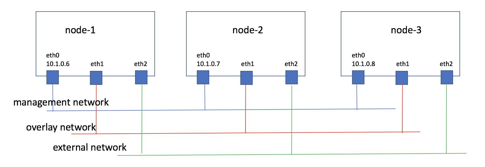

..
      Copyright 2014-2017 OpenStack Foundation
      All Rights Reserved.

      Licensed under the Apache License, Version 2.0 (the "License"); you may
      not use this file except in compliance with the License. You may obtain
      a copy of the License at

          http://www.apache.org/licenses/LICENSE-2.0

      Unless required by applicable law or agreed to in writing, software
      distributed under the License is distributed on an "AS IS" BASIS, WITHOUT
      WARRANTIES OR CONDITIONS OF ANY KIND, either express or implied. See the
      License for the specific language governing permissions and limitations
      under the License.

==========================
OpenStack VIM Installation
==========================

This document describes how to install a simple OpenStack which can be
a Tacker VIM. Since the kolla-ansible provides a good and stable way to deploy
an OpenStack environment, this document adopts it to finish this task.

The target OpenStack consists of three nodes. Besides the OpenStack role, the
first one plays kolla-ansible deploy role, which will run a local registry,
and be used to run kolla-ansible tool.

The basic information and the topology of these nodes is like this:

Prepare kolla-ansible
---------------------

About how to prepare Docker and kolla-ansible environment,
please refer to
https://docs.openstack.org/kolla-ansible/latest/user/quickstart.html

Set up local kolla-ansible docker registry
------------------------------------------

Kolla-ansible is publishing the packaged Docker images at
http://tarballs.openstack.org/kolla/images/. This document will use
``centos-source-registry-pike.tar.gz``.

Download this file and extract:

.. code-block:: console

    # wget http://tarballs.openstack.org/kolla/images/centos-source-registry-pike.tar.gz
    # tar xzvf centos-source-registry-pike.tar.gz -C /opt/registry/

Start Docker registry container:

.. code-block:: console

    # docker run -d -v /opt/registry:/var/lib/registry -p 4000:5000 --restart=always --name registry registry:2

Set Docker to access local registry via insecure channel:

.. code-block:: console

    # cat /usr/lib/systemd/system/docker.service | grep insecure
    ExecStart=/usr/bin/dockerd --insecure-registry 10.1.0.6:4000
    # systemctl daemon-reload
    # systemctl restart docker

.. note::

    The way to set up Docker to access insecure registry depends on operating
    system and Docker version, above way is just an example.

Verify the local registry contains the needed images:

.. code-block:: console

    # curl -k localhost:4000/v2/_catalog
    # curl -k localhost:4000/v2/lokolla/centos-source-fluentd/tags/list
    {"name":"lokolla/centos-source-fluentd","tags":["5.0.1"]}

Install OpenStack
-----------------

#. Edit kolla ansible's configuration file ``/etc/kolla/globals.yml``:

   .. code-block:: ini

       ---
       kolla_install_type: "source"
       openstack_release: "5.0.1"
       kolla_internal_vip_address: "10.1.0.5"
       docker_registry: "10.1.0.6:4000"
       docker_namespace: "lokolla"
       api_interface: "eth0"
       tunnel_interface: "eth1"
       neutron_external_interface: "eth2"
       enable_glance: "yes"
       enable_haproxy: "yes"
       enable_keystone: "yes"
       enable_mariadb: "yes"
       enable_memcached: "yes"
       enable_neutron: "yes"
       enable_nova: "yes"
       enable_rabbitmq: "yes"
       enable_aodh: "yes"
       enable_ceilometer: "yes"
       enable_gnocchi: "yes"
       enable_heat: "yes"
       enable_horizon: "yes"
       enable_neutron_sfc: "yes"

   .. note::

      If nodes are using different network interface names to connect each
      other, please define them in inventory file.

      "10.1.0.5" is an un-used ip address, will be used as VIP address,
      realized by keepalived container.

#. Run kolla-genpwd to generate system passwords:

   .. code-block:: console

      $ sudo cp etc/kolla/passwords.yml /etc/kolla/passwords.yml
      $ sudo kolla-genpwd

   .. note::

      If the pypi version is used to install kolla-ansible the skeleton
      passwords file may be under
      ``/usr/share/kolla-ansible/etc_examples/kolla``.

   With this command, ``/etc/kolla/passwords.yml`` will be populated with
   generated passwords.

#. Editor inventory:

   First copy the sample multinode inventory file from kolla-ansible:

   .. code-block:: console

      # cp inventory/multinode ~/

   Then edit it to contain all of the OpenStack nodes.

   .. code-block:: ini

      [all_vim_nodes]
      10.1.0.8
      10.1.0.7
      10.1.0.6

      [control:children]
      all_vim_nodes

      [network:children]
      all_vim_nodes

      [compute:children]
      all_vim_nodes

      [monitoring:children]
      all_vim_nodes

      [storage:children]
      #if the tacker needs volume feature, put related nodes here

#. Run kolla ansible deploy to install OpenStack system:

   .. code-block:: console

      # kolla-ansible deploy -i ~/multinode

#. Run kolla ansible post-deploy to generate tacker access environment file:

   .. code-block:: console

      # kolla-ansible post-deploy

   With this command, the ``admin-openrc.sh`` will be generated at
   ``/etc/kolla/admin-openrc.sh``.

Prepare OpenStack
-----------------

After installation, OpenStack administrator needs to:

*  Initialized the flavors that the platform will support. Most
   Tacker sample TOSCA templates will ask Tacker to create Flavor
   on demand. If not, the specified flavor in templates must exist
   in OpenStack.

*  Upload related images. Tacker repo's sample TOSCA templates are
   referring to cirros image named ``cirros-0.4.0-x86_64-disk``, so
   this image should uploaded into OpenStack before Tacker uses it.

In additions, following steps are needed:

#. Create projects and users which can be used by Tacker:

   This is a simple task for any OpenStack administrator, but one thing to pay
   attention to is that the user must have ``admin`` and ``heat_stack_owner``
   roles on the user's project.

   .. image:: ../_images/openstack_role.png
      :scale: 50 %

#. Create Neutron networks:

   Most sample TOSCA templates assume there are three Neutron networks in
   target OpenStack that the VIM user can use:

   *  ``net_mgmt``, which is a network Tacker system can access to. Some Tacker
      features, such as monitor policies, need Tacker to access started VNF
      virtual machines. For Tacker to access VNF via ``net_mgmt``, ``net_mgmt``
      can be a provider network.

   *  ``net0`` and ``net1``, which are two business networks which VNFs will
      use. How to connected them depends on the VNFs' business.

   So create these three networks accordingly. For commands to create Neutron
   networks, please refer to
   https://docs.openstack.org/python-openstackclient/latest/cli/command-objects/network.html
