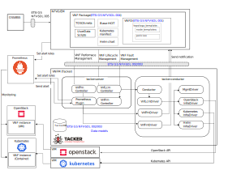
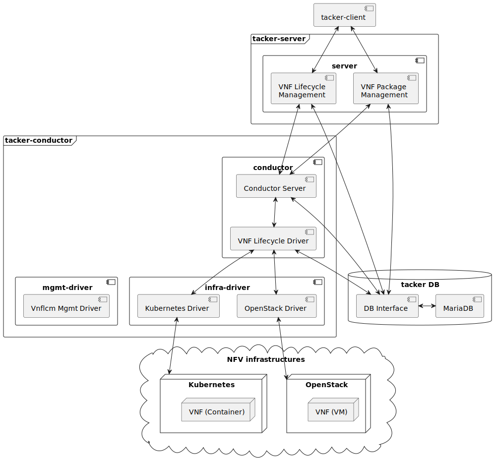
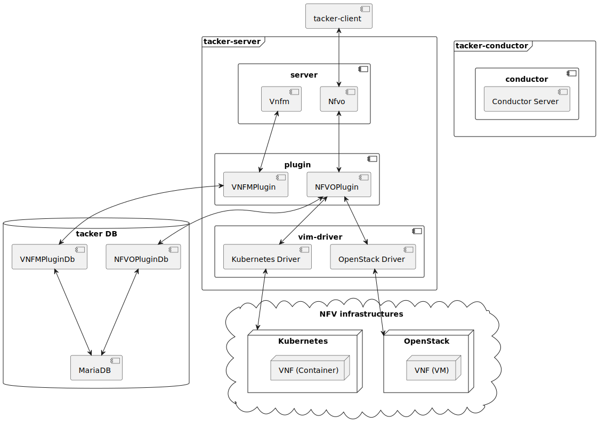

===================
Tacker Architecture
===================

Tacker design can be described by the following diagram:

Packages:

* **tacker** - is the main package for Tacker project.

Components:

* **server** - provides *REST API* and calls conductor via RPC.
* **tacker-conductor** - implements all logics to operate VNF and call required
  drivers providing interface to NFV infrastructures.

* **VnfPm/VnfFmController** - is responsible for exact actions
  to configure of PM/FM.
* **VnfLcmController** - is responsible for exact actions to
  configure of LCM.
* **PrometheusPlugin** - is responsible for exact actions to
  configure Prometheus.

* **VnfPm/VnfFmDriver** - is responsible for send notification to NFVO.
* **VnfLcmDriver** - is responsible for exact action to
  mgmt driver or infra driver.

* **MgmtDriver** - is responsible for exact actions to configure VNFs.
* **InfraDriver** - is responsible for exact actions to operate OpenStack or
  Kubernates.

Tacker Service
--------------

Tacker service is composed of two main processes:

* tacker.service
* tacker-conductor.service

*tacker.service* is a web server with Web Server Gateway Interface (WSGI)
waiting for the REST calls to redirect them to the drivers. Some operations
are sent to the Tacker Conductor via RPC. Two types of API are supported;
ESTI NFV-SOL API and Legacy API.

*tacker-conductor.service* implements some complicated logic and operations
for orchestrations and VNF managements. It is mainly responsible for ETSI
NFV-SOL based API operations and communicates with OpenStack or Kubernetes
VIM by the infra drivers. Heat client or Kubernetes python client provides the
IF to operate or manage resources for each VIM.

ETSI NFV-SOL Tacker Implementation
----------------------------------

Tacker ETSI NFV-SOL based implementation is described as the following:

In Ussuri release, VNF Package Management Interface in `NFV-SOL005`_ and VNF
Lifecycle Management Interface in `NFV-SOL002`_ and `NFV-SOL003`_ are
implemented. They provide a basic function block for VNF instances.

.. TODO(yoshito-ito): add supported ETSI doc and reference
  The supported operations and attributes are summarized in
  :doc:`./supported-etsi-operation` and :doc:`./supported-etsi-resource`.

When a REST API call is sent to tacker-server, some simple operations are
executed in tacker-server with DB queries. The others are redirected to
`Conductor Server` via RPC, and `VNF Lifecycle Driver` calls appropriate
infra-driver to execute the actual logics for control and management of
virtualised resources.

Tacker also provides configuring system for VNF. The mgmt-driver can be called
by `Conductor Server`.

.. note:: VIM related operations such as "Register VIM" and "Update VIM" are
          not defined in ETSI NFV-SOL. Users may need to use legacy Tacker.

Legacy Tacker Implementation
----------------------------

Legacy Tacker implementation is described as the following:

When a REST API call is sent to tacker-server, VNFM and NFVO plugins handle
the request and execute connected methods in each plugin. The NFVO plugin
invokes required vim-driver methods.

.. note:: Legacy API features other than the VIM feature have been deprecated.
          So only Nfvo receives the API from the tacker-client, but Vnfm and
          VNFMPlugin remain because they are used by VNF LCM API V1.

.. _NFV-SOL002 : https://portal.etsi.org/webapp/WorkProgram/Report_WorkItem.asp?WKI_ID=49492
.. _NFV-SOL003 : https://portal.etsi.org/webapp/WorkProgram/Report_WorkItem.asp?WKI_ID=49506
.. _NFV-SOL005 : https://portal.etsi.org/webapp/WorkProgram/Report_WorkItem.asp?WKI_ID=50935

