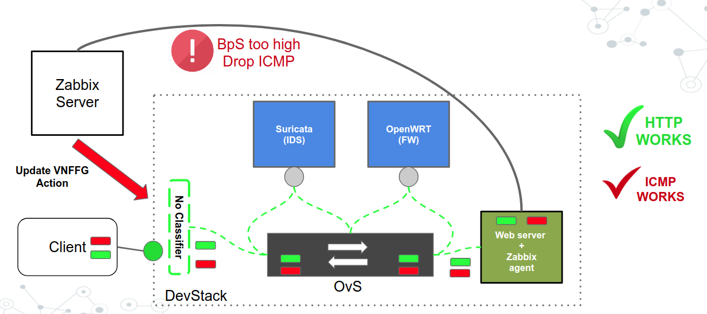
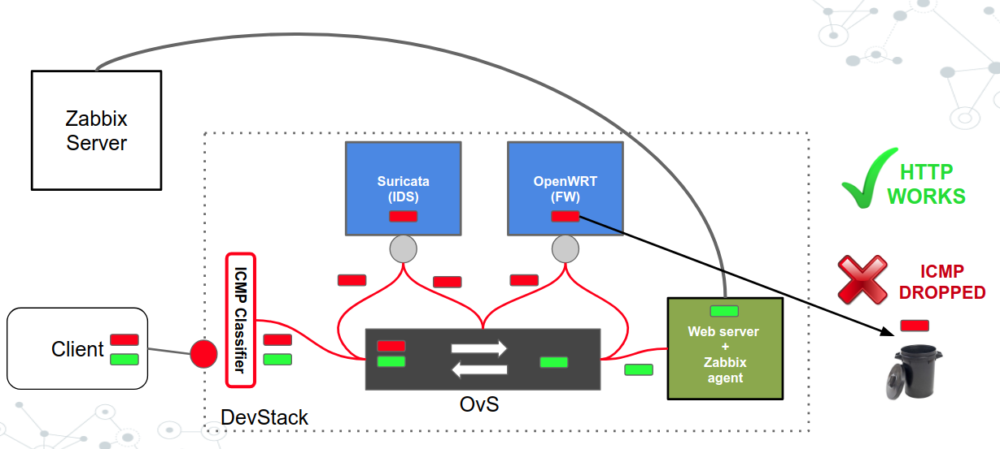
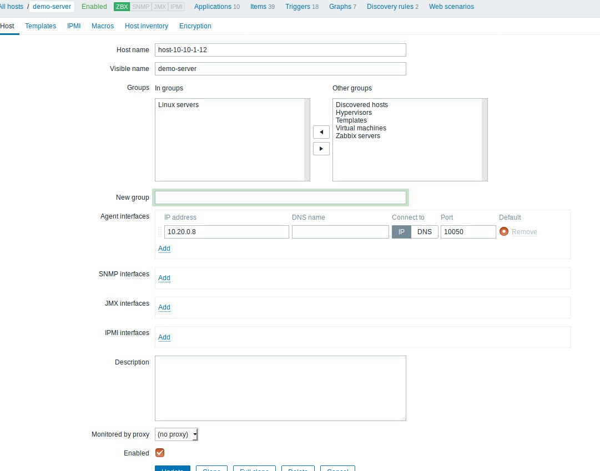
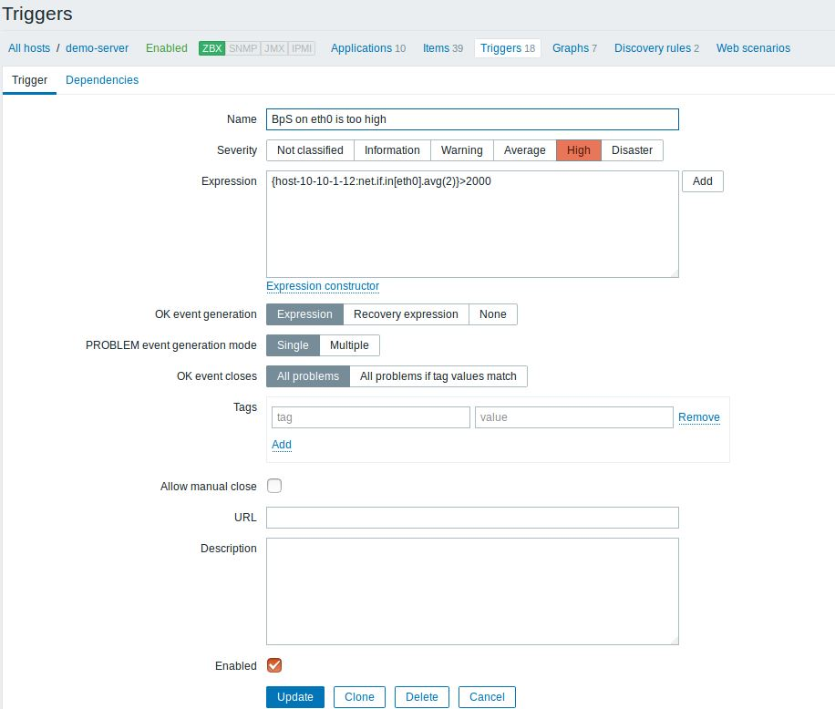
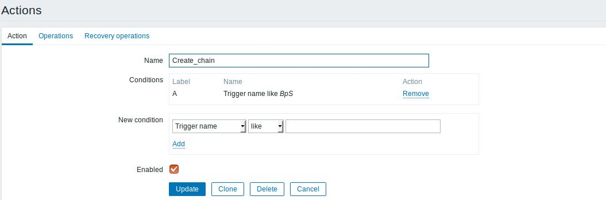
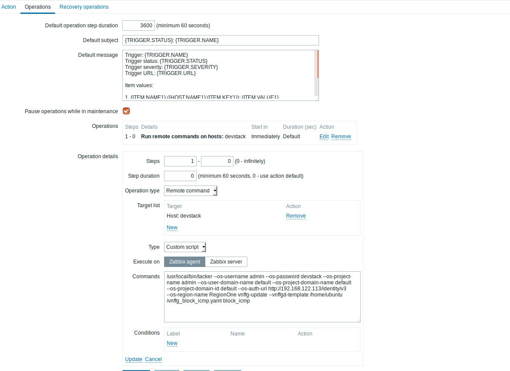

..
  Licensed under the Apache License, Version 2.0 (the "License"); you may
  not use this file except in compliance with the License. You may obtain
  a copy of the License at

          http://www.apache.org/licenses/LICENSE-2.0

  Unless required by applicable law or agreed to in writing, software
  distributed under the License is distributed on an "AS IS" BASIS, WITHOUT
  WARRANTIES OR CONDITIONS OF ANY KIND, either express or implied. See the
  License for the specific language governing permissions and limitations
  under the License.

==========================
A Use Case of VNFFG Update
==========================

This guide walks you through a specific usecase in which you can leverage
the Zabbix monitoring software to create a dynamic VNF Forwarding Graph
(VNFFG) or Service Function Chaining (SFC). You can check out the video
presentation here [#f1]_ and slides here [#f2]_ to see how to do it in action.

Prerequisites
=============

**1. Two libvirt VMs** to install devstack and Zabbix server.

**2. Two libvirt networks** which can reach the internet (one management,
one devstack external)

Topology
========

**1. Chain:** IDS (Suricata), Openwrt (VNFs)

**2. Target to protect:** Server nova instance.

+ SFC with no classifier (HTTP works, ICMP works)

+ SFC with ICMP classifier (HTTP works, ICMP dropped)

Setting up and produce the scenario
===================================

**1.** Install **devstack** in a VM as it is described here [#f3]_ using the
configuration sample here [#f4]_ (Please add here the right configuration for
the management and external networks). Two network interfaces, one for the
management and one for the external network.

**2.** Create a second VM where you will install the **Zabbix server**
according to these instructions [#f5]_. Please be sure that the Zabbix server
has an interface on the same network as the external network of devstack to be
able to monitor the server nova instance through the floating IP.

Config the Zabbix server as below:

+ Register the devstack machine (the host that we want to monitor and it
  should have installed the Zabbix agent, see step 3)

+ Create a trigger with a name which contains the keyword BpS (e.g. BpS in the
  eth0 is too high) and add to that trigger an expression-condition which will
  generate an event if the traffic will set this expression-condition to True.
  The expression-condition is:

.. code-block:: console

  {host-10-10-1-12:net.if.in[eth0].avg(2)}>2000

..

+ Create an action which will update the classifier if a trigger with the BpS
  name will generated by the Zabbix server. To do this you need to create an
  action , set the keyword of the Trigger which will make this action to
  actually come to play and also you need to create an operation inside that
  action where you will write the update-vnffg command which you will execute
  to update the current classifier.

The action command is as follows:

.. code-block:: console

  /usr/local/bin/openstack --os-username admin \
                           --os-password devstack \
                           --os-project-name admin \
                           --os-user-domain-name default \
                           --os-project-domain-name default \
                           --os-project-domain-id default \
                           --os-auth-url http://<devstack ip address>/identity/v3 \
                           --os-region-name RegionOne \
                           vnf graph set \
                           --vnffgd-template vnffg_block_icmp.yaml block_icmp

..

**3.** Install in the **server nova instance** and in the devstack VM
natively the **Zabbix agent**. The Zabbix agent in the server nova instance is
used to send data back to the Zabbix server. The Zabbix agent in the devstack
VM is essential because we execute from the Zabbix server the vnffg-update
command so we can update the classifier of the chain. And for this we need the
Zabbix agent to the devstack VM.

**4.** Deploy two Service Functions (SFs) via two VNFs:

-  The first one is Suricata (IDS) which will be deployed using this VNFD
   template

.. code-block:: yaml

  tosca_definitions_version: tosca_simple_profile_for_nfv_1_0_0
  description: suricata
  metadata:
    template_name: suricata

  topology_template:
    node_templates:
      VDU1:
        type: tosca.nodes.nfv.VDU.Tacker
        capabilities:
          nfv_compute:
            properties:
              num_cpus: 1
              mem_size: 4096 MB
              disk_size: 15 GB
        properties:
          image: danube
          availability_zone: nova
          mgmt_driver: noop
          config: |
            param0: key1
            param1: key2
          service_type: firewall
          monitoring_policy:
            name: ping
            parameters:
              monitoring_delay: 10
              count: 3
              interval: 2
              timeout: 2
              action:
                failure: respawn
              retry: 5
              port: 22

      CP2:
        type: tosca.nodes.nfv.CP.Tacker
        properties:
          management: true
          order: 0
          anti_spoofing_protection: false
        requirements:
          - virtualLink:
              node: VL1
          - virtualBinding:
              node: VDU1

      VL1:
        type: tosca.nodes.nfv.VL
        properties:
          network_name: net1
          vendor: Tacker
..

   After the VNF instance has been deployed successfully, SSH to it and
   configure as in [#f6]_.

-  The second one is OpenWrt with the configuration is the same as it is
   described in the Tacker docs [#f7]_, use the VNFD template here [#f8]_
   and param file here [#f9]_.

**5.** Create a VNFFG with a chain (IDS, Openwrt) and no classifier

**vnffg_no_classifier.yaml**

.. code-block:: yaml

  tosca_definitions_version: tosca_simple_profile_for_nfv_1_0_0

  description: Sample VNFFG template

  topology_template:
    node_templates:

      Forwarding_path1:
        type: tosca.nodes.nfv.FP.TackerV2
        description: demo chain
        properties:
          id: 51
          path:
            - forwarder: IDS
              capability: CP2
            - forwarder: openwrt
              capability: CP4

    groups:
      VNFFG1:
        type: tosca.groups.nfv.VNFFG
        description: Traffic to server
        properties:
          vendor: tacker
          version: 1.0
          number_of_endpoints: 2
          dependent_virtual_link: [VL1,VL2]
          connection_point: [CP2,CP4]
          constituent_vnfs: [IDS,openwrt]
        members: [Forwarding_path1]

..

**6.** Generate ICMP traffic using PING towards the floating IP of the server
nova instance and when that traffic reaches a threshold a specific event is
published to the Zabbix server and Zabbix server executes the vvnffg-update
action which update the already created VNFFG with a classifier which
classifies the ICMP traffic

**vnffg_block_icmp.yaml**

.. code-block:: yaml

  tosca_definitions_version: tosca_simple_profile_for_nfv_1_0_0

  description: Sample VNFFG template

  topology_template:
    node_templates:

      Forwarding_path1:
        type: tosca.nodes.nfv.FP.TackerV2
        description: demo chain
        properties:
          id: 51
          policy:
            type: ACL
            criteria:
              - name: block_icmp
                classifier:
                  network_src_port_id: 654eaf96-3737-4b72-9dd7-445a26dfc2ee
                  ip_proto: 1
          path:
            - forwarder: IDS
              capability: CP2
            - forwarder: openwrt
              capability: CP4

    groups:
      VNFFG1:
        type: tosca.groups.nfv.VNFFG
        description: Traffic to server
        properties:
          vendor: tacker
          version: 1.0
          number_of_endpoints: 2
          dependent_virtual_link: [VL1,VL2]
          connection_point: [CP2,CP4]
          constituent_vnfs: [IDS,openwrt]
        members: [Forwarding_path1]

..

That means that the traffic will be steered to the SFs and it will be
mitigated.

.. rubric:: Footnotes

.. [#f1] https://www.openstack.org/videos/vancouver-2018/dynamic-sfc-from-tacker-to-incept-specific-traffic-of-vm-1
.. [#f2] https://github.com/dangtrinhnt/DynamicSFCDemo/blob/master/DynamicSFC_OpenStackSummit2018Vancouver.pdf
.. [#f3] https://docs.openstack.org/devstack/latest/
.. [#f4] https://opendev.org/openstack/tacker/src/branch/master/devstack/local.conf.example
.. [#f5] https://www.digitalocean.com/community/tutorials/how-to-install-and-configure-zabbix-to-securely-monitor-remote-servers-on-ubuntu-16-04
.. [#f6] https://blog.rapid7.com/2017/02/14/how-to-install-suricata-nids-on-ubuntu-linux/
.. [#f7] https://docs.openstack.org/tacker/latest/install/deploy_openwrt.html
.. [#f8] https://opendev.org/openstack/tacker/src/branch/master/samples/tosca-templates/vnfd/tosca-vnfd-openwrt.yaml
.. [#f9] https://opendev.org/openstack/tacker/src/branch/master/samples/tosca-templates/vnfd/tosca-config-openwrt-firewall.yaml
