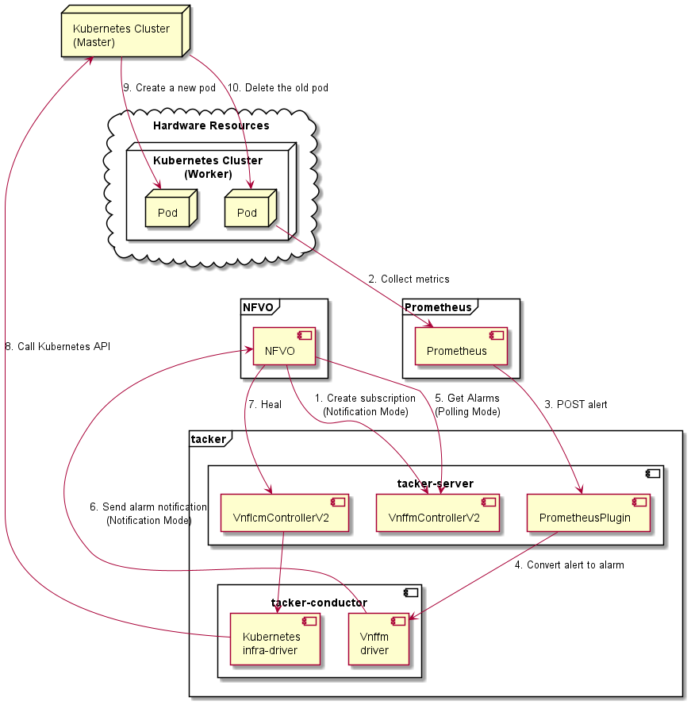

===============================================================
ETSI NFV-SOL CNF Auto Healing With Prometheus via FM Interfaces
===============================================================

This document describes how to auto heal CNF in Tacker with Prometheus
via Fault Management Interfaces.

Overview
--------

Using the Fault Management interfaces, there are two ways to implement
auto heal, Polling Mode and Notification Mode.

The diagram below shows an overview of the CNF auto healing.

1. Create FM subscription(Notification Mode)

   NFVO sends a request to Tacker to create a FM subscription.

2. Collect metrics

   Prometheus collects metrics and decides whether triggering alert
   is needed or not.

3. POST alert

   Prometheus sends alerts to Tacker.

4. Convert alert to alarm

   Tacker receives informed alerts, converts them to alarms, and saves
   them to Tacker DB.

5. Get Alarms and return result(Polling Mode)

   NFVO sends a request at regular intervals to get the alarm in
   the Tacker. Tacker searches Tacker DB with the query condition
   specified by NFVO, and returns the alarm that matches the
   condition to NFVO.

6. Send alarm notification(Notification Mode)

   VnffmDriver finds all FM subscriptions in the DB and matches the
   alerts to them. If there is a FM subscription that can match
   successfully, the alarm is sent to the specified path of the
   NFVO. If the match is not successful, the processing ends.

7. Heal

   NFVO recognizes the failure of the CNF from the alarm and sends
   a heal request to the Tacker.

8. Call Kubernetes API

   In tacker-conductor, the request is redirected again to an
   appropriate infra-driver (in this case Kubernetes infra-driver)
   according to the contents of the instantiate parameters. Then,
   Kubernetes infra-driver calls Kubernetes APIs.

9. Create a new pod

   Kubernetes Master adds the number of Pods according to the
   API calls.

10. Delete the old pod

    Kubernetes Master deletes the number of Pods according to the
    API calls.

Prerequisites
-------------

* The following packages should be installed:

  * tacker
  * python-tackerclient

  At least one VNF instance with status of ``INSTANTIATED`` is required.
  You can refer to :doc:`./etsi_containerized_vnf_usage_guide` for the
  procedure to instantiate VNF.

  The VNF Package used can refer to `the sample`_.

* The following third-party services should be installed

  * NFVO
  * Prometheus(including Alertmanager)

  Each operator has its own NFVO, there is no restriction here, as long as
  it conforms to `ETSI NFV-SOL 002 v3.3.1`_ and `ETSI NFV-SOL 003 v3.3.1`_,
  it can be used.

  For the installation of Prometheus and Alertmanager, please refer to
  the `Prometheus official website`_.

How to configure Prometheus Plugin
~~~~~~~~~~~~~~~~~~~~~~~~~~~~~~~~~~

The Prometheus Plugin is disabled by default in Tacker.
For it to work, we need to find ``fault_management`` in
``tacker.conf`` and change its value to ``True``.

.. code-block:: console

    $ vi /etc/tacker/tacker.conf
    ...
    [prometheus_plugin]
    fault_management = True
    [v2_vnfm]
    # Enable https access to notification server from Tacker (boolean value)
    notification_verify_cert = true
    ...

After modifying the configuration file, don't forget to restart the
Tacker service to take effect.

.. code-block:: console

    $ sudo systemctl stop devstack@tacker
    $ sudo systemctl restart devstack@tacker-conductor
    $ sudo systemctl start devstack@tacker

How to configure Prometheus
~~~~~~~~~~~~~~~~~~~~~~~~~~~

Unlike auto scale via PM interfaces, auto heal via FM interfaces does not
need to login Prometheus server via SSH to modify its configuration.
Users need to manually modify the configuration file of Prometheus, and
then it will monitor the specified resources.

For the setting method of Prometheus configuration file, please refer to
`Prometheus Configuration`_ for details.

The following is the content of a sample ``prometheus.yml``:

.. code-block:: yaml

    # my global config
    global:
      scrape_interval: 15s # Set the scrape interval to every 15 seconds. Default is every 1 minute.
      evaluation_interval: 15s # Evaluate rules every 15 seconds. The default is every 1 minute.
      # scrape_timeout is set to the global default (10s).

    # Alertmanager configuration
    alerting:
      alertmanagers:
        - static_configs:
            - targets:
              - <IP of Alertmanager>:9093

    # Load rules once and periodically evaluate them according to the global 'evaluation_interval'.
    rule_files:
      # - "first_rules.yml"
      # - "second_rules.yml"
      - "tacker-samplevnf-rules.yaml"

    # A scrape configuration containing exactly one endpoint to scrape:
    # Here it's Prometheus itself.
    scrape_configs:
      # The job name is added as a label `job=<job_name>` to any timeseries scraped from this config.
      - job_name: "kube-state-metrics"

        # metrics_path defaults to '/metrics'
        # scheme defaults to 'http'.

        static_configs:
          - targets: ["<IP of Kubernetes>:<port of metrics>"]

The following is the content of a sample ``tacker-samplevnf-rules.yaml``:

.. code-block:: yaml

    groups:
    - name: example
      rules:
      - alert: KubePodCrashLooping
        annotations:
          probable_cause: The server cannot be connected.
          fault_type: Server Down
          fault_details: fault details
        expr: |
          rate(kube_pod_container_status_restarts_total{job="kube-state-metrics"}[10m]) * 60 * 5 > 0
        for: 5m
        labels:
          receiver_type: tacker
          function_type: vnffm
          vnf_instance_id: <VNF instance ID>
          perceived_severity: WARNING
          event_type: EQUIPMENT_ALARM

The following is the content of a sample ``alertmanager.yml``:

.. code-block:: yaml

    route:
      group_by: ['cluster']
      group_wait: 30s
      group_interval: 2m
      repeat_interval: 1h
      receiver: 'web.boo'
      routes:
      - match:
          alertname: KubePodCrashLooping
        receiver: 'web.boo'
    receivers:
    - name: 'web.boo'
      webhook_configs:
      - url: 'http://<IP of Tacker>:9890/alert'
    inhibit_rules:
      - source_match:
          severity: 'critical'
        target_match:
          severity: 'warning'
        equal: ['dev', 'instance']

How does NFVO Auto Heal CNF
~~~~~~~~~~~~~~~~~~~~~~~~~~~

Through the FM interfaces, there are two modes to auto heal the CNF.

Polling Mode
^^^^^^^^^^^^

This mode is where NFVO actively sends a get alarms request to Tacker
at an interval.
According to the content of the response, confirm the VNFC instance ID
of the CNF in which the problem occurred.

The following is an example of a response to a get alarms request:

.. code-block:: json

    [
        {
            "id": "78a39661-60a8-4824-b989-88c1b0c3534a",
            "managedObjectId": "c61314d0-f583-4ab3-a457-46426bce02d3",
            "vnfcInstanceIds": [
                "VDU2-curry-probe-test001-766bdd79bf-wgc7m"
            ],
            "alarmRaisedTime": "2021-09-03 10:21:03",
            "alarmChangedTime": "",
            "alarmClearedTime": "",
            "alarmAcknowledgedTime": "",
            "ackState": "UNACKNOWLEDGED",
            "perceivedSeverity": "WARNING",
            "eventTime": "2021-09-03 10:06:03",
            "eventType": "EQUIPMENT_ALARM",
            "faultType": "",
            "probableCause": "The server cannot be connected.",
            "isRootCause": "false",
            "correlatedAlarmIds": [],
            "faultDetails": [],
            "_links": {
                "self": "/vnffm/v1/alarms/78a39661-60a8-4824-b989-88c1b0c3534a",
                "objectInstance": ""
            }
        }
    ]

.. note::

    The value of ``managedObjectId`` is the VNF instance ID.
    The value of ``vnfcInstanceIds`` is the VNFC instance IDs.

Then send a heal request specifying the VNFC instance ID to Tacker.
The format of the heal request can refer to `heal request`_.

.. _Notification Mode :

Notification Mode
^^^^^^^^^^^^^^^^^

This mode is that NFVO will create a FM subscription on Tacker.
In this FM subscription, multiple filter conditions can be set, so that
the VNF instance that has been instantiated in Tacker can be matched.

Create FM subscription can be executed by the following CLI command.

.. code-block:: console

    $ openstack vnffm sub create sample_param_file.json --os-tacker-api-version 2

The content of the sample ``sample_param_file.json`` in this document is
as follows:

.. code-block:: json

    {
        "filter": {
            "vnfInstanceSubscriptionFilter": {
                "vnfdIds": [
                    "4d5ffa3b-9dde-45a9-a805-659dc8df0c02"
                ],
                "vnfProductsFromProviders": [
                    {
                        "vnfProvider": "Company",
                        "vnfProducts": [
                            {
                                "vnfProductName": "Sample VNF",
                                "versions": [
                                    {
                                        "vnfSoftwareVersion": 1.0,
                                        "vnfdVersions": [1.0, 2.0]
                                    }
                                ]
                            }
                        ]
                    }
                ],
                "vnfInstanceIds": [
                    "aad7d2fe-ed51-47da-a20d-7b299860607e"
                ],
                "vnfInstanceNames": [
                    "test"
                ]
            },
            "notificationTypes": [
                "AlarmNotification"
            ],
            "faultyResourceTypes": [
                "COMPUTE"
            ],
            "perceivedSeverities": [
                "WARNING"
            ],
            "eventTypes": [
                "EQUIPMENT_ALARM"
            ],
            "probableCauses": [
                "The server cannot be connected."
            ]
        },
        "callbackUri": "http://127.0.0.1:9890/vnffm/v1/subscriptions/407cb9c5-60f2-43e8-a43a-925c0323c3eb",
        "authentication": {
            "authType": [
                "BASIC",
                "OAUTH2_CLIENT_CREDENTIALS",
                "OAUTH2_CLIENT_CERT"
            ],
            "paramsBasic": {
                "userName": "nfvo",
                "password": "nfvopwd"
            },
            "paramsOauth2ClientCredentials": {
                "clientId": "auth_user_name",
                "clientPassword": "auth_password",
                "tokenEndpoint": "token_endpoint"
            },
            "paramsOauth2ClientCert": {
                "clientId": "auth_user_name",
                "certificateRef": {
                    "type": "x5t#S256",
                    "value": "certificate_fingerprint"
                },
                "tokenEndpoint": "token_endpoint"
            }
        }
    }

Here is an example of create FM subscription:

.. code-block:: console

    $ openstack vnffm sub create sample_param_file.json --os-tacker-api-version 2
    +--------------+-----------------------------------------------------------------------------------------------------+
    | Field        | Value                                                                                               |
    +--------------+-----------------------------------------------------------------------------------------------------+
    | Callback Uri | /nfvo/notification                                                                                  |
    | Filter       | {                                                                                                   |
    |              |     "vnfInstanceSubscriptionFilter": {                                                              |
    |              |         "vnfdIds": [                                                                                |
    |              |             "4d5ffa3b-9dde-45a9-a805-659dc8df0c02"                                                  |
    |              |         ],                                                                                          |
    |              |         "vnfProductsFromProviders": [                                                               |
    |              |             {                                                                                       |
    |              |                 "vnfProvider": "Company",                                                           |
    |              |                 "vnfProducts": [                                                                    |
    |              |                     {                                                                               |
    |              |                         "vnfProductName": "Sample VNF",                                             |
    |              |                         "versions": [                                                               |
    |              |                             {                                                                       |
    |              |                                 "vnfSoftwareVersion": "1.0",                                        |
    |              |                                 "vnfdVersions": [                                                   |
    |              |                                     "1.0",                                                          |
    |              |                                     "2.0"                                                           |
    |              |                                 ]                                                                   |
    |              |                             }                                                                       |
    |              |                         ]                                                                           |
    |              |                     }                                                                               |
    |              |                 ]                                                                                   |
    |              |             }                                                                                       |
    |              |         ],                                                                                          |
    |              |         "vnfInstanceIds": [                                                                         |
    |              |             "aad7d2fe-ed51-47da-a20d-7b299860607e"                                                  |
    |              |         ],                                                                                          |
    |              |         "vnfInstanceNames": [                                                                       |
    |              |             "test"                                                                                  |
    |              |         ]                                                                                           |
    |              |     },                                                                                              |
    |              |     "notificationTypes": [                                                                          |
    |              |         "AlarmNotification"                                                                         |
    |              |     ],                                                                                              |
    |              |     "faultyResourceTypes": [                                                                        |
    |              |         "COMPUTE"                                                                                   |
    |              |     ],                                                                                              |
    |              |     "perceivedSeverities": [                                                                        |
    |              |         "WARNING"                                                                                   |
    |              |     ],                                                                                              |
    |              |     "eventTypes": [                                                                                 |
    |              |         "EQUIPMENT_ALARM"                                                                           |
    |              |     ],                                                                                              |
    |              |     "probableCauses": [                                                                             |
    |              |         "The server cannot be connected."                                                           |
    |              |     ]                                                                                               |
    |              | }                                                                                                   |
    | ID           | a7a18ac6-a668-4d94-8ba0-f04c20cfeacd                                                                |
    | Links        | {                                                                                                   |
    |              |     "self": {                                                                                       |
    |              |         "href": "http://127.0.0.1:9890/vnffm/v1/subscriptions/407cb9c5-60f2-43e8-a43a-925c0323c3eb" |
    |              |     }                                                                                               |
    |              | }                                                                                                   |
    +--------------+-----------------------------------------------------------------------------------------------------+

After the FM subscription is created, whenever Prometheus sends an alert
to Tacker, Tacker will find a matching FM subscription based on the
information in the alert.

The following is an example of the request body that Prometheus sends
an alert:

.. code-block:: json

    {
        "receiver": "receiver",
        "status": "firing",
        "alerts": [
            {
                "status": "firing",
                "labels": {
                    "receiver_type": "tacker",
                    "function_type": "vnffm",
                    "vnf_instance_id": "aad7d2fe-ed51-47da-a20d-7b299860607e",
                    "pod": "curry-probe-test001-766bdd79bf-wgc7m",
                    "perceived_severity": "WARNING",
                    "event_type": "PROCESSING_ERROR_ALARM"
                },
                "annotations": {
                    "fault_type": "Server Down",
                    "probable_cause": "Process Terminated",
                    "fault_details": "pid 12345"
                },
                "startsAt": "2022-06-21T23:47:36.453Z",
                "endsAt": "0001-01-01T00:00:00Z",
                "generatorURL": "http://controller147:9090/graph?g0.expr=up%7Bjob%3D%22node%22%7D+%3D%3D+0&g0.tab=1",
                "fingerprint": "5ef77f1f8a3ecb8d"
            }
        ],
        "groupLabels": {},
        "commonLabels": {
            "alertname": "NodeInstanceDown",
            "job": "node"
        },
        "commonAnnotations": {
            "description": "sample"
        },
        "externalURL": "http://controller147:9093",
        "version": "4",
        "groupKey": "{}:{}",
        "truncatedAlerts": 0
    }

Finally, a notification is sent to the Callback Uri (i.e. NFVO) in the FM
subscription. NFVO sends a heal request to Tacker according to the
content in the notification.
The format of the heal request can refer to `heal request`_.

The following is an example of the request body that Tacker sends
a notification:

.. code-block:: json

    {
        "id": "87bea1ed-6ced-403e-8640-2c631eb55d08",
        "notificationType": "AlarmNotification",
        "subscriptionId": "fb782658-af96-47e7-9faa-90ba8416e426",
        "timeStamp": "2021-09-03 10:21:03",
        "alarm": {
            "id": "78a39661-60a8-4824-b989-88c1b0c3534a",
            "managedObjectId": "c61314d0-f583-4ab3-a457-46426bce02d3",
            "vnfcInstanceIds": [
                "VDU2-curry-probe-test001-766bdd79bf-wgc7m"
            ],
            "alarmRaisedTime": "2021-09-03 10:21:03",
            "alarmChangedTime": "",
            "alarmClearedTime": "",
            "alarmAcknowledgedTime": "",
            "ackState": "UNACKNOWLEDGED",
            "perceivedSeverity": "WARNING",
            "eventTime": "2021-09-03 10:06:03",
            "eventType": "EQUIPMENT_ALARM",
            "faultType": "",
            "probableCause": "The server cannot be connected.",
            "isRootCause": "false",
            "correlatedAlarmIds": [],
            "faultDetails": [],
            "_links": {
                "self": {
                    "href": "/vnffm/v1/alarms/78a39661-60a8-4824-b989-88c1b0c3534a"
                },
                "objectInstance": {
                    "href": "/vnffm/v1/vnf_instances/c61314d0-f583-4ab3-a457-46426bce02d3"
                }
            }
        },
        "_links": {
            "subscription": {
                "href": "/vnffm/v1/subscriptions/fb782658-af96-47e7-9faa-90ba8416e426"
            }
        }
    }

How to use the CLI of FM interfaces
~~~~~~~~~~~~~~~~~~~~~~~~~~~~~~~~~~~

Get all alarms
^^^^^^^^^^^^^^

Get all alarms can be executed by the following CLI command.

.. code-block:: console

    $ openstack vnffm alarm list --os-tacker-api-version 2

Here is an example of getting all alarms:

.. code-block:: console

    $ openstack vnffm alarm list --os-tacker-api-version 2
    +--------------------------------------+--------------------------------------+--------------+------------------------+--------------------+--------------------+
    | ID                                   | Managed Object Id                    | Ack State    | Event Type             | Perceived Severity | Probable Cause     |
    +--------------------------------------+--------------------------------------+--------------+------------------------+--------------------+--------------------+
    | 1829331c-4439-4bda-bf57-832fb5786ce9 | fe9b053d-777a-442f-ad24-cfc9fd23b0c4 | ACKNOWLEDGED | PROCESSING_ERROR_ALARM | WARNING            | Process Terminated |
    | 70935ca5-e03c-4190-8eca-233dd4b2be9a | ca1999fd-44ef-43c0-b3e3-3290a54b2bb4 | ACKNOWLEDGED | PROCESSING_ERROR_ALARM | WARNING            | Process Terminated |
    +--------------------------------------+--------------------------------------+--------------+------------------------+--------------------+--------------------+

Get the specified alarm
^^^^^^^^^^^^^^^^^^^^^^^

Get the specified alarm can be executed by the following CLI command.

.. code-block:: console

    $ openstack vnffm alarm show ALARM_ID --os-tacker-api-version 2

Here is an example of getting the specified alarm:

.. code-block:: console

    $ openstack vnffm alarm show 1829331c-4439-4bda-bf57-832fb5786ce9 --os-tacker-api-version 2
    +----------------------------+------------------------------------------------------------------------------------------------------+
    | Field                      | Value                                                                                                |
    +----------------------------+------------------------------------------------------------------------------------------------------+
    | Ack State                  | ACKNOWLEDGED                                                                                         |
    | Alarm Acknowledged Time    |                                                                                                      |
    | Alarm Changed Time         | 2022-08-31T07:47:05Z                                                                                 |
    | Alarm Cleared Time         | 2022-06-22T23:47:36Z                                                                                 |
    | Alarm Raised Time          | 2022-08-31T07:46:59Z                                                                                 |
    | Correlated Alarm Ids       |                                                                                                      |
    | Event Time                 | 2022-06-21T23:47:36Z                                                                                 |
    | Event Type                 | PROCESSING_ERROR_ALARM                                                                               |
    | Fault Details              | [                                                                                                    |
    |                            |     "fingerprint: 5ef77f1f8a3ecb8d",                                                                 |
    |                            |     "detail: pid 12345"                                                                              |
    |                            | ]                                                                                                    |
    | Fault Type                 | Server Down                                                                                          |
    | ID                         | 1829331c-4439-4bda-bf57-832fb5786ce9                                                                 |
    | Is Root Cause              | False                                                                                                |
    | Links                      | {                                                                                                    |
    |                            |     "self": {                                                                                        |
    |                            |         "href": "http://127.0.0.1:9890/vnffm/v1/alarms/1829331c-4439-4bda-bf57-832fb5786ce9"         |
    |                            |     },                                                                                               |
    |                            |     "objectInstance": {                                                                              |
    |                            |         "href": "http://127.0.0.1:9890/vnflcm/v2/vnf_instances/fe9b053d-777a-442f-ad24-cfc9fd23b0c4" |
    |                            |     }                                                                                                |
    |                            | }                                                                                                    |
    | Managed Object Id          | fe9b053d-777a-442f-ad24-cfc9fd23b0c4                                                                 |
    | Perceived Severity         | WARNING                                                                                              |
    | Probable Cause             | Process Terminated                                                                                   |
    | Root Cause Faulty Resource |                                                                                                      |
    | Vnfc Instance Ids          | [                                                                                                    |
    |                            |     "VDU2-curry-probe-test001-766bdd79bf-wgc7m"                                                      |
    |                            | ]                                                                                                    |
    +----------------------------+------------------------------------------------------------------------------------------------------+

Change target Alarm
^^^^^^^^^^^^^^^^^^^

Change the ackState of the alarm can be executed by the following CLI
command.

.. code-block:: console

    $ openstack vnffm alarm update ALARM_ID --ack-state UNACKNOWLEDGED --os-tacker-api-version 2

.. note::

    The value of ``--ack-state`` can only be ``ACKNOWLEDGED`` or
    ``UNACKNOWLEDGED``.

Here is an example of changing target alarm:

.. code-block:: console

    $ openstack vnffm alarm update 1829331c-4439-4bda-bf57-832fb5786ce9 --ack-state UNACKNOWLEDGED --os-tacker-api-version 2
    +-----------+----------------+
    | Field     | Value          |
    +-----------+----------------+
    | Ack State | UNACKNOWLEDGED |
    +-----------+----------------+

Create a new FM subscription
^^^^^^^^^^^^^^^^^^^^^^^^^^^^

The creation of FM subscription has been introduced in the
:ref:`Notification Mode` above, and the use case of the CLI command
can be referred to there.

Get all FM subscriptions
^^^^^^^^^^^^^^^^^^^^^^^^

Get all FM subscriptions can be executed by the following CLI command.

.. code-block:: console

    $ openstack vnffm sub list --os-tacker-api-version 2

Here is an example of getting all FM subscriptions:

.. code-block:: console

    $ openstack vnffm sub list --os-tacker-api-version 2
    +--------------------------------------+--------------------------------------------------------------------------------+
    | ID                                   | Callback Uri                                                                   |
    +--------------------------------------+--------------------------------------------------------------------------------+
    | 407cb9c5-60f2-43e8-a43a-925c0323c3eb | http://localhost:9990/notification/callback/test_faultmanagement_interface_max |
    | c4f21875-c41d-42a8-967a-3ec7efe1d867 | http://localhost:9990/notification/callback/test_faultmanagement_interface_min |
    +--------------------------------------+--------------------------------------------------------------------------------+

Get the specified FM subscription
^^^^^^^^^^^^^^^^^^^^^^^^^^^^^^^^^

Get the specified FM subscription can be executed by the following CLI command.

.. code-block:: console

    $ openstack vnffm sub show FM_SUBSCRIPTION_ID --os-tacker-api-version 2

Here is an example of getting the specified FM subscription:

.. code-block:: console

    $ openstack vnffm sub show 407cb9c5-60f2-43e8-a43a-925c0323c3eb --os-tacker-api-version 2
    +--------------+-----------------------------------------------------------------------------------------------------+
    | Field        | Value                                                                                               |
    +--------------+-----------------------------------------------------------------------------------------------------+
    | Callback Uri | http://localhost:9990/notification/callback/test_faultmanagement_interface_max                      |
    | Filter       | {                                                                                                   |
    |              |     "vnfInstanceSubscriptionFilter": {                                                              |
    |              |         "vnfdIds": [                                                                                |
    |              |             "4d5ffa3b-9dde-45a9-a805-659dc8df0c02"                                                  |
    |              |         ],                                                                                          |
    |              |         "vnfProductsFromProviders": [                                                               |
    |              |             {                                                                                       |
    |              |                 "vnfProvider": "Company",                                                           |
    |              |                 "vnfProducts": [                                                                    |
    |              |                     {                                                                               |
    |              |                         "vnfProductName": "Sample VNF",                                             |
    |              |                         "versions": [                                                               |
    |              |                             {                                                                       |
    |              |                                 "vnfSoftwareVersion": "1.0",                                        |
    |              |                                 "vnfdVersions": [                                                   |
    |              |                                     "1.0"                                                           |
    |              |                                 ]                                                                   |
    |              |                             }                                                                       |
    |              |                         ]                                                                           |
    |              |                     }                                                                               |
    |              |                 ]                                                                                   |
    |              |             }                                                                                       |
    |              |         ],                                                                                          |
    |              |         "vnfInstanceIds": [                                                                         |
    |              |             "aad7d2fe-ed51-47da-a20d-7b299860607e"                                                  |
    |              |         ],                                                                                          |
    |              |         "vnfInstanceNames": [                                                                       |
    |              |             "test"                                                                                  |
    |              |         ]                                                                                           |
    |              |     },                                                                                              |
    |              |     "notificationTypes": [                                                                          |
    |              |         "AlarmNotification",                                                                        |
    |              |         "AlarmClearedNotification"                                                                  |
    |              |     ],                                                                                              |
    |              |     "faultyResourceTypes": [                                                                        |
    |              |         "COMPUTE"                                                                                   |
    |              |     ],                                                                                              |
    |              |     "perceivedSeverities": [                                                                        |
    |              |         "WARNING"                                                                                   |
    |              |     ],                                                                                              |
    |              |     "eventTypes": [                                                                                 |
    |              |         "PROCESSING_ERROR_ALARM"                                                                    |
    |              |     ],                                                                                              |
    |              |     "probableCauses": [                                                                             |
    |              |         "Process Terminated"                                                                        |
    |              |     ]                                                                                               |
    |              | }                                                                                                   |
    | ID           | 407cb9c5-60f2-43e8-a43a-925c0323c3eb                                                                |
    | Links        | {                                                                                                   |
    |              |     "self": {                                                                                       |
    |              |         "href": "http://127.0.0.1:9890/vnffm/v1/subscriptions/407cb9c5-60f2-43e8-a43a-925c0323c3eb" |
    |              |     }                                                                                               |
    |              | }                                                                                                   |
    +--------------+-----------------------------------------------------------------------------------------------------+

Delete the specified FM subscription
^^^^^^^^^^^^^^^^^^^^^^^^^^^^^^^^^^^^

Delete the specified FM subscription can be executed by the following CLI
command.

.. code-block:: console

    $ openstack vnffm sub delete FM_SUBSCRIPTION_ID --os-tacker-api-version 2

Here is an example of deleting the specified FM subscription:

.. code-block:: console

    $ openstack vnffm sub delete a7a18ac6-a668-4d94-8ba0-f04c20cfeacd --os-tacker-api-version 2
    VNF FM subscription 'a7a18ac6-a668-4d94-8ba0-f04c20cfeacd' deleted successfully

.. _the sample : https://docs.openstack.org/tacker/latest/user/etsi_cnf_healing.html#how-to-create-vnf-package-for-healing
.. _Prometheus Configuration : https://prometheus.io/docs/prometheus/latest/configuration/configuration/
.. _Prometheus official website : https://prometheus.io/docs/prometheus/latest/getting_started/
.. _ETSI NFV-SOL 002 v3.3.1 : https://www.etsi.org/deliver/etsi_gs/NFV-SOL/001_099/002/03.03.01_60/gs_nfv-sol002v030301p.pdf
.. _ETSI NFV-SOL 003 v3.3.1 : https://www.etsi.org/deliver/etsi_gs/NFV-SOL/001_099/003/03.03.01_60/gs_nfv-sol003v030301p.pdf
.. _heal request : https://docs.openstack.org/api-ref/nfv-orchestration/v2/vnflcm.html?expanded=heal-a-vnf-instance-v2-detail#heal-a-vnf-instance-v2

