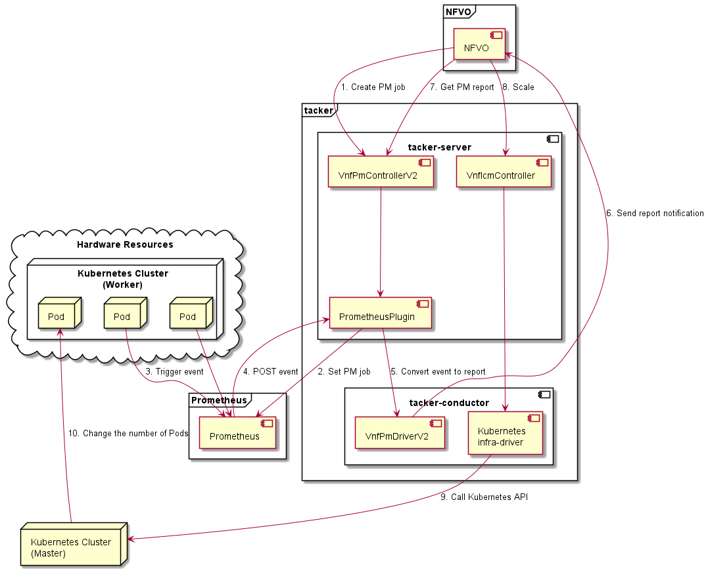

===================================================================
ETSI NFV-SOL CNF Auto Scaling With Prometheus via PM Job Interfaces
===================================================================

This document describes how to auto scale CNF in Tacker with Prometheus
via Performance Management Job Interfaces.

Overview
--------

The diagram below shows an overview of the CNF auto scaling.

1. Create PM job

   The NFVO sends a request to the Tacker to create a PM job.

2. Set PM job

   Prometheus Plugin sets PM job to Prometheus.

3. Trigger event

   Prometheus collects metrics and decides whether triggering event is
   needed or not.

4. POST event

   Prometheus sends POST request to Tacker with specified URI. Tacker
   collects data related to the PM event.

5. Convert event to report

   Tacker receives informed event, converts it to report, and saves
   it to DB. Tacker also saves timestamp of the event.

6. Send report notification

   VnfPmDriverV2 finds all jobs in the DB and matches the report to
   job. If there is a job that can match successfully, the report is
   sent to the specified path of the NFVO. If the match is not successful,
   the processing ends.

7. Get PM report

   The NFVO make a request for the content of the report, then make a
   decision of scaling.

8. Scale

   Upon receiving a request to scale VNF from NFVO, tacker-server
   redirects it to tacker-conductor.

9. Call Kubernetes API

   In tacker-conductor, the request is redirected again to an
   appropriate infra-driver (in this case Kubernetes infra-driver)
   according to the contents of the instantiate parameters. Then,
   Kubernetes infra-driver calls Kubernetes APIs.

10. Change the number of Pods

    Kubernetes Master change the number of Pods according to the
    API calls.

Prerequisites
-------------

* The following packages should be installed:

  * tacker
  * python-tackerclient

  At least one VNF instance with status of ``INSTANTIATED`` is required.
  You can refer to :doc:`./etsi_containerized_vnf_usage_guide` for the
  procedure to instantiate VNF.

  The VNF Package used can refer to `the sample`_.

* The following third-party services should be installed

  * NFVO
  * Prometheus(including Alertmanager)

  Each operator has its own NFVO, there is no restriction here, as long as
  it conforms to `ETSI NFV-SOL 002 v3.3.1`_ and `ETSI NFV-SOL 003 v3.3.1`_,
  it can be used.

  For the installation of Prometheus and Alertmanager, please refer to
  the `official website`_.

How to configure Prometheus Plugin
~~~~~~~~~~~~~~~~~~~~~~~~~~~~~~~~~~

The Prometheus Plugin is disabled by default in Tacker.
For it to work, we need to find ``performance_management`` in
``tacker.conf`` and change its value to ``True``.

.. code-block:: console

    $ vi /etc/tacker/tacker.conf
    ...
    [prometheus_plugin]
    performance_management = True
    [v2_vnfm]
    # Enable https access to notification server from Tacker (boolean value)
    notification_verify_cert = true
    ...

After modifying the configuration file, don't forget to restart the
Tacker service to take effect.

.. code-block:: console

    $ sudo systemctl stop devstack@tacker
    $ sudo systemctl restart devstack@tacker-conductor
    $ sudo systemctl start devstack@tacker

.. _Create PM job :

How to create a PM job
~~~~~~~~~~~~~~~~~~~~~~

After having a CNF that can scale, we need to create a PM job. It
determines the monitoring metrics and monitoring resources to be
used by Prometheus.

.. note::

    When having an NFVO client, the request is sent by NFVO.

The interface for creating PM jobs is defined in both
`ETSI NFV-SOL 002 v3.3.1`_ and `ETSI NFV-SOL 003 v3.3.1`_.

The following are the parameters required by this interface.

.. list-table:: additional params
  :widths: 18 18 10 50
  :header-rows: 1

  * - Attribute name
    - Data type
    - Cardinality
    - Description
  * - objectType
    - String
    - 1
    - Type of the measured object. The applicable measured object type for a
      measurement is defined in clause 7.2 of `ETSI GS NFV-IFA 027`_.
  * - objectInstanceIds
    - Identifier
    - 1..N
    - Identifiers of the measured object instances for which performance
      information is requested to be collected.
  * - subObjectInstanceIds
    - IdentifierInVnf
    - 0..N
    - Identifiers of the measured object instances in case of a structured
      measured object.
  * - criteria
    - PmJobCriteria
    - 1
    - Criteria of the collection of performance information.
  * - performanceMetric
    - String
    - 0..N
    - This defines the types of performance metrics for the specified object
      instances. Valid values are specified as "Measurement Name" values in
      clause 7.2 of `ETSI GS NFV-IFA 027`_. At least one of the two
      attributes (performance metric or group) shall be present.
  * - performanceMetricGroup
    - String
    - 0..N
    - Group of performance metrics. A metric group is a pre-defined list of
      metrics, known to the API producer that it can decompose to individual
      metrics. Valid values are specified as "Measurement Group" values in
      clause 7.2 of `ETSI GS NFV-IFA 027`_. At least one of the two
      attributes (performance metric or group) shall be present.
  * - collectionPeriod
    - UnsignedInt
    - 1
    - Specifies the periodicity at which the API producer will collect
      performance information. The unit shall be seconds.
  * - reportingPeriod
    - UnsignedInt
    - 1
    - Specifies the periodicity at which the API producer will report to
      the API consumer. about performance information. The unit shall be
      seconds. The reportingPeriod should be equal to or a multiple of
      the collectionPeriod.
  * - reportingBoundary
    - DateTime
    - 0..1
    - Identifies a time boundary after which the reporting will stop. The
      boundary shall allow a single reporting as well as periodic reporting
      up to the boundary.
  * - callbackUri
    - Uri
    - 1
    - The URI of the endpoint to send the notification to.
  * - authentication
    - SubscriptionAuthentication
    - 0..1
    - Authentication parameters to configure the use of Authorization when
      sending notifications corresponding to this subscription. See as
      clause 8.3.4 of `ETSI GS NFV-SOL 013`_.
  * - metadata
    - Structure
    - 1
    - Additional parameters to create PM job.
  * - monitoring
    - Structure
    - 1
    - Treats to specify such as monitoring system and driver information.
  * - monitorName
    - String
    - 1
    - In case specifying “prometheus”, backend of monitoring feature is
      to be Prometheus.
  * - driverType
    - String
    - 1
    - “external”: SCP/SFTP for config file transfer.
  * - targetsInfo
    - Structure
    - 1..N
    - Information about the target monitoring system.
  * - prometheusHost
    - String
    - 1
    - FQDN or ip address of target PrometheusServer.
  * - prometheusHostPort
    - Int
    - 1
    - Port of the ssh target PrometheusServer.
  * - alertRuleConfigPath
    - String
    - 1
    - Path of alertRuleConfig path for target Prometheus.
  * - prometheusReloadApiEndpoint
    - String
    - 1
    - Endpoint url of reload API of target Prometheus.
  * - authInfo
    - Structure
    - 1
    - Define authentication information to access host.
  * - ssh_username
    - String
    - 1
    - The username of the target host for ssh.
  * - ssh_password
    - String
    - 1
    - The password of the target host for ssh.

.. note::

    * If ``subObjectInstanceIds`` is present, the cardinality of the
      ``objectInstanceIds`` attribute shall be 1.
    * ``performanceMetric`` and ``performanceMetricGroup``, at least one of
      the two attributes shall be present.
    * ``objectType`` has only the following values: ``Vnf``, ``Vnfc``,
      ``VnfIntCp``, ``VnfExtCp``.

Create PM job can be executed by the following CLI command.

.. code-block:: console

    $ openstack vnfpm job create sample_param_file.json --os-tacker-api-version 2

The content of the sample ``sample_param_file.json`` in this document is
as follows:

.. code-block:: json

    {
        "objectType": "Vnf",
        "objectInstanceIds": ["495ffedf-2755-42c8-bf14-a5433701311e"],
        "subObjectInstanceIds": [],
        "criteria": {
            "performanceMetric": [
                "VcpuUsageMeanVnf.495ffedf-2755-42c8-bf14-a5433701311e"
            ],
            "performanceMetricGroup": [
                "VirtualisedComputeResource"
            ],
            "collectionPeriod": 5,
            "reportingPeriod": 10,
            "reportingBoundary": "2022-06-23T04:56:00.910Z"
        },
        "callbackUri": "http://localhost:9990/notification/callback/test_performancemanagement_interface_min_1",
        "authentication": {
            "authType": [
                "BASIC",
                "OAUTH2_CLIENT_CREDENTIALS",
                "OAUTH2_CLIENT_CERT"
            ],
            "paramsBasic": {
                "userName": "nfvo",
                "password": "nfvopwd"
            },
            "paramsOauth2ClientCredentials": {
                "clientId": "auth_user_name",
                "clientPassword": "auth_password",
                "tokenEndpoint": "token_endpoint"
            },
            "paramsOauth2ClientCert": {
                "clientId": "auth_user_name",
                "certificateRef": {
                    "type": "x5t#S256",
                    "value": "certificate_fingerprint"
                },
                "tokenEndpoint": "token_endpoint"
             }
        },
        "metadata": {
            "monitoring": {
                "monitorName": "prometheus",
                "driverType": "external",
                "targetsInfo": [
                    {
                        "prometheusHost": "prometheusHost",
                        "prometheusHostPort": "22",
                        "authInfo": {
                            "ssh_username": "ssh_username",
                            "ssh_password": "ssh_password"
                        },
                        "alertRuleConfigPath": "/etc/prometheus/rules/tacker-rule.yml",
                        "prometheusReloadApiEndpoint": "http://localhost:9990/-/reload"
                    }
                ]
            }
        }
    }

Here is an example of create PM job:

.. code-block:: console

    $ openstack vnfpm job create sample_param_file.json --os-tacker-api-version 2
    +-------------------------+------------------------------------------------------------------------------------------------------------------------+
    | Field                   | Value                                                                                                                  |
    +-------------------------+------------------------------------------------------------------------------------------------------------------------+
    | Callback Uri            | http://localhost:9990/notification/callback/test_performancemanagement_interface_min_1                                 |
    | Criteria                | {                                                                                                                      |
    |                         |     "performanceMetric": [                                                                                             |
    |                         |         "VCpuUsageMeanVnf.495ffedf-2755-42c8-bf14-a5433701311e"                                                        |
    |                         |     ],                                                                                                                 |
    |                         |     "collectionPeriod": 5,                                                                                             |
    |                         |     "reportingPeriod": 10                                                                                              |
    |                         | }                                                                                                                      |
    | ID                      | ca9b58cf-8493-44e3-9e76-678ea0e80a80                                                                                   |
    | Links                   | {                                                                                                                      |
    |                         |     "self": {                                                                                                          |
    |                         |         "href": "http://127.0.0.1:9890/vnfpm/v2/pm_jobs/ca9b58cf-8493-44e3-9e76-678ea0e80a80"                          |
    |                         |     },                                                                                                                 |
    |                         |     "objects": [                                                                                                       |
    |                         |         {                                                                                                              |
    |                         |             "href": "http://127.0.0.1:9890/vnflcm/v2/vnf_instances/495ffedf-2755-42c8-bf14-a5433701311e"               |
    |                         |         }                                                                                                              |
    |                         |     ]                                                                                                                  |
    |                         | }                                                                                                                      |
    | Object Instance Ids     | [                                                                                                                      |
    |                         |     "495ffedf-2755-42c8-bf14-a5433701311e"                                                                             |
    |                         | ]                                                                                                                      |
    | Object Type             | Vnf                                                                                                                    |
    | Reports                 | []                                                                                                                     |
    | Sub Object Instance Ids |                                                                                                                        |
    +-------------------------+------------------------------------------------------------------------------------------------------------------------+

When creating a PM job, Tacker will modify the configuration file on the
specified Prometheus based on ``metadata``.
Then Prometheus will monitor the specified resource and send the monitored
information to Tacker.
Tacker converts the received monitoring information into a report and
sends a notification request to NFVO.

The following is the request body of a sample notification request.

.. code-block:: console

    {
        'id': 'c045dae8-cd94-4a29-b09c-96729060f2ad',
        'notificationType': 'PerformanceInformationAvailableNotification',
        'timeStamp': '2022-09-05T06:56:39Z',
        'pmJobId': '34f7a186-88fa-4a42-a35f-30ea9ad710f1',
        'objectType': 'Vnf',
        'objectInstanceId': 'e30f5f45-522c-4e84-9b2d-9e1669708fff',
        '_links': {
            'objectInstance': {
                'href': 'http://127.0.0.1:9890/vnflcm/v2/vnf_instances/e30f5f45-522c-4e84-9b2d-9e1669708fff'
            },
            'pmJob': {
                'href': 'http://127.0.0.1:9890/vnfpm/v2/pm_jobs/34f7a186-88fa-4a42-a35f-30ea9ad710f1'
            },
            'performanceReport': {
                'href': 'http://127.0.0.1:9890/vnfpm/v2/pm_jobs/34f7a186-88fa-4a42-a35f-30ea9ad710f1/reports/46e95584-7f11-4fd0-b59c-4688c37177ff'
            }
        }
    }

.. note::

    The target URL of this notification request is the ``Callback Uri``
    field in the PM job.

How does NFVO Auto Scale CNF
~~~~~~~~~~~~~~~~~~~~~~~~~~~~

NFVO will send a get PM report request to Tacker according to the URL
of the report in the notification request.

The response returned by Tacker is as follows:

.. code-block:: console

    {
        'entries': [
            {
                'objectType': 'Vnf',
                'objectInstanceId': 'e30f5f45-522c-4e84-9b2d-9e1669708fff',
                'subObjectInstanceId': 'VDU2-curry-probe-test001-766bdd79bf-wgc7m',
                'performanceMetric': 'VCpuUsageMeanVnf.e30f5f45-522c-4e84-9b2d-9e1669708fff',
                'performanceValues': [
                    {
                        'timeStamp': '2022-09-05T08:02:58Z',
                        'value': 99.0
                    }
                ]
            }
        ]
    }

NFVO will determine whether a scale operation is required based on
the report data. If needed, a scale request will be sent to Tacker.

How to use the CLI of PM interfaces
~~~~~~~~~~~~~~~~~~~~~~~~~~~~~~~~~~~

Create a PM job
^^^^^^^^^^^^^^^

The creation of PM job has been introduced in the
:ref:`Create PM job` above, and the use case of the CLI
command can be referred to there.

Get all PM jobs
^^^^^^^^^^^^^^^

Get all PM jobs can be executed by the following CLI command.

.. code-block:: console

    $ openstack vnfpm job list --os-tacker-api-version 2

Here is an example of getting all PM jobs:

.. code-block:: console

    $ openstack vnfpm job list --os-tacker-api-version 2
    +--------------------------------------+-------------+----------------------------------------------------------------------------------------------------------+
    | Id                                   | Object Type | Links                                                                                                    |
    +--------------------------------------+-------------+----------------------------------------------------------------------------------------------------------+
    | b8b4095a-148d-42b5-b714-9d703e6c7c62 | Vnf         | {                                                                                                        |
    |                                      |             |     "self": {                                                                                            |
    |                                      |             |         "href": "http://127.0.0.1:9890/vnfpm/v2/pm_jobs/b8b4095a-148d-42b5-b714-9d703e6c7c62"            |
    |                                      |             |     },                                                                                                   |
    |                                      |             |     "objects": [                                                                                         |
    |                                      |             |         {                                                                                                |
    |                                      |             |             "href": "http://127.0.0.1:9890/vnflcm/v2/vnf_instances/97efce79-34c4-474d-87a0-38ad954f64af" |
    |                                      |             |         }                                                                                                |
    |                                      |             |     ]                                                                                                    |
    |                                      |             | }                                                                                                        |
    | ca9b58cf-8493-44e3-9e76-678ea0e80a80 | Vnf         | {                                                                                                        |
    |                                      |             |     "self": {                                                                                            |
    |                                      |             |         "href": "http://127.0.0.1:9890/vnfpm/v2/pm_jobs/ca9b58cf-8493-44e3-9e76-678ea0e80a80"            |
    |                                      |             |     },                                                                                                   |
    |                                      |             |     "objects": [                                                                                         |
    |                                      |             |         {                                                                                                |
    |                                      |             |             "href": "http://127.0.0.1:9890/vnflcm/v2/vnf_instances/495ffedf-2755-42c8-bf14-a5433701311e" |
    |                                      |             |         }                                                                                                |
    |                                      |             |     ]                                                                                                    |
    |                                      |             | }                                                                                                        |
    +--------------------------------------+-------------+----------------------------------------------------------------------------------------------------------+

Get the specified PM job
^^^^^^^^^^^^^^^^^^^^^^^^

Get the specified PM job can be executed by the following CLI command.

.. code-block:: console

    $ openstack vnfpm job show JOB_ID --os-tacker-api-version 2

Here is an example of getting the specified PM job:

.. code-block:: console

    $ openstack vnfpm job show ca9b58cf-8493-44e3-9e76-678ea0e80a80 --os-tacker-api-version 2
    +-------------------------+------------------------------------------------------------------------------------------------------------------------+
    | Field                   | Value                                                                                                                  |
    +-------------------------+------------------------------------------------------------------------------------------------------------------------+
    | Callback Uri            | http://localhost:9990/notification/callback/test_performancemanagement_interface_min_1                                 |
    | Criteria                | {                                                                                                                      |
    |                         |     "performanceMetric": [                                                                                             |
    |                         |         "VCpuUsageMeanVnf.495ffedf-2755-42c8-bf14-a5433701311e"                                                        |
    |                         |     ],                                                                                                                 |
    |                         |     "collectionPeriod": 5,                                                                                             |
    |                         |     "reportingPeriod": 10                                                                                              |
    |                         | }                                                                                                                      |
    | ID                      | ca9b58cf-8493-44e3-9e76-678ea0e80a80                                                                                   |
    | Links                   | {                                                                                                                      |
    |                         |     "self": {                                                                                                          |
    |                         |         "href": "http://127.0.0.1:9890/vnfpm/v2/pm_jobs/ca9b58cf-8493-44e3-9e76-678ea0e80a80"                          |
    |                         |     },                                                                                                                 |
    |                         |     "objects": [                                                                                                       |
    |                         |         {                                                                                                              |
    |                         |             "href": "http://127.0.0.1:9890/vnflcm/v2/vnf_instances/495ffedf-2755-42c8-bf14-a5433701311e"               |
    |                         |         }                                                                                                              |
    |                         |     ]                                                                                                                  |
    |                         | }                                                                                                                      |
    | Object Instance Ids     | [                                                                                                                      |
    |                         |     "495ffedf-2755-42c8-bf14-a5433701311e"                                                                             |
    |                         | ]                                                                                                                      |
    | Object Type             | Vnf                                                                                                                    |
    | Reports                 | [                                                                                                                      |
    |                         |     {                                                                                                                  |
    |                         |         "href": "/vnfpm/v2/pm_jobs/ca9b58cf-8493-44e3-9e76-678ea0e80a80/reports/53aafe25-7124-4880-8b58-47a93b3dc371", |
    |                         |         "readyTime": "2022-08-30T08:02:58Z"                                                                            |
    |                         |     }                                                                                                                  |
    |                         | ]                                                                                                                      |
    | Sub Object Instance Ids |                                                                                                                        |
    +-------------------------+------------------------------------------------------------------------------------------------------------------------+

Change target PM job
^^^^^^^^^^^^^^^^^^^^

Updating a PM job can only change two fields, callbackUri and authentication.
It can be executed by the following CLI command.

.. code-block:: console

    $ openstack vnfpm job update JOB_ID sample_param_file.json --os-tacker-api-version 2

The content of the sample ``sample_param_file.json`` in this document is
as follows:

.. code-block:: json

    {
        "callbackUri": "http://localhost:9990/notification/callback",
        "authentication": {
            "authType": [
                "BASIC",
                "OAUTH2_CLIENT_CREDENTIALS",
                "OAUTH2_CLIENT_CERT"
            ],
            "paramsBasic": {
                "userName": "nfvo",
                "password": "nfvopwd"
            },
            "paramsOauth2ClientCredentials": {
                "clientId": "auth_user_name",
                "clientPassword": "auth_password",
                "tokenEndpoint": "token_endpoint"
            },
            "paramsOauth2ClientCert": {
                "clientId": "auth_user_name",
                "certificateRef": {
                    "type": "x5t#S256",
                    "value": "certificate_fingerprint"
                },
                "tokenEndpoint": "token_endpoint"
            }
        }
    }

Here is an example of changing target PM job:

.. code-block:: console

    $ openstack vnfpm job update ca9b58cf-8493-44e3-9e76-678ea0e80a80 sample_param_file.json --os-tacker-api-version 2
    +-------------------------+------------------------------------------------------------------------------------------------------------------------+
    | Field                   | Value                                                                                                                  |
    +-------------------------+------------------------------------------------------------------------------------------------------------------------+
    | Callback Uri            | http://localhost:9990/notification/callback                                                                            |
    | Criteria                | {                                                                                                                      |
    |                         |     "performanceMetric": [                                                                                             |
    |                         |         "VCpuUsageMeanVnf.495ffedf-2755-42c8-bf14-a5433701311e"                                                        |
    |                         |     ],                                                                                                                 |
    |                         |     "collectionPeriod": 5,                                                                                             |
    |                         |     "reportingPeriod": 10                                                                                              |
    |                         | }                                                                                                                      |
    | ID                      | ca9b58cf-8493-44e3-9e76-678ea0e80a80                                                                                   |
    | Links                   | {                                                                                                                      |
    |                         |     "self": {                                                                                                          |
    |                         |         "href": "http://127.0.0.1:9890/vnfpm/v2/pm_jobs/ca9b58cf-8493-44e3-9e76-678ea0e80a80"                          |
    |                         |     },                                                                                                                 |
    |                         |     "objects": [                                                                                                       |
    |                         |         {                                                                                                              |
    |                         |             "href": "http://127.0.0.1:9890/vnflcm/v2/vnf_instances/495ffedf-2755-42c8-bf14-a5433701311e"               |
    |                         |         }                                                                                                              |
    |                         |     ]                                                                                                                  |
    |                         | }                                                                                                                      |
    | Object Instance Ids     | [                                                                                                                      |
    |                         |     "495ffedf-2755-42c8-bf14-a5433701311e"                                                                             |
    |                         | ]                                                                                                                      |
    | Object Type             | Vnf                                                                                                                    |
    | Reports                 | []                                                                                                                     |
    | Sub Object Instance Ids |                                                                                                                        |
    +-------------------------+------------------------------------------------------------------------------------------------------------------------+

Delete the specified PM job
^^^^^^^^^^^^^^^^^^^^^^^^^^^

Delete the specified PM job can be executed by the following CLI command.

.. code-block:: console

    $ openstack vnfpm job delete JOB_ID --os-tacker-api-version 2

Here is an example of deleting the specified PM job:

.. code-block:: console

    $ openstack vnfpm job delete ca9b58cf-8493-44e3-9e76-678ea0e80a80 --os-tacker-api-version 2
    VNF PM job 'ca9b58cf-8493-44e3-9e76-678ea0e80a80' deleted successfully

Get the specified PM report
^^^^^^^^^^^^^^^^^^^^^^^^^^^

Get the specified PM report can be executed by the following CLI command.

.. code-block:: console

    $ openstack vnfpm report show JOB_ID REPORT_ID --os-tacker-api-version 2

Here is an example of getting the specified PM report:

.. code-block:: console

    $ openstack vnfpm report show ca9b58cf-8493-44e3-9e76-678ea0e80a80 53aafe25-7124-4880-8b58-47a93b3dc371 --os-tacker-api-version 2
    +---------+---------------------------------------------------------------------------------------+
    | Field   | Value                                                                                 |
    +---------+---------------------------------------------------------------------------------------+
    | Entries | [                                                                                     |
    |         |     {                                                                                 |
    |         |         "objectType": "Vnf",                                                          |
    |         |         "objectInstanceId": "495ffedf-2755-42c8-bf14-a5433701311e",                   |
    |         |         "performanceMetric": "VCpuUsageMeanVnf.495ffedf-2755-42c8-bf14-a5433701311e", |
    |         |         "performanceValues": [                                                        |
    |         |             {                                                                         |
    |         |                 "timeStamp": "2022-08-30T08:02:58Z",                                  |
    |         |                 "value": "99.0"                                                       |
    |         |             }                                                                         |
    |         |         ]                                                                             |
    |         |     }                                                                                 |
    |         | ]                                                                                     |
    +---------+---------------------------------------------------------------------------------------+

.. _ETSI NFV-SOL 002 v3.3.1 : https://www.etsi.org/deliver/etsi_gs/NFV-SOL/001_099/002/03.03.01_60/gs_nfv-sol002v030301p.pdf
.. _ETSI NFV-SOL 003 v3.3.1 : https://www.etsi.org/deliver/etsi_gs/NFV-SOL/001_099/003/03.03.01_60/gs_nfv-sol003v030301p.pdf
.. _official website : https://prometheus.io/docs/prometheus/latest/getting_started/
.. _the sample : https://docs.openstack.org/tacker/latest/user/etsi_cnf_scaling.html#how-to-create-vnf-package-for-scaling
.. _ETSI GS NFV-IFA 027 : https://www.etsi.org/deliver/etsi_gs/NFV-IFA/001_099/027/03.03.01_60/gs_nfv-ifa027v030301p.pdf
.. _ETSI GS NFV-SOL 013 : https://www.etsi.org/deliver/etsi_gs/NFV-SOL/001_099/013/03.04.01_60/gs_nfv-sol013v030401p.pdf
