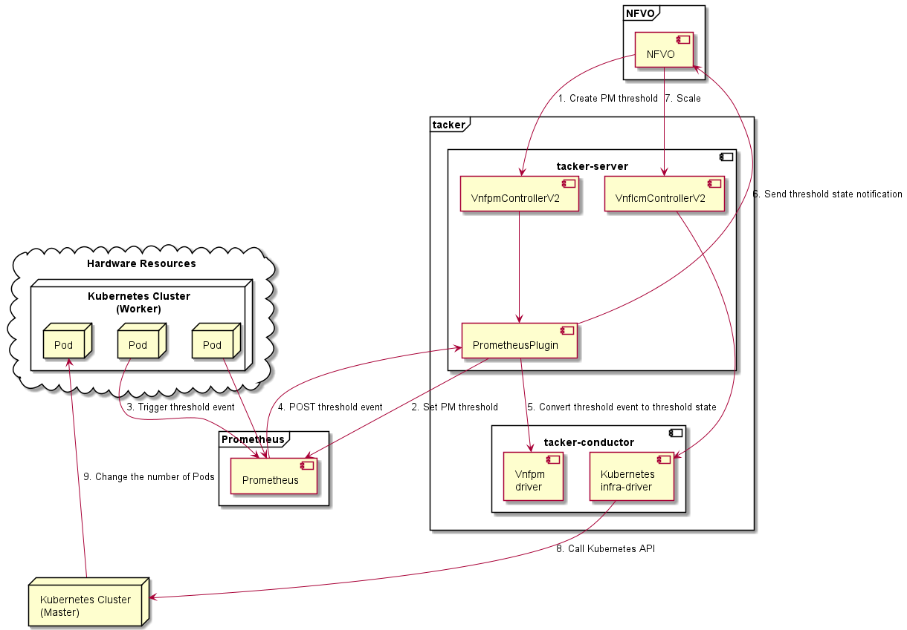

=========================================================================
ETSI NFV-SOL CNF Auto Scaling With Prometheus via PM Threshold Interfaces
=========================================================================

This document describes how to auto scale CNF in Tacker with Prometheus
via Performance Management Threshold Interfaces.

Overview
--------

The diagram below shows an overview of the CNF auto scaling.

1. Create PM threshold

   The NFVO sends a request to the Tacker to create a PM threshold.

2. Set PM threshold

   Prometheus Plugin sets PM threshold to Prometheus.

3. Trigger threshold event

   Prometheus collects metrics and decides whether triggering threshold event
   is needed or not.

4. POST threshold event

   Prometheus sends POST request to Tacker with specified URI. Tacker
   collects data related to the PM threshold event.

5. Convert threshold event to threshold state

   Tacker receives informed threshold event, converts it to threshold state,
   and saves it to DB.

6. Send threshold state notification

   VnfPmDriverV2 finds all thresholds in the DB and matches the threshold
   state to threshold. If the crossingDirection of threshold state is ``UP``
   or ``DOWN``, the notification is sent to the specified path of the NFVO.
   If the match is not successful or the situation does not exist, the
   processing ends.

7. Scale

   Upon receiving a request to scale VNF from NFVO, tacker-server
   redirects it to tacker-conductor.

8. Call Kubernetes API

   In tacker-conductor, the request is redirected again to an
   appropriate infra-driver (in this case Kubernetes infra-driver)
   according to the contents of the instantiate parameters. Then,
   Kubernetes infra-driver calls Kubernetes APIs.

9. Change the number of Pods

   Kubernetes Master change the number of Pods according to the
   API calls.

Prerequisites
-------------

* The following packages should be installed:

  * tacker
  * python-tackerclient

  At least one VNF instance with status of ``INSTANTIATED`` is required.
  You can refer to :doc:`./etsi_containerized_vnf_usage_guide` for the
  procedure to instantiate VNF.

  The VNF Package used can refer to `the sample`_.

* The following third-party services should be installed

  * NFVO
  * Prometheus(including Alertmanager)

  Each operator has its own NFVO, there is no restriction here, as long as
  it conforms to `ETSI NFV-SOL 002 v3.3.1`_ and `ETSI NFV-SOL 003 v3.3.1`_,
  it can be used.

  For the installation of Prometheus and Alertmanager, please refer to
  the `official website`_.

How to configure Prometheus Plugin
~~~~~~~~~~~~~~~~~~~~~~~~~~~~~~~~~~

Please refer to `How to configure Prometheus Plugin`_ to enable the
Prometheus Plugin.

.. _Create PM threshold :

How to create a PM threshold
~~~~~~~~~~~~~~~~~~~~~~~~~~~~

After having a CNF that can scale, we need to create a PM threshold. It
determines the monitoring metrics and monitoring resources to be
used by Prometheus.

.. note::

    When having an NFVO client, the request is sent by NFVO.

The interface for creating PM thresholds is defined in both
`ETSI NFV-SOL 002 v3.3.1`_ and `ETSI NFV-SOL 003 v3.3.1`_.

The following are the parameters required by this interface.

.. list-table:: additional params
  :widths: 18 18 10 50
  :header-rows: 1

  * - Attribute name
    - Data type
    - Cardinality
    - Description
  * - objectType
    - String
    - 1
    - Type of the measured object. The applicable measured object type for a
      measurement is defined in clause 7.2 of `ETSI GS NFV-IFA 027`_.
  * - objectInstanceId
    - Identifier
    - 1
    - Identifiers of the measured object instances for which performance
      information is requested to be collected.
  * - subObjectInstanceIds
    - IdentifierInVnf
    - 0..N
    - Identifiers of the measured object instances in case of a structured
      measured object.
  * - criteria
    - ThresholdCriteria
    - 1
    - Criteria of the collection of performance information.
  * - performanceMetric
    - String
    - 1
    - This defines the types of performance metrics for the specified object
      instances. Valid values are specified as "Measurement Name" values in
      clause 7.2 of `ETSI GS NFV-IFA 027`_.
  * - thresholdType
    - String
    - 1
    - This defines the type of threshold. This attribute determines which other
      attributes are present in the data structure.
  * - simpleThresholdDetails
    - Structure
    - 0..1
    - Details of a simple threshold. Shall be present if
      thresholdType="SIMPLE".
  * - thresholdValue
    - Float
    - 1
    - The threshold value. Shall be represented as a floating point number.
  * - hysteresis
    - Float
    - 1
    - The hysteresis of the threshold. Shall be represented as a non-negative
      floating point number.
  * - callbackUri
    - Uri
    - 1
    - The URI of the endpoint to send the notification to.
  * - authentication
    - SubscriptionAuthentication
    - 0..1
    - Authentication parameters to configure the use of Authorization when
      sending notifications corresponding to this subscription. See as
      clause 8.3.4 of `ETSI GS NFV-SOL 013`_.
  * - metadata
    - Structure
    - 1
    - Additional parameters to create PM threshold.
  * - monitoring
    - Structure
    - 1
    - Treats to specify such as monitoring system and driver information.
  * - monitorName
    - String
    - 1
    - In case specifying "prometheus", backend of monitoring feature is
      to be Prometheus.
  * - driverType
    - String
    - 1
    - "external": SCP/SFTP for config file transfer.
  * - targetsInfo
    - Structure
    - 1..N
    - Information about the target monitoring system.
  * - prometheusHost
    - String
    - 1
    - FQDN or ip address of target PrometheusServer.
  * - prometheusHostPort
    - Int
    - 1
    - Port of the ssh target PrometheusServer.
  * - alertRuleConfigPath
    - String
    - 1
    - Path of alertRuleConfig path for target Prometheus.
  * - prometheusReloadApiEndpoint
    - String
    - 1
    - Endpoint url of reload API of target Prometheus.
  * - authInfo
    - Structure
    - 1
    - Define authentication information to access host.
  * - ssh_username
    - String
    - 1
    - The username of the target host for ssh.
  * - ssh_password
    - String
    - 1
    - The password of the target host for ssh.

.. note::

    * ``objectType`` has only the following values: ``Vnf``, ``Vnfc``,
      ``VnfIntCp``, ``VnfExtCp``.

Create PM threshold can be executed by the following CLI command.

.. code-block:: console

    $ openstack vnfpm threshold create sample_param_file.json --os-tacker-api-version 2

The content of the sample ``sample_param_file.json`` in this document is
as follows:

.. code-block:: json

    {
        "objectType": "Vnf",
        "objectInstanceId": "511a2d68-c975-4913-b7b8-d75468e3102b",
        "subObjectInstanceIds": [],
        "criteria": {
             "performanceMetric": "VMemoryUsageMeanVnf.511a2d68-c975-4913-b7b8-d75468e3102b",
             "thresholdType": "SIMPLE",
             "simpleThresholdDetails": {
             "thresholdValue": 55,
             "hysteresis": 30
            }
        },
        "callbackUri": "http://localhost:9990/notification/callbackuri/511a2d68-c975-4913-b7b8-d75468e3102b",
        "authentication": {
            "authType": [
                "BASIC",
                "OAUTH2_CLIENT_CREDENTIALS",
                "OAUTH2_CLIENT_CERT"
            ],
            "paramsBasic": {
                "userName": "nfvo",
                "password": "nfvopwd"
            },
            "paramsOauth2ClientCredentials": {
                "clientId": "auth_user_name",
                "clientPassword": "auth_password",
                "tokenEndpoint": "token_endpoint"
            },
            "paramsOauth2ClientCert": {
                "clientId": "auth_user_name",
                "certificateRef": {
                    "type": "x5t#S256",
                    "value": "certificate_fingerprint"
                },
                "tokenEndpoint": "token_endpoint"
            }
        },
        "metadata": {
            "monitoring": {
                "monitorName": "prometheus",
                "driverType": "external",
                "targetsInfo": [
                    {
                        "prometheusHost": "prometheusHost",
                        "prometheusHostPort": "22",
                        "authInfo": {
                            "ssh_username": "ssh_username",
                            "ssh_password": "ssh_password"
                        },
                        "alertRuleConfigPath": "/etc/prometheus/rules/tacker-rule.yml",
                        "prometheusReloadApiEndpoint": "http://localhost:9990/-/reload"
                    }
                ]
            }
        }
    }

Here is an example of create PM threshold:

.. code-block:: console

    $ openstack vnfpm threshold create sample_param_file.json --os-tacker-api-version 2
    +-------------------------+------------------------------------------------------------------------------------------------------+
    | Field                   | Value                                                                                                |
    +-------------------------+------------------------------------------------------------------------------------------------------+
    | Callback Uri            | http://127.0.0.1:9990/notification/callbackuri/511a2d68-c975-4913-b7b8-d75468e3102b                  |
    | Criteria                | {                                                                                                    |
    |                         |     "performanceMetric": "VMemoryUsageMeanVnf.511a2d68-c975-4913-b7b8-d75468e3102b",                 |
    |                         |     "thresholdType": "SIMPLE",                                                                       |
    |                         |     "simpleThresholdDetails": {                                                                      |
    |                         |         "thresholdValue": 55.0,                                                                      |
    |                         |         "hysteresis": 30.0                                                                           |
    |                         |     }                                                                                                |
    |                         | }                                                                                                    |
    | ID                      | 4787c544-c3d0-4aeb-bf60-1598125c3d4f                                                                 |
    | Links                   | {                                                                                                    |
    |                         |     "self": {                                                                                        |
    |                         |         "href": "http://127.0.0.1:9890/vnfpm/v2/thresholds/4787c544-c3d0-4aeb-bf60-1598125c3d4f"     |
    |                         |     },                                                                                               |
    |                         |     "object": {                                                                                      |
    |                         |         "href": "http://127.0.0.1:9890/vnflcm/v2/vnf_instances/511a2d68-c975-4913-b7b8-d75468e3102b" |
    |                         |     }                                                                                                |
    |                         | }                                                                                                    |
    | Object Instance Id      | 511a2d68-c975-4913-b7b8-d75468e3102b                                                                 |
    | Object Type             | Vnf                                                                                                  |
    | Sub Object Instance Ids |                                                                                                      |
    +-------------------------+------------------------------------------------------------------------------------------------------+

When creating a PM threshold, Tacker will modify the configuration file on the
specified Prometheus based on ``metadata``.
Then Prometheus will monitor the specified resource and send the monitored
information to Tacker.
Tacker converts the received monitoring information into a threshold state and
sends a notification request to NFVO.

The following is the request body of a sample notification request.

.. code-block:: json

   {
       "id": "ec3cfe7b-aef4-4d66-9b65-15fe6a589b2e",
       "notificationType": "PerformanceThresholdNotification",
       "timeStamp": "2023-02-10T02:39:07Z",
       "thresholdId": "4787c544-c3d0-4aeb-bf60-1598125c3d4f",
       "crossingDirection": "DOWN",
       "objectType": "Vnf",
       "objectInstanceId": "511a2d68-c975-4913-b7b8-d75468e3102b",
       "performanceMetric": "VMemoryUsageMeanVnf.511a2d68-c975-4913-b7b8-d75468e3102b",
       "performanceValue": "0.0014381563014867896",
       "_links": {
           "objectInstance": {
               "href": "http://127.0.0.1:9890/vnflcm/v2/vnf_instances/511a2d68-c975-4913-b7b8-d75468e3102b"
           },
           "threshold": {
               "href": "http://127.0.0.1:9890/vnfpm/v2/thresholds/4787c544-c3d0-4aeb-bf60-1598125c3d4f"
           }
       }
   }

.. note::

    The target URL of this notification request is the ``Callback Uri``
    field in the PM threshold.

How does NFVO Auto Scale CNF
~~~~~~~~~~~~~~~~~~~~~~~~~~~~

NFVO will determine whether a scale operation is required based on
the notification data. If needed, a scale request will be sent to Tacker.

How to use the CLI of PM interfaces
~~~~~~~~~~~~~~~~~~~~~~~~~~~~~~~~~~~

Create a PM threshold
^^^^^^^^^^^^^^^^^^^^^

The creation of PM threshold has been introduced in the
:ref:`Create PM threshold` above, and the use case of the CLI
command can be referred to there.

Get all PM thresholds
^^^^^^^^^^^^^^^^^^^^^

Get all PM thresholds can be executed by the following CLI command.

.. code-block:: console

    $ openstack vnfpm threshold list --os-tacker-api-version 2

Here is an example of getting all PM thresholds:

.. code-block:: console

    $ openstack vnfpm threshold list --os-tacker-api-version 2
    +--------------------------------------+-------------+------------------------------------------------------------------------------------------------------+
    | ID                                   | Object Type | Links                                                                                                |
    +--------------------------------------+-------------+------------------------------------------------------------------------------------------------------+
    | 682eb763-a976-4a7a-b6a6-a40787d25dbb | Vnf         | {                                                                                                    |
    |                                      |             |     "self": {                                                                                        |
    |                                      |             |         "href": "http://127.0.0.1:9890/vnfpm/v2/thresholds/682eb763-a976-4a7a-b6a6-a40787d25dbb"     |
    |                                      |             |     },                                                                                               |
    |                                      |             |     "object": {                                                                                      |
    |                                      |             |         "href": "http://127.0.0.1:9890/vnflcm/v2/vnf_instances/511a2d68-c975-4913-b7b8-d75468e3102b" |
    |                                      |             |     }                                                                                                |
    |                                      |             | }                                                                                                    |
    +--------------------------------------+-------------+------------------------------------------------------------------------------------------------------+

Get the specified PM threshold
^^^^^^^^^^^^^^^^^^^^^^^^^^^^^^

Get the specified PM threshold can be executed by the following CLI command.

.. code-block:: console

    $ openstack vnfpm threshold show THRESHOLD_ID --os-tacker-api-version 2

Here is an example of getting the specified PM threshold:

.. code-block:: console

    $ openstack vnfpm threshold show 682eb763-a976-4a7a-b6a6-a40787d25dbb --os-tacker-api-version 2
    +-------------------------+------------------------------------------------------------------------------------------------------+
    | Field                   | Value                                                                                                |
    +-------------------------+------------------------------------------------------------------------------------------------------+
    | Callback Uri            | http://127.0.0.1:9990/notification/callbackuri/511a2d68-c975-4913-b7b8-d75468e3102b                  |
    | Criteria                | {                                                                                                    |
    |                         |     "performanceMetric": "VMemoryUsageMeanVnf.511a2d68-c975-4913-b7b8-d75468e3102b",                 |
    |                         |     "thresholdType": "SIMPLE",                                                                       |
    |                         |     "simpleThresholdDetails": {                                                                      |
    |                         |         "thresholdValue": 55.0,                                                                      |
    |                         |         "hysteresis": 30.0                                                                           |
    |                         |     }                                                                                                |
    |                         | }                                                                                                    |
    | ID                      | 682eb763-a976-4a7a-b6a6-a40787d25dbb                                                                 |
    | Links                   | {                                                                                                    |
    |                         |     "self": {                                                                                        |
    |                         |         "href": "http://127.0.0.1:9890/vnfpm/v2/thresholds/682eb763-a976-4a7a-b6a6-a40787d25dbb"     |
    |                         |     },                                                                                               |
    |                         |     "object": {                                                                                      |
    |                         |         "href": "http://127.0.0.1:9890/vnflcm/v2/vnf_instances/511a2d68-c975-4913-b7b8-d75468e3102b" |
    |                         |     }                                                                                                |
    |                         | }                                                                                                    |
    | Object Instance Id      | 511a2d68-c975-4913-b7b8-d75468e3102b                                                                 |
    | Object Type             | Vnf                                                                                                  |
    | Sub Object Instance Ids |                                                                                                      |
    +-------------------------+------------------------------------------------------------------------------------------------------+

Change target PM threshold
^^^^^^^^^^^^^^^^^^^^^^^^^^

Updating a PM threshold can only change two fields, callbackUri and
authentication.
It can be executed by the following CLI command.

.. code-block:: console

    $ openstack vnfpm threshold update THRESHOLD_ID sample_param_file.json --os-tacker-api-version 2

The content of the sample ``sample_param_file.json`` in this document is
as follows:

.. code-block:: json

    {
        "callbackUri": "http://127.0.0.1:9990/notification/callbackuri/callbackUri",
        "authentication": {
            "authType": [
                "BASIC",
                "OAUTH2_CLIENT_CREDENTIALS",
                "OAUTH2_CLIENT_CERT"
            ],
            "paramsBasic": {
                "userName": "nfvo",
                "password": "nfvopwd"
            },
            "paramsOauth2ClientCredentials": {
                "clientId": "auth_user_name",
                "clientPassword": "password",
                "tokenEndpoint": "token_endpoint"
            },
            "paramsOauth2ClientCert": {
                "clientId": "auth_user_name",
                "certificateRef": {
                    "type": "x5t#S256",
                    "value": "certificate_fingerprint"
                },
                "tokenEndpoint": "token_endpoint"
            }
        }
    }

Here is an example of changing target PM threshold:

.. code-block:: console

    $ openstack vnfpm threshold update 682eb763-a976-4a7a-b6a6-a40787d25dbb sample_param_file.json --os-tacker-api-version 2
    +----------------+------------------------------------------------------------+
    | Field          | Value                                                      |
    +----------------+------------------------------------------------------------+
    | Callback Uri   | http://127.0.0.1:9990/notification/callbackuri/callbackUri |
    +----------------+------------------------------------------------------------+

Delete the specified PM threshold
^^^^^^^^^^^^^^^^^^^^^^^^^^^^^^^^^

Delete the specified PM threshold can be executed by the following CLI command.

.. code-block:: console

    $ openstack vnfpm threshold delete THRESHOLD_ID --os-tacker-api-version 2

Here is an example of deleting the specified PM threshold:

.. code-block:: console

    $ openstack vnfpm threshold delete 682eb763-a976-4a7a-b6a6-a40787d25dbb --os-tacker-api-version 2
    VNF PM threshold '682eb763-a976-4a7a-b6a6-a40787d25dbb' deleted successfully

.. _ETSI NFV-SOL 002 v3.3.1 : https://www.etsi.org/deliver/etsi_gs/NFV-SOL/001_099/002/03.03.01_60/gs_nfv-sol002v030301p.pdf
.. _ETSI NFV-SOL 003 v3.3.1 : https://www.etsi.org/deliver/etsi_gs/NFV-SOL/001_099/003/03.03.01_60/gs_nfv-sol003v030301p.pdf
.. _official website : https://prometheus.io/docs/prometheus/latest/getting_started/
.. _the sample : https://docs.openstack.org/tacker/latest/user/etsi_cnf_scaling.html#how-to-create-vnf-package-for-scaling
.. _ETSI GS NFV-IFA 027 : https://www.etsi.org/deliver/etsi_gs/NFV-IFA/001_099/027/03.03.01_60/gs_nfv-ifa027v030301p.pdf
.. _ETSI GS NFV-SOL 013 : https://www.etsi.org/deliver/etsi_gs/NFV-SOL/001_099/013/03.04.01_60/gs_nfv-sol013v030401p.pdf
.. _How to configure Prometheus Plugin : https://docs.openstack.org/tacker/latest/user/etsi_cnf_auto_scaling_pm.html#how-to-configure-prometheus-plugin
