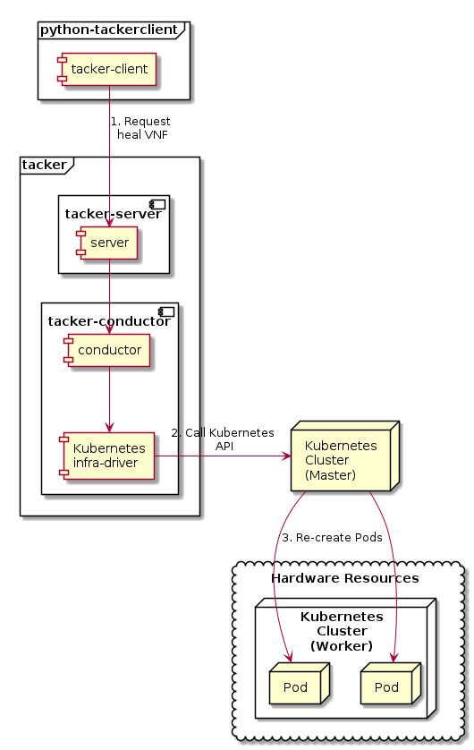

========================
ETSI NFV-SOL CNF Healing
========================

This document describes how to heal CNF in Tacker.

Overview
--------

The diagram below shows an overview of the CNF healing.

1. Request heal VNF

   A user requests tacker-server to heal a VNF or all VNFs with tacker-client
   by requesting ``heal VNF``.

2. Call Kubernetes API

   Upon receiving a request from tacker-client, tacker-server redirects it to
   tacker-conductor.  In tacker-conductor, the request is redirected again to
   an appropriate infra-driver (in this case Kubernetes infra-driver) according
   to the contents of the instantiate parameters.  Then, Kubernetes
   infra-driver calls Kubernetes APIs.

3. Re-create Pods

   Kubernetes Master re-creates Pods according to the API calls.

Prerequisites
-------------

The following packages should be installed:

* tacker
* python-tackerclient

The procedure of prepare for healing operation that from "register VIM" to
"Instantiate VNF", basically refer to
:doc:`./etsi_containerized_vnf_usage_guide`.

This procedure uses an example using the sample VNF package.

How to Create VNF Package for Healing
~~~~~~~~~~~~~~~~~~~~~~~~~~~~~~~~~~~~~~
Using `tacker/tests/etc/samples/etsi/nfv/test_cnf_heal`_,
describe how to create VNF package for healing.

.. code-block:: console

    $ cd tacker/tests/etc/samples/etsi/nfv/test_cnf_heal

Download official definition files from ETSI NFV.
ETSI GS NFV-SOL 001 [i.4] specifies the structure and format of the VNFD based
on TOSCA specifications.

.. code-block:: console

    $ cd Definitions
    $ wget https://forge.etsi.org/rep/nfv/SOL001/raw/v2.6.1/etsi_nfv_sol001_common_types.yaml
    $ wget https://forge.etsi.org/rep/nfv/SOL001/raw/v2.6.1/etsi_nfv_sol001_vnfd_types.yaml

CSAR Package should be compressed into a ZIP file for uploading.
Following commands are an example of compressing a VNF Package:

.. code-block:: console

    $ cd -
    $ zip deployment.zip -r Definitions/ Files/ TOSCA-Metadata/
    $ ls
    Definitions  deployment.zip  Files  TOSCA-Metadata

After creating a vnf package with :command:`openstack vnf package create`,
some information including ID, Links,
Onboarding State, Operational State, and Usage State will be returned.
When the Onboarding State is CREATED, the Operational State is DISABLED,
and the Usage State is NOT_IN_USE, indicate the creation is successful.

.. code-block:: console

    $ openstack vnf package create
    +-------------------+-------------------------------------------------------------------------------------------------+
    | Field             | Value                                                                                           |
    +-------------------+-------------------------------------------------------------------------------------------------+
    | ID                | 08d00a5c-e8aa-4219-9412-411458eaa7d2                                                            |
    | Links             | {                                                                                               |
    |                   |     "self": {                                                                                   |
    |                   |         "href": "/vnfpkgm/v1/vnf_packages/08d00a5c-e8aa-4219-9412-411458eaa7d2"                 |
    |                   |     },                                                                                          |
    |                   |     "packageContent": {                                                                         |
    |                   |         "href": "/vnfpkgm/v1/vnf_packages/08d00a5c-e8aa-4219-9412-411458eaa7d2/package_content" |
    |                   |     }                                                                                           |
    |                   | }                                                                                               |
    | Onboarding State  | CREATED                                                                                         |
    | Operational State | DISABLED                                                                                        |
    | Usage State       | NOT_IN_USE                                                                                      |
    | User Defined Data | {}                                                                                              |
    +-------------------+-------------------------------------------------------------------------------------------------+

Upload the CSAR zip file to the VNF Package by running the following command
:command:`openstack vnf package upload --path <path of vnf package> <vnf package ID>`.
Here is an example of uploading VNF package:

.. code-block:: console

  $ openstack vnf package upload --path deployment.zip 08d00a5c-e8aa-4219-9412-411458eaa7d2
  Upload request for VNF package 08d00a5c-e8aa-4219-9412-411458eaa7d2 has been accepted.

Create VNF instance by running :command:`openstack vnflcm create <VNFD ID>`.

Here is an example of creating VNF :

.. code-block:: console

  $ openstack vnflcm create b1bb0ce7-ebca-4fa7-95ed-4840d70a1177
  +--------------------------+---------------------------------------------------------------------------------------------+
  | Field                    | Value                                                                                       |
  +--------------------------+---------------------------------------------------------------------------------------------+
  | ID                       | 92cf0ccb-e575-46e2-9c0d-30c67e75aaf6                                                        |
  | Instantiation State      | NOT_INSTANTIATED                                                                            |
  | Links                    | {                                                                                           |
  |                          |     "self": {                                                                               |
  |                          |         "href": "/vnflcm/v1/vnf_instances/92cf0ccb-e575-46e2-9c0d-30c67e75aaf6"             |
  |                          |     },                                                                                      |
  |                          |     "instantiate": {                                                                        |
  |                          |         "href": "/vnflcm/v1/vnf_instances/92cf0ccb-e575-46e2-9c0d-30c67e75aaf6/instantiate" |
  |                          |     }                                                                                       |
  |                          | }                                                                                           |
  | VNF Instance Description | None                                                                                        |
  | VNF Instance Name        | None                                                                                        |
  | VNF Product Name         | Sample VNF                                                                                  |
  | VNF Provider             | Company                                                                                     |
  | VNF Software Version     | 1.0                                                                                         |
  | VNFD ID                  | b1bb0ce7-ebca-4fa7-95ed-4840d70a1177                                                        |
  | VNFD Version             | 1.0                                                                                         |
  +--------------------------+---------------------------------------------------------------------------------------------+

After the command is executed, instantiate VNF.
Instantiate VNF by running the following command
:command:`openstack vnflcm instantiate <VNF instance ID> <json file>`.

The following example shows a json file that deploys the Kubernetes resources
described in ``deployment_heal_simple.yaml``. Please note that ``additionalParams``
includes path of Kubernetes resource definition file and that
``lcm-kubernetes-def-files`` should be a list.

.. code-block:: console

    $ cat ./instance_kubernetes.json
    {
      "flavourId": "simple",
      "additionalParams": {
        "lcm-kubernetes-def-files": [
          "Files/kubernetes/deployment_heal_simple.yaml"
        ]
      },
      "vimConnectionInfo": [
        {
          "id": "8a3adb69-0784-43c7-833e-aab0b6ab4470",
          "vimId": "8d8373fe-6977-49ff-83ac-7756572ed186",
          "vimType": "kubernetes"
        }
      ]
    }
    $ openstack vnflcm instantiate 92cf0ccb-e575-46e2-9c0d-30c67e75aaf6 instance_kubernetes.json
    Instantiate request for VNF Instance 92cf0ccb-e575-46e2-9c0d-30c67e75aaf6 has been accepted.

CNF Healing Procedure
---------------------

As mentioned in Prerequisites and Healing target VNF instance, the VNF must be
instantiated before healing.

Details of CLI commands are described in :doc:`../cli/cli-etsi-vnflcm`.

There are two main methods for CNF healing.

* Healing of the entire VNF

  Heal entire VNF instance by termination and instantiation of the VNF.

* Healing specified with VNFC instances

  Heal Pod (mapped as VNFC) that is singleton or created using controller
  resources of Kubernetes such as Deployment, DaemonSet, StatefulSet and
  ReplicaSet.

.. note:: A VNFC is a 'VNF Component', and one VNFC basically corresponds to
          one VDU in the VNF. For more information on VNFC, see
          `NFV-SOL002 v2.6.1`_.

.. _labelCapHealingtargetVNFinstance:

Healing Target VNF Instance
~~~~~~~~~~~~~~~~~~~~~~~~~~~

Assuming that the following VNF instance exists. VNF Instance is made by using
`tacker/tests/etc/samples/etsi/nfv/test_cnf_heal`_.
This instance will be healed.

.. code-block:: console

  $ openstack vnflcm show VNF_INSTANCE_ID

Result:

.. code-block:: console

  +--------------------------+-------------------------------------------------------------------------------------------+
  | Field                    | Value                                                                                     |
  +--------------------------+-------------------------------------------------------------------------------------------+
  | ID                       | 92cf0ccb-e575-46e2-9c0d-30c67e75aaf6                                                      |
  | Instantiated Vnf Info    | {                                                                                         |
  |                          |     "flavourId": "simple",                                                                |
  |                          |     "vnfState": "STARTED",                                                                |
  |                          |     "scaleStatus": [                                                                      |
  |                          |         {                                                                                 |
  |                          |             "aspectId": "vdu1_aspect",                                                    |
  |                          |             "scaleLevel": 0                                                               |
  |                          |         }                                                                                 |
  |                          |     ],                                                                                    |
  |                          |     "extCpInfo": [],                                                                      |
  |                          |     "vnfcResourceInfo": [                                                                 |
  |                          |         {                                                                                 |
  |                          |             "id": "686b356f-8096-4e24-99e5-3c81d36341be",                                 |
  |                          |             "vduId": "VDU1",                                                              |
  |                          |             "computeResource": {                                                          |
  |                          |                 "vimConnectionId": null,                                                  |
  |                          |                 "resourceId": "vdu1-heal-simple-75b5566444-wgc7m",                        |
  |                          |                 "vimLevelResourceType": "Deployment"                                      |
  |                          |             },                                                                            |
  |                          |             "storageResourceIds": []                                                      |
  |                          |         },                                                                                |
  |                          |         {                                                                                 |
  |                          |             "id": "73cb41e7-31ae-494b-b4d0-66b8168c257e",                                 |
  |                          |             "vduId": "VDU1",                                                              |
  |                          |             "computeResource": {                                                          |
  |                          |                 "vimConnectionId": null,                                                  |
  |                          |                 "resourceId": "vdu1-heal-simple-75b5566444-wwzcm",                        |
  |                          |                 "vimLevelResourceType": "Deployment"                                      |
  |                          |             },                                                                            |
  |                          |             "storageResourceIds": []                                                      |
  |                          |         }                                                                                 |
  |                          |     ],                                                                                    |
  |                          |     "additionalParams": {}                                                                |
  |                          | }                                                                                         |
  | Instantiation State      | INSTANTIATED                                                                              |
  | Links                    | {                                                                                         |
  |                          |     "self": {                                                                             |
  |                          |         "href": "/vnflcm/v1/vnf_instances/92cf0ccb-e575-46e2-9c0d-30c67e75aaf6"           |
  |                          |     },                                                                                    |
  |                          |     "terminate": {                                                                        |
  |                          |         "href": "/vnflcm/v1/vnf_instances/92cf0ccb-e575-46e2-9c0d-30c67e75aaf6/terminate" |
  |                          |     },                                                                                    |
  |                          |     "heal": {                                                                             |
  |                          |         "href": "/vnflcm/v1/vnf_instances/92cf0ccb-e575-46e2-9c0d-30c67e75aaf6/heal"      |
  |                          |     }                                                                                     |
  |                          | }                                                                                         |
  | VIM Connection Info      | [                                                                                         |
  |                          |     {                                                                                     |
  |                          |         "id": "8a3adb69-0784-43c7-833e-aab0b6ab4470",                                     |
  |                          |         "vimId": "8d8373fe-6977-49ff-83ac-7756572ed186",                                  |
  |                          |         "vimType": "kubernetes",                                                          |
  |                          |         "interfaceInfo": {},                                                              |
  |                          |         "accessInfo": {}                                                                  |
  |                          |     }                                                                                     |
  |                          | ]                                                                                         |
  | VNF Instance Description | None                                                                                      |
  | VNF Instance Name        | None                                                                                      |
  | VNF Product Name         | Sample VNF                                                                                |
  | VNF Provider             | Company                                                                                   |
  | VNF Software Version     | 1.0                                                                                       |
  | VNFD ID                  | b1bb0ce7-ebca-4fa7-95ed-4840d70a1177                                                      |
  | VNFD Version             | 1.0                                                                                       |
  +--------------------------+-------------------------------------------------------------------------------------------+

How to Heal of the Entire VNF
~~~~~~~~~~~~~~~~~~~~~~~~~~~~~

Execute Heal of the entire CNF with CLI command and check the name and age of
pod information before and after healing.
This is to confirm that the name has changed and age has been new after heal.

Pod information before heal:

.. code-block:: console

  $ kubectl get pod
  NAME                                READY   STATUS    RESTARTS   AGE
  vdu1-heal-simple-75b5566444-wgc7m   1/1     Running   0          20m
  vdu1-heal-simple-75b5566444-wwzcm   1/1     Running   0          20m

Heal entire VNF can be executed by the following CLI command.

.. code-block:: console

  $ openstack vnflcm heal VNF_INSTANCE_ID

Result:

.. code-block:: console

  Heal request for VNF Instance 92cf0ccb-e575-46e2-9c0d-30c67e75aaf6 has been accepted.

Pod information after heal:

.. code-block:: console

  $ kubectl get pod
  NAME                                READY   STATUS    RESTARTS   AGE
  vdu1-heal-simple-75b5566444-ks785   1/1     Running   0          60s
  vdu1-heal-simple-75b5566444-p5mjv   1/1     Running   0          60s

All ``vnfcResourcecInfo`` in ``Instnatiated Vnf Info`` will be updated from
the VNF Instance displayed in :ref:`labelCapHealingtargetVNFinstance`.

.. code-block:: console

  $ openstack vnflcm show VNF_INSTANCE_ID

Result:

.. code-block:: console

  +--------------------------+-------------------------------------------------------------------------------------------+
  | Field                    | Value                                                                                     |
  +--------------------------+-------------------------------------------------------------------------------------------+
  | ID                       | 92cf0ccb-e575-46e2-9c0d-30c67e75aaf6                                                      |
  | Instantiated Vnf Info    | {                                                                                         |
  |                          |     "flavourId": "simple",                                                                |
  |                          |     "vnfState": "STARTED",                                                                |
  |                          |     "scaleStatus": [                                                                      |
  |                          |         {                                                                                 |
  |                          |             "aspectId": "vdu1_aspect",                                                    |
  |                          |             "scaleLevel": 0                                                               |
  |                          |         }                                                                                 |
  |                          |     ],                                                                                    |
  |                          |     "extCpInfo": [],                                                                      |
  |                          |     "vnfcResourceInfo": [                                                                 |
  |                          |         {                                                                                 |
  |                          |             "id": "a77b9a8e-a672-492d-9459-81c7b6483947",                                 |
  |                          |             "vduId": "VDU1",                                                              |
  |                          |             "computeResource": {                                                          |
  |                          |                 "vimConnectionId": null,                                                  |
  |                          |                 "resourceId": "vdu1-heal-simple-75b5566444-j45qb",                        |
  |                          |                 "vimLevelResourceType": "Deployment"                                      |
  |                          |             },                                                                            |
  |                          |             "storageResourceIds": []                                                      |
  |                          |         },                                                                                |
  |                          |         {                                                                                 |
  |                          |             "id": "9463d02b-faba-41cb-8131-e90eaa319c83",                                 |
  |                          |             "vduId": "VDU1",                                                              |
  |                          |             "computeResource": {                                                          |
  |                          |                 "vimConnectionId": null,                                                  |
  |                          |                 "resourceId": "vdu1-heal-simple-75b5566444-p5mjv",                        |
  |                          |                 "vimLevelResourceType": "Deployment"                                      |
  |                          |             },                                                                            |
  |                          |             "storageResourceIds": []                                                      |
  |                          |         }                                                                                 |
  |                          |     ],                                                                                    |
  |                          |     "additionalParams": {}                                                                |
  |                          | }                                                                                         |
  | Instantiation State      | INSTANTIATED                                                                              |
  | Links                    | {                                                                                         |
  |                          |     "self": {                                                                             |
  |                          |         "href": "/vnflcm/v1/vnf_instances/92cf0ccb-e575-46e2-9c0d-30c67e75aaf6"           |
  |                          |     },                                                                                    |
  |                          |     "terminate": {                                                                        |
  |                          |         "href": "/vnflcm/v1/vnf_instances/92cf0ccb-e575-46e2-9c0d-30c67e75aaf6/terminate" |
  |                          |     },                                                                                    |
  |                          |     "heal": {                                                                             |
  |                          |         "href": "/vnflcm/v1/vnf_instances/92cf0ccb-e575-46e2-9c0d-30c67e75aaf6/heal"      |
  |                          |     }                                                                                     |
  |                          | }                                                                                         |
  | VIM Connection Info      | [                                                                                         |
  |                          |     {                                                                                     |
  |                          |         "id": "8a3adb69-0784-43c7-833e-aab0b6ab4470",                                     |
  |                          |         "vimId": "8d8373fe-6977-49ff-83ac-7756572ed186",                                  |
  |                          |         "vimType": "kubernetes",                                                          |
  |                          |         "interfaceInfo": {},                                                              |
  |                          |         "accessInfo": {}                                                                  |
  |                          |     }                                                                                     |
  |                          | ]                                                                                         |
  | VNF Instance Description | None                                                                                      |
  | VNF Instance Name        | None                                                                                      |
  | VNF Product Name         | Sample VNF                                                                                |
  | VNF Provider             | Company                                                                                   |
  | VNF Software Version     | 1.0                                                                                       |
  | VNFD ID                  | b1bb0ce7-ebca-4fa7-95ed-4840d70a1177                                                      |
  | VNFD Version             | 1.0                                                                                       |
  +--------------------------+-------------------------------------------------------------------------------------------+

How to Heal Specified with VNFC Instances
~~~~~~~~~~~~~~~~~~~~~~~~~~~~~~~~~~~~~~~~~
Execute Heal of the partial CNF CLI command and check the name and age of pod
information before and after healing.
This is to confirm that the name has changed and age has been new after heal.

Pod information before heal:

.. code-block:: console

  $ kubectl get pod
  NAME                                READY   STATUS    RESTARTS   AGE
  vdu1-heal-simple-75b5566444-wgc7m   1/1     Running   0          20m
  vdu1-heal-simple-75b5566444-wwzcm   1/1     Running   0          20m

Heal specified with VNFC instances can be executed by running
:command:`openstack vnflcm heal VNF_INSTANCE_ID --vnfc-instance VNFC_INSTANCE_ID`.

In the example of this procedure, specify the ID
``686b356f-8096-4e24-99e5-3c81d36341be`` of the first ``vnfcResourceInfo`` as
``VNFC_INATANCE_ID``.

.. code-block:: console

  $ openstack vnflcm heal 92cf0ccb-e575-46e2-9c0d-30c67e75aaf6 --vnfc-instance 686b356f-8096-4e24-99e5-3c81d36341be

Result:

.. code-block:: console

  Heal request for VNF Instance 92cf0ccb-e575-46e2-9c0d-30c67e75aaf6 has been accepted.

Pod information after heal:

.. code-block:: console

  $ kubectl get pod
  NAME                                READY   STATUS    RESTARTS   AGE
  vdu1-heal-simple-75b5566444-ks785   1/1     Running   0          24s
  vdu1-heal-simple-75b5566444-wwzcm   1/1     Running   0          20m

Only the ``resourceId`` of target ``vnfcResourcecInfo`` in
``Instnatiated Vnf Info`` will be updated from the VNF Instance displayed in
:ref:`labelCapHealingtargetVNFinstance`.

.. code-block:: console

  $ openstack vnflcm show VNF_INSTANCE_ID

Result:

.. code-block:: console

  +--------------------------+-------------------------------------------------------------------------------------------+
  | Field                    | Value                                                                                     |
  +--------------------------+-------------------------------------------------------------------------------------------+
  | ID                       | 92cf0ccb-e575-46e2-9c0d-30c67e75aaf6                                                      |
  | Instantiated Vnf Info    | {                                                                                         |
  |                          |     "flavourId": "simple",                                                                |
  |                          |     "vnfState": "STARTED",                                                                |
  |                          |     "scaleStatus": [                                                                      |
  |                          |         {                                                                                 |
  |                          |             "aspectId": "vdu1_aspect",                                                    |
  |                          |             "scaleLevel": 0                                                               |
  |                          |         }                                                                                 |
  |                          |     ],                                                                                    |
  |                          |     "extCpInfo": [],                                                                      |
  |                          |     "vnfcResourceInfo": [                                                                 |
  |                          |         {                                                                                 |
  |                          |             "id": "686b356f-8096-4e24-99e5-3c81d36341be",                                 |
  |                          |             "vduId": "VDU1",                                                              |
  |                          |             "computeResource": {                                                          |
  |                          |                 "vimConnectionId": null,                                                  |
  |                          |                 "resourceId": "vdu1-heal-simple-75b5566444-ks785",                        |
  |                          |                 "vimLevelResourceType": "Deployment"                                      |
  |                          |             },                                                                            |
  |                          |             "storageResourceIds": []                                                      |
  |                          |         },                                                                                |
  |                          |         {                                                                                 |
  |                          |             "id": "73cb41e7-31ae-494b-b4d0-66b8168c257e",                                 |
  |                          |             "vduId": "VDU1",                                                              |
  |                          |             "computeResource": {                                                          |
  |                          |                 "vimConnectionId": null,                                                  |
  |                          |                 "resourceId": "vdu1-heal-simple-75b5566444-wwzcm",                        |
  |                          |                 "vimLevelResourceType": "Deployment"                                      |
  |                          |             },                                                                            |
  |                          |             "storageResourceIds": []                                                      |
  |                          |         }                                                                                 |
  |                          |     ],                                                                                    |
  |                          |     "additionalParams": {}                                                                |
  |                          | }                                                                                         |
  | Instantiation State      | INSTANTIATED                                                                              |
  | Links                    | {                                                                                         |
  |                          |     "self": {                                                                             |
  |                          |         "href": "/vnflcm/v1/vnf_instances/92cf0ccb-e575-46e2-9c0d-30c67e75aaf6"           |
  |                          |     },                                                                                    |
  |                          |     "terminate": {                                                                        |
  |                          |         "href": "/vnflcm/v1/vnf_instances/92cf0ccb-e575-46e2-9c0d-30c67e75aaf6/terminate" |
  |                          |     },                                                                                    |
  |                          |     "heal": {                                                                             |
  |                          |         "href": "/vnflcm/v1/vnf_instances/92cf0ccb-e575-46e2-9c0d-30c67e75aaf6/heal"      |
  |                          |     }                                                                                     |
  |                          | }                                                                                         |
  | VIM Connection Info      | [                                                                                         |
  |                          |     {                                                                                     |
  |                          |         "id": "8a3adb69-0784-43c7-833e-aab0b6ab4470",                                     |
  |                          |         "vimId": "8d8373fe-6977-49ff-83ac-7756572ed186",                                  |
  |                          |         "vimType": "kubernetes",                                                          |
  |                          |         "interfaceInfo": {},                                                              |
  |                          |         "accessInfo": {}                                                                  |
  |                          |     }                                                                                     |
  |                          | ]                                                                                         |
  | VNF Instance Description | None                                                                                      |
  | VNF Instance Name        | None                                                                                      |
  | VNF Product Name         | Sample VNF                                                                                |
  | VNF Provider             | Company                                                                                   |
  | VNF Software Version     | 1.0                                                                                       |
  | VNFD ID                  | b1bb0ce7-ebca-4fa7-95ed-4840d70a1177                                                      |
  | VNFD Version             | 1.0                                                                                       |
  +--------------------------+-------------------------------------------------------------------------------------------+

.. _NFV-SOL002 v2.6.1 : https://www.etsi.org/deliver/etsi_gs/NFV-SOL/001_099/002/02.06.01_60/gs_nfv-sol002v020601p.pdf
.. _tacker/tests/etc/samples/etsi/nfv/test_cnf_heal : https://opendev.org/openstack/tacker/src/branch/master/tacker/tests/etc/samples/etsi/nfv/test_cnf_heal
