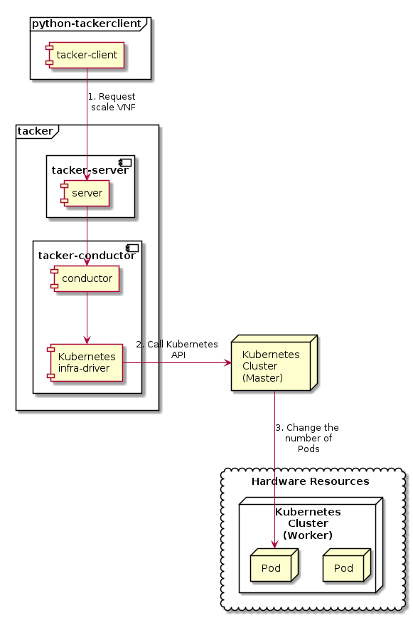

========================
ETSI NFV-SOL CNF Scaling
========================

This document describes how to scale CNF in Tacker.

Overview
--------

The diagram below shows an overview of the CNF scaling.

1. Request scale VNF

   A user requests tacker-server to scale a VNF or all VNFs with tacker-client
   by requesting ``scale VNF``.

2. Call Kubernetes API

   Upon receiving a request from tacker-client, tacker-server redirects it to
   tacker-conductor.  In tacker-conductor, the request is redirected again to
   an appropriate infra-driver (in this case Kubernetes infra-driver) according
   to the contents of the instantiate parameters.  Then, Kubernetes
   infra-driver calls Kubernetes APIs.

3. Change the number of Pods

   Kubernetes Master change the number of Pods according to the API calls.

Prerequisites
-------------

The following packages should be installed:

* tacker
* python-tackerclient

The procedure of prepare for scaling operation that from "register VIM" to
"Instantiate VNF", basically refer to
:doc:`./etsi_containerized_vnf_usage_guide`.

This procedure uses an example using the sample VNF package.

How to Create VNF Package for Scaling
~~~~~~~~~~~~~~~~~~~~~~~~~~~~~~~~~~~~~~
Using `tacker/tests/etc/samples/etsi/nfv/test_cnf_scale`_,
describe how to create VNF package for scaling.

.. code-block:: console

    $ cd tacker/tests/etc/samples/etsi/nfv/test_cnf_scale

Download official definition files from ETSI NFV.
ETSI GS NFV-SOL 001 [i.4] specifies the structure and format of the VNFD based
on TOSCA specifications.

.. code-block:: console

    $ cd Definitions
    $ wget https://forge.etsi.org/rep/nfv/SOL001/raw/v2.6.1/etsi_nfv_sol001_common_types.yaml
    $ wget https://forge.etsi.org/rep/nfv/SOL001/raw/v2.6.1/etsi_nfv_sol001_vnfd_types.yaml

CSAR Package should be compressed into a ZIP file for uploading.
Following commands are an example of compressing a VNF Package:

.. code-block:: console

    $ cd -
    $ zip deployment.zip -r Definitions/ Files/ TOSCA-Metadata/
    $ ls
    Definitions  deployment.zip  Files  TOSCA-Metadata

After creating a vnf package with :command:`openstack vnf package create`, some
information including ID, Links, Onboarding State, Operational State, and Usage
State will be returned. When the Onboarding State is CREATED, the Operational
State is DISABLED, and the Usage State is NOT_IN_USE, indicate the creation is
successful.

.. code-block:: console

    $ openstack vnf package create
    +-------------------+-------------------------------------------------------------------------------------------------+
    | Field             | Value                                                                                           |
    +-------------------+-------------------------------------------------------------------------------------------------+
    | ID                | 08d00a5c-e8aa-4219-9412-411458eaa7d2                                                            |
    | Links             | {                                                                                               |
    |                   |     "self": {                                                                                   |
    |                   |         "href": "/vnfpkgm/v1/vnf_packages/08d00a5c-e8aa-4219-9412-411458eaa7d2"                 |
    |                   |     },                                                                                          |
    |                   |     "packageContent": {                                                                         |
    |                   |         "href": "/vnfpkgm/v1/vnf_packages/08d00a5c-e8aa-4219-9412-411458eaa7d2/package_content" |
    |                   |     }                                                                                           |
    |                   | }                                                                                               |
    | Onboarding State  | CREATED                                                                                         |
    | Operational State | DISABLED                                                                                        |
    | Usage State       | NOT_IN_USE                                                                                      |
    | User Defined Data | {}                                                                                              |
    +-------------------+-------------------------------------------------------------------------------------------------+

Upload the CSAR zip file in to the VNF Package by running the following command
:command:`openstack vnf package upload --path <path of vnf package> <vnf package ID>`

Here is an example of uploading VNF package:

.. code-block:: console

  $ openstack vnf package upload --path deployment.zip 08d00a5c-e8aa-4219-9412-411458eaa7d2
  Upload request for VNF package 08d00a5c-e8aa-4219-9412-411458eaa7d2 has been accepted.

Create VNF instance by running :command:`openstack vnflcm create <VNFD ID>`.

Here is an example of creating VNF :

.. code-block:: console

  $ openstack vnflcm create b1bb0ce7-ebca-4fa7-95ed-4840d70a1177
  +--------------------------+---------------------------------------------------------------------------------------------+
  | Field                    | Value                                                                                       |
  +--------------------------+---------------------------------------------------------------------------------------------+
  | ID                       | 92cf0ccb-e575-46e2-9c0d-30c67e75aaf6                                                        |
  | Instantiation State      | NOT_INSTANTIATED                                                                            |
  | Links                    | {                                                                                           |
  |                          |     "self": {                                                                               |
  |                          |         "href": "/vnflcm/v1/vnf_instances/92cf0ccb-e575-46e2-9c0d-30c67e75aaf6"             |
  |                          |     },                                                                                      |
  |                          |     "instantiate": {                                                                        |
  |                          |         "href": "/vnflcm/v1/vnf_instances/92cf0ccb-e575-46e2-9c0d-30c67e75aaf6/instantiate" |
  |                          |     }                                                                                       |
  |                          | }                                                                                           |
  | VNF Instance Description | None                                                                                        |
  | VNF Instance Name        | None                                                                                        |
  | VNF Product Name         | Sample VNF                                                                                  |
  | VNF Provider             | Company                                                                                     |
  | VNF Software Version     | 1.0                                                                                         |
  | VNFD ID                  | b1bb0ce7-ebca-4fa7-95ed-4840d70a1177                                                        |
  | VNFD Version             | 1.0                                                                                         |
  +--------------------------+---------------------------------------------------------------------------------------------+

After the command is executed, instantiate VNF.
Instantiate VNF by running the following command
:command:`openstack vnflcm instantiate <VNF instance ID> <json file>`

The following example shows a json file that deploys the Kubernetes resources
described in ``deployment_scale.yaml``. Please note that ``additionalParams``
includes path of Kubernetes resource definition file and that
``lcm-kubernetes-def-files`` should be a list.

.. code-block:: console

    $ cat ./instance_kubernetes.json
    {
      "flavourId": "simple",
      "additionalParams": {
        "lcm-kubernetes-def-files": [
          "Files/kubernetes/deployment_scale.yaml"
        ]
      },
      "vimConnectionInfo": [
        {
          "id": "8a3adb69-0784-43c7-833e-aab0b6ab4470",
          "vimId": "8d8373fe-6977-49ff-83ac-7756572ed186",
          "vimType": "kubernetes"
        }
      ]
    }
    $ openstack vnflcm instantiate 92cf0ccb-e575-46e2-9c0d-30c67e75aaf6 instance_kubernetes.json
    Instantiate request for VNF Instance 92cf0ccb-e575-46e2-9c0d-30c67e75aaf6 has been accepted.

CNF Scaling Procedure
---------------------

As mentioned in Prerequisites, the VNF must be instantiated before performing
scaling.
Users can scale the number of pod replicas managed by controller resources such
as Kubernetes Deployment, StatefulSet, and ReplicaSet.

.. note:: If kind is Stateful Set and not dynamic provisioning
          (no-provisioner), user must create the Persistent Volume for the
          maximum replicas in advance because the increased Persistent Volume
          is not created during the scale out operation.

Details of CLI commands are described in :doc:`../cli/cli-etsi-vnflcm`.

There are two main methods for CNF scaling.

* Scale out CNF
* Scale in CNF

How to Identify ASPECT_ID
~~~~~~~~~~~~~~~~~~~~~~~~~

In order to execute scaling, it is necessary to specify ``ASPECT_ID``, which is
the ID for the target scaling group.
First, the method of specifying the ID will be described.

``ASPECT_ID`` is described in VNFD included in the VNF Package.
In the following VNFD excerpt, **vdu1_aspect** corresponds to ``ASPECT_ID``.

.. code-block:: yaml

  node_templates:
    VNF:
      type: company.provider.VNF
      properties:
        flavour_description: A simple flavour

    VDU1:
      type: tosca.nodes.nfv.Vdu.Compute
      properties:
        name: vdu1
        description: kubernetes controller resource as VDU
        vdu_profile:
          min_number_of_instances: 1
          max_number_of_instances: 3

  ...snip VNFD...

  policies:
    - scaling_aspects:
        type: tosca.policies.nfv.ScalingAspects
        properties:
          aspects:
            vdu1_aspect:
              name: vdu1_aspect
              description: vdu1 scaling aspect
              max_scale_level: 2
              step_deltas:
                - delta_1

    - vdu1_initial_delta:
        type: tosca.policies.nfv.VduInitialDelta
        properties:
          initial_delta:
            number_of_instances: 1
        targets: [ VDU1 ]

    - vdu1_scaling_aspect_deltas:
        type: tosca.policies.nfv.VduScalingAspectDeltas
        properties:
          aspect: vdu1_aspect
          deltas:
            delta_1:
              number_of_instances: 1
        targets: [ VDU1 ]

    - instantiation_levels:
        type: tosca.policies.nfv.InstantiationLevels
        properties:
          levels:
            instantiation_level_1:
              description: Smallest size
              scale_info:
                vdu1_aspect:
                  scale_level: 0
            instantiation_level_2:
              description: Largest size
              scale_info:
                vdu1_aspect:
                  scale_level: 2
          default_level: instantiation_level_1

    - vdu1_instantiation_levels:
        type: tosca.policies.nfv.VduInstantiationLevels
        properties:
          levels:
            instantiation_level_1:
              number_of_instances: 1
            instantiation_level_2:
              number_of_instances: 3
        targets: [ VDU1 ]

  ...snip VNFD...

.. note:: See `NFV-SOL001 v2.6.1`_ annex A.6 for details about ``ASPECT_ID``.

How to Scale Out CNF
~~~~~~~~~~~~~~~~~~~~

Execute Scale CLI command and check the number of replicas before and after
scaling.
This is to confirm that the number of replicas has increased after Scale-out.
An example using deployment is described.

Replicas information before scale-out:

.. code-block:: console

  $ kubectl get deployment
  NAME   READY   UP-TO-DATE   AVAILABLE   AGE
  vdu1   1/1     1            1           2d

Scale-out CNF can be executed by the following CLI command.

.. code-block:: console

  $ openstack vnflcm scale --type SCALE_OUT --aspect-id vdu1_aspect VNF_INSTANCE_ID

Result:

.. code-block:: console

  Scale request for VNF Instance edd306c3-647c-412c-a033-74aa40118038 has been accepted.

Replicas information after scale-out:

.. code-block:: console

  $ kubectl get deployment
  NAME   READY   UP-TO-DATE   AVAILABLE   AGE
  vdu1   2/2     2            2           2d

How to Scale in CNF
~~~~~~~~~~~~~~~~~~~

Execute Scale CLI command and check the number of replicas before and after
scaling.
This is to confirm that the number of replicas has increased after Scale-in.
An example using deployment is described.

Replicas information before scale-out:

.. code-block:: console

  $ kubectl get deployment
  NAME   READY   UP-TO-DATE   AVAILABLE   AGE
  vdu1   2/2     2            2           2d

Scale-in VNF can be executed by the following CLI command.

.. code-block:: console

  $ openstack vnflcm scale --type SCALE_IN --aspect-id vdu1_aspect VNF_INSTANCE_ID

Result:

.. code-block:: console

  Scale request for VNF Instance
  edd306c3-647c-412c-a033-74aa40118038 has been accepted.

Replicas information after scale-in:

.. code-block:: console

  $ kubectl get deployment
  NAME   READY   UP-TO-DATE   AVAILABLE   AGE
  vdu1   1/1     1            1           2d

.. _NFV-SOL001 v2.6.1 : https://www.etsi.org/deliver/etsi_gs/NFV-SOL/001_099/001/02.06.01_60/gs_NFV-SOL001v020601p.pdf
.. _tacker/tests/etc/samples/etsi/nfv/test_cnf_scale : https://opendev.org/openstack/tacker/src/branch/master/tacker/tests/etc/samples/etsi/nfv/test_cnf_scale
