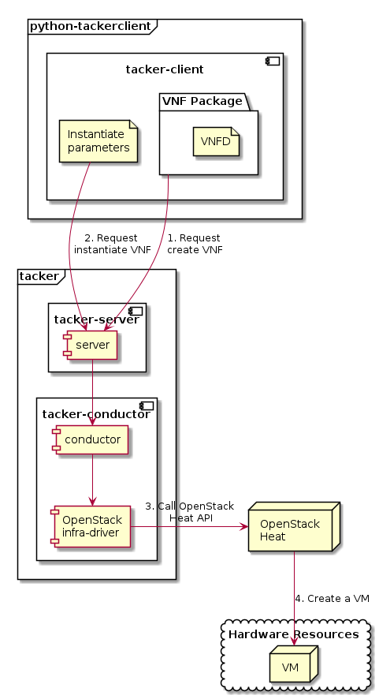

============================================
ETSI NFV-SOL VNF Deployment as VM with TOSCA
============================================

This document describes how to deploy VNF as VM with TOSCA
in Tacker using CLI commands.

Overview
--------

The diagram below shows an overview of the VNF deployment.

1. Request create VNF

   A user requests tacker-server to create a VNF with tacker-client by
   uploading a VNF Package and requesting ``create VNF``.  The VNF Package
   should contain ``VNFD``.  The detailed explanation of ``VNFD`` can be found
   in :doc:`./vnf-package`.

2. Request instantiate VNF

   A user requests tacker-server to instantiate the created VNF by requesting
   ``instantiate VNF`` with instantiate parameters.

3. Call OpenStack Heat API

   Upon receiving a request from tacker-client, tacker-server redirects it to
   tacker-conductor.  In tacker-conductor, the request is redirected again to
   an appropriate infra-driver (in this case OpenStack infra-driver) according
   to the contents of the instantiate parameters.  Then, OpenStack infra-driver
   calls OpenStack Heat APIs to create a VM as a VNF.

4. Create a VM

   OpenStack Heat creates a VM according to the API calls.

Prerequisites
-------------

The following packages should be installed:

* tacker
* python-tackerclient

A default VIM should be registered according to
:doc:`../cli/cli-legacy-vim`.

The VNF Package(sample_vnf_pkg.zip) used below is prepared
by referring to :doc:`./vnf-package`.

VNF Deployment Procedure as VM
------------------------------

In order to deploy VNF as VM, it is necessary to execute
the following procedure.
Details of CLI commands are described in
:doc:`../cli/cli-etsi-vnfpkgm` and :doc:`../cli/cli-etsi-vnflcm`.

1. Create VNF Package Info
^^^^^^^^^^^^^^^^^^^^^^^^^^

Execute the following CLI command to create VNF Package.

.. code-block:: console

  $ openstack vnf package create

Result:

.. code-block:: console

  +-------------------+----------------------------------------------------------------------------------------------------+
  | Field             | Value                                                                                              |
  +-------------------+----------------------------------------------------------------------------------------------------+
  | ID                | e712a702-741f-4093-a971-b3ad69411ac1                                                               |
  | Links             | packageContent=href=/vnfpkgm/v1/vnf_packages/e712a702-741f-4093-a971-b3ad69411ac1/package_content, |
  |                   | self=href=s/vnfpkgm/v1/vnf_packages/e712a702-741f-4093-a971-b3ad69411ac1                           |
  | Onboarding State  | CREATED                                                                                            |
  | Operational State | DISABLED                                                                                           |
  | Usage State       | NOT_IN_USE                                                                                         |
  | User Defined Data |                                                                                                    |
  +-------------------+----------------------------------------------------------------------------------------------------+

After that, execute the following CLI command and confirm that
VNF Package creation was successful.

* Confirm that the 'Onboarding State' is 'CREATED'.
* Confirm that the 'Operational State' is 'DISABLED'.
* Confirm that the 'Usage State' is 'NOT_IN_USE'.

.. code-block:: console

  $ openstack vnf package show VNF_PACKAGE_ID \
      -c 'Onboarding State' -c 'Operational State' -c 'Usage State'

Result:

.. code-block:: console

  +-------------------+------------+
  | Field             | Value      |
  +-------------------+------------+
  | Onboarding State  | CREATED    |
  | Operational State | DISABLED   |
  | Usage State       | NOT_IN_USE |
  +-------------------+------------+

2. Upload VNF Package
^^^^^^^^^^^^^^^^^^^^^

Execute the following CLI command to upload VNF Package.

.. code-block:: console

  $ openstack vnf package upload --path sample_csar.zip VNF_PACKAGE_ID

Result:

.. code-block:: console

  Upload request for VNF package e712a702-741f-4093-a971-b3ad69411ac1 has been accepted.

After that, execute the following CLI command and confirm that
VNF Package uploading was successful.

* Confirm that the 'Onboarding State' is 'ONBOARDED'.
* Confirm that the 'Operational State' is 'ENABLED'.
* Confirm that the 'Usage State' is 'NOT_IN_USE'.
* Take a note of the 'VNFD ID' because you will need it in the next
  'Create VNF Identifier'.

.. note::
       The state of 'Onboarding State' changes in the order of
       'UPLOADING', 'PROCESSING', 'ONBOARDED'.

.. code-block:: console

  $ openstack vnf package show VNF_PACKAGE_ID \
      -c 'Onboarding State' -c 'Operational State' -c 'Usage State' -c 'VNFD ID'

Result:

.. code-block:: console

  +-------------------+--------------------------------------+
  | Field             | Value                                |
  +-------------------+--------------------------------------+
  | Onboarding State  | ONBOARDED                            |
  | Operational State | ENABLED                              |
  | Usage State       | NOT_IN_USE                           |
  | VNFD ID           | b1bb0ce7-ebca-4fa7-95ed-4840d70a1177 |
  +-------------------+--------------------------------------+

3. Create VNF Identifier
^^^^^^^^^^^^^^^^^^^^^^^^

Execute the following CLI command to create a VNF instance.

.. code-block:: console

  $ openstack vnflcm create VNFD_ID

Result:

.. code-block:: console

  +--------------------------+----------------------------------------------------------------------------------------------+
  | Field                    | Value                                                                                        |
  +--------------------------+----------------------------------------------------------------------------------------------+
  | ID                       | 725f625e-f6b7-4bcd-b1b7-7184039fde45                                                         |
  | Instantiation State      | NOT_INSTANTIATED                                                                             |
  | Links                    | instantiate=href=/vnflcm/v1/vnf_instances/725f625e-f6b7-4bcd-b1b7-7184039fde45/instantiate,  |
  |                          | self=href=/vnflcm/v1/vnf_instances/725f625e-f6b7-4bcd-b1b7-7184039fde45                      |
  | VNF Instance Description | None                                                                                         |
  | VNF Instance Name        | None                                                                                         |
  | VNF Product Name         | Sample VNF                                                                                   |
  | VNF Provider             | Company                                                                                      |
  | VNF Software Version     | 1.0                                                                                          |
  | VNFD ID                  | b1bb0ce7-ebca-4fa7-95ed-4840d70a1177                                                         |
  | VNFD Version             | 1.0                                                                                          |
  +--------------------------+----------------------------------------------------------------------------------------------+

After that, execute the following CLI command and confirm that
VNF instance creation was successful.

* Confirm that the 'Usage State' of the VNF Package is 'IN_USE'.
* Confirm that the 'Instantiation State' of the VNF instance
  is 'NOT_INSTANTIATED'.

.. code-block:: console

  $ openstack vnf package show VNF_PACKAGE_ID \
      -c 'Usage State'

Result:

.. code-block:: console

  +-------------+--------+
  | Field       | Value  |
  +-------------+--------+
  | Usage State | IN_USE |
  +-------------+--------+

.. code-block:: console

  $ openstack vnflcm show VNF_INSTANCE_ID \
      -c 'Instantiation State'

Result:

.. code-block:: console

  +---------------------+------------------+
  | Field               | Value            |
  +---------------------+------------------+
  | Instantiation State | NOT_INSTANTIATED |
  +---------------------+------------------+

4. Instantiate VNF
^^^^^^^^^^^^^^^^^^

Create a sample_param_file.json file with the following format.
This is the file that defines the parameters for an instantiate request.
These parameters will be set in the body of the instantiate request.

Required parameter:

* flavourID

.. note::
       Details of flavourID is described in :doc:`./vnfd-sol001`.

Optional parameters:

* instantiationLevelId
* extVirtualLinks
* extManagedVirtualLinks
* vimConnectionInfo

.. note::
      You can skip `vimConnectionInfo` only when you have
      the default VIM described in :doc:`../cli/cli-legacy-vim`.

Param file with only required parameters:

.. code-block:: console

  {
    "flavourId":"simple"
  }

Param file with optional parameters:

.. code-block:: console

  {
    "flavourId": "simple",
    "instantiationLevelId": "instantiation_level_1",
    "extVirtualLinks": [
      {
        "id": "net0",
        "resourceId": "4bf3e646-7a24-4f04-a985-d8f4bb1203de", #Set the uuid of the network to use
        "extCps": [
          {
            "cpdId": "CP1",
            "cpConfig": [
              {
                "cpProtocolData": [
                  {
                    "layerProtocol": "IP_OVER_ETHERNET"
                  }
                ]
              }
            ]
          }
        ]
      }
    ],
    "vimConnectionInfo": [
      {
        "id": "e24f9796-a8e9-4cb0-85ce-5920dcddafa1",    #Set a random uuid.
        "vimId": "8a0fd79d-e224-4c27-85f5-ee79c6e0d870", #Set the uuid of the VIM to use
        "vimType": "ETSINFV.OPENSTACK_KEYSTONE.v_2"
      }
    ]
  }

Execute the following CLI command to instantiate VNF instance.

.. code-block:: console

  $ openstack vnflcm instantiate VNF_INSTANCE_ID \
       ./sample_param_file.json

Result:

.. code-block:: console

  Instantiate request for VNF Instance 725f625e-f6b7-4bcd-b1b7-7184039fde45 has been accepted.

After that, execute the following CLI command and confirm that
VNF instance instantiation was successful.

* Confirm that the 'Instantiation State' is 'INSTANTIATED'.

.. code-block:: console

  $ openstack vnflcm show VNF_INSTANCE_ID \
      -c 'Instantiation State'

Result:

.. code-block:: console

  +---------------------+--------------+
  | Field               | Value        |
  +---------------------+--------------+
  | Instantiation State | INSTANTIATED |
  +---------------------+--------------+

5. Terminate VNF
^^^^^^^^^^^^^^^^

Execute the following CLI command to terminate the VNF instance.

.. code-block:: console

  $ openstack vnflcm terminate VNF_INSTANCE_ID

Result:

.. code-block:: console

  Terminate request for VNF Instance '725f625e-f6b7-4bcd-b1b7-7184039fde45' has been accepted.

After that, execute the following CLI command and confirm that
VNF instance termination was successful.

* Confirm that the 'Instantiation State' is 'NOT_INSTANTIATED'.

.. code-block:: console

  $ openstack vnflcm show VNF_INSTANCE_ID \
      -c 'Instantiation State'

Result:

.. code-block:: console

  +---------------------+------------------+
  | Field               | Value            |
  +---------------------+------------------+
  | Instantiation State | NOT_INSTANTIATED |
  +---------------------+------------------+

6. Delete VNF Identifier
^^^^^^^^^^^^^^^^^^^^^^^^

Execute the following CLI command to delete the VNF instance.

.. code-block:: console

  $ openstack vnflcm delete VNF_INSTANCE_ID

Result:

.. code-block:: console

  Vnf instance '725f625e-f6b7-4bcd-b1b7-7184039fde45' deleted successfully

After that, execute the following CLI command and confirm that
VNF instance deletion was successful.

* Confirm that the 'Usage State' of VNF Package is 'NOT_IN_USE'.
* Confirm that the VNF instance is not found.

.. code-block:: console

  $ openstack vnf package show VNF_PACKAGE_ID \
      -c 'Usage State'

Result:

.. code-block:: console

  +-------------+------------+
  | Field       | Value      |
  +-------------+------------+
  | Usage State | NOT_IN_USE |
  +-------------+------------+

.. code-block:: console

  $ openstack vnflcm show VNF_INSTANCE_ID

Result:

.. code-block:: console

  Can not find requested vnf instance: 725f625e-f6b7-4bcd-b1b7-7184039fde45
