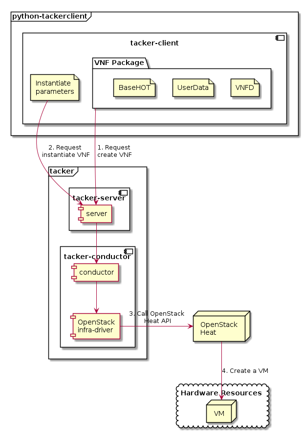

==============================================================
ETSI NFV-SOL VNF Deployment as VM with LCM Operation User Data
==============================================================

This document describes how to deploy VNF as VM with
LCM operation user data in Tacker using CLI commands.
Please check `LCM-user-data spec`_ and `NFV-SOL014 v2.8.1`_
for more information on LCM operation user data.

.. note::
       Most of the content is the same as :doc:`./etsi_vnf_deployment_as_vm_with_tosca`,
       but some have 'LCM operation user data' specific descriptions.
       The part will be clarified with the notation [This is UserData specific part].

Overview
--------

The diagram below shows an overview of the VNF deployment.

1. Request create VNF

   A user requests tacker-server to create a VNF with tacker-client by
   uploading a VNF Package and requesting ``create VNF``.  The VNF Package
   should contain ``BaseHOT`` and ``UserData`` in addition to ``VNFD``.  The
   detailed explanation of these contents can be found in :doc:`./vnf-package`.

2. Request instantiate VNF

   A user requests tacker-server to instantiate the created VNF by requesting
   ``instantiate VNF`` with instantiate parameters.

3. Call OpenStack Heat API

   Upon receiving a request, tacker-server redirects it to tacker-conductor.
   In tacker-conductor, the request is redirected again to an appropriate
   infra-driver (in this case OpenStack infra-driver) according to the contents
   of the instantiate parameters.  Then, OpenStack infra-driver calls OpenStack
   Heat APIs to create a VM as a VNF.

4. Create a VM

   OpenStack Heat creates a VM according to the API calls.

Prerequisites
-------------

The following packages should be installed:

* tacker
* python-tackerclient

A default VIM should be registered according to
:doc:`../cli/cli-legacy-vim`.

The VNF Package(sample_vnf_pkg.zip) used below is prepared
by referring to :doc:`./vnf-package`.

.. note:: [This is UserData specific part]
          In order to deploy VNF using LCM operation user data,
          it is necessary to include BaseHOT and UserData in the VNF Package,
          which are optional in :doc:`./vnf-package`.

VNF Deployment Procedure as VM
------------------------------

In order to deploy VNF as a VM, it is necessary to execute
the following procedure.
Details of CLI commands are described in
:doc:`../cli/cli-etsi-vnfpkgm` and :doc:`../cli/cli-etsi-vnflcm`.

Many procedures are the same as :doc:`./etsi_vnf_deployment_as_vm_with_tosca`,
so refer to the doc for those procedures.

1. Create VNF Package Info
^^^^^^^^^^^^^^^^^^^^^^^^^^

See procedure in :doc:`./etsi_vnf_deployment_as_vm_with_tosca`.

2. Upload VNF Package
^^^^^^^^^^^^^^^^^^^^^

See procedure in :doc:`./etsi_vnf_deployment_as_vm_with_tosca`.

3. Create VNF Identifier
^^^^^^^^^^^^^^^^^^^^^^^^

See procedure in :doc:`./etsi_vnf_deployment_as_vm_with_tosca`.

4. Instantiate VNF
^^^^^^^^^^^^^^^^^^

Create a sample_param_file.json file with the following format.
This is the file that defines the parameters for an instantiate request.
These parameters will be set in the body of the instantiate request.

Required parameter:

* flavourId
* additionalParams

.. note::
       Details of flavourId is described in :doc:`./vnfd-sol001`.

.. note::
       [This is UserData specific part]
       additionalParams is a parameter that can be described by KeyValuePairs.
       By setting the following two parameters in this parameter,
       instantiate using LCM operation user data becomes possible.
       For file_name.py and class_name, set the file name and class name
       described in Prerequisites.

       * lcm-operation-user-data: ./UserData/file_name.py
       * lcm-operation-user-data-class: class_name

Optional parameters:

* instantiationLevelId
* extVirtualLinks
* extManagedVirtualLinks
* vimConnectionInfo

.. note::
      You can skip `vimConnectionInfo` only when you have
      the default VIM described in :doc:`../cli/cli-legacy-vim`.

Param file with only required parameters:

.. code-block:: console

  {
    "flavourId":"simple",
    "additionalParams": {
      "lcm-operation-user-data": "./UserData/lcm_user_data.py",
      "lcm-operation-user-data-class": "SampleUserData"
    }
  }

Param file with optional parameters:

.. code-block:: console

  {
    "flavourId": "simple",
    "instantiationLevelId": "instantiation_level_1",
    "extVirtualLinks": [
      {
        "id": "net0",
        "resourceId": "4bf3e646-7a24-4f04-a985-d8f4bb1203de", #Set the uuid of the network to use
        "extCps": [
          {
            "cpdId": "CP1",
            "cpConfig": [
              {
                "cpProtocolData": [
                  {
                    "layerProtocol": "IP_OVER_ETHERNET"
                  }
                ]
              }
            ]
          }
        ]
      }
    ],
    "vimConnectionInfo": [
      {
        "id": "e24f9796-a8e9-4cb0-85ce-5920dcddafa1",    #Set a random uuid.
        "vimId": "8a0fd79d-e224-4c27-85f5-ee79c6e0d870", #Set the uuid of the VIM to use
        "vimType": "ETSINFV.OPENSTACK_KEYSTONE.v_2"
      }
    ],
    "additionalParams": {
      "lcm-operation-user-data": "./UserData/lcm_user_data.py",
      "lcm-operation-user-data-class": "SampleUserData"
    }
  }

Execute the following CLI command to instantiate the VNF instance.

.. code-block:: console

  $ openstack vnflcm instantiate VNF_INSTANCE_ID \
       ./sample_param_file.json

Result:

.. code-block:: console

  Instantiate request for VNF Instance 725f625e-f6b7-4bcd-b1b7-7184039fde45 has been accepted.

After that, execute the following CLI command and confirm that
VNF instance instantiation was successful.

* Confirm that the 'Instantiation State' is 'INSTANTIATED'.

.. code-block:: console

  $ openstack vnflcm show VNF_INSTANCE_ID \
      -c 'Instantiation State'

Result:

.. code-block:: console

  +---------------------+--------------+
  | Field               | Value        |
  +---------------------+--------------+
  | Instantiation State | INSTANTIATED |
  +---------------------+--------------+

5. Terminate VNF
^^^^^^^^^^^^^^^^

See procedure in :doc:`./etsi_vnf_deployment_as_vm_with_tosca`.

6. Delete VNF Identifier
^^^^^^^^^^^^^^^^^^^^^^^^

See procedure in :doc:`./etsi_vnf_deployment_as_vm_with_tosca`.

.. _LCM-user-data spec : https://specs.openstack.org/openstack/tacker-specs/specs/ussuri/lcm-operation-with-lcm-operation-user-data.html
.. _NFV-SOL014 v2.8.1 : https://www.etsi.org/deliver/etsi_gs/NFV-SOL/001_099/014/02.08.01_60/gs_NFV-SOL014v020801p.pdf

