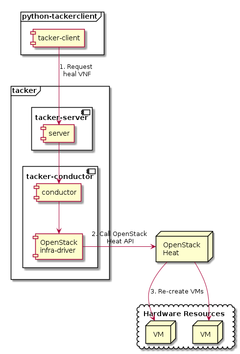

========================
ETSI NFV-SOL VNF Healing
========================

This document describes how to heal VNF in Tacker.

Overview
--------

The diagram below shows an overview of the VNF healing.

1. Request heal VNF

   A user requests tacker-server to heal a VNF or all VNFs with tacker-client
   by requesting ``heal VNF``.

2. Call OpenStack Heat API

   Upon receiving a request from tacker-client, tacker-server redirects it to
   tacker-conductor.  In tacker-conductor, the request is redirected again to
   an appropriate infra-driver (in this case OpenStack infra-driver) according
   to the contents of the instantiate parameters.  Then, OpenStack infra-driver
   calls OpenStack Heat APIs.

3. Re-create VMs

   OpenStack Heat re-creates VMs according to the API calls.

Prerequisites
-------------

The following packages should be installed:

* tacker
* python-tackerclient

A default VIM should be registered according to
:doc:`../cli/cli-legacy-vim`.

The VNF Package(sample_vnf_pkg.zip) used below is prepared
by referring to :doc:`./vnf-package`.

Execute up to "Instantiate VNF" in the procedure of
:doc:`./etsi_vnf_deployment_as_vm_with_tosca`.
In other words, the procedure after "Terminate VNF" is not executed.

Healing Target VNF Instance
~~~~~~~~~~~~~~~~~~~~~~~~~~~

Assuming that the following VNF instance exists,
this instance will be healed.

.. code-block:: console

  $ openstack vnflcm show VNF_INSTANCE_ID

Result:

.. code-block:: console

  +--------------------------+-------------------------------------------------------------------------------------------------+
  | Field                    | Value                                                                                           |
  +--------------------------+-------------------------------------------------------------------------------------------------+
  | ID                       | 9e086f34-b3c9-4986-b5e5-609a5ac4c1f9                                                            |
  | Instantiated Vnf Info    | {                                                                                               |
  |                          |     "flavourId": "simple",                                                                      |
  |                          |     "vnfState": "STARTED",                                                                      |
  |                          |     "extCpInfo": [                                                                              |
  |                          |         {                                                                                       |
  |                          |             "id": "241e6022-c9be-4ad6-b7a7-ecb32de20475",                                       |
  |                          |             "cpdId": "CP1",                                                                     |
  |                          |             "extLinkPortId": null,                                                              |
  |                          |             "associatedVnfcCpId": "b07ba349-1366-4d14-91e9-07842cdfa7ab",                       |
  |                          |             "cpProtocolInfo": [                                                                 |
  |                          |                 {                                                                               |
  |                          |                     "layerProtocol": "IP_OVER_ETHERNET"                                         |
  |                          |                 }                                                                               |
  |                          |             ]                                                                                   |
  |                          |         }                                                                                       |
  |                          |     ],                                                                                          |
  |                          |     "extVirtualLinkInfo": [                                                                     |
  |                          |         {                                                                                       |
  |                          |             "id": "net0",                                                                       |
  |                          |             "resourceHandle": {                                                                 |
  |                          |                 "vimConnectionId": null,                                                        |
  |                          |                 "resourceId": "1948231e-bbf0-4ff9-a692-40f8d6d5c90d",                           |
  |                          |                 "vimLevelResourceType": null                                                    |
  |                          |             }                                                                                   |
  |                          |         }                                                                                       |
  |                          |     ],                                                                                          |
  |                          |     "vnfcResourceInfo": [                                                                       |
  |                          |         {                                                                                       |
  |                          |             "id": "b07ba349-1366-4d14-91e9-07842cdfa7ab",                                       |
  |                          |             "vduId": "VDU1",                                                                    |
  |                          |             "computeResource": {                                                                |
  |                          |                 "vimConnectionId": "13bef9df-7c54-4b37-9da0-1256953e7f60",                      |
  |                          |                 "resourceId": "794b9460-d799-4398-98a4-413fb04d2051",                           |
  |                          |                 "vimLevelResourceType": "OS::Nova::Server"                                      |
  |                          |             },                                                                                  |
  |                          |             "storageResourceIds": [],                                                           |
  |                          |             "vnfcCpInfo": [                                                                     |
  |                          |                 {                                                                               |
  |                          |                     "id": "f7297196-a024-4a90-9393-aadeb7de1fb3",                               |
  |                          |                     "cpdId": "CP1",                                                             |
  |                          |                     "vnfExtCpId": null,                                                         |
  |                          |                     "vnfLinkPortId": "cf733c70-8dc2-46b8-8d76-2ebd0bb5bd07",                    |
  |                          |                     "cpProtocolInfo": [                                                         |
  |                          |                         {                                                                       |
  |                          |                             "layerProtocol": "IP_OVER_ETHERNET"                                 |
  |                          |                         }                                                                       |
  |                          |                     ]                                                                           |
  |                          |                 },                                                                              |
  |                          |                 {                                                                               |
  |                          |                     "id": "f3851831-ed25-4e73-b913-6725085c7484",                               |
  |                          |                     "cpdId": "CP2",                                                             |
  |                          |                     "vnfExtCpId": null,                                                         |
  |                          |                     "vnfLinkPortId": "8cc28f47-ee72-420e-b4e8-26913d60bf55"                     |
  |                          |                 }                                                                               |
  |                          |             ]                                                                                   |
  |                          |         },                                                                                      |
  |                          |         {                                                                                       |
  |                          |             "id": "aae43bc1-a54e-46e8-9371-59c1ef5fc84d",                                       |
  |                          |             "vduId": "VDU2",                                                                    |
  |                          |             "computeResource": {                                                                |
  |                          |                 "vimConnectionId": "13bef9df-7c54-4b37-9da0-1256953e7f60",                      |
  |                          |                 "resourceId": "20e10aed-16e9-4f7c-ad0c-1e885cc1200e",                           |
  |                          |                 "vimLevelResourceType": "OS::Nova::Server"                                      |
  |                          |             },                                                                                  |
  |                          |             "storageResourceIds": [                                                             |
  |                          |                 "21703823-33b3-4f06-a52c-28b455146a4a"                                          |
  |                          |             ],                                                                                  |
  |                          |             "vnfcCpInfo": [                                                                     |
  |                          |                 {                                                                               |
  |                          |                     "id": "d0088ed3-1639-4f3b-a369-3baae7e86540",                               |
  |                          |                     "cpdId": "CP3",                                                             |
  |                          |                     "vnfExtCpId": null,                                                         |
  |                          |                     "vnfLinkPortId": "d5fe9f7b-f50d-49dc-a3c8-ded2843005e4"                     |
  |                          |                 }                                                                               |
  |                          |             ]                                                                                   |
  |                          |         }                                                                                       |
  |                          |     ],                                                                                          |
  |                          |     "vnfVirtualLinkResourceInfo": [                                                             |
  |                          |         {                                                                                       |
  |                          |             "id": "45588051-a413-41a0-a55c-b31fb50fb351",                                       |
  |                          |             "vnfVirtualLinkDescId": "internalVL2",                                              |
  |                          |             "networkResource": {                                                                |
  |                          |                 "vimConnectionId": "13bef9df-7c54-4b37-9da0-1256953e7f60",                      |
  |                          |                 "resourceId": "f45802ae-7fff-4c6e-b62f-3d55baec4c6b",                           |
  |                          |                 "vimLevelResourceType": "OS::Neutron::Net"                                      |
  |                          |             },                                                                                  |
  |                          |             "vnfLinkPorts": [                                                                   |
  |                          |                 {                                                                               |
  |                          |                     "id": "8cc28f47-ee72-420e-b4e8-26913d60bf55",                               |
  |                          |                     "resourceHandle": {                                                         |
  |                          |                         "vimConnectionId": "13bef9df-7c54-4b37-9da0-1256953e7f60",              |
  |                          |                         "resourceId": "e020ad8f-3f85-4d13-98c1-3ea476bf2d1a",                   |
  |                          |                         "vimLevelResourceType": "OS::Neutron::Port"                             |
  |                          |                     },                                                                          |
  |                          |                     "cpInstanceId": "f3851831-ed25-4e73-b913-6725085c7484"                      |
  |                          |                 },                                                                              |
  |                          |                 {                                                                               |
  |                          |                     "id": "d5fe9f7b-f50d-49dc-a3c8-ded2843005e4",                               |
  |                          |                     "resourceHandle": {                                                         |
  |                          |                         "vimConnectionId": "13bef9df-7c54-4b37-9da0-1256953e7f60",              |
  |                          |                         "resourceId": "8f1588e5-4410-40eb-84ee-28336a6a0212",                   |
  |                          |                         "vimLevelResourceType": "OS::Neutron::Port"                             |
  |                          |                     },                                                                          |
  |                          |                     "cpInstanceId": "d0088ed3-1639-4f3b-a369-3baae7e86540"                      |
  |                          |                 }                                                                               |
  |                          |             ]                                                                                   |
  |                          |         },                                                                                      |
  |                          |         {                                                                                       |
  |                          |             "id": "66f3fa97-4046-4fa4-b1ff-19295501021f",                                       |
  |                          |             "vnfVirtualLinkDescId": "net0",                                                     |
  |                          |             "networkResource": {                                                                |
  |                          |                 "vimConnectionId": null,                                                        |
  |                          |                 "resourceId": "1948231e-bbf0-4ff9-a692-40f8d6d5c90d",                           |
  |                          |                 "vimLevelResourceType": "OS::Neutron::Net"                                      |
  |                          |             },                                                                                  |
  |                          |             "vnfLinkPorts": [                                                                   |
  |                          |                 {                                                                               |
  |                          |                     "id": "cf733c70-8dc2-46b8-8d76-2ebd0bb5bd07",                               |
  |                          |                     "resourceHandle": {                                                         |
  |                          |                         "vimConnectionId": "13bef9df-7c54-4b37-9da0-1256953e7f60",              |
  |                          |                         "resourceId": "1db39a17-bbae-4074-8623-8a8026b51647",                   |
  |                          |                         "vimLevelResourceType": "OS::Neutron::Port"                             |
  |                          |                     },                                                                          |
  |                          |                     "cpInstanceId": "f7297196-a024-4a90-9393-aadeb7de1fb3"                      |
  |                          |                 }                                                                               |
  |                          |             ]                                                                                   |
  |                          |         }                                                                                       |
  |                          |     ],                                                                                          |
  |                          |     "virtualStorageResourceInfo": [                                                             |
  |                          |         {                                                                                       |
  |                          |             "id": "21703823-33b3-4f06-a52c-28b455146a4a",                                       |
  |                          |             "virtualStorageDescId": "VirtualStorage",                                           |
  |                          |             "storageResource": {                                                                |
  |                          |                 "vimConnectionId": "13bef9df-7c54-4b37-9da0-1256953e7f60",                      |
  |                          |                 "resourceId": "c6231ea2-6a90-4ba4-b38b-778a5d7110ee",                           |
  |                          |                 "vimLevelResourceType": "OS::Cinder::Volume"                                    |
  |                          |             }                                                                                   |
  |                          |         }                                                                                       |
  |                          |     ],                                                                                          |
  |                          |     "vnfcInfo": [                                                                               |
  |                          |         {                                                                                       |
  |                          |             "id": "4c999b33-3004-4b44-a826-49d07f5becb9",                                       |
  |                          |             "vduId": "VDU1",                                                                    |
  |                          |             "vnfcState": "STARTED"                                                              |
  |                          |         },                                                                                      |
  |                          |         {                                                                                       |
  |                          |             "id": "d8f83af0-1b4d-4f57-b53c-fd028849be8f",                                       |
  |                          |             "vduId": "VDU2",                                                                    |
  |                          |             "vnfcState": "STARTED"                                                              |
  |                          |         }                                                                                       |
  |                          |     ],                                                                                          |
  |                          |     "additionalParams": {}                                                                      |
  |                          | }                                                                                               |
  | Instantiation State      | INSTANTIATED                                                                                    |
  | Links                    | {                                                                                               |
  |                          |     "self": {                                                                                   |
  |                          |         "href": "/vnflcm/v1/vnf_instances/9e086f34-b3c9-4986-b5e5-609a5ac4c1f9"                 |
  |                          |     },                                                                                          |
  |                          |     "terminate": {                                                                              |
  |                          |         "href": "/vnflcm/v1/vnf_instances/9e086f34-b3c9-4986-b5e5-609a5ac4c1f9/terminate"       |
  |                          |     },                                                                                          |
  |                          |     "heal": {                                                                                   |
  |                          |         "href": "/vnflcm/v1/vnf_instances/9e086f34-b3c9-4986-b5e5-609a5ac4c1f9/heal"            |
  |                          |     },                                                                                          |
  |                          |     "changeExtConn": {                                                                          |
  |                          |         "href": "/vnflcm/v1/vnf_instances/9e086f34-b3c9-4986-b5e5-609a5ac4c1f9/change_ext_conn" |
  |                          |     }                                                                                           |
  |                          | }                                                                                               |
  | VIM Connection Info      | []                                                                                              |
  | VNF Instance Description | None                                                                                            |
  | VNF Instance Name        | vnf-9e086f34-b3c9-4986-b5e5-609a5ac4c1f9                                                        |
  | VNF Product Name         | Sample VNF                                                                                      |
  | VNF Provider             | Company                                                                                         |
  | VNF Software Version     | 1.0                                                                                             |
  | VNFD ID                  | b1bb0ce7-ebca-4fa7-95ed-4840d70a1177                                                            |
  | VNFD Version             | 1.0                                                                                             |
  | vnfPkgId                 |                                                                                                 |
  +--------------------------+-------------------------------------------------------------------------------------------------+

.. note::
       The value set for 'VNF Instance Name' corresponds to 'Stack Name'
       managed by Heat.
       In this manual, it corresponds to **vnf-9e086f34-b3c9-4986-b5e5-609a5ac4c1f9**.

VNF Healing Procedure
---------------------

As mentioned in **Prerequisites** and **Healing target VNF instance**,
the VNF must be instantiated before healing.

Details of CLI commands are described in
:doc:`../cli/cli-etsi-vnflcm`.

There are two main methods for VNF healing.

* Healing of the entire VNF
* Healing specified with VNFC instances

.. note::
       A VNFC is a 'VNF Component', and one VNFC basically
       corresponds to one VDU in the VNF.
       For more information on VNFC, see `NFV-SOL002 v2.6.1`_.

The client can specify the target resources for healing
with two parameters in the API request.

- *vnfcInstanceId* is a list which indicates VNFC instances
  for which a healing action is requested.

- *all* indicates whether network resources and storage resources
  are included in the heal target. This is set in the attribute
  of *additionalParams*.

With the combination of these parameters,
Tacker supports the following patterns of healing.

- Pattern A. *vnfcInstanceId* is included in the request.

  - Pattern A-1. *all = False* is included in the request or *all* is not
    included in the request.

    - Only specified VNFC instances are healed.
  - Pattern A-2. *all = True* are included in the request.

    - Specified VNFC instances and storage resources are healed.
- Pattern B. *vnfcInstanceId* is not included in the request.

  - Pattern B-1. *all = False* is included in the request or *all* is not
    included in the request.

    - All VNFC instances included in the VNF instance are healed.
  - Pattern B-2. *all = True* are included in the request.

    - All resources included in the VNF instance are healed.
      It includes VNFC instances, network resources, and storage resources
      but not external virtual networks.

.. note::
       *all* option is not supported by the version 1 API.

How to Heal of the Entire VNF
~~~~~~~~~~~~~~~~~~~~~~~~~~~~~

When healing of the entire VNF, the following APIs are executed
from Tacker to Heat.
See `Heat API reference`_. for details on Heat APIs.

* stack delete
* stack create

Execute Heat CLI command and check 'ID' and 'Stack Status' of the stack
before and after healing.
This is to confirm that stack 'ID' has changed
before and after healing, and that the re-creation has been
completed successfully.
See `Heat CLI reference`_. for details on Heat CLI commands.

Stack information before healing:

.. code-block:: console

  $ openstack stack list -c 'ID' -c 'Stack Name' -c 'Stack Status'

Result:

.. code-block:: console

  +--------------------------------------+------------------------------------------+-----------------+
  | ID                                   | Stack Name                               | Stack Status    |
  +--------------------------------------+------------------------------------------+-----------------+
  | 5322e9c4-b5ac-439e-8ed4-d0710816f318 | vnf-9e086f34-b3c9-4986-b5e5-609a5ac4c1f9 | CREATE_COMPLETE |
  +--------------------------------------+------------------------------------------+-----------------+

Healing execution of the entire VNF:

.. code-block:: console

  $ openstack vnflcm heal VNF_INSTANCE_ID

Result:

.. code-block:: console

  Heal request for VNF Instance 9e086f34-b3c9-4986-b5e5-609a5ac4c1f9 has been accepted.

Stack information after healing:

.. code-block:: console

  $ openstack stack list -c 'ID' -c 'Stack Name' -c 'Stack Status'

Result:

.. code-block:: console

  +--------------------------------------+------------------------------------------+-----------------+
  | ID                                   | Stack Name                               | Stack Status    |
  +--------------------------------------+------------------------------------------+-----------------+
  | ad077101-b093-4785-9ca5-cc7c1379bb10 | vnf-9e086f34-b3c9-4986-b5e5-609a5ac4c1f9 | CREATE_COMPLETE |
  +--------------------------------------+------------------------------------------+-----------------+

.. note::
       'ID' has changed from the ID before healing.
       'Stack Status' transitions to CREATE_COMPLETE.

How to Heal Specified with VNFC Instances
~~~~~~~~~~~~~~~~~~~~~~~~~~~~~~~~~~~~~~~~~

Extract the value of vnfcResourceInfo -> id from 'Instantiated Vnf Info'
in **Healing target VNF instance**.
This is the VNFC instance ID.

This manual shows an example of healing VDU1 as VNFC.
In this manual, **b07ba349-1366-4d14-91e9-07842cdfa7ab** corresponds to
the VNFC instance ID of VDU1.

When healing specified with VNFC instances, the following
APIs are executed from Tacker to Heat.
See `Heat API reference`_. for details on Heat APIs.

* stack resource mark unhealthy
* stack update

Execute Heat CLI command and check physical_resource_id and
resource_status of VDU1 before and after healing.
This is to confirm that the resource ID of this VDU1 has changed
before and after healing, and that the re-creation has been
completed successfully.
See `Heat CLI reference`_. for details on Heat CLI commands.

.. note::
       Note that 'vnfc-instance-id' managed by Tacker and
       'physical-resource-id' managed by Heat are different.

VDU1 information before healing:

.. code-block:: console

  $ openstack stack resource show HEAT_STACK_ID \
      VDU_NAME -c physical_resource_id -c resource_status

Result:

.. code-block:: console

  +----------------------+--------------------------------------+
  | Field                | Value                                |
  +----------------------+--------------------------------------+
  | physical_resource_id | b3393a22-a064-43d0-b021-e8549a62b366 |
  | resource_status      | CREATE_COMPLETE                      |
  +----------------------+--------------------------------------+

Healing execution of VDU1:

.. code-block:: console

  $ openstack vnflcm heal VNF_INSTANCE_ID \
                          --vnfc-instance VNFC_INSTANCE_ID

Result:

.. code-block:: console

  Heal request for VNF Instance 9e086f34-b3c9-4986-b5e5-609a5ac4c1f9 has been accepted.

.. note::
       It is possible to specify multiple VNFC instance IDs in '--vnfc-instance' option.

VDU1 information before healing:

.. code-block:: console

  $ openstack stack resource show HEAT_STACK_ID \
      VDU_NAME -c physical_resource_id -c resource_status

Result:

.. code-block:: console

  +----------------------+--------------------------------------+
  | Field                | Value                                |
  +----------------------+--------------------------------------+
  | physical_resource_id | 794b9460-d799-4398-98a4-413fb04d2051 |
  | resource_status      | CREATE_COMPLETE                      |
  +----------------------+--------------------------------------+

.. note::
       'physical_resource_id' has changed from the ID before healing.
       'resource_status' transitions to CREATE_COMPLETE.

.. _NFV-SOL002 v2.6.1 : https://www.etsi.org/deliver/etsi_gs/NFV-SOL/001_099/002/02.06.01_60/gs_NFV-SOL002v020601p.pdf
.. _Heat API reference : https://docs.openstack.org/api-ref/orchestration/v1/index.html
.. _Heat CLI reference : https://docs.openstack.org/python-openstackclient/latest/cli/plugin-commands/heat.html
