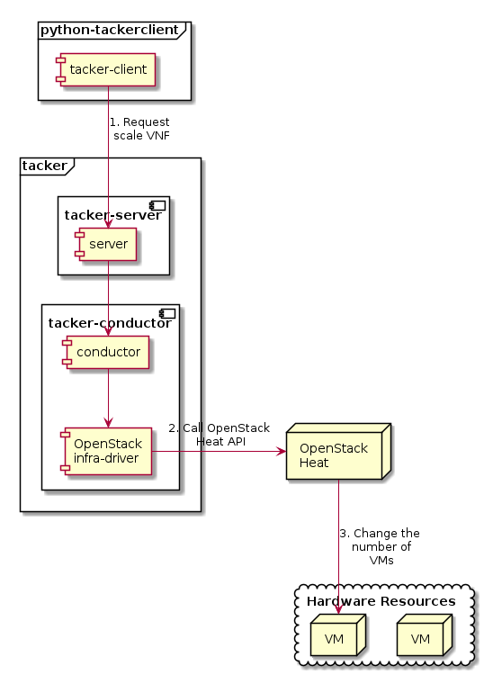

========================
ETSI NFV-SOL VNF Scaling
========================

This document describes how to scale VNF in Tacker.

Overview
--------

The diagram below shows an overview of the VNF scaling.

1. Request scale VNF

   A user requests tacker-server to scale a VNF or all VNFs with tacker-client
   by requesting ``scale VNF``.

2. Call OpenStack Heat API

   Upon receiving a request from tacker-client, tacker-server redirects it to
   tacker-conductor.  In tacker-conductor, the request is redirected again to
   an appropriate infra-driver (in this case OpenStack infra-driver) according
   to the contents of the instantiate parameters.  Then, OpenStack infra-driver
   calls OpenStack Heat APIs.

3. Change the number of VMs

   OpenStack Heat change the number of VMs according to the API calls.

.. note:: Scale API version 1 supports is_reverse option.
          Scale-in operation with this option deletes VNF from the last
          registered VM. Scale API version 2 does not support this option
          because it deletes VM in this order by default.

Prerequisites
-------------

The following packages should be installed:

* tacker
* python-tackerclient

A default VIM should be registered according to
:doc:`../cli/cli-legacy-vim`.

The VNF Package(sample_vnf_pkg.zip) used below is prepared
by referring to :doc:`./vnf-package`.

Execute up to "Instantiate VNF" in the procedure of
:doc:`./etsi_vnf_deployment_as_vm_with_tosca` or
:doc:`./etsi_vnf_deployment_as_vm_with_user_data`.
In other words, the procedure after "Terminate VNF" is not executed.

VNF Scaling Procedure
---------------------

As mentioned in Prerequisites, the VNF must be instantiated
before performing scaling.

Details of CLI commands are described in
:doc:`../cli/cli-etsi-vnflcm`.

There are two main methods for VNF scaling.

* Scale out VNF
* Scale in VNF

How to Identify ASPECT_ID
~~~~~~~~~~~~~~~~~~~~~~~~~

In order to execute scaling, it is necessary to specify
ASPECT_ID, which is the ID for the target scaling group.
First, the method of specifying the ID will be described.

ASPECT_ID is described in VNFD included in the VNF Package.
In the following VNFD excerpt, **VDU1_scale**
corresponds to ASPECT_ID.

.. code-block:: yaml

  node_templates:
    VDU1:
      type: tosca.nodes.nfv.Vdu.Compute
      properties:
        name: VDU1
        description: VDU1 compute node
        vdu_profile:
          min_number_of_instances: 1
          max_number_of_instances: 3
      capabilities:
        virtual_compute:
          properties:
            requested_additional_capabilities:
              properties:
                requested_additional_capability_name: m1.tiny
                support_mandatory: true
                target_performance_parameters:
                  entry_schema: test
            virtual_memory:
              virtual_mem_size: 512 MB
            virtual_cpu:
              num_virtual_cpu: 1
            virtual_local_storage:
              - size_of_storage: 3 GB

  ...snip VNFD...

  policies:
    - scaling_aspects:
        type: tosca.policies.nfv.ScalingAspects
        properties:
          aspects:
            VDU1_scale:
              name: VDU1_scale
              description: VDU1 scaling aspect
              max_scale_level: 2
              step_deltas:
                - delta_1

    - VDU1_initial_delta:
        type: tosca.policies.nfv.VduInitialDelta
        properties:
          initial_delta:
            number_of_instances: 1
        targets: [ VDU1 ]

    - VDU1_scaling_aspect_deltas:
        type: tosca.policies.nfv.VduScalingAspectDeltas
        properties:
          aspect: VDU1_scale
          deltas:
            delta_1:
              number_of_instances: 1
        targets: [ VDU1 ]

    - instantiation_levels:
        type: tosca.policies.nfv.InstantiationLevels
        properties:
          levels:
            instantiation_level_1:
              description: Smallest size
              scale_info:
                VDU1_scale:
                  scale_level: 0
            instantiation_level_2:
              description: Largest size
              scale_info:
                VDU1_scale:
                  scale_level: 2
          default_level: instantiation_level_1

    - VDU1_instantiation_levels:
        type: tosca.policies.nfv.VduInstantiationLevels
        properties:
          levels:
            instantiation_level_1:
              number_of_instances: 1
            instantiation_level_2:
              number_of_instances: 3
        targets: [ VDU1 ]

  ...snip VNFD...

.. note:: See `NFV-SOL001 v2.6.1`_ annex A.6 for details about ASPECT_ID.

How to Scale Out VNF
~~~~~~~~~~~~~~~~~~~~

Execute Scale CLI command and check the number of stacks
before and after scaling.
This is to confirm that the number of stacks has increased
after Scale-out.
See `Heat CLI reference`_. for details on Heat CLI commands.

Stack information before scale-out:

.. code-block:: console

  $ openstack stack list --nested -c 'ID' -c 'Stack Name' -c 'Stack Status' -c 'Parent'

Result:

.. code-block:: console

  +--------------------------------------+-----------------------------------------------------------------------------------------------------+-----------------+--------------------------------------+
  | ID                                   | Stack Name                                                                                          | Stack Status    | Parent                               |
  +--------------------------------------+-----------------------------------------------------------------------------------------------------+-----------------+--------------------------------------+
  | 43b183c8-53cc-430f-b4e8-b0e1adc4e702 | vnflcm_edd306c3-647c-412c-a033-74aa40118038-VDU1_scale_group-5w6gwjuqjpsx-rlitsss7zfsx-oa4wsjz5yfcf | CREATE_COMPLETE | b96169b5-d692-4b5c-81b2-86010775180e |
  | b96169b5-d692-4b5c-81b2-86010775180e | vnflcm_edd306c3-647c-412c-a033-74aa40118038-VDU1_scale_group-5w6gwjuqjpsx                           | CREATE_COMPLETE | 6f48a8cf-0acb-4271-ae72-562c903f5381 |
  | 6f48a8cf-0acb-4271-ae72-562c903f5381 | vnflcm_edd306c3-647c-412c-a033-74aa40118038                                                         | CREATE_COMPLETE | None                                 |
  +--------------------------------------+-----------------------------------------------------------------------------------------------------+-----------------+--------------------------------------+

Scale-out VNF can be executed by the following CLI command.

.. code-block:: console

  $ openstack vnflcm scale --type SCALE_OUT --aspect-id VDU1_scale VNF_INSTANCE_ID

Result:

.. code-block:: console

  Scale request for VNF Instance edd306c3-647c-412c-a033-74aa40118038 has been accepted.

Stack information after scale-out:

.. code-block:: console

  $ openstack stack list --nested -c 'ID' -c 'Stack Name' -c 'Stack Status' -c 'Parent'

Result:

.. code-block:: console

  +--------------------------------------+-----------------------------------------------------------------------------------------------------+-----------------+--------------------------------------+
  | ID                                   | Stack Name                                                                                          | Stack Status    | Parent                               |
  +--------------------------------------+-----------------------------------------------------------------------------------------------------+-----------------+--------------------------------------+
  | 44c364a0-1928-4717-bd95-43a74a5fe520 | vnflcm_edd306c3-647c-412c-a033-74aa40118038-VDU1_scale_group-5w6gwjuqjpsx-prjzcxxskx4i-bwx6egqcdlqg | CREATE_COMPLETE | b96169b5-d692-4b5c-81b2-86010775180e |
  | 43b183c8-53cc-430f-b4e8-b0e1adc4e702 | vnflcm_edd306c3-647c-412c-a033-74aa40118038-VDU1_scale_group-5w6gwjuqjpsx-rlitsss7zfsx-oa4wsjz5yfcf | UPDATE_COMPLETE | b96169b5-d692-4b5c-81b2-86010775180e |
  | b96169b5-d692-4b5c-81b2-86010775180e | vnflcm_edd306c3-647c-412c-a033-74aa40118038-VDU1_scale_group-5w6gwjuqjpsx                           | UPDATE_COMPLETE | 6f48a8cf-0acb-4271-ae72-562c903f5381 |
  | 6f48a8cf-0acb-4271-ae72-562c903f5381 | vnflcm_edd306c3-647c-412c-a033-74aa40118038                                                         | CREATE_COMPLETE | None                                 |
  +--------------------------------------+-----------------------------------------------------------------------------------------------------+-----------------+--------------------------------------+

Stack details:

.. code-block:: console

  $ openstack stack resource list b96169b5-d692-4b5c-81b2-86010775180e
  +---------------+--------------------------------------+---------------+-----------------+----------------------+
  | resource_name | physical_resource_id                 | resource_type | resource_status | updated_time         |
  +---------------+--------------------------------------+---------------+-----------------+----------------------+
  | rlitsss7zfsx  | 43b183c8-53cc-430f-b4e8-b0e1adc4e702 | VDU1.yaml     | UPDATE_COMPLETE | 2021-01-06T05:24:50Z |
  | prjzcxxskx4i  | 44c364a0-1928-4717-bd95-43a74a5fe520 | VDU1.yaml     | CREATE_COMPLETE | 2021-01-06T05:24:49Z |
  +---------------+--------------------------------------+---------------+-----------------+----------------------+

  $ openstack stack resource list 43b183c8-53cc-430f-b4e8-b0e1adc4e702
  +----------------+--------------------------------------+------------------------+-----------------+----------------------+
  | resource_name  | physical_resource_id                 | resource_type          | resource_status | updated_time         |
  +----------------+--------------------------------------+------------------------+-----------------+----------------------+
  | VDU1           | 82fd8c7d-7a55-449e-b563-457c6c59e9ac | OS::Nova::Server       | CREATE_COMPLETE | 2021-01-06T05:15:35Z |
  +----------------+--------------------------------------+------------------------+-----------------+----------------------+

  $ openstack stack resource list 44c364a0-1928-4717-bd95-43a74a5fe520
  +----------------+--------------------------------------+------------------------+-----------------+----------------------+
  | resource_name  | physical_resource_id                 | resource_type          | resource_status | updated_time         |
  +----------------+--------------------------------------+------------------------+-----------------+----------------------+
  | VDU1           | 073fc301-49a5-41ff-953f-5fa6736414ed | OS::Nova::Server       | CREATE_COMPLETE | 2021-01-06T05:24:49Z |
  +----------------+--------------------------------------+------------------------+-----------------+----------------------+

It can be seen that the child-stack (ID: 44c364a0-1928-4717-bd95-43a74a5fe520)
with the parent-stack (ID: b96169b5-d692-4b5c-81b2-86010775180e)
is increased by the scaling out operation.

How to Scale in VNF
~~~~~~~~~~~~~~~~~~~

Execute Scale CLI command and check the number of stacks
before and after scaling.
This is to confirm that the number of stacks has decreased
after Scale-in.
See `Heat CLI reference`_. for details on Heat CLI commands.

Stack information before scale-in:

.. code-block:: console

  $ openstack stack list --nested -c 'ID' -c 'Stack Name' -c 'Stack Status' -c 'Parent'

Result:

.. code-block:: console

  +--------------------------------------+-----------------------------------------------------------------------------------------------------+-----------------+--------------------------------------+
  | ID                                   | Stack Name                                                                                          | Stack Status    | Parent                               |
  +--------------------------------------+-----------------------------------------------------------------------------------------------------+-----------------+--------------------------------------+
  | 44c364a0-1928-4717-bd95-43a74a5fe520 | vnflcm_edd306c3-647c-412c-a033-74aa40118038-VDU1_scale_group-5w6gwjuqjpsx-prjzcxxskx4i-bwx6egqcdlqg | CREATE_COMPLETE | b96169b5-d692-4b5c-81b2-86010775180e |
  | 43b183c8-53cc-430f-b4e8-b0e1adc4e702 | vnflcm_edd306c3-647c-412c-a033-74aa40118038-VDU1_scale_group-5w6gwjuqjpsx-rlitsss7zfsx-oa4wsjz5yfcf | UPDATE_COMPLETE | b96169b5-d692-4b5c-81b2-86010775180e |
  | b96169b5-d692-4b5c-81b2-86010775180e | vnflcm_edd306c3-647c-412c-a033-74aa40118038-VDU1_scale_group-5w6gwjuqjpsx                           | UPDATE_COMPLETE | 6f48a8cf-0acb-4271-ae72-562c903f5381 |
  | 6f48a8cf-0acb-4271-ae72-562c903f5381 | vnflcm_edd306c3-647c-412c-a033-74aa40118038                                                         | CREATE_COMPLETE | None                                 |
  +--------------------------------------+-----------------------------------------------------------------------------------------------------+-----------------+--------------------------------------+

Scale-in VNF can be executed by the following CLI command.

.. code-block:: console

  $ openstack vnflcm scale --type SCALE_IN --aspect-id VDU1_scale VNF_INSTANCE_ID

Result:

.. code-block:: console

  Scale request for VNF Instance edd306c3-647c-412c-a033-74aa40118038 has been accepted.

Stack information after scale-in:

.. code-block:: console

  $ openstack stack list --nested -c 'ID' -c 'Stack Name' -c 'Stack Status' -c 'Parent'

Result:

.. code-block:: console

  +--------------------------------------+-----------------------------------------------------------------------------------------------------+-----------------+--------------------------------------+
  | ID                                   | Stack Name                                                                                          | Stack Status    | Parent                               |
  +--------------------------------------+-----------------------------------------------------------------------------------------------------+-----------------+--------------------------------------+
  | 44c364a0-1928-4717-bd95-43a74a5fe520 | vnflcm_edd306c3-647c-412c-a033-74aa40118038-VDU1_scale_group-5w6gwjuqjpsx-prjzcxxskx4i-bwx6egqcdlqg | UPDATE_COMPLETE | b96169b5-d692-4b5c-81b2-86010775180e |
  | b96169b5-d692-4b5c-81b2-86010775180e | vnflcm_edd306c3-647c-412c-a033-74aa40118038-VDU1_scale_group-5w6gwjuqjpsx                           | UPDATE_COMPLETE | 6f48a8cf-0acb-4271-ae72-562c903f5381 |
  | 6f48a8cf-0acb-4271-ae72-562c903f5381 | vnflcm_edd306c3-647c-412c-a033-74aa40118038                                                         | CREATE_COMPLETE | None                                 |
  +--------------------------------------+-----------------------------------------------------------------------------------------------------+-----------------+--------------------------------------+

There were two child-stacks(ID: 44c364a0-1928-4717-bd95-43a74a5fe520
and ID: 43b183c8-53cc-430f-b4e8-b0e1adc4e702) with
a parent-stack(ID: b96169b5-d692-4b5c-81b2-86010775180e),
it can be seen that one of them is decreased by the scale-in operation.

.. _NFV-SOL001 v2.6.1 : https://www.etsi.org/deliver/etsi_gs/NFV-SOL/001_099/001/02.06.01_60/gs_NFV-SOL001v020601p.pdf
.. _Heat CLI reference : https://docs.openstack.org/python-openstackclient/latest/cli/plugin-commands/heat.html
