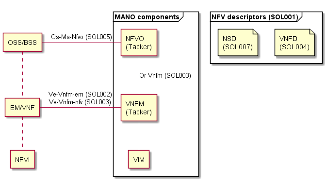

============
Introduction
============

Tacker is a Generic VNF Manager (VNFM) and an NFV Orchestrator (NFVO) to
operate Network Services (NSs) and Virtual Network Functions (VNFs) on an NFV
infrastructure platform like OpenStack or Kubernetes. The operations are based
on ETSI NFV Management and Orchestration (MANO) Architecture [1]_.

Now Tacker has two different architectures:

* ETSI NFV-SOL based implementation
* Legacy implementation

When Tacker project was originated to follow the ETSI NFV MANO standards in
Liberty release, the standarding for "NFV Solutions (SOL)", which is the
specifications for protocols and data models, was not yet defined. After the
publications of SOL documents for NFV descriptors such as VNF descriptor
(VNFD) and NS Descriptor (NSD) as `NFV-SOL001`_, `NFV-SOL004`_, and
`NFV-SOL007`_, and also after REST-based APIs have been specified as
`NFV-SOL002`_, `NFV-SOL003`_, and `NFV-SOL005`_, the SOL based new
implementations have started in Ussuri release.

ETSI NFV MANO concept
---------------------

MANO functional blocks are:

**NFV Orchestrator(NFVO)** - is responsible for on-boarding NS and VNF, and
providing global resource management, validation and authorization of NFV
infrastructure (NFVI) resource requests.
**VNF Manager(VNFM)** - is responsible for the lifecycle management of VNF.
**Virtualised Infrastructure Manager (VIM)** - controls and manages compute,
storage, and network resources.

Tacker provides a functional block of NFVO and VNFM. VIM can be an OpenStack
or Kubernetes cluster. In a particular use case to deploy a VNF instance,
you need to prepare a VNF Package. A VNF Package includes VNFD, software
images for Virtual Machine (VM), and other artifact resources such as scripts
and config files. NFVO is called to deploy a VNF instance with a VNF Package,
then NFVO asks VNFM to deploy actual VNF on a NFV infrastructure. All the
interfaces involved in this process is defined in ETSI NFV specifications.

.. [1] https://www.etsi.org/technologies/nfv

.. _NFV-SOL001 : https://portal.etsi.org/webapp/workProgram/Report_WorkItem.asp?wki_id=49491
.. _NFV-SOL004 : https://portal.etsi.org/webapp/WorkProgram/Report_WorkItem.asp?wki_id=50617
.. _NFV-SOL007 : https://portal.etsi.org/webapp/WorkProgram/Report_WorkItem.asp?wki_id=54501
.. _NFV-SOL002 : https://portal.etsi.org/webapp/WorkProgram/Report_WorkItem.asp?WKI_ID=49492
.. _NFV-SOL003 : https://portal.etsi.org/webapp/WorkProgram/Report_WorkItem.asp?WKI_ID=49506
.. _NFV-SOL005 : https://portal.etsi.org/webapp/WorkProgram/Report_WorkItem.asp?WKI_ID=50935
