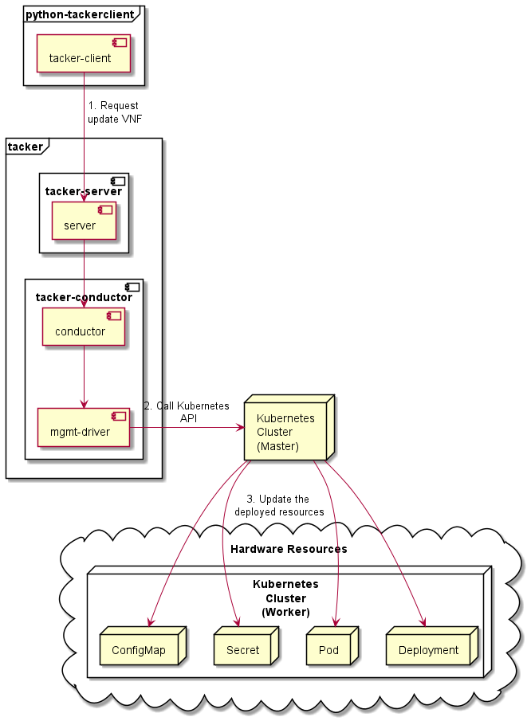

========================================
ETSI NFV-SOL CNF Update with Mgmt Driver
========================================

This document describes how to update CNF with Mgmt Driver in Tacker.

Overview
--------

The diagram below shows an overview of the CNF updating.

1. Request update VNF

   A user requests tacker-server to update a CNF with tacker-client
   by requesting ``update VNF`` as a Modify VNF information operation.

2. Call Kubernetes API

   Upon receiving a request from tacker-client, tacker-server redirects it to
   tacker-conductor. In tacker-conductor, the request is redirected again to
   the matching Mgmt Driver (in this case the Mgmt Driver of container update)
   according to the contents of the VNFD in the VNF Package. Then, Mgmt Driver
   calls Kubernetes APIs.

3. Update resources

   Kubernetes Master update resources according to the API calls.

Mgmt Driver Introduction
~~~~~~~~~~~~~~~~~~~~~~~~

Mgmt Driver enables Users to configure their VNF before and/or after
its VNF Lifecycle Management operation. Users can customize the logic
of Mgmt Driver by implementing their own Mgmt Driver and these
customizations are specified by "interface" definition in
`NFV-SOL001 v2.6.1`_.

The Mgmt Driver in this user guide supports updating CNF with
``modify_information_start`` and ``modify_information_end`` operation.

Use Cases
~~~~~~~~~

In this user guide, the provided sample VNF Packages will be instantiated
and then updated. The sample Mgmt Driver will update resources on
Kubernetes during update. Update the ConfigMap and Secret, and also
update the image in the Pod, Deployment, DaemonSet and ReplicaSet, and other
resources will not change.

Prerequisites
-------------

The following packages should be installed:

* tacker
* python-tackerclient

After installing the above packages, you also need to import the sample
Mgmt Driver file. You can refer to `Set Tacker Configuration`_ in
`How to use Mgmt Driver for deploying Kubernetes Cluster`_ for usage of
Mgmt Driver file.

.. note::

    You can find sample Mgmt Driver file in the following path.
    `samples/mgmt_driver/kubernetes/container_update/container_update_mgmt.py`_

You can also refer to :doc:`./etsi_containerized_vnf_usage_guide` for the
procedure of preparation from "`Prepare Kubernetes VIM`_" to
"`Instantiate VNF`_".

How to Instantiate VNF for Updating
~~~~~~~~~~~~~~~~~~~~~~~~~~~~~~~~~~~~

You can use the sample VNF package below to instantiate VNF to be updated.

.. note::

    In this document, ``TACKER_ROOT`` is the root of tacker’s repository on
    the server.

.. code-block:: console

    $ cd TACKER_ROOT/tacker/tests/etc/samples/etsi/nfv/test_cnf_container_update_before

Copy the official definition files from the sample directory.
`ETSI GS NFV-SOL 001`_ specifies the structure and format of the VNFD
based on TOSCA specifications.

.. code-block:: console

    $ cd TACKER_ROOT/tacker/tests/etc/samples/etsi/nfv/test_cnf_container_update_before
    $ cp TACKER_ROOT/samples/vnf_packages/Definitions/etsi_nfv_sol001_common_types.yaml Definitions/
    $ cp TACKER_ROOT/samples/vnf_packages/Definitions/etsi_nfv_sol001_vnfd_types.yaml Definitions/

CSAR Package should be compressed into a ZIP file for uploading.
Following commands are an example of compressing a VNF Package:

.. note::

    The sample Mgmt Driver file also needs to be copied into the CSAR Package.

.. code-block:: console

    $ cd TACKER_ROOT/tacker/tests/etc/samples/etsi/nfv/test_cnf_container_update_before
    $ mkdir Scripts
    $ cp TACKER_ROOT/samples/mgmt_driver/kubernetes/container_update/container_update_mgmt.py Scripts/
    $ zip deployment.zip -r Definitions/ Files/ TOSCA-Metadata/ Scripts/

After creating a VNF package with :command:`openstack vnf package create`,
When the Onboarding State is CREATED, the Operational
State is DISABLED, and the Usage State is NOT_IN_USE, indicate the creation is
successful.

.. code-block:: console

  $ openstack vnf package create
    +-------------------+-------------------------------------------------------------------------------------------------+
    | Field             | Value                                                                                           |
    +-------------------+-------------------------------------------------------------------------------------------------+
    | ID                | d80b1025-7309-4dbc-8310-f51a24045b08                                                            |
    | Links             | {                                                                                               |
    |                   |     "self": {                                                                                   |
    |                   |         "href": "/vnfpkgm/v1/vnf_packages/d80b1025-7309-4dbc-8310-f51a24045b08"                 |
    |                   |     },                                                                                          |
    |                   |     "packageContent": {                                                                         |
    |                   |         "href": "/vnfpkgm/v1/vnf_packages/d80b1025-7309-4dbc-8310-f51a24045b08/package_content" |
    |                   |     }                                                                                           |
    |                   | }                                                                                               |
    | Onboarding State  | CREATED                                                                                         |
    | Operational State | DISABLED                                                                                        |
    | Usage State       | NOT_IN_USE                                                                                      |
    | User Defined Data | {}                                                                                              |
    +-------------------+-------------------------------------------------------------------------------------------------+

Upload the CSAR zip file to the VNF Package by running the following command
:command:`openstack vnf package upload --path <path of vnf package> <vnf package ID>`.

Here is an example of uploading VNF package:

.. code-block:: console

  $ openstack vnf package upload --path deployment.zip d80b1025-7309-4dbc-8310-f51a24045b08
    Upload request for VNF package d80b1025-7309-4dbc-8310-f51a24045b08 has been accepted.

Create VNF instance by running :command:`openstack vnflcm create <VNFD ID>`.

.. note::

    The VNFD ID could be found by
    :command:`openstack vnf package show <vnf package ID>` command.

Here is an example of creating VNF :

.. code-block:: console

  $ openstack vnflcm create b1bb0ce7-ebca-4fa7-95ed-4840d70a7774
    +-----------------------------+------------------------------------------------------------------------------------------------------------------+
    | Field                       | Value                                                                                                            |
    +-----------------------------+------------------------------------------------------------------------------------------------------------------+
    | ID                          | f21814f0-3e00-4651-a9ac-ec10f3248c19                                                                             |
    | Instantiation State         | NOT_INSTANTIATED                                                                                                 |
    | Links                       | {                                                                                                                |
    |                             |     "self": {                                                                                                    |
    |                             |         "href": "http://localhost:9890/vnflcm/v1/vnf_instances/f21814f0-3e00-4651-a9ac-ec10f3248c19"             |
    |                             |     },                                                                                                           |
    |                             |     "instantiate": {                                                                                             |
    |                             |         "href": "http://localhost:9890/vnflcm/v1/vnf_instances/f21814f0-3e00-4651-a9ac-ec10f3248c19/instantiate" |
    |                             |     }                                                                                                            |
    |                             | }                                                                                                                |
    | VNF Configurable Properties |                                                                                                                  |
    | VNF Instance Description    | None                                                                                                             |
    | VNF Instance Name           | vnf-f21814f0-3e00-4651-a9ac-ec10f3248c19                                                                         |
    | VNF Product Name            | Sample VNF                                                                                                       |
    | VNF Provider                | Company                                                                                                          |
    | VNF Software Version        | 1.0                                                                                                              |
    | VNFD ID                     | b1bb0ce7-ebca-4fa7-95ed-4840d70a7774                                                                             |
    | VNFD Version                | 1.0                                                                                                              |
    | vnfPkgId                    |                                                                                                                  |
    +-----------------------------+------------------------------------------------------------------------------------------------------------------+

The following example shows the yaml files that deploys the Kubernetes
resources.
You can see resource definition files are included as a value of
``lcm-kubernetes-def-files`` in ``additionalParams`` here.

.. code-block:: console

    $ cat ./instance_kubernetes.json
      {
        "flavourId": "simple",
        "additionalParams": {
          "lcm-kubernetes-def-files": [
            "Files/kubernetes/configmap_1.yaml",
            "Files/kubernetes/deployment.yaml",
            "Files/kubernetes/pod_env.yaml",
            "Files/kubernetes/pod_volume.yaml",
            "Files/kubernetes/replicaset.yaml",
            "Files/kubernetes/secret_1.yaml",
            "Files/kubernetes/configmap_3.yaml",
            "Files/kubernetes/pod_env_2.yaml",
            "Files/kubernetes/pod_volume_2.yaml",
            "Files/kubernetes/daemonset.yaml",
            "Files/kubernetes/deployment_2.yaml",
            "Files/kubernetes/secret_3.yaml"
          ],
          "namespace": "default"
        },
        "vimConnectionInfo": [
          {
            "id": "8a3adb69-0784-43c7-833e-aab0b6ab4470",
            "vimId": "143897f4-7ab3-4fc5-9a5b-bbff09bdb92f",
            "vimType": "kubernetes"
          }
        ]
      }

Instantiate VNF by running the following command
:command:`openstack vnflcm instantiate <VNF instance ID> <json file>`,
after the command above is executed.

.. code-block:: console

    $ openstack vnflcm instantiate f21814f0-3e00-4651-a9ac-ec10f3248c19 instance_kubernetes.json
      Instantiate request for VNF Instance f21814f0-3e00-4651-a9ac-ec10f3248c19 has been accepted.

CNF Updating Procedure
-----------------------

As mentioned in Prerequisites, the VNF must be instantiated before performing
updating.

Next, the user can use the original vnf package as a template to make a new
vnf package, in which the yaml of ConfigMap, Secret, Pod, Deployment, DaemonSet
and ReplicaSet can be changed.

.. note::

    * The yaml of ConfigMap and Secret can be changed. The kind, namespace
      and name cannot be changed, but the file name and file path can
      be changed.
    * The yaml of Pod, Deployment, DaemonSet and ReplicaSet can also be
      changed, but only the image field can be changed, and no other fields can
      be changed.
    * No other yaml is allowed to be changed.
    * If changes other than images are made to the yaml of Pod, Deployment,
      DaemonSet and ReplicaSet , those will not take effect. However, if heal
      entire VNF at this time, the resource will be based on the new yaml
      during the instantiation, and all changes will take effect.

Then after creating and uploading the new vnf package, you can perform the
update operation.
After the update, the Mgmt Driver will restart the pod to update and
recreate the deployment, DaemonSet and ReplicaSet to update.

.. note::

    This document provides the new vnf package, the path is
    `tacker/tests/etc/samples/etsi/nfv/test_cnf_container_update_after`_

Details of CLI commands are described in :doc:`../cli/cli-etsi-vnflcm`.

How to Update CNF
~~~~~~~~~~~~~~~~~

Execute Update CLI command and check the status of the resources
before and after updating.

This is to confirm that the resources deployed in Kubernetes are updated
after update CNF.
The following is an example of the entire process.
The resources information before update:

* ConfigMap

  .. code-block:: console

    $ kubectl get configmaps
      NAME               DATA   AGE
      cm-data            1      32m
      cm-data2           1      32m
      kube-root-ca.crt   1      20h
    $
    $ kubectl describe configmaps cm-data
      Name:         cm-data
      Namespace:    default
      Labels:       <none>
      Annotations:  <none>

      Data
      ====
      cmKey1.txt:
      ----
      configmap data
      foo
      bar
      Events:  <none>
    $
    $ kubectl describe configmaps cm-data2
      Name:         cm-data2
      Namespace:    default
      Labels:       <none>
      Annotations:  <none>

      Data
      ====
      cmKey1.txt:
      ----
      configmap data
      foo
      bar
      Events:  <none>

* Secret

  .. code-block:: console

    $ kubectl get secrets
      NAME                  TYPE                                  DATA   AGE
      default-token-w59gg   kubernetes.io/service-account-token   3      20h
      secret-data           Opaque                                2      37m
      secret-data2          Opaque                                2      37m
    $
    $ kubectl describe secrets secret-data
      Name:         secret-data
      Namespace:    default
      Labels:       <none>
      Annotations:  <none>

      Type:  Opaque

      Data
      ====
      password:     15 bytes
      secKey1.txt:  15 bytes
    $
    $ kubectl describe secrets secret-data2
      Name:         secret-data2
      Namespace:    default
      Labels:       <none>
      Annotations:  <none>

      Type:  Opaque

      Data
      ====
      password:     15 bytes
      secKey1.txt:  15 bytes

* Pod

  .. code-block:: console

    $ kubectl get pod -o wide
      NAME                           READY   STATUS    RESTARTS   AGE   IP             NODE    NOMINATED NODE   READINESS GATES
      daemonset-nv79l                1/1     Running   0          39m   10.233.96.20   node2   <none>           <none>
      deployment1-85dd489b89-p7m9q   1/1     Running   0          39m   10.233.96.17   node2   <none>           <none>
      deployment2-5c6b485699-mdx9v   1/1     Running   0          39m   10.233.96.22   node2   <none>           <none>
      env-test1                      1/1     Running   0          39m   10.233.96.21   node2   <none>           <none>
      env-test2                      1/1     Running   0          39m   10.233.96.19   node2   <none>           <none>
      replicaset-bv6cp               1/1     Running   0          39m   10.233.96.24   node2   <none>           <none>
      volume-test1                   1/1     Running   0          39m   10.233.96.18   node2   <none>           <none>
      volume-test2                   1/1     Running   0          39m   10.233.96.23   node2   <none>           <none>
    $
    $ kubectl describe pod volume-test1
      Name:         volume-test1
      Namespace:    default
      ...
      Containers:
        nginx:
          Container ID:   cri-o://623c652c7ab71d268e18129475d0391b72c88b1a8a778bbdd3d479fad2521bc2
          Image:          nginx
          Image ID:       docker.io/library/nginx@sha256:ecc068890de55a75f1a32cc8063e79f90f0b043d70c5fcf28f1713395a4b3d49
      ...
      Volumes:
        cm-volume:
          Type:      ConfigMap (a volume populated by a ConfigMap)
          Name:      cm-data
          Optional:  false
        sec-volume:
          Type:        Secret (a volume populated by a Secret)
          SecretName:  secret-data
          Optional:    false
      ...
    $
    $ kubectl describe pod volume-test2
      Name:         volume-test2
      Namespace:    default
      ...
      Containers:
        nginx:
          Container ID:   cri-o://74d38aa62097b3a1a80181195ebda3877e3773311d0273fdc3fbb27fa4b9600d
          Image:          nginx
          Image ID:       docker.io/library/nginx@sha256:ecc068890de55a75f1a32cc8063e79f90f0b043d70c5fcf28f1713395a4b3d49
      ...
      Volumes:
        cm-volume:
          Type:      ConfigMap (a volume populated by a ConfigMap)
          Name:      cm-data2
          Optional:  false
        sec-volume:
          Type:        Secret (a volume populated by a Secret)
          SecretName:  secret-data2
          Optional:    false
      ...

* Deployment

  .. code-block:: console

    $ kubectl get deployments.apps -o wide
      NAME          READY   UP-TO-DATE   AVAILABLE   AGE   CONTAINERS   IMAGES   SELECTOR
      deployment1   1/1     1            1           49m   nginx        nginx    app=webserver
      deployment2   1/1     1            1           49m   nginx        nginx    app=webserver
    $
    $ kubectl describe pod deployment1-85dd489b89-p7m9q
      Name:         deployment1-85dd489b89-p7m9q
      Namespace:    default
      ...
      Containers:
        nginx:
          Container ID:   cri-o://50ffc03736a03c8d4546bb60bb5815b4c8f6cbbfb7b70da4121a06c5c8d6568a
          Image:          nginx
          Image ID:       docker.io/library/nginx@sha256:ecc068890de55a75f1a32cc8063e79f90f0b043d70c5fcf28f1713395a4b3d49
      ...
          Environment Variables from:
            cm-data      ConfigMap with prefix 'CM_'  Optional: false
            secret-data  Secret with prefix 'SEC_'    Optional: false
          Environment:
            CMENV:   <set to the key 'cmKey1.txt' of config map 'cm-data'>  Optional: false
            SECENV:  <set to the key 'password' in secret 'secret-data'>    Optional: false
      ...
    $
    $ kubectl describe pod deployment2-5c6b485699-mdx9v
      Name:         deployment2-5c6b485699-mdx9v
      Namespace:    default
      ...
      Containers:
        nginx:
          Container ID:   cri-o://6d7a8019984c04ab758b962a228f44fb14bfc0f4e1f525548d87a91d17b49f77
          Image:          nginx
          Image ID:       docker.io/library/nginx@sha256:ecc068890de55a75f1a32cc8063e79f90f0b043d70c5fcf28f1713395a4b3d49
      ...
          Environment Variables from:
            cm-data2      ConfigMap with prefix 'CM_'  Optional: false
            secret-data2  Secret with prefix 'SEC_'    Optional: false
          Environment:
            CMENV:   <set to the key 'cmKey1.txt' of config map 'cm-data2'>  Optional: false
            SECENV:  <set to the key 'password' in secret 'secret-data2'>    Optional: false
      ...

* DaemonSet

  .. code-block:: console

    $ kubectl get daemonset.apps -o wide
      NAME        DESIRED   CURRENT   READY   UP-TO-DATE   AVAILABLE   NODE SELECTOR   AGE   CONTAINERS   IMAGES   SELECTOR
      daemonset   1         1         1       1            1           <none>          58m   nginx        nginx    app=nginx
    $
    $ kubectl describe pod daemonset-nv79l
      Name:         daemonset-nv79l
      Namespace:    default
      ...
      Containers:
        nginx:
          Container ID:   cri-o://3f392217d5f22c417fc9da24f4bd27d41e90a2165d10356a44cd1b98b6b899d9
          Image:          nginx
          Image ID:       docker.io/library/nginx@sha256:ecc068890de55a75f1a32cc8063e79f90f0b043d70c5fcf28f1713395a4b3d49
      ...
          Environment Variables from:
            cm-data      ConfigMap with prefix 'CM_'  Optional: false
            secret-data  Secret with prefix 'SEC_'    Optional: false
          Environment:
            CMENV:   <set to the key 'cmKey1.txt' of config map 'cm-data'>  Optional: false
            SECENV:  <set to the key 'password' in secret 'secret-data'>    Optional: false
      ...

* ReplicaSet

  .. code-block:: console

    $ kubectl get replicaset.apps -o wide
      NAME                     DESIRED   CURRENT   READY   AGE   CONTAINERS   IMAGES   SELECTOR
      deployment1-85dd489b89   1         1         1       62m   nginx        nginx    app=webserver,pod-template-hash=85dd489b89
      deployment2-5c6b485699   1         1         1       62m   nginx        nginx    app=webserver,pod-template-hash=5c6b485699
      replicaset               1         1         1       62m   nginx        nginx    app=webserver
    $
    $ kubectl describe pod replicaset-bv6cp
      Name:         replicaset-bv6cp
      Namespace:    default
      ...
      Containers:
        nginx:
          Container ID:   cri-o://d8e5ea8404a8cd272b54cefac236fdf0c1963a6b0cf03b283e9f57c70fcd4eab
          Image:          nginx
          Image ID:       docker.io/library/nginx@sha256:ecc068890de55a75f1a32cc8063e79f90f0b043d70c5fcf28f1713395a4b3d49
      ...
      Volumes:
        cm-volume:
          Type:      ConfigMap (a volume populated by a ConfigMap)
          Name:      cm-data
          Optional:  false
        sec-volume:
          Type:        Secret (a volume populated by a Secret)
          SecretName:  secret-data
          Optional:    false
      ...

Update CNF can be executed by the following CLI command.

.. code-block:: console

  $ openstack vnflcm update VNF_INSTANCE_ID --I sample_param_file.json

The content of the sample sample_param_file.json in this document is
as follows:

.. code-block:: console

  {
    "vnfdId": "b1bb0ce7-ebca-4fa7-95ed-4840d70a8883",
    "vnfInstanceName": "update_vnf_after",
    "metadata": {
      "configmap_secret_paths": [
        "Files/kubernetes/configmap_2.yaml",
        "Files/kubernetes/secret_2.yaml"
      ]
    }
  }

.. note::

    If you want to update ConfigMap and Secret, not only need to update
    their yaml, but also need to specify the updated yaml file path in
    the metadata field of the request input parameter.

Here is an example of updating CNF:

.. code-block:: console

  $ openstack vnflcm update f21814f0-3e00-4651-a9ac-ec10f3248c19 --I sample_param_file.json
    Update vnf:f21814f0-3e00-4651-a9ac-ec10f3248c19

The resources information after update:

* ConfigMap

  .. code-block:: console

    $ kubectl describe configmaps cm-data
      Name:         cm-data
      Namespace:    default
      Labels:       <none>
      Annotations:  <none>

      Data
      ====
      cmKey1.txt:
      ----
      configmap2 data2
      foo2
      bar2
      Events:  <none>
    $
    $ kubectl describe configmaps cm-data2
      Name:         cm-data2
      Namespace:    default
      Labels:       <none>
      Annotations:  <none>

      Data
      ====
      cmKey1.txt:
      ----
      configmap data
      foo
      bar
      Events:  <none>

* Secret

  .. code-block:: console

    $ kubectl describe secrets secret-data
      Name:         secret-data
      Namespace:    default
      Labels:       <none>
      Annotations:  <none>

      Type:  Opaque

      Data
      ====
      password:     16 bytes
      secKey1.txt:  18 bytes
    $
    $ kubectl describe secrets secret-data2
      Name:         secret-data2
      Namespace:    default
      Labels:       <none>
      Annotations:  <none>

      Type:  Opaque

      Data
      ====
      password:     15 bytes
      secKey1.txt:  15 bytes

* Pod

  .. code-block:: console

    $ kubectl get pod -o wide
      NAME                           READY   STATUS    RESTARTS   AGE    IP             NODE    NOMINATED NODE   READINESS GATES
      daemonset-gl4kf                1/1     Running   0          38m    10.233.96.27   node2   <none>           <none>
      deployment1-5974f79c95-5d6x4   1/1     Running   0          38m    10.233.96.25   node2   <none>           <none>
      deployment2-5c6b485699-mdx9v   1/1     Running   0          114m   10.233.96.22   node2   <none>           <none>
      env-test1                      1/1     Running   1          114m   10.233.96.21   node2   <none>           <none>
      env-test2                      1/1     Running   0          114m   10.233.96.19   node2   <none>           <none>
      replicaset-xfgmj               1/1     Running   0          38m    10.233.96.26   node2   <none>           <none>
      volume-test1                   1/1     Running   1          114m   10.233.96.18   node2   <none>           <none>
      volume-test2                   1/1     Running   0          114m   10.233.96.23   node2   <none>           <none>

    $
    $ kubectl describe pod volume-test1
      Name:         volume-test1
      Namespace:    default
      ...
      Containers:
        nginx:
          Container ID:   cri-o://77f1518b617403115163874f1ea65793b92f7c8d22f5364fe5bb299b471decb1
          Image:          cirros
          Image ID:       docker.io/library/cirros@sha256:be6f5d1ab1e463e7991ecb29f1e71993d633ff1d190188662085ef641bdcf389
      ...
      Volumes:
        cm-volume:
          Type:      ConfigMap (a volume populated by a ConfigMap)
          Name:      cm-data
          Optional:  false
        sec-volume:
          Type:        Secret (a volume populated by a Secret)
          SecretName:  secret-data
          Optional:    false
      ...
    $
    $ kubectl describe pod volume-test2
      Name:         volume-test2
      Namespace:    default
      ...
      Containers:
        nginx:
          Container ID:   cri-o://74d38aa62097b3a1a80181195ebda3877e3773311d0273fdc3fbb27fa4b9600d
          Image:          nginx
          Image ID:       docker.io/library/nginx@sha256:ecc068890de55a75f1a32cc8063e79f90f0b043d70c5fcf28f1713395a4b3d49
      ...
      Volumes:
        cm-volume:
          Type:      ConfigMap (a volume populated by a ConfigMap)
          Name:      cm-data2
          Optional:  false
        sec-volume:
          Type:        Secret (a volume populated by a Secret)
          SecretName:  secret-data2
          Optional:    false
      ...

* Deployment

  .. code-block:: console

    $ kubectl get deployments.apps -o wide
      NAME          READY   UP-TO-DATE   AVAILABLE   AGE     CONTAINERS   IMAGES   SELECTOR
      deployment1   1/1     1            1           4h10m   nginx        cirros   app=webserver
      deployment2   1/1     1            1           4h10m   nginx        nginx    app=webserver
    $
    $ kubectl describe pod deployment1-5974f79c95-5d6x4
      Name:         deployment1-5974f79c95-5d6x4
      Namespace:    default
      ...
      Containers:
        nginx:
          Container ID:   cri-o://7b8bd5a7da875fea74a0b0d54ad8a6c1e65bf08a823ae864c6bd7f16b494b990
          Image:          cirros
          Image ID:       docker.io/library/cirros@sha256:be6f5d1ab1e463e7991ecb29f1e71993d633ff1d190188662085ef641bdcf389
      ...
          Environment Variables from:
            cm-data      ConfigMap with prefix 'CM_'  Optional: false
            secret-data  Secret with prefix 'SEC_'    Optional: false
          Environment:
            CMENV:   <set to the key 'cmKey1.txt' of config map 'cm-data'>  Optional: false
            SECENV:  <set to the key 'password' in secret 'secret-data'>    Optional: false
      ...
    $
    $ kubectl describe pod deployment2-5c6b485699-mdx9v
      Name:         deployment2-5c6b485699-mdx9v
      Namespace:    default
      ...
      Containers:
        nginx:
          Container ID:   cri-o://6d7a8019984c04ab758b962a228f44fb14bfc0f4e1f525548d87a91d17b49f77
          Image:          nginx
          Image ID:       docker.io/library/nginx@sha256:ecc068890de55a75f1a32cc8063e79f90f0b043d70c5fcf28f1713395a4b3d49
      ...
          Environment Variables from:
            cm-data2      ConfigMap with prefix 'CM_'  Optional: false
            secret-data2  Secret with prefix 'SEC_'    Optional: false
          Environment:
            CMENV:   <set to the key 'cmKey1.txt' of config map 'cm-data2'>  Optional: false
            SECENV:  <set to the key 'password' in secret 'secret-data2'>    Optional: false
      ...

* DaemonSet

  .. code-block:: console

    $ kubectl get daemonset.apps -o wide
      NAME        DESIRED   CURRENT   READY   UP-TO-DATE   AVAILABLE   NODE SELECTOR   AGE     CONTAINERS   IMAGES   SELECTOR
      daemonset   1         1         1       1            1           <none>          4h14m   nginx        cirros   app=nginx
    $
    $ kubectl describe pod daemonset-gl4kf
      Name:         daemonset-gl4kf
      Namespace:    default
      ...
      Containers:
        nginx:
          Container ID:   cri-o://98712bf43f41fce1983d46cefcfab7ed72f6159f6eb18ab763d9707caf887d8c
          Image:          cirros
          Image ID:       docker.io/library/cirros@sha256:be6f5d1ab1e463e7991ecb29f1e71993d633ff1d190188662085ef641bdcf389
      ...
          Environment Variables from:
            cm-data      ConfigMap with prefix 'CM_'  Optional: false
            secret-data  Secret with prefix 'SEC_'    Optional: false
          Environment:
            CMENV:   <set to the key 'cmKey1.txt' of config map 'cm-data'>  Optional: false
            SECENV:  <set to the key 'password' in secret 'secret-data'>    Optional: false
      ...

* ReplicaSet

  .. code-block:: console

    $ kubectl get replicaset.apps -o wide
      NAME                     DESIRED   CURRENT   READY   AGE     CONTAINERS   IMAGES   SELECTOR
      deployment1-5974f79c95   1         1         1       3h5m    nginx        cirros   app=webserver,pod-template-hash=5974f79c95
      deployment1-85dd489b89   0         0         0       4h20m   nginx        nginx    app=webserver,pod-template-hash=85dd489b89
      deployment2-5c6b485699   1         1         1       4h20m   nginx        nginx    app=webserver,pod-template-hash=5c6b485699
      replicaset               1         1         1       4h20m   nginx        cirros   app=webserver
    $
    $ kubectl describe pod replicaset-xfgmj
      Name:         replicaset-xfgmj
      Namespace:    default
      ...
      Containers:
        nginx:
          Container ID:   cri-o://a9cf17fd465780e5f3e557a1c5d27e0c8ccf5f31a0fd106d9dc891971fed455d
          Image:          cirros
          Image ID:       docker.io/library/cirros@sha256:be6f5d1ab1e463e7991ecb29f1e71993d633ff1d190188662085ef641bdcf389
      ...
      Volumes:
        cm-volume:
          Type:      ConfigMap (a volume populated by a ConfigMap)
          Name:      cm-data
          Optional:  false
        sec-volume:
          Type:        Secret (a volume populated by a Secret)
          SecretName:  secret-data
          Optional:    false
      ...

You can see that only the Pods are restarted whose ConfigMap/Secret or images
are updated. When it comes to Deployments, DaemonSets and ReplicaSets whose
ConfigMap/Secret or images are updated, their pods will be deleted and
recreated.

.. _NFV-SOL001 v2.6.1 : https://www.etsi.org/deliver/etsi_gs/NFV-SOL/001_099/001/02.06.01_60/gs_NFV-SOL001v020601p.pdf
.. _Set Tacker Configuration : https://docs.openstack.org/tacker/latest/user/mgmt_driver_deploy_k8s_usage_guide.html#set-tacker-configuration
.. _How to use Mgmt Driver for deploying Kubernetes Cluster : https://docs.openstack.org/tacker/latest/user/mgmt_driver_deploy_k8s_usage_guide.html#mgmt-driver-introduction
.. _samples/mgmt_driver/kubernetes/container_update/container_update_mgmt.py : https://opendev.org/openstack/tacker/src/branch/master/samples/mgmt_driver/kubernetes/container_update/container_update_mgmt.py
.. _tacker/tests/etc/samples/etsi/nfv/test_cnf_container_update_before : https://opendev.org/openstack/tacker/src/branch/master/tacker/tests/etc/samples/etsi/nfv/test_cnf_container_update_before
.. _tacker/tests/etc/samples/etsi/nfv/test_cnf_container_update_after : https://opendev.org/openstack/tacker/src/branch/master/tacker/tests/etc/samples/etsi/nfv/test_cnf_container_update_after
.. _ETSI GS NFV-SOL 001 : https://www.etsi.org/deliver/etsi_gs/NFV-SOL/001_099/001/02.06.01_60/gs_nfv-sol001v020601p.pdf
.. _Prepare Kubernetes VIM : https://docs.openstack.org/tacker/latest/user/etsi_containerized_vnf_usage_guide.html#prepare-kubernetes-vim
.. _Instantiate VNF : https://docs.openstack.org/tacker/latest/user/etsi_containerized_vnf_usage_guide.html#instantiate-vnf
