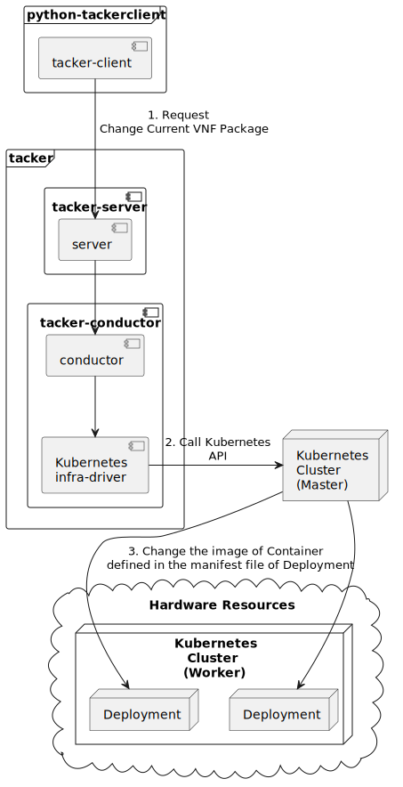

===========================================
ETSI NFV-SOL CNF Change Current VNF Package
===========================================

This document describes how to change current VNF package for CNF
in Tacker v2 API.

Overview
--------

The diagram below shows an overview of changing current VNF package.

1. Request Change Current VNF Package

   A user requests tacker-server to change current VNF package for VNF instance
   with tacker-client by requesting ``change current VNF package``.

2. Call Kubernetes API

   Upon receiving a request from tacker-client, tacker-server redirects it to
   tacker-conductor. In tacker-conductor, the request is redirected again to
   an appropriate infra-driver (in this case Kubernetes infra-driver) according
   to the contents of VNF instance. Then, Kubernetes infra-driver calls
   Kubernetes APIs.

3. Change the image of Container defined in the manifest file of Deployment

   Kubernetes Master update the image of Container defined in the manifest
   file of Deployment according to the API calls.

Prerequisites
-------------

The following packages should be installed:

* tacker
* python-tackerclient

At least one VNF instance with status of ``INSTANTIATED`` is required.
You can refer to :doc:`/user/v2/cnf/deployment/index` for the
procedure to instantiate VNF.

You can also refer to :doc:`/user/vnf-package` for the operation of uploading
VNF package.

The sample packages for CNF can be obtained from the following links.

* `VNF Package for Common instantiate`_
* `VNF Package for Change Current VNF Package`_

Change Current VNF Package
--------------------------

As mentioned in Prerequisites, the VNF must be created
before performing change current VNF package.

You need to upload the VNF package you want to change to before
executing change current VNF package.

Details of CLI commands are described in
:doc:`/cli/cli-etsi-vnflcm`.

For changing current VNF package, you need to prepare a JSON-formatted
definition file before running command for changing the VNF package.

``sample_param_file_for_specified_resources.json:``

.. code-block:: json

  {
    "vnfdId": "c6595341-a5bb-8246-53c4-7aeb843d60c5",
    "additionalParams": {
      "upgrade_type": "RollingUpdate",
      "lcm-kubernetes-def-files": [
        "Files/kubernetes/namespace.yaml",
        "Files/new_kubernetes/new_deployment.yaml"
      ],
      "vdu_params": [{
        "vdu_id": "VDU2"
      }]
    },
    "vimConnectionInfo": {
      "vim1": {
        "vimId": "8bc6f536-e5fb-4e4f-96f7-f55b16d35850",
        "vimType": "ETSINFV.KUBERNETES.V_1",
        "interfaceInfo": {
          "endpoint": "https://192.168.56.10:6443"
        },
        "accessInfo": {
          "bearer_token": "bearer_token"
        },
        "extra": {
          "dummy-key": "dummy-val"
        }
      }
    },
    "vnfConfigurableProperties": {
      "key": "value"
    },
    "extensions": {
      "key": "value"
    }
  }

.. note::

  Unlike Change Current VNF Package for VNF,
  coordination scripts are not supported for CNF.
  Therefore, lcm-operation-coordinate files need not be
  specified by ``additionalParams``.

You can set following parameter in additionalParams:

.. list-table:: additionalParams
  :widths: 15 10 30
  :header-rows: 1

  * - Attribute name
    - Cardinality
    - Parameter description
  * - upgrade_type
    - 1
    - Type of file update operation method. Specify Blue-Green or Rolling update.
  * - lcm-kubernetes-def-files
    - 0..N
    - File path of the manifest file of the deployment resource.
  * - vdu_params
    - 1..N
    - VDU information of target VDU to update.
  * - > vdu_id
    - 1
    - VDU name of target VDU to update.

.. note::

  ``sample_param_file_for_specified_resources.json`` contains
  all optional parameters.

  * ``vnfdId`` is the VNFD id of the new VNF package you uploaded.
  * ``lcm-kubernetes-def-files`` is only used in Kubernetes VIM, not
    OpenStack VIM. And you only need to set this parameter when you need to
    update the path of the manifest file of the deployment resource.
  * ``vimConnectionInfo`` is an optional parameter.
    This operation can specify the ``vimConnectionInfo`` for
    the VNF instance.
    Even if this operation specify multiple ``vimConnectionInfo``
    associated with one VNF instance, only one of them will be used
    for life cycle management operations.
    It is not possible to delete the key of registered ``vimConnectionInfo``.
  * ``vnfConfigurableProperties`` and ``extensions`` are optional
    parameter.
    As with the update operation, these values are updated by performing
    JSON Merge Patch with the values set in the request parameter to the
    current values.
    For ``metadata``, the value set before this operation is maintained.

.. note::

  Currently, this operation only supports some functions of
  ``Change Current VNF Package``.

  * There are several ways to update deployment, but Bobcat version Tacker only
    supports ``RollingUpdate`` type. You can set it via ``upgrade_type``
    param.
  * Currently only support update images of deployment.
  * Currently unsupported updates:

    * This API currently does not support increasing or decreasing the number
      of Pods according to the VNF package.
    * The add and delete operations of the entire deployment are not
      supported.
    * In the definition of ETSI, external networks (e.g. extVirtualLinks,
      extManagedVirtualLinks) can be modified. This API currently does not
      support the operations of modifying, adding, and deleting these
      networks.

How to Change Current VNF Package with specified resource
~~~~~~~~~~~~~~~~~~~~~~~~~~~~~~~~~~~~~~~~~~~~~~~~~~~~~~~~~

You can update only specific kubernetes resources (e.g. deployment) by
specifying the file path of the kubernetes definition file in the
``lcm-kubernetes-def-files`` and vdu information in ``vdu_params``
of the ``change current VNF package`` request parameter file
(e.g. sample_param_file_for_specified_resources.json).

Execute Change Current VNF Package CLI command. After complete this change
operation you should check resource status by Kubernetes CLI commands.

1. check deployment's image information. This is to confirm that deployment's
image has changed before and after operation.

2. check the age of deployment and pods under this deployment. This is to
confirm that the deployment has not redeployed before and after operation,
and the pods under this deployment have redeployed.

3. check the status and name of pods under this deployment. This is to confirm
that the status of pods under this deployment are running, the name of pods
under this deployment has changed before and after operation.

Deployment information before operation:

.. code-block:: console

  $ kubectl get deployment -o wide -n curry

Result:

.. code-block:: console

  NAME   READY   UP-TO-DATE   AVAILABLE   AGE     CONTAINERS   IMAGES   SELECTOR
  vdu2   2/2     2            2           6m40s   nginx        nginx    app=webserver

Deployment detailed information before operation:

.. code-block:: console

  $ kubectl describe deployment vdu2 -n curry

Result:

.. code-block:: console

  Name:                   vdu2
  Namespace:              curry
  CreationTimestamp:      Thu, 07 Dec 2023 01:22:43 +0000
  Labels:                 <none>
  Annotations:            deployment.kubernetes.io/revision: 1
  Selector:               app=webserver
  Replicas:               2 desired | 2 updated | 2 total | 2 available | 0 unavailable
  StrategyType:           RollingUpdate
  MinReadySeconds:        0
  RollingUpdateStrategy:  25% max unavailable, 25% max surge
  Pod Template:
    Labels:  app=webserver
    Containers:
     nginx:
      Image:      nginx
      Port:       80/TCP
      Host Port:  0/TCP
      Limits:
        memory:  200Mi
      Requests:
        memory:     100Mi
      Environment:  <none>
      Mounts:       <none>
    Volumes:        <none>
  Conditions:
    Type           Status  Reason
    ----           ------  ------
    Available      True    MinimumReplicasAvailable
    Progressing    True    NewReplicaSetAvailable
  OldReplicaSets:  <none>
  NewReplicaSet:   vdu2-749bb6cbbf (2/2 replicas created)
  Events:
    Type    Reason             Age    From                   Message
    ----    ------             ----   ----                   -------
    Normal  ScalingReplicaSet  7m21s  deployment-controller  Scaled up replica set vdu2-749bb6cbbf to 2

Pods information before operation:

.. code-block:: console

  $ kubectl get pods -o wide -n curry

Result:

.. code-block:: console

  NAME                    READY   STATUS    RESTARTS   AGE     IP           NODE      NOMINATED NODE   READINESS GATES
  vdu2-749bb6cbbf-dcjpn   1/1     Running   0          9m11s   10.0.0.98    vagrant   <none>           <none>
  vdu2-749bb6cbbf-hmsbh   1/1     Running   0          9m11s   10.0.0.116   vagrant   <none>           <none>

Change Current VNF Package execution of the entire VNF:

.. code-block:: console

  $ openstack vnflcm change-vnfpkg VNF_INSTANCE_ID \
    ./sample_param_file_for_specified_resources.json \
    --os-tacker-api-version 2

Result:

.. code-block:: console

  Change Current VNF Package for VNF Instance 63936f24-d43c-42d9-b38d-3c8eff85c445 has been accepted.

Deployment information after operation:

.. code-block:: console

  $ kubectl get deployment -o wide -n curry

Result:

.. code-block:: console

  NAME   READY   UP-TO-DATE   AVAILABLE   AGE   CONTAINERS   IMAGES         SELECTOR
  vdu2   2/2     2            2           13m   nginx        nginx:alpine   app=webserver

Deployment detailed information after operation:

.. code-block:: console

  $ kubectl describe deployment vdu2 -n curry

Result:

.. code-block:: console

  Name:                   vdu2
  Namespace:              curry
  CreationTimestamp:      Thu, 07 Dec 2023 01:22:43 +0000
  Labels:                 <none>
  Annotations:            deployment.kubernetes.io/revision: 2
  Selector:               app=webserver
  Replicas:               2 desired | 2 updated | 2 total | 2 available | 0 unavailable
  StrategyType:           RollingUpdate
  MinReadySeconds:        0
  RollingUpdateStrategy:  25% max unavailable, 25% max surge
  Pod Template:
    Labels:  app=webserver
    Containers:
     nginx:
      Image:      nginx:alpine
      Port:       80/TCP
      Host Port:  0/TCP
      Limits:
        memory:  200Mi
      Requests:
        memory:     100Mi
      Environment:  <none>
      Mounts:       <none>
    Volumes:        <none>
  Conditions:
    Type           Status  Reason
    ----           ------  ------
    Available      True    MinimumReplicasAvailable
    Progressing    True    NewReplicaSetAvailable
  OldReplicaSets:  <none>
  NewReplicaSet:   vdu2-8556bbb5d8 (2/2 replicas created)
  Events:
    Type    Reason             Age   From                   Message
    ----    ------             ----  ----                   -------
    Normal  ScalingReplicaSet  14m   deployment-controller  Scaled up replica set vdu2-749bb6cbbf to 2
    Normal  ScalingReplicaSet  104s  deployment-controller  Scaled up replica set vdu2-8556bbb5d8 to 1
    Normal  ScalingReplicaSet  91s   deployment-controller  Scaled down replica set vdu2-749bb6cbbf to 1 from 2
    Normal  ScalingReplicaSet  91s   deployment-controller  Scaled up replica set vdu2-8556bbb5d8 to 2 from 1
    Normal  ScalingReplicaSet  83s   deployment-controller  Scaled down replica set vdu2-749bb6cbbf to 0 from 1

.. note::
  ``image`` has changed from ``nginx`` to ``nginx:alpine``.
  The age of deployment ``vdu2`` has not been reset, so deployment ``vdu2``
  has not redeployed.

Pods information after operation:

.. code-block:: console

  $ kubectl get pods -o wide -n curry

Result:

.. code-block:: console

  NAME                    READY   STATUS    RESTARTS   AGE     IP           NODE      NOMINATED NODE   READINESS GATES
  vdu2-8556bbb5d8-2wvxj   1/1     Running   0          3m57s   10.0.0.76    vagrant   <none>           <none>
  vdu2-8556bbb5d8-tj4vx   1/1     Running   0          3m44s   10.0.0.120   vagrant   <none>           <none>

.. note::

  ``name`` of pods has changed before and after operation.
  The age of pods under deployment has been reset, so pods under
  this deployment has redeployed before and after operation.

History of Checks
-----------------

The content of this document has been confirmed to work
using the following VNF Packages.

* `test_instantiate_cnf_resources for 2023.2 Bobcat`_
* `test_change_vnf_pkg_with_deployment for 2023.2 Bobcat`_

.. _VNF Package for Common instantiate:
  https://opendev.org/openstack/tacker/src/branch/master/samples/tests/functional/sol_kubernetes_v2/test_instantiate_cnf_resources/contents
.. _VNF Package for Change Current VNF Package:
  https://opendev.org/openstack/tacker/src/branch/master/samples/tests/functional/sol_kubernetes_v2/test_change_vnf_pkg_with_deployment/contents
.. _test_instantiate_cnf_resources for 2023.2 Bobcat:
  https://opendev.org/openstack/tacker/src/branch/stable/2023.2/tacker/tests/functional/sol_kubernetes_v2/samples/test_instantiate_cnf_resources
.. _test_change_vnf_pkg_with_deployment for 2023.2 Bobcat:
  https://opendev.org/openstack/tacker/src/branch/stable/2023.2/tacker/tests/functional/sol_kubernetes_v2/samples/test_change_vnf_pkg_with_deployment
