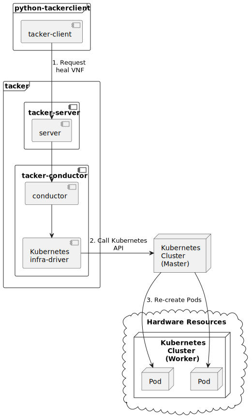

========================
ETSI NFV-SOL CNF Healing
========================

This document describes how to heal CNF in Tacker v2 API.

Overview
--------

The diagram below shows an overview of the CNF healing.

1. Request heal VNF

   A user requests tacker-server to heal a VNF or all VNFs with tacker-client
   by requesting ``heal VNF``.

2. Call Kubernetes API

   Upon receiving a request from tacker-client, tacker-server redirects it to
   tacker-conductor.  In tacker-conductor, the request is redirected again to
   an appropriate infra-driver (in this case Kubernetes infra-driver) according
   to the contents of the instantiate parameters.  Then, Kubernetes
   infra-driver calls Kubernetes APIs.

3. Re-create Pods

   Kubernetes Master re-creates Pods according to the API calls.

Prerequisites
-------------

The following packages should be installed:

* tacker
* python-tackerclient

Execute up to "Instantiate VNF" in the procedure of
:doc:`/user/v2/cnf/deployment/index`.
In other words, the procedure after "Terminate VNF" is not executed.

CNF Healing Procedure
---------------------

As mentioned in Prerequisites and Healing target VNF instance, the VNF must be
instantiated before healing.

Details of CLI commands are described in :doc:`/cli/cli-etsi-vnflcm`.

There are two main methods for CNF healing.

* Healing of the entire VNF

  Heal entire VNF instance by termination and instantiation of the VNF.

* Healing specified with VNFC instances

  Heal Pod (mapped as VNFC) that is singleton or created using controller
  resources of Kubernetes such as Deployment, DaemonSet, StatefulSet and
  ReplicaSet.

.. note::

  A VNFC is a 'VNF Component', and one VNFC basically corresponds to
  one VDU in the VNF. For more information on VNFC, see `NFV-SOL002 v3.3.1`_.

.. _Healing Target VNF Instance:

Healing Target VNF Instance
~~~~~~~~~~~~~~~~~~~~~~~~~~~

Assuming that the following VNF instance exists,
this instance will be healed.

.. code-block:: console

  $ openstack vnflcm show VNF_INSTANCE_ID --os-tacker-api-version 2 \
    -f json | jq .'["Instantiated Vnf Info"]'.vnfcInfo

Result:

.. code-block:: console

  [
    {
      "id": "VDU1-vdu1-749bb6cbbf-dcjpn",
      "vduId": "VDU1",
      "vnfcResourceInfoId": "vdu1-749bb6cbbf-dcjpn",
      "vnfcState": "STARTED"
    },
    {
      "id": "VDU1-vdu1-749bb6cbbf-hmsbh",
      "vduId": "VDU1",
      "vnfcResourceInfoId": "vdu1-749bb6cbbf-hmsbh",
      "vnfcState": "STARTED"
    }
  ]

How to Heal of the Entire VNF
~~~~~~~~~~~~~~~~~~~~~~~~~~~~~

Execute Heal of the entire CNF with CLI command and check the name and age of
pod information before and after healing.
This is to confirm that the name has changed and age has been new after heal.

Pod information before heal:

.. code-block:: console

  $ kubectl get pod
  NAME                    READY   STATUS    RESTARTS   AGE
  vdu1-749bb6cbbf-dcjpn   1/1     Running   0          7h38m
  vdu1-749bb6cbbf-hmsbh   1/1     Running   0          7h38m

Heal entire VNF can be executed by the following CLI command.

.. code-block:: console

  $ openstack vnflcm heal VNF_INSTANCE_ID --os-tacker-api-version 2

Result:

.. code-block:: console

  Heal request for VNF Instance 431b94b5-d7ba-4d1c-aa26-ecec65d7ee53 has been accepted.

Pod information after heal:

.. code-block:: console

  $ kubectl get pod
  NAME                    READY   STATUS    RESTARTS   AGE
  vdu1-749bb6cbbf-jgjq9   1/1     Running   0          31s
  vdu1-749bb6cbbf-tj4vx   1/1     Running   0          31s

All ``vnfcResourceInfo`` in ``Instantiated Vnf Info`` will be updated from
the VNF Instance displayed in :ref:`Healing Target VNF Instance`.

.. code-block:: console

  $ openstack vnflcm show VNF_INSTANCE_ID --os-tacker-api-version 2 \
    -f json | jq .'["Instantiated Vnf Info"]'.vnfcInfo

Result:

.. code-block:: console

  [
    {
      "id": "VDU1-vdu1-749bb6cbbf-jgjq9",
      "vduId": "VDU1",
      "vnfcResourceInfoId": "vdu1-749bb6cbbf-jgjq9",
      "vnfcState": "STARTED"
    },
    {
      "id": "VDU1-vdu1-749bb6cbbf-tj4vx",
      "vduId": "VDU1",
      "vnfcResourceInfoId": "vdu1-749bb6cbbf-tj4vx",
      "vnfcState": "STARTED"
    }
  ]

How to Heal Specified with VNFC Instances
~~~~~~~~~~~~~~~~~~~~~~~~~~~~~~~~~~~~~~~~~
Execute Heal of the partial CNF CLI command and check the name and age of pod
information before and after healing.
This is to confirm that the name has changed and age has been new after heal.

Pod information before heal:

.. code-block:: console

  $ kubectl get pod
  NAME                    READY   STATUS    RESTARTS   AGE
  vdu1-749bb6cbbf-jgjq9   1/1     Running   0          31s
  vdu1-749bb6cbbf-tj4vx   1/1     Running   0          31s

Heal specified with VNFC instances can be executed by running
:command:`openstack vnflcm heal VNF_INSTANCE_ID --vnfc-instance VNFC_INSTANCE_ID`.

.. note::

  ``VNFC_INSTANCE_ID`` is ``instantiatedVnfInfo.vnfcInfo.id``.

.. code-block:: console

  $ openstack vnflcm heal VNF_INSTANCE_ID --vnfc-instance VNFC_INSTANCE_ID \
    --os-tacker-api-version 2

Result:

.. code-block:: console

  Heal request for VNF Instance 431b94b5-d7ba-4d1c-aa26-ecec65d7ee53 has been accepted.

Pod information after heal:

.. code-block:: console

  $ kubectl get pod
  NAME                    READY   STATUS    RESTARTS   AGE
  vdu1-749bb6cbbf-6mbsl   1/1     Running   0          86s
  vdu1-749bb6cbbf-tj4vx   1/1     Running   0          9m59s

.. code-block:: console

  $ openstack vnflcm show VNF_INSTANCE_ID --os-tacker-api-version 2 \
    -f json | jq .'["Instantiated Vnf Info"]'.vnfcInfo

Result:

.. code-block:: console

  [
    {
      "id": "VDU1-vdu1-749bb6cbbf-6mbsl",
      "vduId": "VDU1",
      "vnfcResourceInfoId": "vdu1-749bb6cbbf-6mbsl",
      "vnfcState": "STARTED"
    },
    {
      "id": "VDU1-vdu1-749bb6cbbf-tj4vx",
      "vduId": "VDU1",
      "vnfcResourceInfoId": "vdu1-749bb6cbbf-tj4vx",
      "vnfcState": "STARTED"
    }
  ]

History of Checks
-----------------

The content of this document has been confirmed to work
using the following VNF Package.

* `test_instantiate_cnf_resources for 2023.2 Bobcat`_

.. _NFV-SOL002 v3.3.1: https://www.etsi.org/deliver/etsi_gs/NFV-SOL/001_099/002/03.03.01_60/gs_nfv-sol002v030301p.pdf
.. _test_instantiate_cnf_resources for 2023.2 Bobcat:
  https://opendev.org/openstack/tacker/src/branch/stable/2023.2/tacker/tests/functional/sol_kubernetes_v2/samples/test_instantiate_cnf_resources
