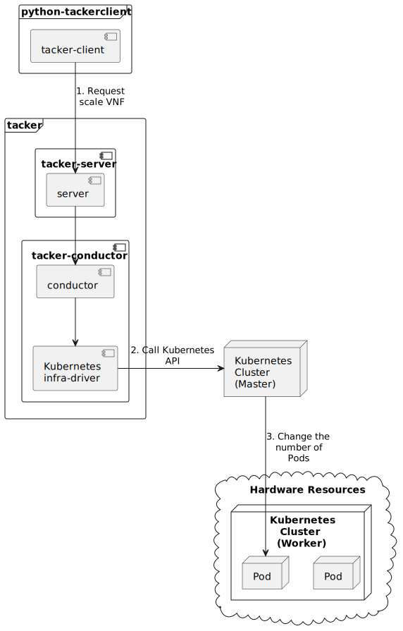

========================
ETSI NFV-SOL CNF Scaling
========================

This document describes how to scale CNF in Tacker v2 API.

Overview
--------

The diagram below shows an overview of the CNF scaling.

1. Request scale VNF

   A user requests tacker-server to scale a VNF or all VNFs with tacker-client
   by requesting ``scale VNF``.

2. Call Kubernetes API

   Upon receiving a request from tacker-client, tacker-server redirects it to
   tacker-conductor. In tacker-conductor, the request is redirected again to
   an appropriate infra-driver (in this case Kubernetes infra-driver) according
   to the contents of the instantiate parameters. Then, Kubernetes
   infra-driver calls Kubernetes APIs.

3. Change the number of Pods

   Kubernetes Master change the number of Pods according to the API calls.

Prerequisites
-------------

The following packages should be installed:

* tacker
* python-tackerclient

Execute up to "Instantiate VNF" in the procedure of
:doc:`/user/v2/cnf/deployment/index`.
In other words, the procedure after "Terminate VNF" is not executed.

CNF Scaling Procedure
---------------------

As mentioned in Prerequisites, the VNF must be instantiated before performing
scaling.
Users can scale the number of pod replicas managed by controller resources such
as Kubernetes Deployment, StatefulSet, and ReplicaSet.

.. note::

  If kind is Stateful Set and not dynamic provisioning (no-provisioner),
  user must create the Persistent Volume for the maximum replicas
  in advance because the increased Persistent Volume is not created
  during the scale out operation.

Details of CLI commands are described in :doc:`/cli/cli-etsi-vnflcm`.

There are two main methods for CNF scaling.

* Scale out CNF
* Scale in CNF

How to Identify ASPECT_ID
~~~~~~~~~~~~~~~~~~~~~~~~~

In order to execute scaling, it is necessary to specify ``ASPECT_ID``, which is
the ID for the target scaling group.
First, the method of specifying the ID will be described.

``ASPECT_ID`` is described in VNFD included in the VNF Package.
In the following VNFD excerpt, **vdu1_aspect** corresponds to ``ASPECT_ID``.

.. code-block:: yaml

  node_templates:
    VNF:
      type: company.provider.VNF
      properties:
        flavour_description: A simple flavour

    VDU1:
      type: tosca.nodes.nfv.Vdu.Compute
      properties:
        name: vdu1
        description: VDU1 compute node
        vdu_profile:
          min_number_of_instances: 1
          max_number_of_instances: 3

  policies:
    - scaling_aspects:
        type: tosca.policies.nfv.ScalingAspects
        properties:
          aspects:
            vdu1_aspect:
              name: vdu1_aspect
              description: vdu1 scaling aspect
              max_scale_level: 2
              step_deltas:
                - delta_1

    - VDU1_initial_delta:
        type: tosca.policies.nfv.VduInitialDelta
        properties:
          initial_delta:
            number_of_instances: 2
        targets: [ VDU1 ]

    - VDU1_scaling_aspect_deltas:
        type: tosca.policies.nfv.VduScalingAspectDeltas
        properties:
          aspect: vdu1_aspect
          deltas:
            delta_1:
              number_of_instances: 1
        targets: [ VDU1 ]

    - instantiation_levels:
        type: tosca.policies.nfv.InstantiationLevels
        properties:
          levels:
            instantiation_level_1:
              description: Smallest size
              scale_info:
                vdu1_aspect:
                  scale_level: 1
            instantiation_level_2:
              description: Largest size
              scale_info:
                vdu1_aspect:
                  scale_level: 2
          default_level: instantiation_level_1

    - VDU1_instantiation_levels:
        type: tosca.policies.nfv.VduInstantiationLevels
        properties:
          levels:
            instantiation_level_1:
              number_of_instances: 2
            instantiation_level_2:
              number_of_instances: 3
        targets: [ VDU1 ]

.. note::

  See `NFV-SOL001 v2.6.1`_ annex A.6 for details about ``ASPECT_ID``.

How to Scale Out CNF
~~~~~~~~~~~~~~~~~~~~

Execute Scale CLI command and check the number of replicas before and after
scaling.
This is to confirm that the number of replicas has increased after Scale-out.
An example using deployment is described.

Replicas information before scale-out:

.. code-block:: console

  $ kubectl get deployment
  NAME   READY   UP-TO-DATE   AVAILABLE   AGE
  vdu1   2/2     2            2           7h4m

Scale-out CNF can be executed by the following CLI command.

.. code-block:: console

  $ openstack vnflcm scale --type SCALE_OUT --aspect-id ASPECT_ID \
    VNF_INSTANCE_ID --os-tacker-api-version 2

Result:

.. code-block:: console

  Scale request for VNF Instance 431b94b5-d7ba-4d1c-aa26-ecec65d7ee53 has been accepted.

Replicas information after scale-out:

.. code-block:: console

  $ kubectl get deployment
  NAME   READY   UP-TO-DATE   AVAILABLE   AGE
  vdu1   3/3     3            3           7h8m

How to Scale in CNF
~~~~~~~~~~~~~~~~~~~

Execute Scale CLI command and check the number of replicas before and after
scaling.
This is to confirm that the number of replicas has increased after Scale-in.
An example using deployment is described.

Replicas information before scale-out:

.. code-block:: console

  $ kubectl get deployment
  NAME   READY   UP-TO-DATE   AVAILABLE   AGE
  vdu1   3/3     3            3           7h8m

Scale-in VNF can be executed by the following CLI command.

.. code-block:: console

  $ openstack vnflcm scale --type SCALE_IN --aspect-id ASPECT_ID \
    VNF_INSTANCE_ID --os-tacker-api-version 2

Result:

.. code-block:: console

  Scale request for VNF Instance 431b94b5-d7ba-4d1c-aa26-ecec65d7ee53 has been accepted.

Replicas information after scale-in:

.. code-block:: console

  $ kubectl get deployment
  NAME   READY   UP-TO-DATE   AVAILABLE   AGE
  vdu1   2/2     2            2           7h12m

History of Checks
-----------------

The content of this document has been confirmed to work
using the following VNF Package.

* `test_instantiate_cnf_resources for 2023.2 Bobcat`_

.. _NFV-SOL001 v2.6.1: https://www.etsi.org/deliver/etsi_gs/NFV-SOL/001_099/001/02.06.01_60/gs_NFV-SOL001v020601p.pdf
.. _test_instantiate_cnf_resources for 2023.2 Bobcat:
  https://opendev.org/openstack/tacker/src/branch/stable/2023.2/tacker/tests/functional/sol_kubernetes_v2/samples/test_instantiate_cnf_resources
