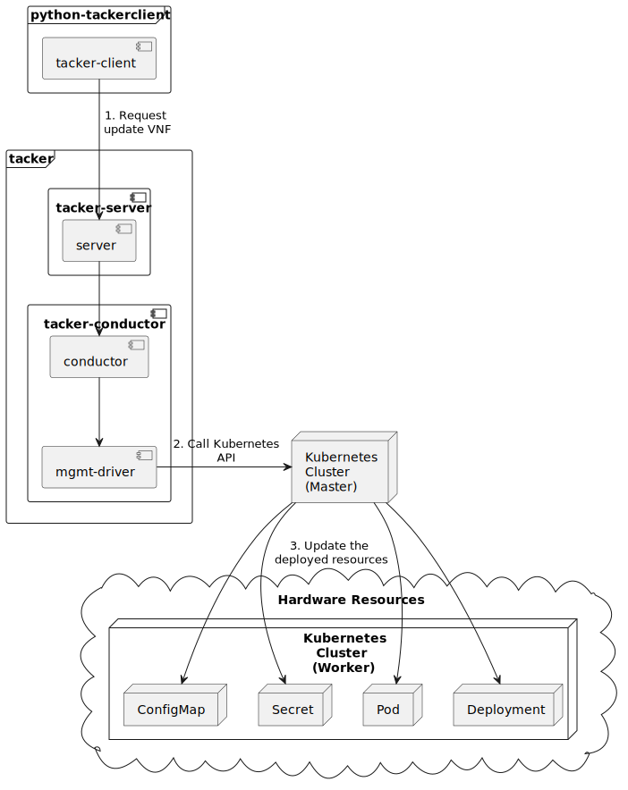

========================================
ETSI NFV-SOL CNF Update with Mgmt Driver
========================================

This document describes how to update CNF with Mgmt Driver in Tacker v2 API.

Overview
--------

The diagram below shows an overview of the CNF updating.

1. Request update VNF

   A user requests tacker-server to update a CNF with tacker-client
   by requesting ``update VNF`` as a Modify VNF information operation.

2. Call Kubernetes API

   Upon receiving a request from tacker-client, tacker-server redirects it to
   tacker-conductor. In tacker-conductor, the request is redirected again to
   the matching Mgmt Driver (in this case the Mgmt Driver of container update)
   according to the contents of the VNFD in the VNF Package. Then, Mgmt Driver
   calls Kubernetes APIs.

3. Update resources

   Kubernetes Master update resources according to the API calls.

Mgmt Driver Introduction
~~~~~~~~~~~~~~~~~~~~~~~~

Mgmt Driver enables Users to configure their VNF before and/or after
its VNF Lifecycle Management operation. Users can customize the logic
of Mgmt Driver by implementing their own Mgmt Driver and these
customizations are specified by "interface" definition in
`NFV-SOL001 v2.6.1`_.

The Mgmt Driver in this user guide supports updating CNF with
``modify_information_start`` and ``modify_information_end`` operation.

Use Cases
~~~~~~~~~

In this user guide, the provided sample VNF Packages will be instantiated
and then updated. The sample Mgmt Driver will update resources on
Kubernetes during update. Update the ConfigMap and Secret, and also
update the image in the Pod, Deployment, DaemonSet and ReplicaSet, and other
resources will not change.

Prerequisites
-------------

The following packages should be installed:

* tacker
* python-tackerclient

And you need to put the Mgmt Driver file in the
Scripts directory of the VNF Package.

.. note::

  You can find sample Mgmt Driver file in the following path.
  `tacker/sol_refactored/mgmt_drivers/container_update_mgmt_v2.py`_

You can also refer to :doc:`/user/v2/cnf/deployment/index` for the
procedure of preparation from "Prepare Kubernetes VIM" to
"Instantiate VNF".

How to Instantiate VNF for Updating
~~~~~~~~~~~~~~~~~~~~~~~~~~~~~~~~~~~~

You can use the sample VNF package below to instantiate VNF to be updated.

.. code-block:: console

  $ python3 -m pip install TACKER_ROOT
  $ cd TACKER_ROOT/samples/tests/functional/sol_kubernetes_v2/test_cnf_container_update_before
  $ vi pkggen.py
  ...
  vim_id = "your k8s vim's id" (modify this value to your own vim Id)
  ...
  $ python3 pkggen.py
  $ ll
  ...
  drwxr-xr-x  5 stack stack  4096 Nov  5 23:46 contents/
  -rw-r--r--  1 stack stack  1922 Nov  5 23:46 pkggen.py
  -rw-rw-r--  1 stack stack 25823 Nov 20 04:30 test_cnf_container_update_before.zip
  ...

.. note::

  In this document, ``TACKER_ROOT`` is the root of tacker's repository on
  the server.

After you have done the above, you will have the sample VNF package
`test_cnf_container_update_before.zip`.

After creating a VNF package with :command:`openstack vnf package create`,
When the Onboarding State is CREATED, the Operational
State is DISABLED, and the Usage State is NOT_IN_USE, indicate the creation is
successful.

.. code-block:: console

  $ openstack vnf package create
  +-------------------+-------------------------------------------------------------------------------------------------+
  | Field             | Value                                                                                           |
  +-------------------+-------------------------------------------------------------------------------------------------+
  | ID                | 67e8b34a-d303-4ec1-acb0-e6a3bf6aae12                                                            |
  | Links             | {                                                                                               |
  |                   |     "self": {                                                                                   |
  |                   |         "href": "/vnfpkgm/v1/vnf_packages/67e8b34a-d303-4ec1-acb0-e6a3bf6aae12"                 |
  |                   |     },                                                                                          |
  |                   |     "packageContent": {                                                                         |
  |                   |         "href": "/vnfpkgm/v1/vnf_packages/67e8b34a-d303-4ec1-acb0-e6a3bf6aae12/package_content" |
  |                   |     }                                                                                           |
  |                   | }                                                                                               |
  | Onboarding State  | CREATED                                                                                         |
  | Operational State | DISABLED                                                                                        |
  | Usage State       | NOT_IN_USE                                                                                      |
  | User Defined Data | {}                                                                                              |
  +-------------------+-------------------------------------------------------------------------------------------------+

Upload the CSAR zip file to the VNF Package by running the following command
:command:`openstack vnf package upload --path <path of vnf package> <vnf package ID>`.

Here is an example of uploading VNF package:

.. code-block:: console

  $ openstack vnf package upload --path test_cnf_container_update_before.zip 67e8b34a-d303-4ec1-acb0-e6a3bf6aae12
  Upload request for VNF package 67e8b34a-d303-4ec1-acb0-e6a3bf6aae12 has been accepted.

Create VNF instance by running
:command:`openstack vnflcm create <VNFD ID> --os-tacker-api-version 2`.

.. note::

  The VNFD ID could be found by
  :command:`openstack vnf package show <vnf package ID>` command.

Here is an example of creating VNF :

.. code-block:: console

  $ openstack vnflcm create 97018ca2-bf29-4715-9e2b-6e432dd1f414
  +-----------------------------+------------------------------------------------------------------------------------------------------------------+
  | Field                       | Value                                                                                                            |
  +-----------------------------+------------------------------------------------------------------------------------------------------------------+
  | ID                          | dec67077-b67c-46ff-b5bf-3b8d34b4ed79                                                                             |
  | Instantiation State         | NOT_INSTANTIATED                                                                                                 |
  | Links                       | {                                                                                                                |
  |                             |     "self": {                                                                                                    |
  |                             |         "href": "http://127.0.0.1:9890/vnflcm/v2/vnf_instances/dec67077-b67c-46ff-b5bf-3b8d34b4ed79"             |
  |                             |     },                                                                                                           |
  |                             |     "instantiate": {                                                                                             |
  |                             |         "href": "http://127.0.0.1:9890/vnflcm/v2/vnf_instances/dec67077-b67c-46ff-b5bf-3b8d34b4ed79/instantiate" |
  |                             |     }                                                                                                            |
  |                             | }                                                                                                                |
  | VNF Configurable Properties |                                                                                                                  |
  | VNF Instance Description    |                                                                                                                  |
  | VNF Instance Name           |                                                                                                                  |
  | VNF Product Name            | Sample VNF                                                                                                       |
  | VNF Provider                | Company                                                                                                          |
  | VNF Software Version        | 1.0                                                                                                              |
  | VNFD ID                     | 97018ca2-bf29-4715-9e2b-6e432dd1f414                                                                             |
  | VNFD Version                | 1.0                                                                                                              |
  +-----------------------------+------------------------------------------------------------------------------------------------------------------+

The following example shows the yaml files that deploys the Kubernetes
resources.
You can see resource definition files are included as a value of
``lcm-kubernetes-def-files`` in ``additionalParams`` here.

.. code-block:: console

  $ cat ./instance_kubernetes.json
  {
    "flavourId": "simple",
    "vimConnectionInfo": {
      "vim1": {
        "vimId": "b7e657dc-8f16-4c1c-8fa4-a7c298d6a827",
        "vimType": "ETSINFV.KUBERNETES.V_1"
      }
    },
    "additionalParams": {
      "lcm-kubernetes-def-files": [
        "Files/kubernetes/configmap_1.yaml",
        "Files/kubernetes/deployment.yaml",
        "Files/kubernetes/pod_env.yaml",
        "Files/kubernetes/pod_volume.yaml",
        "Files/kubernetes/replicaset.yaml",
        "Files/kubernetes/secret_1.yaml",
        "Files/kubernetes/configmap_3.yaml",
        "Files/kubernetes/pod_env_2.yaml",
        "Files/kubernetes/pod_volume_2.yaml",
        "Files/kubernetes/daemonset.yaml",
        "Files/kubernetes/deployment_2.yaml",
        "Files/kubernetes/secret_3.yaml"
      ]
    }
  }

Instantiate VNF by running the following command
:command:`openstack vnflcm instantiate <VNF instance ID> <json file> --os-tacker-api-version 2`,
after the command above is executed.

.. code-block:: console

  $ openstack vnflcm instantiate VNF_INSTANCE_ID instance_kubernetes.json --os-tacker-api-version 2
  Instantiate request for VNF Instance dec67077-b67c-46ff-b5bf-3b8d34b4ed79 has been accepted.

CNF Updating Procedure
-----------------------

As mentioned in `Prerequisites`, the VNF must be instantiated before
performing updating.

Next, the user can use the original vnf package as a template to make a new
vnf package, in which the yaml of ConfigMap, Secret, Pod, Deployment, DaemonSet
and ReplicaSet can be changed.

.. note::

  * The yaml of ConfigMap and Secret can be changed. The kind, namespace
    and name cannot be changed, but the file name and file path can
    be changed.
  * The yaml of Pod, Deployment, DaemonSet and ReplicaSet can also be
    changed, but only the image field can be changed, and no other fields can
    be changed.
  * No other yaml is allowed to be changed.
  * If changes other than images are made to the yaml of Pod, Deployment,
    DaemonSet and ReplicaSet , those will not take effect. However, if heal
    entire VNF at this time, the resource will be based on the new yaml
    during the instantiation, and all changes will take effect.

Then after creating and uploading the new vnf package, you can perform the
update operation.
After the update, the Mgmt Driver will restart the pod to update and
recreate the deployment, DaemonSet and ReplicaSet to update.

.. note::

    This document provides the new vnf package, the path is
    `samples/tests/functional/sol_kubernetes_v2/test_cnf_container_update_after`_

Details of CLI commands are described in :doc:`/cli/cli-etsi-vnflcm`.

How to Update CNF
~~~~~~~~~~~~~~~~~

Execute Update CLI command and check the status of the resources
before and after updating.

This is to confirm that the resources deployed in Kubernetes are updated
after update CNF.
The following is an example of the entire process.
The resources information before update:

* ConfigMap

  .. code-block:: console

    $ kubectl get configmaps
    NAME               DATA   AGE
    cm-data            1      70s
    cm-data3           1      70s
    kube-root-ca.crt   1      14d

    $ kubectl describe configmaps cm-data
    Name:         cm-data
    Namespace:    default
    Labels:       <none>
    Annotations:  <none>

    Data
    ====
    cmKey1.txt:
    ----
    configmap data
    foo
    bar

    BinaryData
    ====

    Events:  <none>

    $ kubectl describe configmaps cm-data3
    Name:         cm-data3
    Namespace:    default
    Labels:       <none>
    Annotations:  <none>

    Data
    ====
    cmKey1.txt:
    ----
    configmap data
    foo
    bar

    BinaryData
    ====

    Events:  <none>

* Secret

  .. code-block:: console

    $ kubectl get secrets
    NAME                   TYPE                                  DATA   AGE
    default-token-k8svim   kubernetes.io/service-account-token   3      33m
    secret-data            Opaque                                2      2m53s
    secret-data3           Opaque                                2      2m53s

    $ kubectl describe secrets secret-data
    Name:         secret-data
    Namespace:    default
    Labels:       <none>
    Annotations:  <none>

    Type:  Opaque

    Data
    ====
    password:     15 bytes
    secKey1.txt:  15 bytes

    $ kubectl describe secrets secret-data3
    Name:         secret-data3
    Namespace:    default
    Labels:       <none>
    Annotations:  <none>

    Type:  Opaque

    Data
    ====
    password:     15 bytes
    secKey1.txt:  15 bytes

* Pod

  .. code-block:: console

    $ kubectl get pod -o wide
    NAME                                READY   STATUS    RESTARTS   AGE     IP           NODE      NOMINATED NODE   READINESS GATES
    daemonset-vdu5-jgjq9                1/1     Running   0          6m38s   10.0.0.107   vagrant   <none>           <none>
    deployment2-vdu6-86579d6868-6mbsl   1/1     Running   0          6m38s   10.0.0.79    vagrant   <none>           <none>
    env-test                            1/1     Running   0          6m38s   10.0.0.108   vagrant   <none>           <none>
    env-test2                           1/1     Running   0          6m38s   10.0.0.97    vagrant   <none>           <none>
    vdu1-update-6fcf66b5dd-nngts        1/1     Running   0          6m38s   10.0.0.116   vagrant   <none>           <none>
    vdu2-update-2wvxj                   1/1     Running   0          6m38s   10.0.0.91    vagrant   <none>           <none>
    volume-test                         1/1     Running   0          6m38s   10.0.0.74    vagrant   <none>           <none>
    volume-test2                        1/1     Running   0          6m38s   10.0.0.98    vagrant   <none>           <none>

    $ kubectl describe pod volume-test
    Name:             volume-test
    Namespace:        default
    ...
    Containers:
      nginx:
        Container ID:   cri-o://f08eaee4d9fb0cdaaf9803fb97891ff61507239af1c6317464300bcc5d1f9f08
        Image:          nginx
        Image ID:       docker.io/library/nginx@sha256:86e53c4c16a6a276b204b0fd3a8143d86547c967dc8258b3d47c3a21bb68d3c6
    ...
    Volumes:
      cm-volume:
        Type:      ConfigMap (a volume populated by a ConfigMap)
        Name:      cm-data
        Optional:  false
      sec-volume:
        Type:        Secret (a volume populated by a Secret)
        SecretName:  secret-data
        Optional:    false
    ...

    $ kubectl describe pod volume-test2
    Name:             volume-test2
    Namespace:        default
    ...
    Containers:
      nginx:
        Container ID:   cri-o://6255e5c8d0af561789919c5aa07ac90ea691b4d0a91b5f88b9c00592295e9c9b
        Image:          nginx
        Image ID:       docker.io/library/nginx@sha256:86e53c4c16a6a276b204b0fd3a8143d86547c967dc8258b3d47c3a21bb68d3c6
    ...
    Volumes:
      cm-volume:
        Type:      ConfigMap (a volume populated by a ConfigMap)
        Name:      cm-data3
        Optional:  false
      sec-volume:
        Type:        Secret (a volume populated by a Secret)
        SecretName:  secret-data3
        Optional:    false
    ...

* Deployment

  .. code-block:: console

    $ kubectl get deployments.apps -o wide
    NAME               READY   UP-TO-DATE   AVAILABLE   AGE   CONTAINERS   IMAGES   SELECTOR
    deployment2-vdu6   1/1     1            1           20m   nginx        nginx    app=webserver
    vdu1-update        1/1     1            1           20m   nginx        nginx    app=webserver

    $ kubectl describe pod deployment2-vdu6-86579d6868-6mbsl
    Name:             deployment2-vdu6-86579d6868-6mbsl
    Namespace:        default
    ...
    Containers:
      nginx:
        Container ID:   cri-o://eece8b07f2b66760bdc57e7a3fbc073938d73b37e62401d394d058e4273cdd90
        Image:          nginx
        Image ID:       docker.io/library/nginx@sha256:86e53c4c16a6a276b204b0fd3a8143d86547c967dc8258b3d47c3a21bb68d3c6
    ...
        Environment Variables from:
          cm-data3      ConfigMap with prefix 'CM_'  Optional: false
          secret-data3  Secret with prefix 'SEC_'    Optional: false
        Environment:
          CMENV:   <set to the key 'cmKey1.txt' of config map 'cm-data3'>  Optional: false
          SECENV:  <set to the key 'password' in secret 'secret-data3'>    Optional: false
    ...

    $ kubectl describe pod vdu1-update-6fcf66b5dd-nngts
    Name:             vdu1-update-6fcf66b5dd-nngts
    Namespace:        default
    ...
    Containers:
      nginx:
        Container ID:   cri-o://55db77c8612cbddc6041431a9fd1c065cd5251253b07e86288107043e84d9dab
        Image:          nginx
        Image ID:       docker.io/library/nginx@sha256:86e53c4c16a6a276b204b0fd3a8143d86547c967dc8258b3d47c3a21bb68d3c6
    ...
        Environment Variables from:
          cm-data      ConfigMap with prefix 'CM_'  Optional: false
          secret-data  Secret with prefix 'SEC_'    Optional: false
        Environment:
          CMENV:   <set to the key 'cmKey1.txt' of config map 'cm-data'>  Optional: false
          SECENV:  <set to the key 'password' in secret 'secret-data'>    Optional: false
    ...

* DaemonSet

  .. code-block:: console

    $ kubectl get daemonset -o wide
    NAME             DESIRED   CURRENT   READY   UP-TO-DATE   AVAILABLE   NODE SELECTOR   AGE   CONTAINERS   IMAGES   SELECTOR
    daemonset-vdu5   1         1         1       1            1           <none>          27m   nginx        nginx    app=nginx

    $ kubectl describe pod daemonset-vdu5-jgjq9
    Name:             daemonset-vdu5-jgjq9
    Namespace:        default
    ...
    Containers:
      nginx:
        Container ID:   cri-o://0d99ecf321d715aded2ec2834f2fecc57dbb7c6eb8e7f710f193df5a0844d846
        Image:          nginx
        Image ID:       docker.io/library/nginx@sha256:86e53c4c16a6a276b204b0fd3a8143d86547c967dc8258b3d47c3a21bb68d3c6
    ...
        Environment Variables from:
          cm-data      ConfigMap with prefix 'CM_'  Optional: false
          secret-data  Secret with prefix 'SEC_'    Optional: false
        Environment:
          CMENV:   <set to the key 'cmKey1.txt' of config map 'cm-data'>  Optional: false
          SECENV:  <set to the key 'password' in secret 'secret-data'>    Optional: false
    ...

* ReplicaSet

  .. code-block:: console

    $ kubectl get replicaset -o wide
    NAME                          DESIRED   CURRENT   READY   AGE   CONTAINERS   IMAGES   SELECTOR
    deployment2-vdu6-86579d6868   1         1         1       32m   nginx        nginx    app=webserver,pod-template-hash=86579d6868
    vdu1-update-6fcf66b5dd        1         1         1       32m   nginx        nginx    app=webserver,pod-template-hash=6fcf66b5dd
    vdu2-update                   1         1         1       32m   nginx        nginx    app=webserver

    $ kubectl describe pod vdu2-update-2wvxj
    Name:             vdu2-update-2wvxj
    Namespace:        default
    ...
    Containers:
      nginx:
        Container ID:   cri-o://8e24081e5e325302f1e4403bf76756b90f848a9c712e53d99f547ba6265d7ed6
        Image:          nginx
        Image ID:       docker.io/library/nginx@sha256:86e53c4c16a6a276b204b0fd3a8143d86547c967dc8258b3d47c3a21bb68d3c6
    ...
    Volumes:
      cm-volume:
        Type:      ConfigMap (a volume populated by a ConfigMap)
        Name:      cm-data
        Optional:  false
      sec-volume:
        Type:        Secret (a volume populated by a Secret)
        SecretName:  secret-data
        Optional:    false
    ...

Update CNF can be executed by the following CLI command.

.. code-block:: console

  $ openstack vnflcm update VNF_INSTANCE_ID --I sample_param_file.json \
    --os-tacker-api-version 2

The content of the sample sample_param_file.json in this document is
as follows:

.. code-block:: console

  {
    "vnfdId": "58bcc1c6-1400-46ec-b7fb-e508bf7e00e9",
    "vnfInstanceName": "modify_vnf_after",
    "metadata": {
      "configmap_secret_paths": [
        "Files/kubernetes/configmap_2.yaml",
        "Files/kubernetes/secret_2.yaml"
      ]
    }
  }

.. note::

  If you want to update ConfigMap and Secret, not only need to update
  their yaml, but also need to specify the updated yaml file path in
  the metadata field of the request input parameter.

Here is an example of updating CNF:

.. code-block:: console

  $ openstack vnflcm update dec67077-b67c-46ff-b5bf-3b8d34b4ed79 --I sample_param_file.json
    Update vnf:dec67077-b67c-46ff-b5bf-3b8d34b4ed79

The resources information after update:

* ConfigMap

  .. code-block:: console

    $ kubectl describe configmaps cm-data
    Name:         cm-data
    Namespace:    default
    Labels:       <none>
    Annotations:  <none>

    Data
    ====
    cmKey1.txt:
    ----
    configmap2 data2
    foo2
    bar2

    BinaryData
    ====

    Events:  <none>

    $ kubectl describe configmaps cm-data3
    Name:         cm-data3
    Namespace:    default
    Labels:       <none>
    Annotations:  <none>

    Data
    ====
    cmKey1.txt:
    ----
    configmap data
    foo
    bar

    BinaryData
    ====

    Events:  <none>

* Secret

  .. code-block:: console

    $ kubectl describe secrets secret-data
    Name:         secret-data
    Namespace:    default
    Labels:       <none>
    Annotations:  <none>

    Type:  Opaque

    Data
    ====
    password:     16 bytes
    secKey1.txt:  18 bytes

    $ kubectl describe secret secret-data3
    Name:         secret-data3
    Namespace:    default
    Labels:       <none>
    Annotations:  <none>

    Type:  Opaque

    Data
    ====
    secKey1.txt:  15 bytes
    password:     15 bytes

* Pod

  .. code-block:: console

    $ kubectl get pod -o wide
    NAME                                READY   STATUS    RESTARTS        AGE     IP           NODE      NOMINATED NODE   READINESS GATES
    daemonset-vdu5-whd4s                1/1     Running   0               9m49s   10.0.0.76    vagrant   <none>           <none>
    deployment2-vdu6-86579d6868-6mbsl   1/1     Running   0               104m    10.0.0.79    vagrant   <none>           <none>
    env-test                            1/1     Running   1 (9m52s ago)   104m    10.0.0.108   vagrant   <none>           <none>
    env-test2                           1/1     Running   0               104m    10.0.0.97    vagrant   <none>           <none>
    vdu1-update-5d87858fc6-tfgts        1/1     Running   0               9m52s   10.0.0.71    vagrant   <none>           <none>
    vdu2-update-tk7qp                   1/1     Running   0               9m52s   10.0.0.91    vagrant   <none>           <none>
    volume-test                         1/1     Running   1 (9m52s ago)   104m    10.0.0.74    vagrant   <none>           <none>
    volume-test2                        1/1     Running   0               104m    10.0.0.98    vagrant   <none>           <none>

    $ kubectl describe pod env-test
    Name:             env-test
    Namespace:        default
    ...
    Containers:
      nginx:
        Container ID:   cri-o://143924c0a3869402db7e07950cf66c6360a4298a8b575e9ea3c35cf77d48854d
        Image:          tomcat
        Image ID:       docker.io/library/tomcat@sha256:857b168692495ee6ff0d6ee89b5b479555c74401bc3c219c88644b9181f03dd5
    ...
        Environment Variables from:
          cm-data      ConfigMap with prefix 'CM_'  Optional: false
          secret-data  Secret with prefix 'SEC_'    Optional: false
        Environment:
          CMENV:   <set to the key 'cmKey1.txt' of config map 'cm-data'>  Optional: false
          SECENV:  <set to the key 'password' in secret 'secret-data'>    Optional: false
    ...

    $ kubectl describe pod env-test2
    Name:             env-test2
    Namespace:        default
    ...
    Containers:
      nginx:
        Container ID:   cri-o://1ebf1f8fccfd821f55a0918657735758173ea83037edd84bf651e660afd16f82
        Image:          nginx
        Image ID:       docker.io/library/nginx@sha256:86e53c4c16a6a276b204b0fd3a8143d86547c967dc8258b3d47c3a21bb68d3c6
    ...
        Environment Variables from:
          cm-data3      ConfigMap with prefix 'CM_'  Optional: false
          secret-data3  Secret with prefix 'SEC_'    Optional: false
        Environment:
          CMENV:   <set to the key 'cmKey1.txt' of config map 'cm-data3'>  Optional: false
          SECENV:  <set to the key 'password' in secret 'secret-data3'>    Optional: false
    ...

    $ kubectl describe pod volume-test
    Name:             volume-test
    Namespace:        default
    ...
    Containers:
      nginx:
        Container ID:   cri-o://e46b41347ddc29dbd7afee3dda324a1ac26383ab1f805635dd64895328bbe5a1
        Image:          cirros
        Image ID:       docker.io/library/cirros@sha256:a40a2b0a21536db691c8e7e055dbb92c81ad15392048abbde32fc5698e07f831
    ...
    Volumes:
      cm-volume:
        Type:      ConfigMap (a volume populated by a ConfigMap)
        Name:      cm-data
        Optional:  false
      sec-volume:
        Type:        Secret (a volume populated by a Secret)
        SecretName:  secret-data
        Optional:    false
    ...

    $ kubectl describe pod volume-test2
    Name:             volume-test2
    Namespace:        default
    ...
    Containers:
      nginx:
        Container ID:   cri-o://6255e5c8d0af561789919c5aa07ac90ea691b4d0a91b5f88b9c00592295e9c9b
        Image:          nginx
        Image ID:       docker.io/library/nginx@sha256:86e53c4c16a6a276b204b0fd3a8143d86547c967dc8258b3d47c3a21bb68d3c6
    ...
    Volumes:
      cm-volume:
        Type:      ConfigMap (a volume populated by a ConfigMap)
        Name:      cm-data3
        Optional:  false
      sec-volume:
        Type:        Secret (a volume populated by a Secret)
        SecretName:  secret-data3
        Optional:    false
    ...

* Deployment

  .. code-block:: console

    $ kubectl get deployments -o wide
    NAME               READY   UP-TO-DATE   AVAILABLE   AGE    CONTAINERS   IMAGES   SELECTOR
    deployment2-vdu6   1/1     1            1           114m   nginx        nginx    app=webserver
    vdu1-update        1/1     1            1           114m   nginx        cirros   app=webserver

    $ kubectl describe pod deployment2-vdu6-86579d6868-6mbsl
    Name:             deployment2-vdu6-86579d6868-6mbsl
    Namespace:        default
    ...
    Containers:
      nginx:
        Container ID:   cri-o://eece8b07f2b66760bdc57e7a3fbc073938d73b37e62401d394d058e4273cdd90
        Image:          nginx
        Image ID:       docker.io/library/nginx@sha256:86e53c4c16a6a276b204b0fd3a8143d86547c967dc8258b3d47c3a21bb68d3c6
    ...
        Environment Variables from:
          cm-data3      ConfigMap with prefix 'CM_'  Optional: false
          secret-data3  Secret with prefix 'SEC_'    Optional: false
        Environment:
          CMENV:   <set to the key 'cmKey1.txt' of config map 'cm-data3'>  Optional: false
          SECENV:  <set to the key 'password' in secret 'secret-data3'>    Optional: false   Optional: false
    ...

    $ kubectl describe pod vdu1-update-5d87858fc6-tfgts
    Name:             vdu1-update-5d87858fc6-tfgts
    Namespace:        default
    ...
    Containers:
      nginx:
        Container ID:   cri-o://12e4ada36be199c46971f4e41c4afc82d7cedd77c5120a8a0b751a43a884a307
        Image:          cirros
        Image ID:       docker.io/library/cirros@sha256:a40a2b0a21536db691c8e7e055dbb92c81ad15392048abbde32fc5698e07f831
    ...
        Environment Variables from:
          cm-data      ConfigMap with prefix 'CM_'  Optional: false
          secret-data  Secret with prefix 'SEC_'    Optional: false
        Environment:
          CMENV:   <set to the key 'cmKey1.txt' of config map 'cm-data'>  Optional: false
          SECENV:  <set to the key 'password' in secret 'secret-data'>    Optional: false
    ...

* DaemonSet

  .. code-block:: console

    $ kubectl get daemonset -o wide
    NAME             DESIRED   CURRENT   READY   UP-TO-DATE   AVAILABLE   NODE SELECTOR   AGE    CONTAINERS   IMAGES   SELECTOR
    daemonset-vdu5   1         1         1       1            1           <none>          126m   nginx        cirros   app=nginx

    $ kubectl describe pod daemonset-vdu5-whd4s
    Name:             daemonset-vdu5-whd4s
    Namespace:        default
    ...
    Containers:
      nginx:
        Container ID:   cri-o://f291342b342ad106410b99212f4e934730dbdf94cc2d2daf767efd7cb7305d68
        Image:          cirros
        Image ID:       docker.io/library/cirros@sha256:a40a2b0a21536db691c8e7e055dbb92c81ad15392048abbde32fc5698e07f831
    ...
        Environment Variables from:
          cm-data      ConfigMap with prefix 'CM_'  Optional: false
          secret-data  Secret with prefix 'SEC_'    Optional: false
        Environment:
          CMENV:   <set to the key 'cmKey1.txt' of config map 'cm-data'>  Optional: false
          SECENV:  <set to the key 'password' in secret 'secret-data'>    Optional: false
    ...

* ReplicaSet

  .. code-block:: console

    $ kubectl get replicaset.apps -o wide
    NAME                          DESIRED   CURRENT   READY   AGE    CONTAINERS   IMAGES                SELECTOR
    deployment2-vdu6-86579d6868   1         1         1       131m   nginx        nginx                 app=webserver,pod-template-hash=86579d6868
    vdu1-update-5d87858fc6        1         1         1       37m    nginx        cirros                app=webserver,pod-template-hash=5d87858fc6
    vdu1-update-6fcf66b5dd        0         0         0       131m   nginx        nginx                 app=webserver,pod-template-hash=6fcf66b5dd
    vdu2-update                   1         1         1       131m   nginx        celebdor/kuryr-demo   app=webserver

    $ kubectl describe pod vdu2-update-tk7qp
    Name:             vdu2-update-tk7qp
    Namespace:        default
    ...
    Containers:
      nginx:
        Container ID:   cri-o://05f13a7b7d171e2d68bcbceefbce0537b851bd0f0f7de60fba0d9500349d6f4d
        Image:          celebdor/kuryr-demo
        Image ID:       docker.io/celebdor/kuryr-demo@sha256:74102005010b28a4518e08215df992a46b27ffc8b50836f29d8f9c0d7c9d4135
    ...
    Volumes:
      cm-volume:
        Type:      ConfigMap (a volume populated by a ConfigMap)
        Name:      cm-data
        Optional:  false
      sec-volume:
        Type:        Secret (a volume populated by a Secret)
        SecretName:  secret-data
        Optional:    false
    ...

You can see that only the Pods are restarted whose ConfigMap/Secret or images
are updated. When it comes to Deployments, DaemonSets and ReplicaSets whose
ConfigMap/Secret or images are updated, their pods will be deleted and
recreated.

History of Checks
-----------------

The content of this document has been confirmed to work
using the following VNF Packages.

* `test_cnf_container_update_before for 2023.2 Bobcat`_
* `test_cnf_container_update_after for 2023.2 Bobcat`_

.. _NFV-SOL001 v2.6.1: https://www.etsi.org/deliver/etsi_gs/NFV-SOL/001_099/001/02.06.01_60/gs_NFV-SOL001v020601p.pdf
.. _tacker/sol_refactored/mgmt_drivers/container_update_mgmt_v2.py:
  https://opendev.org/openstack/tacker/src/branch/master/tacker/sol_refactored/mgmt_drivers/container_update_mgmt_v2.py
.. _samples/tests/functional/sol_kubernetes_v2/test_cnf_container_update_after:
  https://opendev.org/openstack/tacker/src/branch/master/samples/tests/functional/sol_kubernetes_v2/test_cnf_container_update_after
.. _test_cnf_container_update_before for 2023.2 Bobcat:
  https://opendev.org/openstack/tacker/src/branch/stable/2023.2/tacker/tests/functional/sol_kubernetes_v2/samples/test_cnf_container_update_before
.. _test_cnf_container_update_after for 2023.2 Bobcat:
  https://opendev.org/openstack/tacker/src/branch/stable/2023.2/tacker/tests/functional/sol_kubernetes_v2/samples/test_cnf_container_update_after
