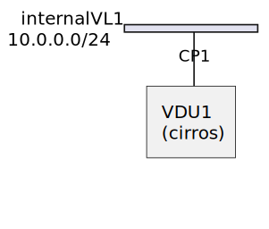

==============================
Getting Started with v2 Tacker
==============================

Summary
-------

This lecture enables you to:

-  create & delete a sample VNF on the OpenStack with Tacker v2 API

Following two types of VNF deployment supported by Tacker are introduced in
this lecture.

- :doc:`/user/v2/vnf/deployment_with_user_data/index`

"VNF Deployment with LCM Operation User Data" is optional.
The part will be clarified with the notation [This is UserData specific part].

The following figure shows a sample VNF used in this lecture.

.. note::

  VIM config, a VNF package, and instantiation parameters files
  used in this tutorial are placed at the repository.

  - `tacker/doc/user/v2/getting_started/conf`_

.. note::

  You can see logs of Tacker with this command:

  .. code-block:: console

    $ sudo journalctl -u devstack@tacker.service
    $ sudo journalctl -u devstack@tacker-conductor.service

Prerequisites
-------------

The following packages should be installed:

* tacker
* python-tackerclient

Configuration
^^^^^^^^^^^^^

Load credentials for client operations
""""""""""""""""""""""""""""""""""""""

Before any Tacker commands can be run, your credentials need to be sourced.

.. note::

  See `Create OpenStack client environment scripts`_ for details.
  In this document, the settings are as follows:

  .. code-block::

    OS_REGION_NAME=RegionOne
    OS_PROJECT_DOMAIN_ID=default
    OS_CACERT=
    OS_AUTH_URL=http://192.168.56.10/identity
    OS_TENANT_NAME=nfv
    OS_USER_DOMAIN_ID=default
    OS_USERNAME=nfv_user
    OS_VOLUME_API_VERSION=3
    OS_AUTH_TYPE=password
    OS_PROJECT_NAME=nfv
    OS_PASSWORD=devstack
    OS_IDENTITY_API_VERSION=3

You can confirm that Tacker is available by checking this command works without
error:

.. code-block:: console

  $ openstack vim list

.. note::

  See :doc:`/cli/index` to find all the available commands.

Register VIM
------------

#. Prepare VIM configuration file:

   You can use a setup script for generating VIM configuration or edit it from
   scratch as described in :doc:`/reference/vim_config`.
   This script finds parameters for the configuration, such as user
   name or password, from your environment variables.
   Here is an example of generating OpenStack VIM configuration as
   ``vim_config.yaml``. In this document, ``TACKER_ROOT`` is the root of
   tacker's repository on your server.

   .. code-block:: console

     $ bash TACKER_ROOT/tools/gen_vim_config.sh -p nfv --os-user nfv_user \
       --os-disable-cert-verify
     Config for OpenStack VIM 'vim_config.yaml' generated.

   There are several options for configuring parameters from command
   line supported. Refer help with ``-h`` for details.

   .. note::

     See :doc:`/reference/vim_config` for tool details.

   You can also use a sample configuration file (vim_config.yaml) instead of
   using the script.

   .. code-block:: console

     $ cp TACKER_ROOT/doc/source/user/v2/getting_started/conf/vim_config.yaml ./
     $ vi vim_config.yaml

   .. literalinclude:: conf/vim_config.yaml
            :language: yaml

#. Register Default VIM:

   Once you setup VIM configuration file, you register default VIM via
   ``openstack`` command with ``--is-default`` option.

   .. code-block:: console

     $ openstack vim register --config-file ./vim_config.yaml \
       --is-default --fit-width openstack-admin-vim
     +----------------+-----------------------------------------------------+
     | Field          | Value                                               |
     +----------------+-----------------------------------------------------+
     | auth_cred      | {                                                   |
     |                |     "username": "nfv_user",                         |
     |                |     "user_domain_name": "default",                  |
     |                |     "cert_verify": "False",                         |
     |                |     "project_id": null,                             |
     |                |     "project_name": "nfv",                          |
     |                |     "project_domain_name": "default",               |
     |                |     "auth_url": "http://192.168.56.10/identity/v3", |
     |                |     "key_type": "barbican_key",                     |
     |                |     "secret_uuid": "***",                           |
     |                |     "password": "***"                               |
     |                | }                                                   |
     | auth_url       | http://192.168.56.10/identity/v3                    |
     | created_at     | 2023-11-30 08:32:48.869451                          |
     | description    |                                                     |
     | extra          |                                                     |
     | id             | bff267c4-6fc9-46b5-be53-15a6a3680033                |
     | is_default     | True                                                |
     | name           | openstack-admin-vim                                 |
     | placement_attr | {                                                   |
     |                |     "regions": [                                    |
     |                |         "RegionOne"                                 |
     |                |     ]                                               |
     |                | }                                                   |
     | project_id     | ebbc6cf1a03d49918c8e408535d87268                    |
     | status         | ACTIVE                                              |
     | type           | openstack                                           |
     | updated_at     | None                                                |
     | vim_project    | {                                                   |
     |                |     "name": "nfv",                                  |
     |                |     "project_domain_name": "default"                |
     |                | }                                                   |
     +----------------+-----------------------------------------------------+

Create and Upload VNF Package
-----------------------------

Prepare VNF Package
^^^^^^^^^^^^^^^^^^^

#. Create VNF Package CSAR directories:

   .. code-block:: console

     $ mkdir -p ./sample_vnf_package_csar/TOSCA-Metadata \
       ./sample_vnf_package_csar/Definitions \
       ./sample_vnf_package_csar/BaseHOT/simple/nested \
       ./sample_vnf_package_csar/Files

   [This is UserData specific part] When using UserData, create the following directories in addition.

   .. code-block:: console

     $ mkdir -p ./sample_vnf_package_csar/UserData

#. Create a ``TOSCA.meta`` file:

   .. code-block:: console

     $ vi ./sample_vnf_package_csar/TOSCA-Metadata/TOSCA.meta

   .. literalinclude:: conf/TOSCA-Metadata/TOSCA.meta
            :language: text

#. Download ETSI definition files:

   You should set ``${TOSCA_VERSION}`` to one of the appropriate TOSCA service
   template versions (`SOL001`_), e.g., ``export TOSCA_VERSION=v2.6.1``.

   .. important::

     You should also check if the version of TOSCA service template is
     supported by tacker.
     See :doc:`/user/vnfd-sol001` for supported version.

   .. code-block:: console

     $ cd ./sample_vnf_package_csar/Definitions
     $ wget https://forge.etsi.org/rep/nfv/SOL001/raw/${TOSCA_VERSION}/etsi_nfv_sol001_common_types.yaml
     $ wget https://forge.etsi.org/rep/nfv/SOL001/raw/${TOSCA_VERSION}/etsi_nfv_sol001_vnfd_types.yaml

#. Create VNFD files:

   - Create ``sample_vnfd_top.yaml``

     .. code-block:: console

       $ vi ./sample_vnfd_top.yaml

     .. literalinclude:: conf/Definitions/sample_vnfd_top.yaml
              :language: yaml

   - Create ``sample_vnfd_types.yaml``

     .. code-block:: console

       $ vi ./sample_vnfd_types.yaml

     .. literalinclude:: conf/Definitions/sample_vnfd_types.yaml
              :language: yaml

     .. note::

       ``description_id`` shall be globally unique, i.e., you cannot create
       multiple VNFDs with the same ``description_id``.

   - Create ``sample_vnfd_df_simple.yaml``

     .. code-block:: console

       $ vi ./sample_vnfd_df_simple.yaml

     .. literalinclude:: conf/Definitions/sample_vnfd_df_simple.yaml
              :language: yaml

     .. note::

       The ``flavour_description`` should be updated by the property in "VNF" but
       Tacker cannot handle it. After the instantiation, the default value in
       ``sample_vnfd_types.yaml`` is always used.

#. Create BaseHOT files:

   .. code-block:: console

     $ cd -
     $ vi ./sample_vnf_package_csar/BaseHOT/simple/sample_lcm_hot.yaml
     $ vi ./sample_vnf_package_csar/BaseHOT/simple/nested/VDU1.yaml

   - sample_lcm_hot.yaml

     .. literalinclude:: conf/BaseHOT/simple/sample_lcm_hot.yaml
              :language: yaml

   - VDU1.yaml

     .. literalinclude:: conf/BaseHOT/simple/nested/VDU1.yaml
              :language: yaml

#. [This is UserData specific part] Create UserData files:

   .. code-block:: console

     $ cd ./sample_vnf_package_csar/UserData/
     $ touch ./__init__.py
     $ vi ./lcm_user_data.py

   .. note::

     See :doc:`/user/userdata_script` for details.
     In this document, the following "StandardUserData" is used.

   .. literalinclude:: ../../../../../tacker/sol_refactored/infra_drivers/openstack/userdata_standard.py
            :language: python

#. Compress the VNF Package CSAR to zip:

   .. code-block:: console

     $ cd -
     $ cd ./sample_vnf_package_csar
     $ zip sample_vnf_package_csar.zip \
       -r TOSCA-Metadata/ Definitions/ BaseHOT/ Files/

   The contents of the zip file should look something like this.

   .. code-block:: console

     $ unzip -Z -1 sample_vnf_package_csar.zip
     TOSCA-Metadata/
     TOSCA-Metadata/TOSCA.meta
     Definitions/
     Definitions/sample_vnfd_types.yaml
     Definitions/etsi_nfv_sol001_vnfd_types.yaml
     Definitions/etsi_nfv_sol001_common_types.yaml
     Definitions/sample_vnfd_df_simple.yaml
     Definitions/sample_vnfd_top.yaml
     BaseHOT/
     BaseHOT/simple/
     BaseHOT/simple/nested/
     BaseHOT/simple/nested/VDU1.yaml
     BaseHOT/simple/sample_lcm_hot.yaml
     Files/

   - [This is UserData specific part] When using UserData, add ``UserData`` directories.

     .. code-block:: console

       $ zip sample_vnf_package_csar.zip -r UserData/

     The contents of the zip file should look something like this.

     .. code-block:: console

       $ unzip -Z -1 sample_vnf_package_csar.zip
       TOSCA-Metadata/
       TOSCA-Metadata/TOSCA.meta
       Definitions/
       Definitions/sample_vnfd_types.yaml
       Definitions/etsi_nfv_sol001_vnfd_types.yaml
       Definitions/etsi_nfv_sol001_common_types.yaml
       Definitions/sample_vnfd_df_simple.yaml
       Definitions/sample_vnfd_top.yaml
       BaseHOT/
       BaseHOT/simple/
       BaseHOT/simple/nested/
       BaseHOT/simple/nested/VDU1.yaml
       BaseHOT/simple/sample_lcm_hot.yaml
       Files/
       UserData/
       UserData/__init__.py
       UserData/lcm_user_data.py

   Here, you can find the structure of the sample VNF Package CSAR as a
   zip file.

Create VNF Package
^^^^^^^^^^^^^^^^^^

#. Execute vnfpkgm create:

   Take a note of "VNF Package ID" as it will be used in the next step.

   .. code-block:: console

     $ cd -
     $ openstack vnf package create
     +-------------------+-------------------------------------------------------------------------------------------------+
     | Field             | Value                                                                                           |
     +-------------------+-------------------------------------------------------------------------------------------------+
     | ID                | 6e6b7a6d-0ebe-4085-96c2-b34269d837f9                                                            |
     | Links             | {                                                                                               |
     |                   |     "self": {                                                                                   |
     |                   |         "href": "/vnfpkgm/v1/vnf_packages/6e6b7a6d-0ebe-4085-96c2-b34269d837f9"                 |
     |                   |     },                                                                                          |
     |                   |     "packageContent": {                                                                         |
     |                   |         "href": "/vnfpkgm/v1/vnf_packages/6e6b7a6d-0ebe-4085-96c2-b34269d837f9/package_content" |
     |                   |     }                                                                                           |
     |                   | }                                                                                               |
     | Onboarding State  | CREATED                                                                                         |
     | Operational State | DISABLED                                                                                        |
     | Usage State       | NOT_IN_USE                                                                                      |
     | User Defined Data | {}                                                                                              |
     +-------------------+-------------------------------------------------------------------------------------------------+

Upload VNF Package
^^^^^^^^^^^^^^^^^^

#. Execute vnfpkgm upload:

   The "VNF Package ID" ``6e6b7a6d-0ebe-4085-96c2-b34269d837f9`` needs to be
   replaced with the appropriate one that was obtained from `Create VNF
   Package`.

   .. code-block:: console

     $ openstack vnf package upload \
       --path ./sample_vnf_package_csar/sample_vnf_package_csar.zip \
       6e6b7a6d-0ebe-4085-96c2-b34269d837f9
     Upload request for VNF package 6e6b7a6d-0ebe-4085-96c2-b34269d837f9 has been accepted.

Check the created VNF Package
^^^^^^^^^^^^^^^^^^^^^^^^^^^^^

#. Confirm the "Onboarding State" to be ``ONBOARDED``:

   .. code-block:: console

     $ openstack vnf package list
     +--------------------------------------+------------------+------------------+-------------+-------------------+-------------------------------------------------------------------------------------------------+
     | Id                                   | Vnf Product Name | Onboarding State | Usage State | Operational State | Links                                                                                           |
     +--------------------------------------+------------------+------------------+-------------+-------------------+-------------------------------------------------------------------------------------------------+
     | 6e6b7a6d-0ebe-4085-96c2-b34269d837f9 | Sample VNF       | ONBOARDED        | NOT_IN_USE  | ENABLED           | {                                                                                               |
     |                                      |                  |                  |             |                   |     "self": {                                                                                   |
     |                                      |                  |                  |             |                   |         "href": "/vnfpkgm/v1/vnf_packages/6e6b7a6d-0ebe-4085-96c2-b34269d837f9"                 |
     |                                      |                  |                  |             |                   |     },                                                                                          |
     |                                      |                  |                  |             |                   |     "packageContent": {                                                                         |
     |                                      |                  |                  |             |                   |         "href": "/vnfpkgm/v1/vnf_packages/6e6b7a6d-0ebe-4085-96c2-b34269d837f9/package_content" |
     |                                      |                  |                  |             |                   |     }                                                                                           |
     |                                      |                  |                  |             |                   | }                                                                                               |
     +--------------------------------------+------------------+------------------+-------------+-------------------+-------------------------------------------------------------------------------------------------+

Create & Instantiate VNF
------------------------

Create VNF
^^^^^^^^^^

#. Find "VNFD ID" to create VNF:

   The "VNFD ID" can be found to be ``b1bb0ce7-ebca-4fa7-95ed-4840d70a1177`` in
   the example.

   .. code-block:: console

     $ openstack vnf package show \
       6e6b7a6d-0ebe-4085-96c2-b34269d837f9 -c 'VNFD ID'
     +---------+--------------------------------------+
     | Field   | Value                                |
     +---------+--------------------------------------+
     | VNFD ID | b1bb0ce7-ebca-4fa7-95ed-4840d70a1177 |
     +---------+--------------------------------------+

#. Create VNF:

   The "VNFD ID" ``b1bb0ce7-ebca-4fa7-95ed-4840d70a1177`` needs to be replaced
   with the appropriate one.

   .. code-block:: console

     $ openstack vnflcm create b1bb0ce7-ebca-4fa7-95ed-4840d70a1177 \
       --os-tacker-api-version 2
     +-----------------------------+------------------------------------------------------------------------------------------------------------------+
     | Field                       | Value                                                                                                            |
     +-----------------------------+------------------------------------------------------------------------------------------------------------------+
     | ID                          | c98b05c7-bc96-43f8-a688-4d8079ffa3bf                                                                             |
     | Instantiation State         | NOT_INSTANTIATED                                                                                                 |
     | Links                       | {                                                                                                                |
     |                             |     "self": {                                                                                                    |
     |                             |         "href": "http://127.0.0.1:9890/vnflcm/v2/vnf_instances/c98b05c7-bc96-43f8-a688-4d8079ffa3bf"             |
     |                             |     },                                                                                                           |
     |                             |     "instantiate": {                                                                                             |
     |                             |         "href": "http://127.0.0.1:9890/vnflcm/v2/vnf_instances/c98b05c7-bc96-43f8-a688-4d8079ffa3bf/instantiate" |
     |                             |     }                                                                                                            |
     |                             | }                                                                                                                |
     | VNF Configurable Properties |                                                                                                                  |
     | VNF Instance Description    |                                                                                                                  |
     | VNF Instance Name           |                                                                                                                  |
     | VNF Product Name            | Sample VNF                                                                                                       |
     | VNF Provider                | Company                                                                                                          |
     | VNF Software Version        | 1.0                                                                                                              |
     | VNFD ID                     | b1bb0ce7-ebca-4fa7-95ed-4840d70a1177                                                                             |
     | VNFD Version                | 1.0                                                                                                              |
     +-----------------------------+------------------------------------------------------------------------------------------------------------------+

Instantiate VNF
^^^^^^^^^^^^^^^

#. Create ``<param-file>``:

   Required parameter:

   - flavourID

   Optional parameters:

   - instantiationLevelId
   - extVirtualLinks
   - extManagedVirtualLinks
   - vimConnectionInfo
   - localizationLanguage
   - additionalParams
   - extensions
   - vnfConfigurableProperties

   .. note::

     You can skip ``vimConnectionInfo`` only when you have the default VIM.

   A sample ``<param-file>`` named as ``sample_request.json`` with
   minimal parameter:

   .. code-block:: console

     $ vi ./sample_request.json

   .. literalinclude:: conf/sample_request.json
            :language: json

   - [This is UserData specific part] When using UserData, use the following parameters instead.

     .. literalinclude:: conf/sample_request_for_userdata.json
              :language: json

     .. note::

       ``userdata_standard.py`` should be replaced with the UserData file name.
       And ``StandardUserData`` should be replaced with the UserData class name.

#. Instantiate VNF:

   The "ID of vnf instance" and "path to <param-file>" are needed to
   instantiate vnf.

   .. code-block:: console

     $ openstack vnflcm instantiate c98b05c7-bc96-43f8-a688-4d8079ffa3bf \
       ./sample_request.json --os-tacker-api-version 2
     Instantiate request for VNF Instance c98b05c7-bc96-43f8-a688-4d8079ffa3bf has been accepted.

   Check the details of the instantiated vnf.

   .. code-block:: console

     $ openstack vnflcm list --os-tacker-api-version 2
     +--------------------------------------+-------------------+---------------------+--------------+----------------------+------------------+--------------------------------------+
     | ID                                   | VNF Instance Name | Instantiation State | VNF Provider | VNF Software Version | VNF Product Name | VNFD ID                              |
     +--------------------------------------+-------------------+---------------------+--------------+----------------------+------------------+--------------------------------------+
     | c98b05c7-bc96-43f8-a688-4d8079ffa3bf |                   | INSTANTIATED        | Company      | 1.0                  | Sample VNF       | b1bb0ce7-ebca-4fa7-95ed-4840d70a1177 |
     +--------------------------------------+-------------------+---------------------+--------------+----------------------+------------------+--------------------------------------+

     $ openstack vnflcm show c98b05c7-bc96-43f8-a688-4d8079ffa3bf \
      --fit-width --os-tacker-api-version 2
     +-----------------------------+--------------------------------------------------------------------------------------------------------------------------------+
     | Field                       | Value                                                                                                                          |
     +-----------------------------+--------------------------------------------------------------------------------------------------------------------------------+
     | ID                          | c98b05c7-bc96-43f8-a688-4d8079ffa3bf                                                                                           |
     | Instantiated Vnf Info       | {                                                                                                                              |
     |                             |     "flavourId": "simple",                                                                                                     |
     |                             |     "vnfState": "STARTED",                                                                                                     |
     |                             |     "scaleStatus": [                                                                                                           |
     |                             |         {                                                                                                                      |
     |                             |             "aspectId": "VDU1_scale",                                                                                          |
     |                             |             "scaleLevel": 0                                                                                                    |
     |                             |         }                                                                                                                      |
     |                             |     ],                                                                                                                         |
     |                             |     "maxScaleLevels": [                                                                                                        |
     |                             |         {                                                                                                                      |
     |                             |             "aspectId": "VDU1_scale",                                                                                          |
     |                             |             "scaleLevel": 2                                                                                                    |
     |                             |         }                                                                                                                      |
     |                             |     ],                                                                                                                         |
     |                             |     "vnfcResourceInfo": [                                                                                                      |
     |                             |         {                                                                                                                      |
     |                             |             "id": "6d01be26-f2be-421d-8c87-a4aa9d39300e",                                                                      |
     |                             |             "vduId": "VDU1",                                                                                                   |
     |                             |             "computeResource": {                                                                                               |
     |                             |                 "vimConnectionId": "bff267c4-6fc9-46b5-be53-15a6a3680033",                                                     |
     |                             |                 "resourceId": "6d01be26-f2be-421d-8c87-a4aa9d39300e",                                                          |
     |                             |                 "vimLevelResourceType": "OS::Nova::Server"                                                                     |
     |                             |             },                                                                                                                 |
     |                             |             "vnfcCpInfo": [                                                                                                    |
     |                             |                 {                                                                                                              |
     |                             |                     "id": "CP1-6d01be26-f2be-421d-8c87-a4aa9d39300e",                                                          |
     |                             |                     "cpdId": "CP1"                                                                                             |
     |                             |                 }                                                                                                              |
     |                             |             ],                                                                                                                 |
     |                             |             "metadata": {                                                                                                      |
     |                             |                 "creation_time": "2023-12-01T06:57:11Z",                                                                       |
     |                             |                 "stack_id": "vnf-c98b05c7-bc96-43f8-a688-4d8079ffa3bf-VDU1-6523jolwu66g/09019137-3b71-426e-8726-8572657999b2", |
     |                             |                 "vdu_idx": null,                                                                                               |
     |                             |                 "flavor": "m1.tiny",                                                                                           |
     |                             |                 "image-VDU1": "cirros-0.5.2-x86_64-disk"                                                                       |
     |                             |             }                                                                                                                  |
     |                             |         }                                                                                                                      |
     |                             |     ],                                                                                                                         |
     |                             |     "vnfVirtualLinkResourceInfo": [                                                                                            |
     |                             |         {                                                                                                                      |
     |                             |             "id": "ffa3b9cf-5135-4dc6-a7a1-dd1912d72363",                                                                      |
     |                             |             "vnfVirtualLinkDescId": "internalVL1",                                                                             |
     |                             |             "networkResource": {                                                                                               |
     |                             |                 "vimConnectionId": "bff267c4-6fc9-46b5-be53-15a6a3680033",                                                     |
     |                             |                 "resourceId": "ffa3b9cf-5135-4dc6-a7a1-dd1912d72363",                                                          |
     |                             |                 "vimLevelResourceType": "OS::Neutron::Net"                                                                     |
     |                             |             }                                                                                                                  |
     |                             |         }                                                                                                                      |
     |                             |     ],                                                                                                                         |
     |                             |     "vnfcInfo": [                                                                                                              |
     |                             |         {                                                                                                                      |
     |                             |             "id": "VDU1-6d01be26-f2be-421d-8c87-a4aa9d39300e",                                                                 |
     |                             |             "vduId": "VDU1",                                                                                                   |
     |                             |             "vnfcResourceInfoId": "6d01be26-f2be-421d-8c87-a4aa9d39300e",                                                      |
     |                             |             "vnfcState": "STARTED"                                                                                             |
     |                             |         }                                                                                                                      |
     |                             |     ],                                                                                                                         |
     |                             |     "metadata": {                                                                                                              |
     |                             |         "stack_id": "0b1b274c-a493-4a2c-994f-ee8569ff111c",                                                                    |
     |                             |         "nfv": {                                                                                                               |
     |                             |             "VDU": {                                                                                                           |
     |                             |                 "VDU1": {                                                                                                      |
     |                             |                     "computeFlavourId": "m1.tiny",                                                                             |
     |                             |                     "vcImageId": "cirros-0.5.2-x86_64-disk"                                                                    |
     |                             |                 }                                                                                                              |
     |                             |             }                                                                                                                  |
     |                             |         },                                                                                                                     |
     |                             |         "tenant": "nfv"                                                                                                        |
     |                             |     }                                                                                                                          |
     |                             | }                                                                                                                              |
     | Instantiation State         | INSTANTIATED                                                                                                                   |
     | Links                       | {                                                                                                                              |
     |                             |     "self": {                                                                                                                  |
     |                             |         "href": "http://127.0.0.1:9890/vnflcm/v2/vnf_instances/c98b05c7-bc96-43f8-a688-4d8079ffa3bf"                           |
     |                             |     },                                                                                                                         |
     |                             |     "terminate": {                                                                                                             |
     |                             |         "href": "http://127.0.0.1:9890/vnflcm/v2/vnf_instances/c98b05c7-bc96-43f8-a688-4d8079ffa3bf/terminate"                 |
     |                             |     },                                                                                                                         |
     |                             |     "scale": {                                                                                                                 |
     |                             |         "href": "http://127.0.0.1:9890/vnflcm/v2/vnf_instances/c98b05c7-bc96-43f8-a688-4d8079ffa3bf/scale"                     |
     |                             |     },                                                                                                                         |
     |                             |     "heal": {                                                                                                                  |
     |                             |         "href": "http://127.0.0.1:9890/vnflcm/v2/vnf_instances/c98b05c7-bc96-43f8-a688-4d8079ffa3bf/heal"                      |
     |                             |     },                                                                                                                         |
     |                             |     "changeExtConn": {                                                                                                         |
     |                             |         "href": "http://127.0.0.1:9890/vnflcm/v2/vnf_instances/c98b05c7-bc96-43f8-a688-4d8079ffa3bf/change_ext_conn"           |
     |                             |     }                                                                                                                          |
     |                             | }                                                                                                                              |
     | VIM Connection Info         | {                                                                                                                              |
     |                             |     "default": {                                                                                                               |
     |                             |         "vimId": "bff267c4-6fc9-46b5-be53-15a6a3680033",                                                                       |
     |                             |         "vimType": "ETSINFV.OPENSTACK_KEYSTONE.V_3",                                                                           |
     |                             |         "interfaceInfo": {                                                                                                     |
     |                             |             "endpoint": "http://192.168.56.10/identity/v3",                                                                    |
     |                             |             "skipCertificateHostnameCheck": true,                                                                              |
     |                             |             "skipCertificateVerification": true                                                                                |
     |                             |         },                                                                                                                     |
     |                             |         "accessInfo": {                                                                                                        |
     |                             |             "username": "nfv_user",                                                                                            |
     |                             |             "region": "RegionOne",                                                                                             |
     |                             |             "project": "nfv",                                                                                                  |
     |                             |             "projectDomain": "default",                                                                                        |
     |                             |             "userDomain": "default"                                                                                            |
     |                             |         },                                                                                                                     |
     |                             |         "extra": {}                                                                                                            |
     |                             |     }                                                                                                                          |
     |                             | }                                                                                                                              |
     | VNF Configurable Properties |                                                                                                                                |
     | VNF Instance Description    |                                                                                                                                |
     | VNF Instance Name           |                                                                                                                                |
     | VNF Product Name            | Sample VNF                                                                                                                     |
     | VNF Provider                | Company                                                                                                                        |
     | VNF Software Version        | 1.0                                                                                                                            |
     | VNFD ID                     | b1bb0ce7-ebca-4fa7-95ed-4840d70a1177                                                                                           |
     | VNFD Version                | 1.0                                                                                                                            |
     +-----------------------------+--------------------------------------------------------------------------------------------------------------------------------+

Terminate & Delete VNF
----------------------

Terminate VNF
^^^^^^^^^^^^^

#. Check the VNF Instance ID to terminate:

   .. code-block:: console

     $ openstack vnflcm list --os-tacker-api-version 2
     +--------------------------------------+-------------------+---------------------+--------------+----------------------+------------------+--------------------------------------+
     | ID                                   | VNF Instance Name | Instantiation State | VNF Provider | VNF Software Version | VNF Product Name | VNFD ID                              |
     +--------------------------------------+-------------------+---------------------+--------------+----------------------+------------------+--------------------------------------+
     | c98b05c7-bc96-43f8-a688-4d8079ffa3bf |                   | INSTANTIATED        | Company      | 1.0                  | Sample VNF       | b1bb0ce7-ebca-4fa7-95ed-4840d70a1177 |
     +--------------------------------------+-------------------+---------------------+--------------+----------------------+------------------+--------------------------------------+

#. Terminate VNF Instance:

   Execute terminate command:

   .. code-block:: console

     $ openstack vnflcm terminate c98b05c7-bc96-43f8-a688-4d8079ffa3bf --os-tacker-api-version 2
     Terminate request for VNF Instance 'c98b05c7-bc96-43f8-a688-4d8079ffa3bf' has been accepted.

   Check the status of VNF Instance:

   .. code-block:: console

     $ openstack vnflcm list --os-tacker-api-version 2
     +--------------------------------------+-------------------+---------------------+--------------+----------------------+------------------+--------------------------------------+
     | ID                                   | VNF Instance Name | Instantiation State | VNF Provider | VNF Software Version | VNF Product Name | VNFD ID                              |
     +--------------------------------------+-------------------+---------------------+--------------+----------------------+------------------+--------------------------------------+
     | c98b05c7-bc96-43f8-a688-4d8079ffa3bf |                   | NOT_INSTANTIATED    | Company      | 1.0                  | Sample VNF       | b1bb0ce7-ebca-4fa7-95ed-4840d70a1177 |
     +--------------------------------------+-------------------+---------------------+--------------+----------------------+------------------+--------------------------------------+

Delete VNF
^^^^^^^^^^

#. Delete VNF Instance:

   .. code-block:: console

     $ openstack vnflcm delete c98b05c7-bc96-43f8-a688-4d8079ffa3bf
     Vnf instance 'c98b05c7-bc96-43f8-a688-4d8079ffa3bf' is deleted successfully

Delete VNF Package
------------------

#. Delete VNF Package:

   Check the VNF Package ID to delete:

   .. code-block:: console

     $ openstack vnf package list
     +--------------------------------------+------------------+------------------+-------------+-------------------+-------------------------------------------------------------------------------------------------+
     | Id                                   | Vnf Product Name | Onboarding State | Usage State | Operational State | Links                                                                                           |
     +--------------------------------------+------------------+------------------+-------------+-------------------+-------------------------------------------------------------------------------------------------+
     | 6e6b7a6d-0ebe-4085-96c2-b34269d837f9 | Sample VNF       | ONBOARDED        | NOT_IN_USE  | ENABLED           | {                                                                                               |
     |                                      |                  |                  |             |                   |     "self": {                                                                                   |
     |                                      |                  |                  |             |                   |         "href": "/vnfpkgm/v1/vnf_packages/6e6b7a6d-0ebe-4085-96c2-b34269d837f9"                 |
     |                                      |                  |                  |             |                   |     },                                                                                          |
     |                                      |                  |                  |             |                   |     "packageContent": {                                                                         |
     |                                      |                  |                  |             |                   |         "href": "/vnfpkgm/v1/vnf_packages/6e6b7a6d-0ebe-4085-96c2-b34269d837f9/package_content" |
     |                                      |                  |                  |             |                   |     }                                                                                           |
     |                                      |                  |                  |             |                   | }                                                                                               |
     +--------------------------------------+------------------+------------------+-------------+-------------------+-------------------------------------------------------------------------------------------------+

   Update the Operational State to ``DISABLED``:

   .. code-block:: console

     $ openstack vnf package update --operational-state 'DISABLED' \
       6e6b7a6d-0ebe-4085-96c2-b34269d837f9
     +-------------------+----------+
     | Field             | Value    |
     +-------------------+----------+
     | Operational State | DISABLED |
     +-------------------+----------+

   Check the Operational State to be changed:

   .. code-block:: console

     $ openstack vnf package list
     +--------------------------------------+------------------+------------------+-------------+-------------------+-------------------------------------------------------------------------------------------------+
     | Id                                   | Vnf Product Name | Onboarding State | Usage State | Operational State | Links                                                                                           |
     +--------------------------------------+------------------+------------------+-------------+-------------------+-------------------------------------------------------------------------------------------------+
     | 6e6b7a6d-0ebe-4085-96c2-b34269d837f9 | Sample VNF       | ONBOARDED        | NOT_IN_USE  | DISABLED          | {                                                                                               |
     |                                      |                  |                  |             |                   |     "self": {                                                                                   |
     |                                      |                  |                  |             |                   |         "href": "/vnfpkgm/v1/vnf_packages/6e6b7a6d-0ebe-4085-96c2-b34269d837f9"                 |
     |                                      |                  |                  |             |                   |     },                                                                                          |
     |                                      |                  |                  |             |                   |     "packageContent": {                                                                         |
     |                                      |                  |                  |             |                   |         "href": "/vnfpkgm/v1/vnf_packages/6e6b7a6d-0ebe-4085-96c2-b34269d837f9/package_content" |
     |                                      |                  |                  |             |                   |     }                                                                                           |
     |                                      |                  |                  |             |                   | }                                                                                               |
     +--------------------------------------+------------------+------------------+-------------+-------------------+-------------------------------------------------------------------------------------------------+

   Delete the VNF Package:

   .. code-block:: console

     $ openstack vnf package delete 6e6b7a6d-0ebe-4085-96c2-b34269d837f9
     All specified vnf-package(s) deleted successfully

.. _tacker/doc/user/v2/getting_started/conf:
  https://opendev.org/openstack/tacker/src/branch/master/doc/user/v2/getting_started/conf
.. _Create OpenStack client environment scripts: https://docs.openstack.org/keystone/latest/install/keystone-openrc-rdo.html
.. _SOL001: https://forge.etsi.org/rep/nfv/SOL001
