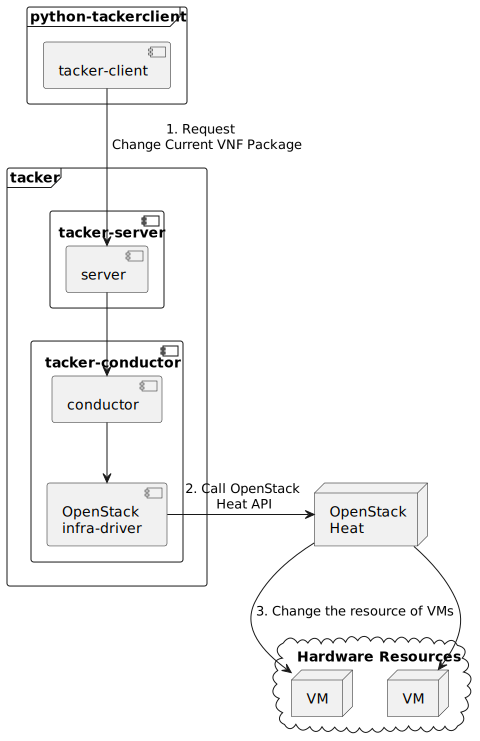

===========================================
ETSI NFV-SOL VNF Change Current VNF Package
===========================================

This document describes how to change current VNF package for VNF
in Tacker v2 API.

Overview
--------

The diagram below shows an overview of changing current VNF package.

1. Request Change Current VNF Package

   A user requests tacker-server to change current VNF package for VNF instance
   with tacker-client by requesting ``change current vnf package``.

2. Call OpenStack Heat API

   Upon receiving a request from tacker-client, tacker-server redirects it to
   tacker-conductor. In tacker-conductor, the request is redirected again to
   an appropriate infra-driver (in this case OpenStack infra-driver) according
   to the contents of VNF instance. Then, OpenStack infra-driver calls
   OpenStack Heat APIs.

3. Change the image of VMs

   OpenStack Heat change the image of VMs according to the API calls.

Prerequisites
-------------

The following packages should be installed:

* tacker
* python-tackerclient

At least one VNF instance with status of ``INSTANTIATED`` is required.
You can refer to :doc:`/user/v2/vnf/deployment_with_user_data/index` for
the procedure to instantiate VNF.

You can refer to :doc:`/user/vnf-package` for the operation of uploading
VNF package.

.. note::

  You can deploy a VM directly by image or volume.
  Therefore, when updating the
  image of the VM, there will be two cases.

  Use the common VNF package and the flavor_id to instantiate,
  and then use the VNF package in the corresponding link to
  execute ``change current vnf package`` operation,
  you can update the image of the VM in the following two ways.

  1. change VM created by image to VM created by new image

  2. change VM created by volume to VM created by new volume

Change Current VNF Package
--------------------------

As mentioned in Prerequisites, the VNF must be created
before performing change current VNF package.

You need to upload the VNF package you want to change to before
executing change current vnf package.

Details of CLI commands are described in
:doc:`/cli/cli-etsi-vnflcm`.

For changing current VNF package, you need to prepare a JSON-formatted
definition file before running command for changing the VNF package.

``sample_param_file.json:``

.. code-block:: json

  {
    "vnfdId": "50656e7a-9726-414c-87e7-bfdabca8d761",
    "additionalParams": {
      "upgrade_type": "RollingUpdate",
      "lcm-operation-coordinate-old-vnf": "./Scripts/coordinate_old_vnf.py",
      "lcm-operation-coordinate-new-vnf": "./Scripts/coordinate_new_vnf.py",
      "vdu_params": [
        {
          "vdu_id": "VDU1",
          "old_vnfc_param": {
            "cp_name": "VDU1_CP1",
            "username": "ubuntu",
            "password": "ubuntu"
          },
          "new_vnfc_param": {
            "cp_name": "VDU1_CP1",
            "username": "ubuntu",
            "password": "ubuntu"
          }
        },
        {
          "vdu_id": "VDU2",
          "old_vnfc_param": {
            "cp_name": "VDU2_CP1",
            "username": "ubuntu",
            "password": "ubuntu"
          },
          "new_vnfc_param": {
            "cp_name": "VDU2_CP1",
            "username": "ubuntu",
            "password": "ubuntu"
          }
        }
      ]
    },
    "extVirtualLinks": [
      {
        "id": "988e3a9d-f9fe-40fa-9850-ce578a1005d5",
        "resourceId": "0cefe3d4-6729-41c5-bd39-277fd9ece3d3",
        "extCps": [
          {
            "cpdId": "VDU1_CP1",
            "cpConfig": {
              "VDU1_CP1_1": {
                "cpProtocolData": [
                  {
                    "layerProtocol": "IP_OVER_ETHERNET",
                    "ipOverEthernet": {
                      "ipAddresses": [
                        {
                          "type": "IPV4",
                          "numDynamicAddresses": 1
                        }
                      ]
                    }
                  }
                ]
              }
            }
          }
        ]
      }
    ]
  }

You can set following parameter in additionalParams:

.. list-table:: additionalParams
  :widths: 15 10 30
  :header-rows: 1

  * - Attribute name
    - Cardinality
    - Parameter description
  * - upgrade_type
    - 1
    - Type of file update operation method. Specify Blue-Green or
      Rolling update.
  * - lcm-operation-coordinate-old-vnf
    - 0..1
    - The file path of the script that simulates the behavior of
      CoordinateVNF for old VNF.
  * - lcm-operation-coordinate-new-vnf
    - 0..1
    - The file path of the script that simulates the behavior of
      CoordinateVNF for new VNF.
  * - vdu_params
    - 1..N
    - VDU information of target VDU to update.
  * - > vdu_id
    - 1
    - VDU name of target VDU to update.
  * - > old_vnfc_param
    - 0..1
    - Old VNFC connection information. Required for ssh connection in
      CoordinateVNF operation for application configuration to VNFC.
  * - >> cp_name
    - 1
    - Connection point name of old VNFC to update.
  * - >> username
    - 1
    - User name of old VNFC to update.
  * - >> password
    - 1
    - Password of old VNFC to update.
  * - > new_vnfc_param
    - 0..1
    - New VNFC connection information. Required for ssh connection in
      CoordinateVNF operation for application configuration to VNFC.
  * - >> cp_name
    - 1
    - Connection point name of new VNFC to update.
  * - >> username
    - 1
    - User name of new VNFC to update.
  * - >> password
    - 1
    - Password of new VNFC to update.
  * - external_lb_param
    - 0..1
    - Load balancer information that requires configuration changes.
      Required only for the Blue-Green deployment process of OpenStack
      VIM.
  * - > ip_address
    - 1
    - IP address of load balancer server.
  * - > username
    - 1
    - User name of load balancer server.
  * - > password
    - 1
    - Password of load balancer server.
  * - lcm-operation-user-data
    - 0..1
    - File name of UserData to use.
  * - lcm-operation-user-data-class
    - 0..1
    - Class name of UserData to use.

.. note::

  ``sample_param_file.json`` can be used to change image for both VDU
  created by ``OS::Heat::AutoScalingGroup`` and single VDU.

  * ``vnfdId`` is the VNFD id of the new VNF package you uploaded.
  * ``lcm-operation-coordinate-old-vnf`` and
    ``lcm-operation-coordinate-new-vnf`` are unique implementations of Tacker
    to simulate the coordination interface in `ETSI SOL002 v3.5.1`_. Mainly a
    script that can communicate with the VM after the VM is created, perform
    special customization of the VM or confirm the status of the VM.
  * ``vimConnectionInfo`` is an optional parameter.
    This operation can specify the ``vimConnectionInfo`` for
    the VNF instance.
    Even if this operation specify multiple ``vimConnectionInfo``
    associated with one VNF instance, only one of them will be used
    for life cycle management operations.
    It is not possible to delete the key of registered ``vimConnectionInfo``.
  * ``vnfConfigurableProperties`` and ``extensions`` are optional
    parameter.
    As with the update operation, these values are updated by performing
    JSON Merge Patch with the values set in the request parameter to the
    current values.
    For ``metadata``, the value set before this operation is maintained.
  * ``extVirtualLinks`` is an optional parameter.
    This operation can change external CP for the the VNF instance.

.. note::

  Currently, this operation only supports some functions of
  ``Change Current VNF Package``.

  * There are several ways to update VDUs, but Bobcat version Tacker only
    supports ``RollingUpdate`` type. You can set it via ``upgrade_type``
    param.

  * Currently only support update images of VMs and modify external networks.

  * Currently unsupported updates:

    * This API currently does not support increasing or decreasing the number
      of VNFcs according to the VNF package.
    * The add and delete operations of the entire VDU are not supported.
    * In the definition of ETSI, external and internal networks
      (e.g. extVirtualLinks, extManagedVirtualLinks) can be modified.
      This current API supports the operations of modifying external
      networks only and does not support the following operations.

      * Adding and deleting external networks.
      * Modifying, adding, and deleting internal networks.

How to Change VM created by image to VM created by new image
~~~~~~~~~~~~~~~~~~~~~~~~~~~~~~~~~~~~~~~~~~~~~~~~~~~~~~~~~~~~

Execute Change Current VNF Package CLI command. After complete this change
operation you should check resource status by Heat CLI commands.

1. check 'ID' and 'Stack Status' of the stack before and after operation.
This is to confirm that stack 'ID' has changed before and after operation,
and that the Stack update has been updated successfully.

2. check 'physical_resource_id' and 'resource_status' of the VDU and VDU's
parent resource. This is to confirm that 'physical_resource_id' has no change
before and after operation, and that the resource_status has been updated
successfully.

3. check 'image' information of VDU before and after operation. This is to
confirm that VDU's has changed successfully.
See `Heat CLI reference`_. for details on Heat CLI commands.

.. note::

  Both single VM and VM created by ``OS::Heat::AutoScalingGroup`` support
  change from image to image.
  The single VM is created directly by ``OS::Nova::Server`` defined in the
  top heat template.

* Check point 1 before operation

  Stack information before operation:

  .. code-block:: console

    $ openstack stack list -c 'ID' -c 'Stack Name' -c 'Stack Status'

  Result:

  .. code-block:: console

    +--------------------------------------+------------------------------------------+-----------------+
    | ID                                   | Stack Name                               | Stack Status    |
    +--------------------------------------+------------------------------------------+-----------------+
    | e7067b0c-1b48-4ca7-a8e2-92ffcbc553f1 | vnf-1eaf3446-00ed-4a19-869c-1ce9650c8ace | CREATE_COMPLETE |
    +--------------------------------------+------------------------------------------+-----------------+

* Check point 2 before operation

  Stack resource information before operation:

  .. code-block:: console

    $ openstack stack resource list e7067b0c-1b48-4ca7-a8e2-92ffcbc553f1

  Result:

  .. code-block:: console

    +---------------+--------------------------------------+----------------------------+-----------------+----------------------+
    | resource_name | physical_resource_id                 | resource_type              | resource_status | updated_time         |
    +---------------+--------------------------------------+----------------------------+-----------------+----------------------+
    | VDU1_scale    | 03afe647-8f93-42ec-a443-953b550c3b3e | OS::Heat::AutoScalingGroup | CREATE_COMPLETE | 2024-03-07T08:38:19Z |
    | VDU2          | 3feac610-44aa-4c8f-8aa7-1ea2e24e2076 | OS::Nova::Server           | CREATE_COMPLETE | 2024-03-07T08:38:19Z |
    | VDU2_CP1      | d0c460e6-7277-4787-8a90-65bd82a6c663 | OS::Neutron::Port          | CREATE_COMPLETE | 2024-03-07T08:38:19Z |
    +---------------+--------------------------------------+----------------------------+-----------------+----------------------+

  VDU(created by ``OS::Heat::AutoScalingGroup``)'s parent information
  before operation:

  .. code-block:: console

    $ openstack stack resource list 03afe647-8f93-42ec-a443-953b550c3b3e

  Result:

  .. code-block:: console

    +---------------+--------------------------------------+---------------------------+-----------------+----------------------+
    | resource_name | physical_resource_id                 | resource_type             | resource_status | updated_time         |
    +---------------+--------------------------------------+---------------------------+-----------------+----------------------+
    | bipqh2pbsnhf  | 443d6bec-c8af-46bf-8619-46037f4fbfe7 | base_hot_nested_VDU1.yaml | CREATE_COMPLETE | 2024-03-07T08:38:20Z |
    +---------------+--------------------------------------+---------------------------+-----------------+----------------------+

  VDU(created by ``OS::Heat::AutoScalingGroup``) information before operation:

  .. code-block:: console

    $ openstack stack resource list 443d6bec-c8af-46bf-8619-46037f4fbfe7

  Result:

  .. code-block:: console

    +---------------+--------------------------------------+-------------------+-----------------+----------------------+
    | resource_name | physical_resource_id                 | resource_type     | resource_status | updated_time         |
    +---------------+--------------------------------------+-------------------+-----------------+----------------------+
    | VDU1          | 8d0c4585-8bac-4fe4-bbff-48586432b671 | OS::Nova::Server  | CREATE_COMPLETE | 2024-03-07T08:38:20Z |
    | VDU1_CP1      | 91f4b13d-7eb0-4a32-9d5e-7d5bff865330 | OS::Neutron::Port | CREATE_COMPLETE | 2024-03-07T08:38:20Z |
    +---------------+--------------------------------------+-------------------+-----------------+----------------------+

* Check point 3 before operation

  VDU(created by ``OS::Heat::AutoScalingGroup``) detailed information before
  operation:

  .. code-block:: console

    $ openstack stack resource show 443d6bec-c8af-46bf-8619-46037f4fbfe7 \
      VDU1 -f json | jq .attributes.image.id

  Result:

  .. code-block:: console

    "fc0f50c7-2e46-4f87-8498-203e0b37f03c"

  VDU(single) detailed information before operation:

  .. code-block:: console

    $ openstack stack resource show e7067b0c-1b48-4ca7-a8e2-92ffcbc553f1 \
      VDU2 -f json | jq .attributes.image.id

  Result:

  .. code-block:: console

    "fc0f50c7-2e46-4f87-8498-203e0b37f03c"

* Execute Change Current VNF Package

  Change Current VNF Package execution of the entire VNF:

  .. code-block:: console

    $ openstack vnflcm change-vnfpkg VNF_INSTANCE_ID \
      ./sample_param_file.json --os-tacker-api-version 2

  Result:

  .. code-block:: console

    Change Current VNF Package for VNF Instance 1eaf3446-00ed-4a19-869c-1ce9650c8ace has been accepted.

* Check point 1 after operation

  Stack information after operation:

  .. code-block:: console

    $ openstack stack list -c 'ID' -c 'Stack Name' -c 'Stack Status'

  Result:

  .. code-block:: console

    +--------------------------------------+------------------------------------------+-----------------+
    | ID                                   | Stack Name                               | Stack Status    |
    +--------------------------------------+------------------------------------------+-----------------+
    | e7067b0c-1b48-4ca7-a8e2-92ffcbc553f1 | vnf-1eaf3446-00ed-4a19-869c-1ce9650c8ace | UPDATE_COMPLETE |
    +--------------------------------------+------------------------------------------+-----------------+

  .. note::

    'Stack Status' transitions to UPDATE_COMPLETE.

* Check point 2 after operation

  Stack resource information after operation:

  .. code-block:: console

    $ openstack stack resource list e7067b0c-1b48-4ca7-a8e2-92ffcbc553f1

  Result:

  .. code-block:: console

    +---------------+--------------------------------------+----------------------------+-----------------+----------------------+
    | resource_name | physical_resource_id                 | resource_type              | resource_status | updated_time         |
    +---------------+--------------------------------------+----------------------------+-----------------+----------------------+
    | VDU1_scale    | 03afe647-8f93-42ec-a443-953b550c3b3e | OS::Heat::AutoScalingGroup | UPDATE_COMPLETE | 2024-03-07T09:06:48Z |
    | VDU2          | 3feac610-44aa-4c8f-8aa7-1ea2e24e2076 | OS::Nova::Server           | UPDATE_COMPLETE | 2024-03-07T09:06:36Z |
    | VDU2_CP1      | d0c460e6-7277-4787-8a90-65bd82a6c663 | OS::Neutron::Port          | CREATE_COMPLETE | 2024-03-07T08:38:19Z |
    +---------------+--------------------------------------+----------------------------+-----------------+----------------------+

  .. note::

    'resource_status' of VDU(single) transitions to UPDATE_COMPLETE.

  VDU(created by ``OS::Heat::AutoScalingGroup``)'s parent information
  after operation:

  .. code-block:: console

    $ openstack stack resource list 03afe647-8f93-42ec-a443-953b550c3b3e

  Result:

  .. code-block:: console

    +---------------+--------------------------------------+---------------------------+-----------------+----------------------+
    | resource_name | physical_resource_id                 | resource_type             | resource_status | updated_time         |
    +---------------+--------------------------------------+---------------------------+-----------------+----------------------+
    | bipqh2pbsnhf  | 443d6bec-c8af-46bf-8619-46037f4fbfe7 | base_hot_nested_VDU1.yaml | UPDATE_COMPLETE | 2024-03-07T09:07:27Z |
    +---------------+--------------------------------------+---------------------------+-----------------+----------------------+

  .. note::

    'resource_status' transitions to UPDATE_COMPLETE.

  VDU(created by ``OS::Heat::AutoScalingGroup``) information after operation:

  .. code-block:: console

    $ openstack stack resource list 443d6bec-c8af-46bf-8619-46037f4fbfe7

  Result:

  .. code-block:: console

    +---------------+--------------------------------------+-------------------+-----------------+----------------------+
    | resource_name | physical_resource_id                 | resource_type     | resource_status | updated_time         |
    +---------------+--------------------------------------+-------------------+-----------------+----------------------+
    | VDU1          | 8d0c4585-8bac-4fe4-bbff-48586432b671 | OS::Nova::Server  | UPDATE_COMPLETE | 2024-03-07T09:06:50Z |
    | VDU1_CP1      | a3772d47-6bb4-48a9-b13e-ced8379ef27e | OS::Neutron::Port | CREATE_COMPLETE | 2024-03-07T09:06:49Z |
    +---------------+--------------------------------------+-------------------+-----------------+----------------------+

  .. note::

    'resource_status' of VDU(created by ``OS::Heat::AutoScalingGroup``)
    transitions to UPDATE_COMPLETE.

* Check point 3 after operation

  VDU(created by ``OS::Heat::AutoScalingGroup``) detailed information after
  operation:

  .. code-block:: console

    $ openstack stack resource show 443d6bec-c8af-46bf-8619-46037f4fbfe7 \
      VDU1 -f json | jq .attributes.image.id

  Result:

  .. code-block:: console

    "8958b374-1b69-485b-a8f5-561f00e3605f"

  .. note::

    You can check 'image'->'id' has changed from
    'fc0f50c7-2e46-4f87-8498-203e0b37f03c' to
    '8958b374-1b69-485b-a8f5-561f00e3605f'.

  VDU(single) detailed information after operation:

  .. code-block:: console

    $ openstack stack resource show e7067b0c-1b48-4ca7-a8e2-92ffcbc553f1 \
      VDU2 -f json | jq .attributes.image.id

  Result:

  .. code-block:: console

    "6217d94a-8ca1-462c-9af9-b00b2d343bee"

  .. note::

    You can check 'image'->'id' has changed from
    'fc0f50c7-2e46-4f87-8498-203e0b37f03c' to
    '6217d94a-8ca1-462c-9af9-b00b2d343bee'.

How to Change VM created by volume to VM created by volume
~~~~~~~~~~~~~~~~~~~~~~~~~~~~~~~~~~~~~~~~~~~~~~~~~~~~~~~~~~

Execute Change Current VNF Package CLI command. After complete this change
operation you should check resource status by Heat CLI commands.

1. check 'ID' and 'Stack Status' of the stack before and after operation.
This is to confirm that stack 'ID' has changed before and after operation,
and that the Stack update has been updated successfully.

2. check 'physical_resource_id' and 'resource_status' of the VDU and VDU's
parent resource. This is to confirm that 'physical_resource_id' of VDU has
changed before and after operation, 'physical_resource_id' of VDU's parent
resource has no change before and after operation, and that the
'resource_status' of VDU has been created successfully, 'resource_status' of
VDU's parent resource has been updated successfully,

3. check 'volume' information of VDU before and after operation. This is to
confirm that VDU's has changed successfully.

.. note::

  Both single VM and VM created by ``OS::Heat::AutoScalingGroup`` support
  change from volume to volume.

* Check point 1 before operation

  Stack information before operation:

  .. code-block:: console

    $ openstack stack list -c 'ID' -c 'Stack Name' -c 'Stack Status'

  Result:

  .. code-block:: console

    +--------------------------------------+------------------------------------------+-----------------+
    | ID                                   | Stack Name                               | Stack Status    |
    +--------------------------------------+------------------------------------------+-----------------+
    | 79094df8-d9d7-4268-833b-2a76d0ead296 | vnf-50ce2a1e-d750-4ae8-bde4-eb241e8801f0 | CREATE_COMPLETE |
    +--------------------------------------+------------------------------------------+-----------------+

* Check point 2 before operation

  Stack resource information before operation:

  .. code-block:: console

    $ openstack stack resource list 79094df8-d9d7-4268-833b-2a76d0ead296

  Result:

  .. code-block:: console

    +---------------------+--------------------------------------+----------------------------+-----------------+----------------------+
    | resource_name       | physical_resource_id                 | resource_type              | resource_status | updated_time         |
    +---------------------+--------------------------------------+----------------------------+-----------------+----------------------+
    | VDU2                | 8ddea18a-d569-42f1-b050-0fdbbbdaab87 | OS::Nova::Server           | CREATE_COMPLETE | 2024-03-08T06:50:09Z |
    | VDU2_CP1            | f6045bfb-088c-40be-a248-5db6dde9bd7a | OS::Neutron::Port          | CREATE_COMPLETE | 2024-03-08T06:50:09Z |
    | VDU2-VirtualStorage | 1629cb2e-6b49-4bbe-9fb6-00bade772d24 | OS::Cinder::Volume         | CREATE_COMPLETE | 2024-03-08T06:50:09Z |
    | VDU2-VolumeType     | 5041cec1-592c-44d2-9c75-0e4432e65e27 | OS::Cinder::VolumeType     | CREATE_COMPLETE | 2024-03-08T06:50:09Z |
    | VDU1_scale          | 436ac8b9-e379-4d03-8d59-0f15edb94330 | OS::Heat::AutoScalingGroup | CREATE_COMPLETE | 2024-03-08T06:50:09Z |
    | VDU1-VolumeType     | ce6338a2-9257-4f90-a909-88caa217255f | OS::Cinder::VolumeType     | CREATE_COMPLETE | 2024-03-08T06:50:09Z |
    +---------------------+--------------------------------------+----------------------------+-----------------+----------------------+

  VDU(created by ``OS::Heat::AutoScalingGroup``)'s parent information
  before operation:

  .. code-block:: console

    $ openstack stack resource list 436ac8b9-e379-4d03-8d59-0f15edb94330

  Result:

  .. code-block:: console

    +---------------+--------------------------------------+---------------------------+-----------------+----------------------+
    | resource_name | physical_resource_id                 | resource_type             | resource_status | updated_time         |
    +---------------+--------------------------------------+---------------------------+-----------------+----------------------+
    | grvgmrc6lxyr  | a80e3f43-09a0-455e-838e-a05768d4c662 | base_hot_nested_VDU1.yaml | CREATE_COMPLETE | 2024-03-08T06:50:10Z |
    +---------------+--------------------------------------+---------------------------+-----------------+----------------------+

  VDU(created by ``OS::Heat::AutoScalingGroup``) information before operation:

  .. code-block:: console

    $ openstack stack resource list a80e3f43-09a0-455e-838e-a05768d4c662

  Result:

  .. code-block:: console

    +---------------------+--------------------------------------+--------------------+-----------------+----------------------+
    | resource_name       | physical_resource_id                 | resource_type      | resource_status | updated_time         |
    +---------------------+--------------------------------------+--------------------+-----------------+----------------------+
    | VDU1                | da61a8f3-9560-480b-82c2-a0585499e172 | OS::Nova::Server   | CREATE_COMPLETE | 2024-03-08T06:50:10Z |
    | VDU1_CP1            | f8c09276-28f1-4c03-b8ba-b83e09c8344b | OS::Neutron::Port  | CREATE_COMPLETE | 2024-03-08T06:50:10Z |
    | VDU1-VirtualStorage | 966bb1b2-97b4-490e-9232-8dc74531b362 | OS::Cinder::Volume | CREATE_COMPLETE | 2024-03-08T06:50:10Z |
    +---------------------+--------------------------------------+--------------------+-----------------+----------------------+

* Check point 3 before operation

  VDU(created by ``OS::Heat::AutoScalingGroup``) detailed information before
  operation:

  .. code-block:: console

    $ openstack stack resource show a80e3f43-09a0-455e-838e-a05768d4c662 \
      VDU1 -f json | jq '.attributes."os-extended-volumes:volumes_attached"[].id'

  Result:

  .. code-block:: console

    "966bb1b2-97b4-490e-9232-8dc74531b362"

  VDU(single) detailed information before operation:

  .. code-block:: console

    $ openstack stack resource show 79094df8-d9d7-4268-833b-2a76d0ead296 \
      VDU2 -f json | jq '.attributes."os-extended-volumes:volumes_attached"[].id'

  Result:

  .. code-block:: console

    "1629cb2e-6b49-4bbe-9fb6-00bade772d24"

* Execute Change Current VNF Package

  Change Current VNF Package execution of the entire VNF:

  .. code-block:: console

    $ openstack vnflcm change-vnfpkg VNF_INSTANCE_ID \
      ./sample_param_file.json --os-tacker-api-version 2

  Result:

  .. code-block:: console

    Change Current VNF Package for VNF Instance 50ce2a1e-d750-4ae8-bde4-eb241e8801f0 has been accepted.

* Check point 1 after operation

  Stack information after operation:

  .. code-block:: console

    $ openstack stack list -c 'ID' -c 'Stack Name' -c 'Stack Status'

  Result:

  .. code-block:: console

    +--------------------------------------+------------------------------------------+-----------------+
    | ID                                   | Stack Name                               | Stack Status    |
    +--------------------------------------+------------------------------------------+-----------------+
    | 79094df8-d9d7-4268-833b-2a76d0ead296 | vnf-50ce2a1e-d750-4ae8-bde4-eb241e8801f0 | UPDATE_COMPLETE |
    +--------------------------------------+------------------------------------------+-----------------+

  .. note::

    'Stack Status' transitions to UPDATE_COMPLETE.

* Check point 2 after operation

  Stack resource information after operation:

  .. code-block:: console

    $ openstack stack resource list 79094df8-d9d7-4268-833b-2a76d0ead296

  Result:

  .. code-block:: console

    +---------------------+--------------------------------------+----------------------------+-----------------+----------------------+
    | resource_name       | physical_resource_id                 | resource_type              | resource_status | updated_time         |
    +---------------------+--------------------------------------+----------------------------+-----------------+----------------------+
    | VDU2_CP1            | f6045bfb-088c-40be-a248-5db6dde9bd7a | OS::Neutron::Port          | CREATE_COMPLETE | 2024-03-08T06:50:09Z |
    | VDU2-VolumeType     | 5041cec1-592c-44d2-9c75-0e4432e65e27 | OS::Cinder::VolumeType     | CREATE_COMPLETE | 2024-03-08T06:50:09Z |
    | VDU1_scale          | 436ac8b9-e379-4d03-8d59-0f15edb94330 | OS::Heat::AutoScalingGroup | UPDATE_COMPLETE | 2024-03-08T07:15:35Z |
    | VDU1-VolumeType     | ce6338a2-9257-4f90-a909-88caa217255f | OS::Cinder::VolumeType     | CREATE_COMPLETE | 2024-03-08T06:50:09Z |
    | VDU2-VirtualStorage | bed6a71d-7858-4787-abd9-6cf617d775a3 | OS::Cinder::Volume         | CREATE_COMPLETE | 2024-03-08T07:14:40Z |
    | VDU2                | 516b5746-ab84-4c9f-be50-a670f0dea338 | OS::Nova::Server           | CREATE_COMPLETE | 2024-03-08T07:15:16Z |
    +---------------------+--------------------------------------+----------------------------+-----------------+----------------------+

  .. note::

    'resource_status' of VDU(single) transitions to CREATE_COMPLETE.
    And 'physical_resource_id' changes from
    '8ddea18a-d569-42f1-b050-0fdbbbdaab87' to
    '516b5746-ab84-4c9f-be50-a670f0dea338'.

  VDU(created by ``OS::Heat::AutoScalingGroup``)'s parent information
  after operation:

  .. code-block:: console

    $ openstack stack resource list 436ac8b9-e379-4d03-8d59-0f15edb94330

  Result:

  .. code-block:: console

    +---------------+--------------------------------------+---------------------------+-----------------+----------------------+
    | resource_name | physical_resource_id                 | resource_type             | resource_status | updated_time         |
    +---------------+--------------------------------------+---------------------------+-----------------+----------------------+
    | grvgmrc6lxyr  | a80e3f43-09a0-455e-838e-a05768d4c662 | base_hot_nested_VDU1.yaml | UPDATE_COMPLETE | 2024-03-08T07:16:14Z |
    +---------------+--------------------------------------+---------------------------+-----------------+----------------------+

  .. note::

    'resource_status' transitions to UPDATE_COMPLETE.

  VDU(created by ``OS::Heat::AutoScalingGroup``) information after operation:

  .. code-block:: console

    $ openstack stack resource list a80e3f43-09a0-455e-838e-a05768d4c662

  Result:

  .. code-block:: console

    +---------------------+--------------------------------------+--------------------+-----------------+----------------------+
    | resource_name       | physical_resource_id                 | resource_type      | resource_status | updated_time         |
    +---------------------+--------------------------------------+--------------------+-----------------+----------------------+
    | VDU1-VirtualStorage | d5fb9aba-14d2-4cab-bc67-b8f12ad42bf5 | OS::Cinder::Volume | CREATE_COMPLETE | 2024-03-08T07:13:44Z |
    | VDU1                | 983befe6-f09e-4b44-b620-84eee3e74c8f | OS::Nova::Server   | UPDATE_COMPLETE | 2024-03-08T07:15:37Z |
    | VDU1_CP1            | e2e05017-1a4c-4a95-b30d-819adeda943c | OS::Neutron::Port  | CREATE_COMPLETE | 2024-03-08T07:15:37Z |
    +---------------------+--------------------------------------+--------------------+-----------------+----------------------+

  .. note::

    'resource_status' of VDU(created by ``OS::Heat::AutoScalingGroup``)
    transitions to UPDATE_COMPLETE.
    And 'physical_resource_id' changes from
    'da61a8f3-9560-480b-82c2-a0585499e172' to
    '983befe6-f09e-4b44-b620-84eee3e74c8f'.

* Check point 3 after operation

  VDU(created by ``OS::Heat::AutoScalingGroup``) detailed information after
  operation:

  .. code-block:: console

    $ openstack stack resource show a80e3f43-09a0-455e-838e-a05768d4c662 \
      VDU1 -f json | jq '.attributes."os-extended-volumes:volumes_attached"[].id'

  Result:

  .. code-block:: console

    "d5fb9aba-14d2-4cab-bc67-b8f12ad42bf5"

  .. note::

    You can check 'os-extended-volumes:volumes_attached'->'id'
    has changed from '966bb1b2-97b4-490e-9232-8dc74531b362' to
    'd5fb9aba-14d2-4cab-bc67-b8f12ad42bf5'.

  VDU(single) detailed information before operation:

  .. code-block:: console

    $ openstack stack resource show 79094df8-d9d7-4268-833b-2a76d0ead296 \
      VDU2 -f json | jq '.attributes."os-extended-volumes:volumes_attached"[].id'

  Result:

  .. code-block:: console

    "bed6a71d-7858-4787-abd9-6cf617d775a3"

  .. note::

    You can check 'os-extended-volumes:volumes_attached'->'id' has
    changed from '1629cb2e-6b49-4bbe-9fb6-00bade772d24' to
    'bed6a71d-7858-4787-abd9-6cf617d775a3'.

How to change flavor of VMs
~~~~~~~~~~~~~~~~~~~~~~~~~~~

Execute Change Current VNF Package CLI command. After complete this
change operation, you should check resource status by Heat CLI commands.

1. check 'flavor' information of VDU before and after operation.
This is to confirm that VDU's flavor have been changed successfully.
See `Heat CLI reference`_ for details on Heat CLI commands.

* Check point 1 before operation

  VDU detailed information before operation:

  .. code-block:: console

    $ openstack stack resource show e7067b0c-1b48-4ca7-a8e2-92ffcbc553f1 VDU2 \
      -f json | jq .attributes.flavor

  Result:

  .. code-block:: console

    {
      "vcpus": 1,
      "ram": 512,
      "disk": 1,
      "ephemeral": 0,
      "swap": 0,
      "original_name": "m1.tiny",
      "extra_specs": {
        "hw_rng:allowed": "True"
      }
    }

* Execute change Current VNF Package

  Change Current VNF Package execution of the entire VNF:

  .. code-block:: console

    $ openstack vnflcm change-vnfpkg VNF_INSTANCE_ID \
      ./sample_param_file.json --os-tacker-api-version 2

  Result:

  .. code-block:: console

    Change Current VNF Package for VNF Instance 50ce2a1e-d750-4ae8-bde4-eb241e8801f0 has been accepted.

* Check point 1 after operation

  VDU detailed information after operation:

  .. code-block:: console

    $ openstack stack resource show e7067b0c-1b48-4ca7-a8e2-92ffcbc553f1 VDU2 \
      -f json | jq .attributes.flavor

  Result:

  .. code-block:: console

    {
      "vcpus": 1,
      "ram": 2048,
      "disk": 20,
      "ephemeral": 0,
      "swap": 0,
      "original_name": "m1.small",
      "extra_specs": {
        "hw_rng:allowed": "True"
      }
    }

  .. note::

    You can check 'attributes.flavor' has been changed.
    In this example, it has been changed as follows.

    * 'attributes.flavor.ram' has been changed from '512' to '2048'
    * 'attributes.flavor.disk' has been changed from '1' to '20'
    * 'attributes.flavor.original_name' has been changed from 'm1.tiny'
      to 'm1.small'

How to change external networks
~~~~~~~~~~~~~~~~~~~~~~~~~~~~~~~

Execute Change Current VNF Package CLI command. After complete this
change operation, you should check resource status by Heat CLI commands.

1. check the number or 'physical_resource_id' of the external network
resources.
In the case of add and delete, this is to confirm that the number of
resources has been changed before and after operation.
And in the case of modify, this is to confirm that
'physical_resource_id' has been changed.

2. check 'address' information of VDU before and after operation.
This is to confirm that VDU's external networks have been changed
successfully.
See `Heat CLI reference`_ for details on Heat CLI commands.

* Check point 1 before operation

  External networks information before operation:

  .. code-block:: console

    $ openstack stack resource list 443d6bec-c8af-46bf-8619-46037f4fbfe7 \
      --filter type='OS::Neutron::Port'

  Result:

  .. code-block:: console

    +---------------+--------------------------------------+-------------------+-----------------+----------------------+
    | resource_name | physical_resource_id                 | resource_type     | resource_status | updated_time         |
    +---------------+--------------------------------------+-------------------+-----------------+----------------------+
    | VDU1_CP1      | 91f4b13d-7eb0-4a32-9d5e-7d5bff865330 | OS::Neutron::Port | CREATE_COMPLETE | 2024-03-07T08:38:20Z |
    +---------------+--------------------------------------+-------------------+-----------------+----------------------+

* Check point 2 before operation

  External networks detailed information before operation:

  .. code-block:: console

    $ openstack stack resource show 443d6bec-c8af-46bf-8619-46037f4fbfe7 VDU1 \
      -f json | jq .attributes.addresses

  Result:

  .. code-block:: console

    {
      "net0": [
        {
          "version": 4,
          "addr": "10.10.0.156",
          "OS-EXT-IPS:type": "fixed",
          "OS-EXT-IPS-MAC:mac_addr": "fa:16:3e:38:11:9d"
        }
      ]
    }

* Execute Change Current VNF Package

  Change Current VNF Package execution of the entire VNF:

  .. code-block:: console

    $ openstack vnflcm change-vnfpkg VNF_INSTANCE_ID \
      ./sample_param_file.json --os-tacker-api-version 2

  Result:

  .. code-block:: console

    Change Current VNF Package for VNF Instance 1eaf3446-00ed-4a19-869c-1ce9650c8ace has been accepted.

* Check point 1 after operation

  External networks information after operation:

  .. code-block:: console

    $ openstack stack resource list 5d6d3b48-4743-404f-a9a3-31750915d1fe \
      --filter type='OS::Neutron::Port'

  Result:

  .. code-block:: console

    +---------------+--------------------------------------+-------------------+-----------------+----------------------+
    | resource_name | physical_resource_id                 | resource_type     | resource_status | updated_time         |
    +---------------+--------------------------------------+-------------------+-----------------+----------------------+
    | VDU1_CP1      | a3772d47-6bb4-48a9-b13e-ced8379ef27e | OS::Neutron::Port | CREATE_COMPLETE | 2024-03-07T09:06:49Z |
    +---------------+--------------------------------------+-------------------+-----------------+----------------------+

  .. note::

    'updated_time' of the external network resources have been changed.
    In this example, 'VDU1_CP1' has been changed.

* Check point 2 after operation

  External networks detailed information after operation:

  .. code-block:: console

    $ openstack stack resource show 5d6d3b48-4743-404f-a9a3-31750915d1fe VDU1 \
      -f json | jq .attributes.addresses

  Result:

  .. code-block:: console

    {
      "net1": [
        {
          "version": 4,
          "addr": "10.10.1.8",
          "OS-EXT-IPS:type": "fixed",
          "OS-EXT-IPS-MAC:mac_addr": "fa:16:3e:15:a5:58"
        }
      ]
    }

  .. note::

    You can check 'attributes.addresses' has been changed.
    In this example, 'net1' has been changed.

History of Checks
-----------------

The content of this document has been confirmed to work
using the following VNF Packages.

* `test_instantiate_vnf_with_old_image_or_volume for 2023.2 Bobcat`_
* `test_change_vnf_pkg_with_new_image for 2023.2 Bobcat`_
* `test_change_vnf_pkg_with_new_volume for 2023.2 Bobcat`_

Please also refer to the samples below.

* `change_vnfpkg_before`_
* `change_vnfpkg_after`_

  .. note::

    If you use the samples, you need to add the following files:

    * Definitions/etsi_nfv_sol001_common_types.yaml
    * Definitions/etsi_nfv_sol001_vnfd_types.yaml
    * Files/images/cirros-0.5.2-x86_64-disk.img

The samples make the following updates:

* VDU1

  * change image
  * change network

* VDU2

  * change image
  * change flavor

* VDU3

  * no change

.. _Heat CLI reference: https://docs.openstack.org/python-openstackclient/latest/cli/plugin-commands/heat.html
.. _ETSI SOL002 v3.5.1: https://www.etsi.org/deliver/etsi_gs/NFV-SOL/001_099/002/03.05.01_60/gs_nfv-sol002v030501p.pdf
.. _test_instantiate_vnf_with_old_image_or_volume for 2023.2 Bobcat:
  https://opendev.org/openstack/tacker/src/branch/stable/2023.2/tacker/tests/functional/sol_v2_common/samples/test_instantiate_vnf_with_old_image_or_volume
.. _test_change_vnf_pkg_with_new_image for 2023.2 Bobcat:
  https://opendev.org/openstack/tacker/src/branch/stable/2023.2/tacker/tests/functional/sol_v2_common/samples/test_change_vnf_pkg_with_new_image
.. _test_change_vnf_pkg_with_new_volume for 2023.2 Bobcat:
  https://opendev.org/openstack/tacker/src/branch/stable/2023.2/tacker/tests/functional/sol_v2_common/samples/test_change_vnf_pkg_with_new_volume
.. _change_vnfpkg_before:
  https://opendev.org/openstack/tacker/src/branch/master/doc/source/user/v2/vnf/chg_vnfpkg/conf/change_vnfpkg_before
.. _change_vnfpkg_after:
  https://opendev.org/openstack/tacker/src/branch/master/doc/source/user/v2/vnf/chg_vnfpkg/conf/change_vnfpkg_after
