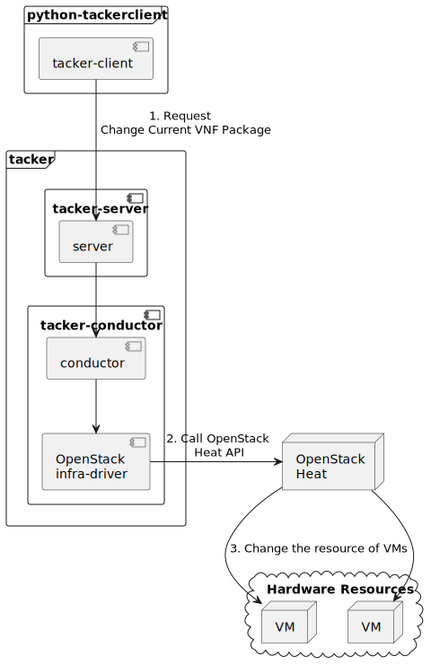

=================================================================
ETSI NFV-SOL VNF Change Current VNF Package with StandardUserData
=================================================================

This document describes how to change current VNF package for VNF when
using StandardUserData as the UserData class in Tacker.

.. note::

  See :doc:`/user/userdata_script` for
  StandardUserData(userdata script for not using AutoScalingGroup).

Overview
--------

The diagram below shows an overview of changing current VNF package.

1. Request Change Current VNF Package

   A user requests tacker-server to change current VNF package for VNF
   instance with tacker-client by requesting
   ``change current vnf package``.

2. Call OpenStack Heat API

   Upon receiving a request from tacker-client, tacker-server redirects
   it to tacker-conductor.
   In tacker-conductor, the request is redirected again to an
   appropriate infra-driver (in this case OpenStack infra-driver)
   according to the contents of VNF instance.
   Then, OpenStack infra-driver calls OpenStack Heat APIs.

3. Change the resource of VMs

   OpenStack Heat change the resource (image, flavor, external network)
   of VMs according to the API calls.

Prerequisites
-------------

The following packages should be installed:

* tacker
* python-tackerclient

At least one VNF instance with status of ``INSTANTIATED`` is required.
You can refer to :doc:`/user/v2/vnf/deployment_with_user_data/index` for
the procedure to instantiate VNF.

You can refer to :doc:`/user/vnf-package` for the operation of uploading VNF
package.

.. note::

  You can deploy a VM directly by image or volume.
  Therefore, when updating the image of the VM, there will be two
  cases.

  Use the common VNF package and the flavor_id to instantiate,
  and then use the VNF package in the corresponding link to
  execute ``change current vnf package`` operation,
  you can update the image of the VM in the following two ways.

  1. change VM created by image to VM created by new image

  2. change VM created by volume to VM created by new volume

Change Current VNF Package
--------------------------

As mentioned in Prerequisites, the VNF must be created
before performing change current VNF package.

.. note::

  Currently, this operation only supports some functions of
  ``Change Current VNF Package``.

  * There are several ways to update VDUs, but in the Bobcat version
    Tacker only supports ``RollingUpdate`` type.
    You can set it via ``upgrade_type`` param.

  * Supported updates:

    * Change image of VMs
    * Change flavor of VMs
    * Modify, add, and delete external networks

  * Unsupported updates:

    * Increase or decrease the number of VNFcs according to the VNF
      package
    * Add and delete the entire VDU

You need to upload the VNF package you want to change to before
executing change current vnf package.

Details of CLI commands are described in
:doc:`/cli/cli-etsi-vnflcm`.

.. note::

  If you want to change the HOT definition before and after change
  current vnf package, you need to change the file name under the
  ``nested`` directory.
  In the operation example in this document, the file names are changed
  before and after change current vnf package as shown below.

  * VDU1

    * before: BaseHOT/simple/nested/VDU1.yaml
    * after: BaseHOT/simple/nested/VDU1-ver2.yaml

  * VDU2

    * before: BaseHOT/simple/nested/VDU2.yaml
    * after: BaseHOT/simple/VDU2-ver2.yaml

For changing current VNF package, you need to prepare a JSON-formatted
definition file before running command.

``sample_param_file_for_standard_user_data.json:``

.. code-block:: json

  {
    "vnfdId": "5b09fc55-5324-47b4-9f3d-70d1ca59a765",
    "extVirtualLinks": [{
      "id": "ext_vl_id_net4",
      "resourceId": "1dad756e-a9d2-4c49-b490-d26940c6cbaf",
      "extCps": [{
        "cpdId": "VDU1_CP4",
        "cpConfig": {
          "VDU1_CP4_1": {
            "cpProtocolData": [{
              "layerProtocol": "IP_OVER_ETHERNET",
              "ipOverEthernet": {
                "ipAddresses": [{
                  "type": "IPV4",
                  "numDynamicAddresses": 1
                }]
              }
            }]
          }
        }
      },
      {
        "cpdId": "VDU2_CP4",
        "cpConfig": {
          "VDU2_CP4_1": {
            "cpProtocolData": [{
              "layerProtocol": "IP_OVER_ETHERNET",
              "ipOverEthernet": {
                "ipAddresses": [{
                  "type": "IPV4",
                  "numDynamicAddresses": 1
                }]
              }
            }]
          }
        }
      }]
    }],
    "extManagedVirtualLinks": [{
      "id": "ext_managed_vl_1",
      "vnfVirtualLinkDescId": "internalVL1",
      "resourceId": "4daf6f6c-8f19-4cc6-96b5-0e3ccc9c7c93"
    }],
    "additionalParams": {
      "upgrade_type": "RollingUpdate",
      "lcm-operation-coordinate-old-vnf": "./Scripts/coordinate_old_vnf.py",
      "lcm-operation-coordinate-new-vnf": "./Scripts/coordinate_new_vnf.py",
      "vdu_params": [{
        "vdu_id": "VDU1",
        "old_vnfc_param": {
          "cp_name": "VDU1_CP1",
          "username": "ubuntu",
          "password": "ubuntu"
        },
        "new_vnfc_param": {
          "cp_name": "VDU1_CP1",
          "username": "ubuntu",
          "password": "ubuntu"
        }
      },
      {
        "vdu_id": "VDU2",
        "old_vnfc_param": {
          "cp_name": "VDU2_CP1",
          "username": "ubuntu",
          "password": "ubuntu"
        },
        "new_vnfc_param": {
          "cp_name": "VDU2_CP1",
          "username": "ubuntu",
          "password": "ubuntu"
        }
      }],
      "lcm-operation-user-data": "./UserData/userdata_standard.py",
      "lcm-operation-user-data-class": "StandardUserData",
      "nfv": {
        "VDU": {
          "VDU1-0": {
            "name": "VDU1-a-001-change_vnfpkg"
          },
          "VDU1-1": {
            "name": "VDU1-a-010-change_vnfpkg"
          },
          "VDU1-2": {
            "name": "VDU1-a-011-change_vnfpkg"
          }
        }
      }
    },
    "vimConnectionInfo": {
      "vim1": {
        "accessInfo": {
          "password": "devstack",
          "project": "nfv",
          "projectDomain": "Default",
          "region": "RegionOne",
          "userDomain": "Default",
          "username": "nfv_user"
        },
        "extra": {
          "new-key": "new-val"
        },
        "interfaceInfo": {
          "endpoint": "http://localhost/identity/v3"
        },
        "vimId": "defb2f96-5670-4bef-8036-27bf61267fc1",
        "vimType": "ETSINFV.OPENSTACK_KEYSTONE.V_3"
      }
    },
    "vnfConfigurableProperties": {
      "key": "value"
    },
    "extensions": {
      "key": "value"
    }
  }

.. note::
  * ``vnfdId`` is the VNFD id of the new VNF package you uploaded.
  * ``extVirtualLinks`` is an optional parameter.
    This operation can change external CP for the the VNF instance.
  * ``extManagedVirtualLinks`` is an optional parameter.
    Note that if the VNF instance uses ``extManagedVirtualLinkInfo``,
    ``extManagedVirtualLinks`` needs to be set in the request
    parameters regardless of whether it is changed.
  * ``lcm-operation-coordinate-old-vnf`` and
    ``lcm-operation-coordinate-new-vnf`` are unique implementations of
    Tacker to simulate the coordination interface in
    `ETSI NFV-SOL002 v3.5.1`_.
    Mainly a script that can communicate with the VM after the VM is
    created, perform special customization of the VM or confirm the
    status of the VM.
  * ``vimConnectionInfo`` is an optional parameter.
    This operation can specify the ``vimConnectionInfo`` for the VNF
    instance.
    Even if this operation specifies multiple ``vimConnectionInfo``
    associated with one VNF instance, only one of them will be used for
    life cycle management operations.
    It is not possible to delete the key of registered
    ``vimConnectionInfo``.
  * ``vnfConfigurableProperties`` and ``extensions`` are optional
    parameter.
    As with the update operation, these values are updated by performing
    JSON Merge Patch with the values set in the request parameter to the
    current values.
    For ``metadata``, the value set before this operation is maintained.

You can set following parameter in additionalParams:

.. list-table:: additionalParams
  :widths: 15 10 30
  :header-rows: 1

  * - Attribute name
    - Cardinality
    - Parameter description
  * - upgrade_type
    - 1
    - Type of file update operation method. Specify Blue-Green or
      Rolling update.
  * - lcm-operation-coordinate-old-vnf
    - 0..1
    - The file path of the script that simulates the behavior of
      CoordinateVNF for old VNF.
  * - lcm-operation-coordinate-new-vnf
    - 0..1
    - The file path of the script that simulates the behavior of
      CoordinateVNF for new VNF.
  * - vdu_params
    - 1..N
    - VDU information of target VDU to update.
  * - > vdu_id
    - 1
    - VDU name of target VDU to update.
  * - > old_vnfc_param
    - 0..1
    - Old VNFC connection information. Required for ssh connection in
      CoordinateVNF operation for application configuration to VNFC.
  * - >> cp_name
    - 1
    - Connection point name of old VNFC to update.
  * - >> username
    - 1
    - User name of old VNFC to update.
  * - >> password
    - 1
    - Password of old VNFC to update.
  * - > new_vnfc_param
    - 0..1
    - New VNFC connection information. Required for ssh connection in
      CoordinateVNF operation for application configuration to VNFC.
  * - >> cp_name
    - 1
    - Connection point name of new VNFC to update.
  * - >> username
    - 1
    - User name of new VNFC to update.
  * - >> password
    - 1
    - Password of new VNFC to update.
  * - external_lb_param
    - 0..1
    - Load balancer information that requires configuration changes.
      Required only for the Blue-Green deployment process of OpenStack
      VIM.
  * - > ip_address
    - 1
    - IP address of load balancer server.
  * - > username
    - 1
    - User name of load balancer server.
  * - > password
    - 1
    - Password of load balancer server.
  * - lcm-operation-user-data
    - 1
    - File name of UserData to use.
  * - lcm-operation-user-data-class
    - 1
    - Class name of UserData to use.
  * - nfv
    - 0..1
    - Parameters used in HOT.

.. note::

  When using StandardUserData as UserData, the following settings are
  required in additionalParams.

  * "lcm-operation-user-data": "./UserData/userdata_standard.py"
  * "lcm-operation-user-data-class": "StandardUserData"

How to change image for VM created by image
~~~~~~~~~~~~~~~~~~~~~~~~~~~~~~~~~~~~~~~~~~~

Execute Change Current VNF Package CLI command. After complete this
change operation, you should check resource status by Heat CLI commands.

1. check 'ID' and 'Stack Status' of the stack before and after
operation.
This is to confirm that stack 'ID' has not been changed before and
after operation, and that the Stack update has been updated
successfully.

2. check 'physical_resource_id' and 'resource_status' of the VDU and
VDU's parent resource.
This is to confirm that 'physical_resource_id' has no change before
and after operation, and that the resource_status has been updated
successfully.

3. check 'image' information of VDU before and after operation.
This is to confirm that VDU's image has been changed successfully.
See `Heat CLI reference`_ for details on Heat CLI commands.

* Check point 1 before operation

  Stack information before operation:

  .. code-block:: console

    $ openstack stack list -c 'ID' -c 'Stack Name' -c 'Stack Status'

  Result:

  .. code-block:: console

    +--------------------------------------+------------------------------------------+-----------------+
    | ID                                   | Stack Name                               | Stack Status    |
    +--------------------------------------+------------------------------------------+-----------------+
    | 74bd6e1f-6e69-49ad-a3b4-2af00f35d5a3 | vnf-63ae20b2-dbe0-4892-a06f-81dbb7396dfb | CREATE_COMPLETE |
    +--------------------------------------+------------------------------------------+-----------------+

* Check point 2 before operation

  Stack resource information before operation:

  .. code-block:: console

    $ openstack stack resource list 74bd6e1f-6e69-49ad-a3b4-2af00f35d5a3 \
      --filter type='VDU1.yaml'

  Result:

  .. code-block:: console

    +---------------+--------------------------------------+---------------+-----------------+----------------------+
    | resource_name | physical_resource_id                 | resource_type | resource_status | updated_time         |
    +---------------+--------------------------------------+---------------+-----------------+----------------------+
    | VDU1-0        | 5d6d3b48-4743-404f-a9a3-31750915d1fe | VDU1.yaml     | CREATE_COMPLETE | 2023-12-04T09:47:40Z |
    +---------------+--------------------------------------+---------------+-----------------+----------------------+

  VDU information before operation:

  .. code-block:: console

    $ openstack stack resource list 5d6d3b48-4743-404f-a9a3-31750915d1fe \
      --filter type='OS::Nova::Server'

  Result:

  .. code-block:: console

    +---------------+--------------------------------------+------------------+-----------------+----------------------+
    | resource_name | physical_resource_id                 | resource_type    | resource_status | updated_time         |
    +---------------+--------------------------------------+------------------+-----------------+----------------------+
    | VDU1          | cb821a5e-91a6-4272-b953-f4e72350034b | OS::Nova::Server | CREATE_COMPLETE | 2023-12-04T09:47:41Z |
    +---------------+--------------------------------------+------------------+-----------------+----------------------+

* Check point 3 before operation

  VDU detailed information before operation:

  .. code-block:: console

    $ openstack stack resource show 5d6d3b48-4743-404f-a9a3-31750915d1fe VDU1 \
      -f json | jq .attributes.image.id

  Result:

  .. code-block:: console

    "6813ef65-0344-48e6-a726-22cb714bef1b"

* Execute Change Current VNF Package

  Change Current VNF Package execution of the entire VNF:

  .. code-block:: console

    $ openstack vnflcm change-vnfpkg VNF_INSTANCE_ID \
      ./sample_param_file_for_standard_user_data.json \
      --os-tacker-api-version 2

  Result:

  .. code-block:: console

    Change Current VNF Package for VNF Instance 63ae20b2-dbe0-4892-a06f-81dbb7396dfb has been accepted.

* Check point 1 after operation

  Stack information after operation:

  .. code-block:: console

    $ openstack stack list -c 'ID' -c 'Stack Name' -c 'Stack Status'

  Result:

  .. code-block:: console

    +--------------------------------------+------------------------------------------+-----------------+
    | ID                                   | Stack Name                               | Stack Status    |
    +--------------------------------------+------------------------------------------+-----------------+
    | 74bd6e1f-6e69-49ad-a3b4-2af00f35d5a3 | vnf-63ae20b2-dbe0-4892-a06f-81dbb7396dfb | UPDATE_COMPLETE |
    +--------------------------------------+------------------------------------------+-----------------+

  .. note::

    'Stack Status' transitions to UPDATE_COMPLETE.

* Check point 2 after operation

  Stack resource information after operation:

  .. code-block:: console

    $ openstack stack resource list 74bd6e1f-6e69-49ad-a3b4-2af00f35d5a3 \
      --filter type='VDU1-ver2.yaml'

  Result:

  .. code-block:: console

    +---------------+--------------------------------------+----------------+-----------------+----------------------+
    | resource_name | physical_resource_id                 | resource_type  | resource_status | updated_time         |
    +---------------+--------------------------------------+----------------+-----------------+----------------------+
    | VDU1-0        | 5d6d3b48-4743-404f-a9a3-31750915d1fe | VDU1-ver2.yaml | UPDATE_COMPLETE | 2023-12-06T05:20:01Z |
    +---------------+--------------------------------------+----------------+-----------------+----------------------+

  VDU information after operation:

  .. code-block:: console

    $ openstack stack resource list 5d6d3b48-4743-404f-a9a3-31750915d1fe \
      --filter type='OS::Nova::Server'

  Result:

  .. code-block:: console

    +---------------+--------------------------------------+------------------+-----------------+----------------------+
    | resource_name | physical_resource_id                 | resource_type    | resource_status | updated_time         |
    +---------------+--------------------------------------+------------------+-----------------+----------------------+
    | VDU1          | cb821a5e-91a6-4272-b953-f4e72350034b | OS::Nova::Server | UPDATE_COMPLETE | 2023-12-06T05:19:08Z |
    +---------------+--------------------------------------+------------------+-----------------+----------------------+

  .. note::
    'resource_status' transitions to UPDATE_COMPLETE.

* Check point 3 after operation

  VDU detailed information after operation:

  .. code-block:: console

    $ openstack stack resource show 5d6d3b48-4743-404f-a9a3-31750915d1fe VDU1 \
      -f json | jq .attributes.image.id

  Result:

  .. code-block:: console

    "8879b7f5-8d5f-4752-a740-c067002fa430"

  .. note::
    You can check 'attributes.image.id' has been changed from
    '6813ef65-0344-48e6-a726-22cb714bef1b' to
    '8879b7f5-8d5f-4752-a740-c067002fa430'.

How to change image for VM created by volume
~~~~~~~~~~~~~~~~~~~~~~~~~~~~~~~~~~~~~~~~~~~~

Execute Change Current VNF Package CLI command. After complete this
change operation, you should check resource status by Heat CLI commands.

1. check 'ID' and 'Stack Status' of the stack before and after
operation.
This is to confirm that stack 'ID' has not been changed before and after
operation, and the Stack update has been updated successfully.

2. check 'physical_resource_id' and 'resource_status' of the VDU and
VDU's parent resource. This is to confirm that 'physical_resource_id' of
VDU has changed before and after operation, 'physical_resource_id' of
VDU's parent resource has no change before and after operation, and that
the 'resource_status' of VDU has been created successfully,
'resource_status' of VDU's parent resource has been updated
successfully.

3. check 'os-extended-volumes:volumes_attached' information of VDU
before and after operation.
This is to confirm that VDU's image has been changed successfully.
See `Heat CLI reference`_ for details on Heat CLI commands.

* Check point 1 before operation

  Stack information before operation:

  .. code-block:: console

    $ openstack stack list -c 'ID' -c 'Stack Name' -c 'Stack Status'

  Result:

  .. code-block:: console

    +--------------------------------------+------------------------------------------+-----------------+
    | ID                                   | Stack Name                               | Stack Status    |
    +--------------------------------------+------------------------------------------+-----------------+
    | 74bd6e1f-6e69-49ad-a3b4-2af00f35d5a3 | vnf-63ae20b2-dbe0-4892-a06f-81dbb7396dfb | CREATE_COMPLETE |
    +--------------------------------------+------------------------------------------+-----------------+

* Check point 2 before operation

  Stack resource information before operation:

  .. code-block:: console

    $ openstack stack resource list 74bd6e1f-6e69-49ad-a3b4-2af00f35d5a3 \
      --filter type='VDU2.yaml'

  Result:

  .. code-block:: console

    +---------------+--------------------------------------+---------------+-----------------+----------------------+
    | resource_name | physical_resource_id                 | resource_type | resource_status | updated_time         |
    +---------------+--------------------------------------+---------------+-----------------+----------------------+
    | VDU2-0        | 0417d111-780a-4efd-b47b-8108e4437502 | VDU2.yaml     | CREATE_COMPLETE | 2023-12-04T09:47:40Z |
    +---------------+--------------------------------------+---------------+-----------------+----------------------+

  VDU information before operation:

  .. code-block:: console

    $ openstack stack resource list 0417d111-780a-4efd-b47b-8108e4437502 \
      --filter type='OS::Nova::Server'

  Result:

  .. code-block:: console

    +---------------+--------------------------------------+------------------+-----------------+----------------------+
    | resource_name | physical_resource_id                 | resource_type    | resource_status | updated_time         |
    +---------------+--------------------------------------+------------------+-----------------+----------------------+
    | VDU2          | 35fb4948-66b1-4c1a-86e5-328793889f5d | OS::Nova::Server | CREATE_COMPLETE | 2023-12-04T09:47:42Z |
    +---------------+--------------------------------------+------------------+-----------------+----------------------+

* Check point 3 before operation

  VDU detailed information before operation:

  .. code-block:: console

    $ openstack stack resource show 0417d111-780a-4efd-b47b-8108e4437502 VDU2 \
      -f json | jq '.attributes."os-extended-volumes:volumes_attached"[].id'

  Result:

  .. code-block:: console

    "5e12516f-7726-411f-8693-e0b20649d3c7"

* Execute Change Current VNF Package

  Change Current VNF Package execution of the entire VNF:

  .. code-block:: console

    $ openstack vnflcm change-vnfpkg VNF_INSTANCE_ID \
      ./sample_param_file_for_standard_user_data.json \
      --os-tacker-api-version 2

  Result:

  .. code-block:: console

    Change Current VNF Package for VNF Instance 63ae20b2-dbe0-4892-a06f-81dbb7396dfb has been accepted.

* Check point 1 after operation

  Stack information after operation:

  .. code-block:: console

    $ openstack stack list -c 'ID' -c 'Stack Name' -c 'Stack Status'

  Result:

  .. code-block:: console

    +--------------------------------------+------------------------------------------+-----------------+
    | ID                                   | Stack Name                               | Stack Status    |
    +--------------------------------------+------------------------------------------+-----------------+
    | 74bd6e1f-6e69-49ad-a3b4-2af00f35d5a3 | vnf-63ae20b2-dbe0-4892-a06f-81dbb7396dfb | UPDATE_COMPLETE |
    +--------------------------------------+------------------------------------------+-----------------+

  .. note::

    'Stack Status' transitions to UPDATE_COMPLETE.

* Check point 2 after operation

  Stack resource information before operation:

  .. code-block:: console

    $ openstack stack resource list 74bd6e1f-6e69-49ad-a3b4-2af00f35d5a3 \
      --filter type='VDU2-ver2.yaml'

  Result:

  .. code-block:: console

    +---------------+--------------------------------------+----------------+-----------------+----------------------+
    | resource_name | physical_resource_id                 | resource_type  | resource_status | updated_time         |
    +---------------+--------------------------------------+----------------+-----------------+----------------------+
    | VDU2-0        | 0417d111-780a-4efd-b47b-8108e4437502 | VDU2-ver2.yaml | UPDATE_COMPLETE | 2023-12-06T05:20:02Z |
    +---------------+--------------------------------------+----------------+-----------------+----------------------+

  VDU information after operation:

  .. code-block:: console

    $ openstack stack resource list 0417d111-780a-4efd-b47b-8108e4437502 \
      --filter type='OS::Nova::Server'

  Result:

  .. code-block:: console

    +---------------+--------------------------------------+------------------+-----------------+----------------------+
    | resource_name | physical_resource_id                 | resource_type    | resource_status | updated_time         |
    +---------------+--------------------------------------+------------------+-----------------+----------------------+
    | VDU2          | b4380e6a-5f8f-4fa4-b2a9-bc8026a19428 | OS::Nova::Server | CREATE_COMPLETE | 2023-12-06T05:18:42Z |
    +---------------+--------------------------------------+------------------+-----------------+----------------------+

  .. note::
    'resource_status' transitions to CREATE_COMPLETE.
    'physical_resource_id' has been changed from
    '35fb4948-66b1-4c1a-86e5-328793889f5d' to
    'b4380e6a-5f8f-4fa4-b2a9-bc8026a19428'.

* Check point 3 after operation

  VDU detailed information after operation:

  .. code-block:: console

    $ openstack stack resource show 0417d111-780a-4efd-b47b-8108e4437502 VDU2 \
      -f json | jq '.attributes."os-extended-volumes:volumes_attached"[].id'

  Result:

  .. code-block:: console

    "2c55612d-78cb-4d42-b9de-8f65e382a067"

  .. note::
    You can check 'attributes.os-extended-volumes:volumes_attached.id'
    has been changed from '5e12516f-7726-411f-8693-e0b20649d3c7' to
    '2c55612d-78cb-4d42-b9de-8f65e382a067'.

How to change flavor of VMs
~~~~~~~~~~~~~~~~~~~~~~~~~~~

Execute Change Current VNF Package CLI command. After complete this
change operation, you should check resource status by Heat CLI commands.

1. check 'flavor' information of VDU before and after operation.
This is to confirm that VDU's flavor have been changed successfully.
See `Heat CLI reference`_ for details on Heat CLI commands.

* Check point 1 before operation

  VDU detailed information before operation:

  .. code-block:: console

    $ openstack stack resource show 0417d111-780a-4efd-b47b-8108e4437502 VDU2 \
      -f json | jq .attributes.flavor

  Result:

  .. code-block:: console

    {
      "vcpus": 1,
      "ram": 512,
      "disk": 1,
      "ephemeral": 0,
      "swap": 0,
      "original_name": "m1.tiny",
      "extra_specs": {
        "hw_rng:allowed": "True"
      }
    }

* Execute change Current VNF Package

  Change Current VNF Package execution of the entire VNF:

  .. code-block:: console

    $ openstack vnflcm change-vnfpkg VNF_INSTANCE_ID \
      ./sample_param_file_for_standard_user_data.json \
      --os-tacker-api-version 2

  Result:

  .. code-block:: console

    Change Current VNF Package for VNF Instance 63ae20b2-dbe0-4892-a06f-81dbb7396dfb has been accepted.

* Check point 1 after operation

  VDU detailed information after operation:

  .. code-block:: console

    $ openstack stack resource show 0417d111-780a-4efd-b47b-8108e4437502 VDU2 \
      -f json | jq .attributes.flavor

  Result:

  .. code-block:: console

    {
      "vcpus": 1,
      "ram": 2048,
      "disk": 20,
      "ephemeral": 0,
      "swap": 0,
      "original_name": "m1.small",
      "extra_specs": {
        "hw_rng:allowed": "True"
      }
    }

  .. note::

    You can check 'attributes.flavor' has been changed.
    In this example, it has been changed as follows.

    * 'attributes.flavor.ram' has been changed from '512' to '2048'
    * 'attributes.flavor.disk' has been changed from '1' to '20'
    * 'attributes.flavor.original_name' has been changed from 'm1.tiny'
      to 'm1.small'

How to change external networks
~~~~~~~~~~~~~~~~~~~~~~~~~~~~~~~

Execute Change Current VNF Package CLI command. After complete this
change operation, you should check resource status by Heat CLI commands.

1. check the number or 'physical_resource_id' of the external network
resources.
In the case of add and delete, this is to confirm that the number of
resources has been changed before and after operation.
And in the case of modify, this is to confirm that
'physical_resource_id' has been changed.

2. check 'address' information of VDU before and after operation.
This is to confirm that VDU's external networks have been changed
successfully.
See `Heat CLI reference`_ for details on Heat CLI commands.

* Check point 1 before operation

  External networks information before operation:

  .. code-block:: console

    $ openstack stack resource list 5d6d3b48-4743-404f-a9a3-31750915d1fe \
      --filter type='OS::Neutron::Port'

  Result:

  .. code-block:: console

    +---------------+--------------------------------------+-------------------+-----------------+----------------------+
    | resource_name | physical_resource_id                 | resource_type     | resource_status | updated_time         |
    +---------------+--------------------------------------+-------------------+-----------------+----------------------+
    | VDU1_CP2      | 6c0b9376-ed4f-4738-af67-4f8d56673e46 | OS::Neutron::Port | CREATE_COMPLETE | 2023-12-04T09:47:41Z |
    | VDU1_CP1      | 08640038-877c-407f-b476-f3ca070585fb | OS::Neutron::Port | CREATE_COMPLETE | 2023-12-04T09:47:41Z |
    | VDU1_CP3      | 9ba1f07c-4fb4-4415-b9ad-d0619c19b046 | OS::Neutron::Port | CREATE_COMPLETE | 2023-12-04T09:47:41Z |
    +---------------+--------------------------------------+-------------------+-----------------+----------------------+

* Check point 2 before operation

  External networks detailed information before operation:

  .. code-block:: console

    $ openstack stack resource show 5d6d3b48-4743-404f-a9a3-31750915d1fe VDU1 \
      -f json | jq .attributes.addresses

  Result:

  .. code-block:: console

    {
      "net1": [
        {
          "version": 4,
          "addr": "10.10.1.110",
          "OS-EXT-IPS:type": "fixed",
          "OS-EXT-IPS-MAC:mac_addr": "fa:16:3e:25:ee:a7"
        }
      ],
      "net_mgmt": [
        {
          "version": 4,
          "addr": "192.168.120.138",
          "OS-EXT-IPS:type": "fixed",
          "OS-EXT-IPS-MAC:mac_addr": "fa:16:3e:f2:25:9a"
        }
      ],
      "vnf-63ae20b2-dbe0-4892-a06f-81dbb7396dfb-internalVL2-ckz5kksjbtfl": [
        {
          "version": 4,
          "addr": "192.168.4.170",
          "OS-EXT-IPS:type": "fixed",
          "OS-EXT-IPS-MAC:mac_addr": "fa:16:3e:c8:b4:e9"
        }
      ]
    }

* Execute Change Current VNF Package

  Change Current VNF Package execution of the entire VNF:

  .. code-block:: console

    $ openstack vnflcm change-vnfpkg VNF_INSTANCE_ID \
      ./sample_param_file_for_standard_user_data.json \
      --os-tacker-api-version 2

  Result:

  .. code-block:: console

    Change Current VNF Package for VNF Instance 63ae20b2-dbe0-4892-a06f-81dbb7396dfb has been accepted.

* Check point 1 after operation

  External networks information after operation:

  .. code-block:: console

    $ openstack stack resource list 5d6d3b48-4743-404f-a9a3-31750915d1fe \
      --filter type='OS::Neutron::Port'

  Result:

  .. code-block:: console

    +---------------+--------------------------------------+-------------------+-----------------+----------------------+
    | resource_name | physical_resource_id                 | resource_type     | resource_status | updated_time         |
    +---------------+--------------------------------------+-------------------+-----------------+----------------------+
    | VDU1_CP2      | 6c0b9376-ed4f-4738-af67-4f8d56673e46 | OS::Neutron::Port | CREATE_COMPLETE | 2023-12-04T09:47:41Z |
    | VDU1_CP1      | 08640038-877c-407f-b476-f3ca070585fb | OS::Neutron::Port | CREATE_COMPLETE | 2023-12-04T09:47:41Z |
    | VDU1_CP4      | 82eb5cee-9b20-4b5c-b769-f49aba71332a | OS::Neutron::Port | CREATE_COMPLETE | 2023-12-06T05:19:04Z |
    | VDU1_CP3      | 91515973-1432-4612-ab75-0538cef81933 | OS::Neutron::Port | CREATE_COMPLETE | 2023-12-06T05:19:06Z |
    +---------------+--------------------------------------+-------------------+-----------------+----------------------+

  .. note::

    The number or 'resource_status' of the external network resources
    have been changed.
    In this example, the number has been changed from '3' to '4'.

* Check point 2 after operation

  External networks detailed information after operation:

  .. code-block:: console

    $ openstack stack resource show 5d6d3b48-4743-404f-a9a3-31750915d1fe VDU1 \
      -f json | jq .attributes.addresses

  Result:

  .. code-block:: console

    {
      "net1": [
        {
          "version": 4,
          "addr": "10.10.1.110",
          "OS-EXT-IPS:type": "fixed",
          "OS-EXT-IPS-MAC:mac_addr": "fa:16:3e:25:ee:a7"
        }
      ],
      "net_mgmt": [
        {
          "version": 4,
          "addr": "192.168.120.138",
          "OS-EXT-IPS:type": "fixed",
          "OS-EXT-IPS-MAC:mac_addr": "fa:16:3e:f2:25:9a"
        }
      ],
      "vnf-63ae20b2-dbe0-4892-a06f-81dbb7396dfb-internalVL3-eefvoasioxui": [
        {
          "version": 4,
          "addr": "192.168.5.164",
          "OS-EXT-IPS:type": "fixed",
          "OS-EXT-IPS-MAC:mac_addr": "fa:16:3e:23:4a:86"
        }
      ],
      "net0": [
        {
          "version": 4,
          "addr": "10.10.0.242",
          "OS-EXT-IPS:type": "fixed",
          "OS-EXT-IPS-MAC:mac_addr": "fa:16:3e:39:75:f0"
        }
      ]
    }

  .. note::

    You can check 'attributes.addresses' has been changed.
    In this example, 'net0' has been added.

History of Checks
-----------------

The content of this document has been confirmed to work
using the following VNF Packages.

* `userdata_standard for 2023.2 Bobcat`_
* `userdata_standard_change_vnfpkg_nw for 2023.2 Bobcat`_

Please also refer to the samples below.

* `change_vnfpkg_before with StandardUserData`_
* `change_vnfpkg_after with StandardUserData`_

  .. note::

    If you use the samples, you need to add the following files:

    * Definitions/etsi_nfv_sol001_common_types.yaml
    * Definitions/etsi_nfv_sol001_vnfd_types.yaml
    * Files/images/cirros-0.5.2-x86_64-disk.img

The samples make the following updates:

* VDU1

  * change image
  * change flavor
  * add network

* VDU2

  * change image
  * add network

* VDU3

  * no change

.. _Heat CLI reference: https://docs.openstack.org/python-openstackclient/latest/cli/plugin-commands/heat.html
.. _ETSI NFV-SOL002 v3.5.1: https://www.etsi.org/deliver/etsi_gs/NFV-SOL/001_099/002/03.05.01_60/gs_nfv-sol002v030501p.pdf
.. _userdata_standard for 2023.2 Bobcat:
  https://opendev.org/openstack/tacker/src/branch/stable/2023.2/tacker/tests/functional/sol_v2_common/samples/userdata_standard
.. _userdata_standard_change_vnfpkg_nw for 2023.2 Bobcat:
  https://opendev.org/openstack/tacker/src/branch/stable/2023.2/tacker/tests/functional/sol_v2_common/samples/userdata_standard_change_vnfpkg_nw
.. _change_vnfpkg_before with StandardUserData:
  https://opendev.org/openstack/tacker/src/branch/master/doc/source/user/v2/vnf/chg_vnfpkg_with_standard/conf/change_vnfpkg_before
.. _change_vnfpkg_after with StandardUserData:
  https://opendev.org/openstack/tacker/src/branch/master/doc/source/user/v2/vnf/chg_vnfpkg_with_standard/conf/change_vnfpkg_after
