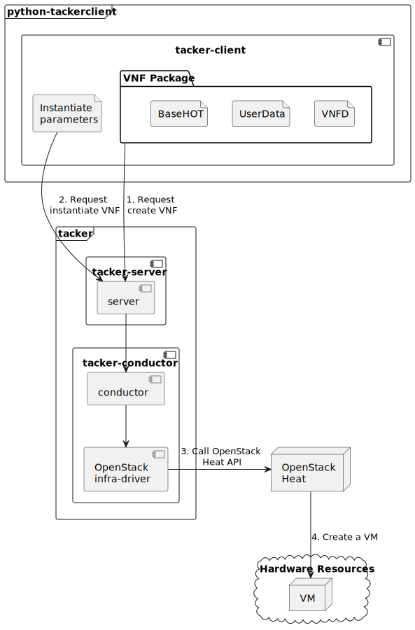

==============================================================
ETSI NFV-SOL VNF Deployment as VM with LCM Operation User Data
==============================================================

This document describes how to deploy VNF as VM with
LCM operation user data in Tacker v2 API using CLI commands.
Please check `LCM-user-data spec`_ and `NFV-SOL014 v2.8.1`_
for more information on LCM operation user data.

Overview
--------

The diagram below shows an overview of the VNF deployment.

1. Request create VNF

   A user requests tacker-server to create a VNF with tacker-client by
   uploading a VNF Package and requesting ``create VNF``. The VNF Package
   should contain ``BaseHOT`` and ``UserData`` in addition to ``VNFD``.
   The detailed explanation of these contents can be found in
   :doc:`/user/vnf-package`.

2. Request instantiate VNF

   A user requests tacker-server to instantiate the created VNF by requesting
   ``instantiate VNF`` with instantiate parameters.

3. Call OpenStack Heat API

   Upon receiving a request, tacker-server redirects it to tacker-conductor.
   In tacker-conductor, the request is redirected again to an appropriate
   infra-driver (in this case OpenStack infra-driver) according to the contents
   of the instantiate parameters. Then, OpenStack infra-driver calls OpenStack
   Heat APIs to create a VM as a VNF.

4. Create a VM

   OpenStack Heat creates a VM according to the API calls.

Prerequisites
-------------

The following packages should be installed:

* tacker
* python-tackerclient

A default VIM should be registered according to
:doc:`/cli/cli-legacy-vim`.

As an example, you can register default VIM as follow.

.. code-block:: console

  $ cat vim_config.yaml
  auth_url: 'http://192.168.56.10/identity'
  username: 'nfv_user'
  password: 'devstack'
  project_name: 'nfv'
  project_domain_name: 'Default'
  user_domain_name: 'Default'
  cert_verify: 'False'

  $ openstack vim register --config-file vim_config.yaml \
    --is-default openstack-admin-vim
  +----------------+-----------------------------------------------------+
  | Field          | Value                                               |
  +----------------+-----------------------------------------------------+
  | auth_cred      | {                                                   |
  |                |     "username": "nfv_user",                         |
  |                |     "user_domain_name": "Default",                  |
  |                |     "cert_verify": "False",                         |
  |                |     "project_id": null,                             |
  |                |     "project_name": "nfv",                          |
  |                |     "project_domain_name": "Default",               |
  |                |     "auth_url": "http://192.168.56.10/identity/v3", |
  |                |     "key_type": "barbican_key",                     |
  |                |     "secret_uuid": "***",                           |
  |                |     "password": "***"                               |
  |                | }                                                   |
  | auth_url       | http://192.168.56.10/identity/v3                    |
  | created_at     | 2023-11-08 02:50:43.373078                          |
  | description    |                                                     |
  | extra          |                                                     |
  | id             | 60f78f56-e297-4a7a-aae7-65418e3961e3                |
  | is_default     | True                                                |
  | name           | openstack-admin-vim                                 |
  | placement_attr | {                                                   |
  |                |     "regions": [                                    |
  |                |         "RegionOne"                                 |
  |                |     ]                                               |
  |                | }                                                   |
  | project_id     | ebbc6cf1a03d49918c8e408535d87268                    |
  | status         | ACTIVE                                              |
  | type           | openstack                                           |
  | updated_at     | None                                                |
  | vim_project    | {                                                   |
  |                |     "name": "nfv",                                  |
  |                |     "project_domain_name": "Default"                |
  |                | }                                                   |
  +----------------+-----------------------------------------------------+

The VNF Package(sample_csar.zip) used below is prepared
by referring to :doc:`/user/vnf-package`.

.. note::

  In order to deploy VNF using LCM operation user data,
  it is necessary to include BaseHOT and UserData in the VNF Package,
  which are optional in :doc:`/user/vnf-package`.

As an example, you can create a VNF Package as follow.

.. code-block:: console

  $ python3 -m pip install TACKER_ROOT
  $ cd TACKER_ROOT/samples/tests/functional/sol_v2_common/basic_lcms_max_individual_vnfc
  $ python3 pre.yaml
  +---------------------------+--------------------------------------+
  | Field                     | Value                                |
  +---------------------------+--------------------------------------+
  | admin_state_up            | UP                                   |
  | availability_zone_hints   |                                      |
  | availability_zones        |                                      |
  | created_at                | 2023-11-08T04:57:50Z                 |
  | description               |                                      |
  | dns_domain                | None                                 |
  | id                        | 8d628e15-375c-4882-be3e-7d8f2824bff2 |
  | ipv4_address_scope        | None                                 |
  | ipv6_address_scope        | None                                 |
  | is_default                | False                                |
  | is_vlan_transparent       | None                                 |
  | mtu                       | 1442                                 |
  | name                      | ft-net0                              |
  | port_security_enabled     | True                                 |
  | project_id                | ebbc6cf1a03d49918c8e408535d87268     |
  | provider:network_type     | geneve                               |
  | provider:physical_network | None                                 |
  | provider:segmentation_id  | 34180                                |
  | qos_policy_id             | None                                 |
  | revision_number           | 1                                    |
  | router:external           | Internal                             |
  | segments                  | None                                 |
  | shared                    | False                                |
  | status                    | ACTIVE                               |
  | subnets                   |                                      |
  | tags                      |                                      |
  | tenant_id                 | ebbc6cf1a03d49918c8e408535d87268     |
  | updated_at                | 2023-11-08T04:57:50Z                 |
  +---------------------------+--------------------------------------+
  +----------------------+--------------------------------------+
  | Field                | Value                                |
  +----------------------+--------------------------------------+
  | allocation_pools     | 100.100.100.2-100.100.100.254        |
  | cidr                 | 100.100.100.0/24                     |
  | created_at           | 2023-11-08T04:57:52Z                 |
  | description          |                                      |
  | dns_nameservers      |                                      |
  | dns_publish_fixed_ip | None                                 |
  | enable_dhcp          | True                                 |
  | gateway_ip           | 100.100.100.1                        |
  | host_routes          |                                      |
  | id                   | a1d042f3-88aa-4150-b42b-8620c9be746c |
  | ip_version           | 4                                    |
  | ipv6_address_mode    | None                                 |
  | ipv6_ra_mode         | None                                 |
  | name                 | ft-ipv4-subnet0                      |
  | network_id           | 8d628e15-375c-4882-be3e-7d8f2824bff2 |
  | project_id           | ebbc6cf1a03d49918c8e408535d87268     |
  | revision_number      | 0                                    |
  | segment_id           | None                                 |
  | service_types        |                                      |
  | subnetpool_id        | None                                 |
  | tags                 |                                      |
  | updated_at           | 2023-11-08T04:57:52Z                 |
  +----------------------+--------------------------------------+
  +----------------------+--------------------------------------------------------+
  | Field                | Value                                                  |
  +----------------------+--------------------------------------------------------+
  | allocation_pools     | 1111:2222:3333::1-1111:2222:3333:0:ffff:ffff:ffff:ffff |
  | cidr                 | 1111:2222:3333::/64                                    |
  | created_at           | 2023-11-08T04:57:54Z                                   |
  | description          |                                                        |
  | dns_nameservers      |                                                        |
  | dns_publish_fixed_ip | None                                                   |
  | enable_dhcp          | True                                                   |
  | gateway_ip           | 1111:2222:3333::                                       |
  | host_routes          |                                                        |
  | id                   | a12a1603-a30d-4724-80fb-9a7019a3c79f                   |
  | ip_version           | 6                                                      |
  | ipv6_address_mode    | None                                                   |
  | ipv6_ra_mode         | None                                                   |
  | name                 | ft-ipv6-subnet0                                        |
  | network_id           | 8d628e15-375c-4882-be3e-7d8f2824bff2                   |
  | project_id           | ebbc6cf1a03d49918c8e408535d87268                       |
  | revision_number      | 0                                                      |
  | segment_id           | None                                                   |
  | service_types        |                                                        |
  | subnetpool_id        | None                                                   |
  | tags                 |                                                        |
  | updated_at           | 2023-11-08T04:57:54Z                                   |
  +----------------------+--------------------------------------------------------+
  +---------------------------+--------------------------------------+
  | Field                     | Value                                |
  +---------------------------+--------------------------------------+
  | admin_state_up            | UP                                   |
  | availability_zone_hints   |                                      |
  | availability_zones        |                                      |
  | created_at                | 2023-11-08T04:57:56Z                 |
  | description               |                                      |
  | dns_domain                | None                                 |
  | id                        | dcdd8e59-d303-4659-bdff-d32f2cb2b806 |
  | ipv4_address_scope        | None                                 |
  | ipv6_address_scope        | None                                 |
  | is_default                | False                                |
  | is_vlan_transparent       | None                                 |
  | mtu                       | 1442                                 |
  | name                      | ft-net1                              |
  | port_security_enabled     | True                                 |
  | project_id                | ebbc6cf1a03d49918c8e408535d87268     |
  | provider:network_type     | geneve                               |
  | provider:physical_network | None                                 |
  | provider:segmentation_id  | 19341                                |
  | qos_policy_id             | None                                 |
  | revision_number           | 1                                    |
  | router:external           | Internal                             |
  | segments                  | None                                 |
  | shared                    | False                                |
  | status                    | ACTIVE                               |
  | subnets                   |                                      |
  | tags                      |                                      |
  | tenant_id                 | ebbc6cf1a03d49918c8e408535d87268     |
  | updated_at                | 2023-11-08T04:57:56Z                 |
  +---------------------------+--------------------------------------+
  +----------------------+--------------------------------------+
  | Field                | Value                                |
  +----------------------+--------------------------------------+
  | allocation_pools     | 22.22.22.2-22.22.22.254              |
  | cidr                 | 22.22.22.0/24                        |
  | created_at           | 2023-11-08T04:57:58Z                 |
  | description          |                                      |
  | dns_nameservers      |                                      |
  | dns_publish_fixed_ip | None                                 |
  | enable_dhcp          | True                                 |
  | gateway_ip           | 22.22.22.1                           |
  | host_routes          |                                      |
  | id                   | ab38a204-8c01-4205-95c6-b4e74198700f |
  | ip_version           | 4                                    |
  | ipv6_address_mode    | None                                 |
  | ipv6_ra_mode         | None                                 |
  | name                 | ft-ipv4-subnet1                      |
  | network_id           | dcdd8e59-d303-4659-bdff-d32f2cb2b806 |
  | project_id           | ebbc6cf1a03d49918c8e408535d87268     |
  | revision_number      | 0                                    |
  | segment_id           | None                                 |
  | service_types        |                                      |
  | subnetpool_id        | None                                 |
  | tags                 |                                      |
  | updated_at           | 2023-11-08T04:57:58Z                 |
  +----------------------+--------------------------------------+
  +----------------------+--------------------------------------------------------+
  | Field                | Value                                                  |
  +----------------------+--------------------------------------------------------+
  | allocation_pools     | 1111:2222:4444::1-1111:2222:4444:0:ffff:ffff:ffff:ffff |
  | cidr                 | 1111:2222:4444::/64                                    |
  | created_at           | 2023-11-08T04:58:00Z                                   |
  | description          |                                                        |
  | dns_nameservers      |                                                        |
  | dns_publish_fixed_ip | None                                                   |
  | enable_dhcp          | True                                                   |
  | gateway_ip           | 1111:2222:4444::                                       |
  | host_routes          |                                                        |
  | id                   | 3f023732-8364-43e0-80de-00799d5b78af                   |
  | ip_version           | 6                                                      |
  | ipv6_address_mode    | None                                                   |
  | ipv6_ra_mode         | None                                                   |
  | name                 | ft-ipv6-subnet1                                        |
  | network_id           | dcdd8e59-d303-4659-bdff-d32f2cb2b806                   |
  | project_id           | ebbc6cf1a03d49918c8e408535d87268                       |
  | revision_number      | 0                                                      |
  | segment_id           | None                                                   |
  | service_types        |                                                        |
  | subnetpool_id        | None                                                   |
  | tags                 |                                                        |
  | updated_at           | 2023-11-08T04:58:00Z                                   |
  +----------------------+--------------------------------------------------------+
  +-------------------------+---------------------------------------------------------------------------+
  | Field                   | Value                                                                     |
  +-------------------------+---------------------------------------------------------------------------+
  | admin_state_up          | UP                                                                        |
  | allowed_address_pairs   |                                                                           |
  | binding_host_id         |                                                                           |
  | binding_profile         |                                                                           |
  | binding_vif_details     |                                                                           |
  | binding_vif_type        | unbound                                                                   |
  | binding_vnic_type       | normal                                                                    |
  | created_at              | 2023-11-08T04:58:02Z                                                      |
  | data_plane_status       | None                                                                      |
  | description             |                                                                           |
  | device_id               |                                                                           |
  | device_owner            |                                                                           |
  | device_profile          | None                                                                      |
  | dns_assignment          | None                                                                      |
  | dns_domain              | None                                                                      |
  | dns_name                | None                                                                      |
  | extra_dhcp_opts         |                                                                           |
  | fixed_ips               | ip_address='10.10.0.34', subnet_id='649c956c-1516-4d92-a6bc-ce936d8a880d' |
  | hardware_offload_type   | None                                                                      |
  | id                      | 389ade82-7618-4b42-bc90-5ebbac0863cf                                      |
  | ip_allocation           | None                                                                      |
  | mac_address             | fa:16:3e:be:f3:50                                                         |
  | name                    | VDU2_CP1-1                                                                |
  | network_id              | 6a3aeb3a-fb8b-4d27-a5f1-4f148aeb303f                                      |
  | numa_affinity_policy    | None                                                                      |
  | port_security_enabled   | True                                                                      |
  | project_id              | ebbc6cf1a03d49918c8e408535d87268                                          |
  | propagate_uplink_status | None                                                                      |
  | qos_network_policy_id   | None                                                                      |
  | qos_policy_id           | None                                                                      |
  | resource_request        | None                                                                      |
  | revision_number         | 1                                                                         |
  | security_group_ids      | fcca932a-c14b-4e67-825c-848a62b54acc                                      |
  | status                  | DOWN                                                                      |
  | tags                    |                                                                           |
  | trunk_details           | None                                                                      |
  | updated_at              | 2023-11-08T04:58:02Z                                                      |
  +-------------------------+---------------------------------------------------------------------------+
  +-------------------------+----------------------------------------------------------------------------+
  | Field                   | Value                                                                      |
  +-------------------------+----------------------------------------------------------------------------+
  | admin_state_up          | UP                                                                         |
  | allowed_address_pairs   |                                                                            |
  | binding_host_id         |                                                                            |
  | binding_profile         |                                                                            |
  | binding_vif_details     |                                                                            |
  | binding_vif_type        | unbound                                                                    |
  | binding_vnic_type       | normal                                                                     |
  | created_at              | 2023-11-08T04:58:04Z                                                       |
  | data_plane_status       | None                                                                       |
  | description             |                                                                            |
  | device_id               |                                                                            |
  | device_owner            |                                                                            |
  | device_profile          | None                                                                       |
  | dns_assignment          | None                                                                       |
  | dns_domain              | None                                                                       |
  | dns_name                | None                                                                       |
  | extra_dhcp_opts         |                                                                            |
  | fixed_ips               | ip_address='10.10.0.171', subnet_id='649c956c-1516-4d92-a6bc-ce936d8a880d' |
  | hardware_offload_type   | None                                                                       |
  | id                      | 33f4e82d-fa74-4961-b0cd-4ae39a51b4a0                                       |
  | ip_allocation           | None                                                                       |
  | mac_address             | fa:16:3e:f0:25:ee                                                          |
  | name                    | VDU2_CP1-2                                                                 |
  | network_id              | 6a3aeb3a-fb8b-4d27-a5f1-4f148aeb303f                                       |
  | numa_affinity_policy    | None                                                                       |
  | port_security_enabled   | True                                                                       |
  | project_id              | ebbc6cf1a03d49918c8e408535d87268                                           |
  | propagate_uplink_status | None                                                                       |
  | qos_network_policy_id   | None                                                                       |
  | qos_policy_id           | None                                                                       |
  | resource_request        | None                                                                       |
  | revision_number         | 1                                                                          |
  | security_group_ids      | fcca932a-c14b-4e67-825c-848a62b54acc                                       |
  | status                  | DOWN                                                                       |
  | tags                    |                                                                            |
  | trunk_details           | None                                                                       |
  | updated_at              | 2023-11-08T04:58:04Z                                                       |
  +-------------------------+----------------------------------------------------------------------------+
  $ python3 pkggen.py
  #####################################################################
  # Run pre.py if an error occurs                                     #
  #  - If an error occurs, run the pre.py script in advance           #
  #    to create the openstack resource required to run this script.  #
  # Run post.py when you finish tests                                 #
  #  - When you no longer need these openstack resources              #
  #    after testing, run post.py and delete them.                    #
  # vnfc ids should be changed in heal req files by show vnf manually.#
  #####################################################################
  $ ll
  ...
  drwxr-xr-x  6 stack stack     4096 Nov  5 23:46 contents/
  -rw-r--r--  1 stack stack     6656 Nov  5 23:46 pkggen.py
  -rw-rw-r--  1 stack stack 15772614 Nov  8 06:35 basic_lcms_max_individual_vnfc.zip
  ...

.. note::

  In this document, ``TACKER_ROOT`` is the root of tacker's repository on
  the server.

After you have done the above, you will have the sample VNF package
`basic_lcms_max_individual_vnfc.zip`.

VNF Deployment Procedure as VM
------------------------------

In order to deploy VNF as a VM, it is necessary to execute
the following procedure.
Details of CLI commands are described in
:doc:`/cli/cli-etsi-vnfpkgm` and :doc:`/cli/cli-etsi-vnflcm`.

1. Create VNF Package Info
^^^^^^^^^^^^^^^^^^^^^^^^^^

Execute the following CLI command to create VNF Package.

.. code-block:: console

  $ openstack vnf package create

Result:

.. code-block:: console

  +-------------------+-------------------------------------------------------------------------------------------------+
  | Field             | Value                                                                                           |
  +-------------------+-------------------------------------------------------------------------------------------------+
  | ID                | aeb0f04a-06a5-40d5-b5dd-73720a886da4                                                            |
  | Links             | {                                                                                               |
  |                   |     "self": {                                                                                   |
  |                   |         "href": "/vnfpkgm/v1/vnf_packages/aeb0f04a-06a5-40d5-b5dd-73720a886da4"                 |
  |                   |     },                                                                                          |
  |                   |     "packageContent": {                                                                         |
  |                   |         "href": "/vnfpkgm/v1/vnf_packages/aeb0f04a-06a5-40d5-b5dd-73720a886da4/package_content" |
  |                   |     }                                                                                           |
  |                   | }                                                                                               |
  | Onboarding State  | CREATED                                                                                         |
  | Operational State | DISABLED                                                                                        |
  | Usage State       | NOT_IN_USE                                                                                      |
  | User Defined Data | {}                                                                                              |
  +-------------------+-------------------------------------------------------------------------------------------------+

After that, execute the following CLI command and confirm that
VNF Package creation was successful.

* Confirm that the 'Onboarding State' is 'CREATED'.
* Confirm that the 'Operational State' is 'DISABLED'.
* Confirm that the 'Usage State' is 'NOT_IN_USE'.

.. code-block:: console

  $ openstack vnf package show VNF_PACKAGE_ID \
    -c 'Onboarding State' -c 'Operational State' -c 'Usage State'

Result:

.. code-block:: console

  +-------------------+------------+
  | Field             | Value      |
  +-------------------+------------+
  | Onboarding State  | CREATED    |
  | Operational State | DISABLED   |
  | Usage State       | NOT_IN_USE |
  +-------------------+------------+

2. Upload VNF Package
^^^^^^^^^^^^^^^^^^^^^

Execute the following CLI command to upload VNF Package.

.. code-block:: console

  $ openstack vnf package upload --path sample_csar.zip VNF_PACKAGE_ID

Result:

.. code-block:: console

  Upload request for VNF package aeb0f04a-06a5-40d5-b5dd-73720a886da4 has been accepted.

After that, execute the following CLI command and confirm that
VNF Package uploading was successful.

* Confirm that the 'Onboarding State' is 'ONBOARDED'.
* Confirm that the 'Operational State' is 'ENABLED'.
* Confirm that the 'Usage State' is 'NOT_IN_USE'.
* Take a note of the 'VNFD ID' because you will need it in the next
  'Create VNF Identifier'.

.. note::

  The state of 'Onboarding State' changes in the order of
  'UPLOADING', 'PROCESSING', 'ONBOARDED'.

.. code-block:: console

  $ openstack vnf package show VNF_PACKAGE_ID \
    -c 'Onboarding State' -c 'Operational State' -c 'Usage State' -c 'VNFD ID'

Result:

.. code-block:: console

  +-------------------+--------------------------------------+
  | Field             | Value                                |
  +-------------------+--------------------------------------+
  | Onboarding State  | ONBOARDED                            |
  | Operational State | ENABLED                              |
  | Usage State       | NOT_IN_USE                           |
  | VNFD ID           | 005b0c0a-45a7-45b7-85b7-f7457227f241 |
  +-------------------+--------------------------------------+

3. Create VNF Identifier
^^^^^^^^^^^^^^^^^^^^^^^^

Execute the following CLI command to create a VNF instance.

.. code-block:: console

  $ openstack vnflcm create VNFD_ID --os-tacker-api-version 2

Result:

.. code-block:: console

  +-----------------------------+------------------------------------------------------------------------------------------------------------------+
  | Field                       | Value                                                                                                            |
  +-----------------------------+------------------------------------------------------------------------------------------------------------------+
  | ID                          | 394575b8-50ae-43a2-9aa6-a7691ea10794                                                                             |
  | Instantiation State         | NOT_INSTANTIATED                                                                                                 |
  | Links                       | {                                                                                                                |
  |                             |     "self": {                                                                                                    |
  |                             |         "href": "http://127.0.0.1:9890/vnflcm/v2/vnf_instances/394575b8-50ae-43a2-9aa6-a7691ea10794"             |
  |                             |     },                                                                                                           |
  |                             |     "instantiate": {                                                                                             |
  |                             |         "href": "http://127.0.0.1:9890/vnflcm/v2/vnf_instances/394575b8-50ae-43a2-9aa6-a7691ea10794/instantiate" |
  |                             |     }                                                                                                            |
  |                             | }                                                                                                                |
  | VNF Configurable Properties |                                                                                                                  |
  | VNF Instance Description    |                                                                                                                  |
  | VNF Instance Name           |                                                                                                                  |
  | VNF Product Name            | Sample VNF                                                                                                       |
  | VNF Provider                | Company                                                                                                          |
  | VNF Software Version        | 1.0                                                                                                              |
  | VNFD ID                     | 005b0c0a-45a7-45b7-85b7-f7457227f241                                                                             |
  | VNFD Version                | 1.0                                                                                                              |
  +-----------------------------+------------------------------------------------------------------------------------------------------------------+

After that, execute the following CLI command and confirm that
VNF instance creation was successful.

* Confirm that the 'Usage State' of the VNF Package is 'IN_USE'.
* Confirm that the 'Instantiation State' of the VNF instance
  is 'NOT_INSTANTIATED'.

.. code-block:: console

  $ openstack vnf package show VNF_PACKAGE_ID -c 'Usage State'

Result:

.. code-block:: console

  +-------------+--------+
  | Field       | Value  |
  +-------------+--------+
  | Usage State | IN_USE |
  +-------------+--------+

.. code-block:: console

  $ openstack vnflcm show VNF_INSTANCE_ID \
    -c 'Instantiation State' --os-tacker-api-version 2

Result:

.. code-block:: console

  +---------------------+------------------+
  | Field               | Value            |
  +---------------------+------------------+
  | Instantiation State | NOT_INSTANTIATED |
  +---------------------+------------------+

4. Instantiate VNF
^^^^^^^^^^^^^^^^^^

Create a sample_param_file.json file with the following format.
This is the file that defines the parameters for an instantiate request.
These parameters will be set in the body of the instantiate request.

Required parameter:

* flavourId
* additionalParams

.. note::

  Details of flavourId is described in :doc:`/user/vnfd-sol001`.

.. note::

  additionalParams is a parameter that can be described by KeyValuePairs.
  By setting the following two parameters in this parameter,
  instantiate using LCM operation user data becomes possible.
  For file_name.py and class_name, set the file name and class name
  described in Prerequisites.

  * lcm-operation-user-data: ./UserData/file_name.py
  * lcm-operation-user-data-class: class_name

Optional parameters:

* instantiationLevelId
* extVirtualLinks
* extManagedVirtualLinks
* vimConnectionInfo
* localizationLanguage
* extensions
* vnfConfigurableProperties

.. note::

  You can skip ``vimConnectionInfo`` only when you have
  the default VIM described in :doc:`/cli/cli-legacy-vim`.

.. note::

  This operation can specify the ``vimConnectionInfo``
  for the VNF instance.
  Even if this operation specify multiple ``vimConnectionInfo``
  associated with one VNF instance, only one of them will be used for
  life cycle management operations.

Param file with only required parameters:

.. code-block:: console

  {
    "flavourId":"simple",
    "additionalParams": {
      "lcm-operation-user-data": "./UserData/userdata_standard.py",
      "lcm-operation-user-data-class": "StandardUserData"
    }
  }

Param file with optional parameters:

.. code-block:: console

  {
    "flavourId": "simple",
    "instantiationLevelId": "instantiation_level_1",
    "extVirtualLinks": [
      {
        "id": "279b0e12-2cc7-48d3-89dc-c58369841763",
        "vimConnectionId": "vim1",
        "resourceProviderId": "Company",
        "resourceId": "6a3aeb3a-fb8b-4d27-a5f1-4f148aeb303f",
        "extCps": [
          {
            "cpdId": "VDU1_CP1",
            "cpConfig": {
              "VDU1_CP1": {
                "parentCpConfigId": "a9d72e2b-9b2f-48b8-9ca0-217ab3ba6f33",
                "cpProtocolData": [
                  {
                    "layerProtocol": "IP_OVER_ETHERNET",
                    "ipOverEthernet": {
                      "ipAddresses": [
                        {
                          "type": "IPV4",
                          "numDynamicAddresses": 1,
                          "subnetId": "649c956c-1516-4d92-a6bc-ce936d8a880d"
                        }
                      ]
                    }
                  }
                ]
              }
            }
          }
        ],
        "extLinkPorts": [
          {
            "id": "2871f033-5e38-4f5f-af26-09c6390648a8",
            "resourceHandle": {
              "resourceId": "389ade82-7618-4b42-bc90-5ebbac0863cf"
            }
          }
        ]
      }
    ],
    "extManagedVirtualLinks": [
      {
        "id": "c381e923-6208-43ac-acc9-f3afec76535a",
        "vnfVirtualLinkDescId": "internalVL1",
        "vimConnectionId": "vim1",
        "resourceProviderId": "Company",
        "resourceId": "9a94da3c-239f-469d-8cf9-5313a4e3961a",
        "extManagedMultisiteVirtualLinkId": "f850522e-c124-4ed9-8027-f15abc22e21d"
      }
    ],
    "vimConnectionInfo": {
      "vim1": {
        "vimId": "4db40866-054f-472d-b559-811e5aa7195c",
        "vimType": "ETSINFV.OPENSTACK_KEYSTONE.V_3",
        "interfaceInfo": {
          "endpoint": "http://localhost/identity/v3"
        },
        "accessInfo": {
          "username": "nfv_user",
          "region": "RegionOne",
          "password": "devstack",
          "project": "nfv",
          "projectDomain": "Default",
          "userDomain": "Default"
        },
        "extra": {
          "dummy-key": "dummy-val"
        }
      }
    },
    "localizationLanguage": "ja",
    "additionalParams": {
      "lcm-operation-user-data": "./UserData/userdata_standard.py",
      "lcm-operation-user-data-class": "StandardUserData"
    },
    "extensions": {
      "key": "value"
    },
    "vnfConfigurableProperties": {
      "key": "value"
    }
  }

Execute the following CLI command to instantiate VNF instance.

.. code-block:: console

  $ openstack vnflcm --os-tacker-api-version 2 instantiate VNF_INSTANCE_ID \
    ./sample_param_file.json

Result:

.. code-block:: console

  Instantiate request for VNF Instance 394575b8-50ae-43a2-9aa6-a7691ea10794 has been accepted.

After that, execute the following CLI command and confirm that
VNF instance instantiation was successful.

* Confirm that the 'Instantiation State' is 'INSTANTIATED'.

.. code-block:: console

  $ openstack vnflcm show VNF_INSTANCE_ID \
    -c 'Instantiation State' --os-tacker-api-version 2

Result:

.. code-block:: console

  +---------------------+--------------+
  | Field               | Value        |
  +---------------------+--------------+
  | Instantiation State | INSTANTIATED |
  +---------------------+--------------+

5. Terminate VNF
^^^^^^^^^^^^^^^^

Execute the following CLI command to terminate the VNF instance.

.. code-block:: console

  $ openstack vnflcm terminate VNF_INSTANCE_ID --os-tacker-api-version 2

Result:

.. code-block:: console

  Terminate request for VNF Instance '394575b8-50ae-43a2-9aa6-a7691ea10794' has been accepted.

After that, execute the following CLI command and confirm that
VNF instance termination was successful.

* Confirm that the 'Instantiation State' is 'NOT_INSTANTIATED'.

.. code-block:: console

  $ openstack vnflcm show VNF_INSTANCE_ID \
    -c 'Instantiation State' --os-tacker-api-version 2

Result:

.. code-block:: console

  +---------------------+------------------+
  | Field               | Value            |
  +---------------------+------------------+
  | Instantiation State | NOT_INSTANTIATED |
  +---------------------+------------------+

6. Delete VNF Identifier
^^^^^^^^^^^^^^^^^^^^^^^^

Execute the following CLI command to delete the VNF instance.

.. code-block:: console

  $ openstack vnflcm delete VNF_INSTANCE_ID --os-tacker-api-version 2

Result:

.. code-block:: console

  Vnf instance '394575b8-50ae-43a2-9aa6-a7691ea10794' is deleted successfully

After that, execute the following CLI command and confirm that
VNF instance deletion was successful.

* Confirm that the 'Usage State' of VNF Package is 'NOT_IN_USE'.
* Confirm that the VNF instance is not found.

.. code-block:: console

  $ openstack vnf package show VNF_PACKAGE_ID -c 'Usage State'

Result:

.. code-block:: console

  +-------------+------------+
  | Field       | Value      |
  +-------------+------------+
  | Usage State | NOT_IN_USE |
  +-------------+------------+

.. code-block:: console

  $ openstack vnflcm show VNF_INSTANCE_ID --os-tacker-api-version 2

Result:

.. code-block:: console

  VnfInstance 394575b8-50ae-43a2-9aa6-a7691ea10794 not found.

History of Checks
-----------------

The content of this document has been confirmed to work
using the following VNF Package.

* `basic_lcms_max_individual_vnfc for 2023.2 Bobcat`_

.. _LCM-user-data spec: https://specs.openstack.org/openstack/tacker-specs/specs/ussuri/lcm-operation-with-lcm-operation-user-data.html
.. _NFV-SOL014 v2.8.1: https://www.etsi.org/deliver/etsi_gs/NFV-SOL/001_099/014/02.08.01_60/gs_NFV-SOL014v020801p.pdf
.. _basic_lcms_max_individual_vnfc for 2023.2 Bobcat:
  https://opendev.org/openstack/tacker/src/branch/stable/2023.2/tacker/tests/functional/sol_v2_common/samples/basic_lcms_max_individual_vnfc
