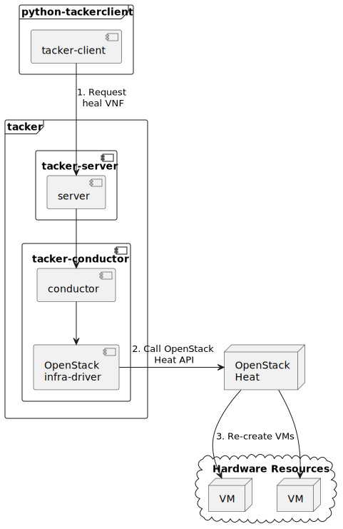

========================
ETSI NFV-SOL VNF Healing
========================

This document describes how to heal VNF in v2 Tacker.

Overview
--------

The diagram below shows an overview of the VNF healing.

1. Request heal VNF

   A user requests tacker-server to heal a VNF or all VNFs with tacker-client
   by requesting ``heal VNF``.

2. Call OpenStack Heat API

   Upon receiving a request from tacker-client, tacker-server redirects it to
   tacker-conductor. In tacker-conductor, the request is redirected again to
   an appropriate infra-driver (in this case OpenStack infra-driver) according
   to the contents of the instantiate parameters. Then, OpenStack infra-driver
   calls OpenStack Heat APIs.

3. Re-create VMs

   OpenStack Heat re-creates VMs according to the API calls.

Prerequisites
-------------

The following packages should be installed:

* tacker
* python-tackerclient

Execute up to "Instantiate VNF" in the procedure of
:doc:`/user/v2/vnf/deployment_with_user_data/index`.
In other words, the procedure after "Terminate VNF" is not executed.

Healing Target VNF Instance
~~~~~~~~~~~~~~~~~~~~~~~~~~~

Assuming that the following VNF instance exists,
this instance will be healed.

.. code-block:: console

  $ openstack vnflcm show VNF_INSTANCE_ID --os-tacker-api-version 2 \
    -f json | jq .'["Instantiated Vnf Info"]'.vnfcInfo

Result:

.. code-block:: console

  [
    {
      "id": "VDU1-ed781426-c59d-4c32-8bc3-e26144167220",
      "vduId": "VDU1",
      "vnfcResourceInfoId": "ed781426-c59d-4c32-8bc3-e26144167220",
      "vnfcState": "STARTED"
    },
    {
      "id": "VDU2-30402dfa-e125-4f8c-a1d1-2a8df3e01987",
      "vduId": "VDU2",
      "vnfcResourceInfoId": "30402dfa-e125-4f8c-a1d1-2a8df3e01987",
      "vnfcState": "STARTED"
    }
  ]

VNF Healing Procedure
---------------------

As mentioned in Prerequisites, the VNF must be instantiated before healing.

Details of CLI commands are described in
:doc:`/cli/cli-etsi-vnflcm`.

There are two main methods for VNF healing.

* Healing of the entire VNF
* Healing specified with VNFC instances

.. note::

  A VNFC is a 'VNF Component', and one VNFC basically
  corresponds to one VDU in the VNF.
  For more information on VNFC, see `NFV-SOL002 v3.3.1`_.

The client can specify the target resources for healing
with two parameters in the API request.

- *vnfcInstanceId* is a list which indicates VNFC instances
  for which a healing action is requested.

- *all* indicates whether network resources and storage resources
  are included in the heal target. This is set in the attribute
  of *additionalParams*.

With the combination of these parameters,
Tacker supports the following patterns of healing.

- Pattern A. *vnfcInstanceId* is included in the request.

  - Pattern A-1. *all = false* is included in the request or *all* is not
    included in the request.

    - Only specified VNFC instances are healed.

  - Pattern A-2. *all = true* is included in the request.

    - Specified VNFC instances and storage resources are healed.

- Pattern B. *vnfcInstanceId* is not included in the request.

  - Pattern B-1. *all = false* is included in the request or *all* is not
    included in the request.

    - All VNFC instances included in the VNF instance are healed.

  - Pattern B-2. *all = true* is included in the request.

    - All resources included in the VNF instance are healed.
      It includes VNFC instances, network resources,
      and storage resources but not external virtual networks.

How to Heal Specified with VNFC Instances
~~~~~~~~~~~~~~~~~~~~~~~~~~~~~~~~~~~~~~~~~

Extract the id of vnfcInfo from 'Instantiated Vnf Info'
in **Healing target VNF instance**.
This is the VNFC instance ID.

This manual shows an example of healing VDU1 as VNFC.
In this manual, **VDU1-ed781426-c59d-4c32-8bc3-e26144167220**
corresponds to the ``vnfcInstanceId`` of VDU1.

When healing specified with VNFC instances, the following
APIs are executed from Tacker to Heat.
See `Heat API reference`_. for details on Heat APIs.

* stack resource mark unhealthy
* stack update

Execute Heat CLI command and check id and status of VDU1
before and after healing.
This is to confirm that the id of some resources have changed
before and after healing, and that the re-creation has been
completed successfully.
See `Heat CLI reference`_. for details on Heat CLI commands.

.. note::

  Note that 'vnfcInstanceId' managed by Tacker and
  'physical_resource_id' managed by Heat are different.

Pattern A-1
^^^^^^^^^^^
- *vnfcInstanceId* is included in the request
- *all = false* is included in the request or *all* is not included
  in the request

VDU1 information before healing:

.. code-block:: console

  $ openstack stack resource show HEAT_STACK_ID VDU1_SERVER_NAME \
    -c physical_resource_id -c resource_name -c resource_status -c resource_type

Result:

.. code-block:: console

  +----------------------+--------------------------------------+
  | Field                | Value                                |
  +----------------------+--------------------------------------+
  | physical_resource_id | ed781426-c59d-4c32-8bc3-e26144167220 |
  | resource_name        | VDU1                                 |
  | resource_status      | CREATE_COMPLETE                      |
  | resource_type        | OS::Nova::Server                     |
  +----------------------+--------------------------------------+

.. code-block:: console

  $ openstack stack resource show HEAT_STACK_ID VDU1_VOLUME_NAME \
    -c physical_resource_id -c resource_name -c resource_status -c resource_type

Result:

.. code-block:: console

  +----------------------+--------------------------------------+
  | Field                | Value                                |
  +----------------------+--------------------------------------+
  | physical_resource_id | 2d4715e6-1e0e-449e-91b5-a6c162adbb39 |
  | resource_name        | VDU1-VirtualStorage                  |
  | resource_status      | CREATE_COMPLETE                      |
  | resource_type        | OS::Cinder::Volume                   |
  +----------------------+--------------------------------------+

Healing execution of VDU1:

.. code-block:: console

  $ openstack vnflcm heal VNF_INSTANCE_ID --vnfc-instance VNFC_INSTANCE_ID \
    --additional-param-file param_file --os-tacker-api-version 2

Result:

.. code-block:: console

  Heal request for VNF Instance df9150a0-8679-4b14-8cbc-9d2d6606ca7c has been accepted.

.. note::

  It is possible to specify multiple VNFC instance IDs in '--vnfc-instance' option.

VDU1 information after healing:

.. code-block:: console

  $ openstack stack resource show HEAT_STACK_ID VDU1_SERVER_NAME \
    -c physical_resource_id -c resource_name -c resource_status -c resource_type

Result:

.. code-block:: console

  +----------------------+--------------------------------------+
  | Field                | Value                                |
  +----------------------+--------------------------------------+
  | physical_resource_id | 83b5c3e0-8dc1-40c8-9aa8-976c43991971 |
  | resource_name        | VDU1                                 |
  | resource_status      | CREATE_COMPLETE                      |
  | resource_type        | OS::Nova::Server                     |
  +----------------------+--------------------------------------+

.. code-block:: console

  $ openstack stack resource show HEAT_STACK_ID VDU1_VOLUME_NAME \
    -c physical_resource_id -c resource_name -c resource_status -c resource_type

Result:

.. code-block:: console

  +----------------------+--------------------------------------+
  | Field                | Value                                |
  +----------------------+--------------------------------------+
  | physical_resource_id | 2d4715e6-1e0e-449e-91b5-a6c162adbb39 |
  | resource_name        | VDU1-VirtualStorage                  |
  | resource_status      | CREATE_COMPLETE                      |
  | resource_type        | OS::Cinder::Volume                   |
  +----------------------+--------------------------------------+

.. note::

  'physical_resource_id' of OS::Nova::Server has changed from the ID
  before healing.
  'physical_resource_id' of OS::Cinder::Volume has not changed from
  the ID before healing.
  'resource_status' transitions to CREATE_COMPLETE.

Pattern A-2
^^^^^^^^^^^
- *vnfcInstanceId* is included in the request
- *all = true* is included in the request

VDU1 information before healing:

.. code-block:: console

  $ openstack stack resource show HEAT_STACK_ID VDU1_SERVER_NAME \
    -c physical_resource_id -c resource_name -c resource_status -c resource_type

Result:

.. code-block:: console

  +----------------------+--------------------------------------+
  | Field                | Value                                |
  +----------------------+--------------------------------------+
  | physical_resource_id | 3395b07e-8c2e-4fb8-a652-f180d03ab284 |
  | resource_name        | VDU1                                 |
  | resource_status      | CREATE_COMPLETE                      |
  | resource_type        | OS::Nova::Server                     |
  +----------------------+--------------------------------------+

.. code-block:: console

  $ openstack stack resource show HEAT_STACK_ID VDU1_VOLUME_NAME \
    -c physical_resource_id -c resource_name -c resource_status -c resource_type

Result:

.. code-block:: console

  +----------------------+--------------------------------------+
  | Field                | Value                                |
  +----------------------+--------------------------------------+
  | physical_resource_id | 2d4715e6-1e0e-449e-91b5-a6c162adbb39 |
  | resource_name        | VDU1-VirtualStorage                  |
  | resource_status      | CREATE_COMPLETE                      |
  | resource_type        | OS::Cinder::Volume                   |
  +----------------------+--------------------------------------+

Healing execution of VDU1:

.. code-block:: console

  $ openstack vnflcm heal VNF_INSTANCE_ID --vnfc-instance VNFC_INSTANCE_ID \
    --additional-param-file param_file --os-tacker-api-version 2

Result:

.. code-block:: console

  Heal request for VNF Instance df9150a0-8679-4b14-8cbc-9d2d6606ca7c has been accepted.

.. note::

  It is possible to specify multiple VNFC instance IDs in '--vnfc-instance' option.

VDU1 information after healing:

.. code-block:: console

  $ openstack stack resource show HEAT_STACK_ID VDU1_SERVER_NAME \
    -c physical_resource_id -c resource_name -c resource_status -c resource_type

Result:

.. code-block:: console

  +----------------------+--------------------------------------+
  | Field                | Value                                |
  +----------------------+--------------------------------------+
  | physical_resource_id | e0ca3bf7-7c3e-477d-8682-81f444f4ab6a |
  | resource_name        | VDU1                                 |
  | resource_status      | CREATE_COMPLETE                      |
  | resource_type        | OS::Nova::Server                     |
  +----------------------+--------------------------------------+

.. code-block:: console

  $ openstack stack resource show HEAT_STACK_ID VDU1_VOLUME_NAME \
    -c physical_resource_id -c resource_name -c resource_status -c resource_type

Result:

.. code-block:: console

  +----------------------+--------------------------------------+
  | Field                | Value                                |
  +----------------------+--------------------------------------+
  | physical_resource_id | bd876ebe-dd91-44d1-830f-99ebd526b854 |
  | resource_name        | VDU1-VirtualStorage                  |
  | resource_status      | CREATE_COMPLETE                      |
  | resource_type        | OS::Cinder::Volume                   |
  +----------------------+--------------------------------------+

.. note::

  'physical_resource_id' of OS::Nova::Server and OS::Cinder::Volume have
  changed from the ID before healing.
  'resource_status' transitions to CREATE_COMPLETE.

How to Heal of the Entire VNF
~~~~~~~~~~~~~~~~~~~~~~~~~~~~~

When healing of the entire VNF and *all = true* is not included in the request,
the following APIs are executed from Tacker to Heat.
See `Heat API reference`_. for details on Heat APIs.

* stack resource mark unhealthy
* stack update

When healing of the entire VNF and *all = true* is included in the request,
the following APIs are executed from Tacker to Heat.
See `Heat API reference`_. for details on Heat APIs.

* stack delete
* stack create

Execute Heat CLI command and check id or status before and after healing.
This is to confirm that the id of some resources have changed
before and after healing, and that the re-creation has been
completed successfully.
See `Heat CLI reference`_. for details on Heat CLI commands.

Pattern B-1
^^^^^^^^^^^
- *vnfcInstanceId* is not included in the request
- *all = false* is included in the request or *all* is not included
  in the request

Stack information before healing:

.. code-block:: console

  $ openstack stack resource show HEAT_STACK_ID VDU1_SERVER_NAME \
    -c physical_resource_id -c resource_name -c resource_status -c resource_type

Result:

.. code-block:: console

  +----------------------+--------------------------------------+
  | Field                | Value                                |
  +----------------------+--------------------------------------+
  | physical_resource_id | e0ca3bf7-7c3e-477d-8682-81f444f4ab6a |
  | resource_name        | VDU1                                 |
  | resource_status      | CREATE_COMPLETE                      |
  | resource_type        | OS::Nova::Server                     |
  +----------------------+--------------------------------------+

.. code-block:: console

  $ openstack stack resource show HEAT_STACK_ID VDU2_SERVER_NAME \
    -c physical_resource_id -c resource_name -c resource_status -c resource_type

Result:

.. code-block:: console

  +----------------------+--------------------------------------+
  | Field                | Value                                |
  +----------------------+--------------------------------------+
  | physical_resource_id | 30402dfa-e125-4f8c-a1d1-2a8df3e01987 |
  | resource_name        | VDU2                                 |
  | resource_status      | CREATE_COMPLETE                      |
  | resource_type        | OS::Nova::Server                     |
  +----------------------+--------------------------------------+

.. code-block:: console

  $ openstack stack resource show HEAT_STACK_ID VDU1_VOLUME_NAME \
    -c physical_resource_id -c resource_name -c resource_status -c resource_type

Result:

.. code-block:: console

  +----------------------+--------------------------------------+
  | Field                | Value                                |
  +----------------------+--------------------------------------+
  | physical_resource_id | bd876ebe-dd91-44d1-830f-99ebd526b854 |
  | resource_name        | VDU1-VirtualStorage                  |
  | resource_status      | CREATE_COMPLETE                      |
  | resource_type        | OS::Cinder::Volume                   |
  +----------------------+--------------------------------------+

.. code-block:: console

  $ openstack stack resource show HEAT_STACK_ID VDU2_VOLUME_NAME \
    -c physical_resource_id -c resource_name -c resource_status -c resource_type

Result:

.. code-block:: console

  +----------------------+--------------------------------------+
  | Field                | Value                                |
  +----------------------+--------------------------------------+
  | physical_resource_id | 379db550-6dad-4e3b-aadb-55dfc4d4c832 |
  | resource_name        | VDU2-VirtualStorage                  |
  | resource_status      | CREATE_COMPLETE                      |
  | resource_type        | OS::Cinder::Volume                   |
  +----------------------+--------------------------------------+

.. code-block:: console

  $ openstack stack resource show HEAT_STACK_ID VDU1_CP_NAME \
    -c physical_resource_id -c resource_name -c resource_status -c resource_type

Result:

.. code-block:: console

  +----------------------+--------------------------------------+
  | Field                | Value                                |
  +----------------------+--------------------------------------+
  | physical_resource_id | cbaf5040-2c4a-4498-a59c-9e6842feb920 |
  | resource_name        | VDU1_CP3                             |
  | resource_status      | CREATE_COMPLETE                      |
  | resource_type        | OS::Neutron::Port                    |
  +----------------------+--------------------------------------+

.. code-block:: console

  $ openstack stack resource show HEAT_STACK_ID VDU2_CP_NAME \
    -c physical_resource_id -c resource_name -c resource_status -c resource_type

Result:

.. code-block:: console

  +----------------------+--------------------------------------+
  | Field                | Value                                |
  +----------------------+--------------------------------------+
  | physical_resource_id | 267161b4-f942-47ce-9aec-c2f5644330f7 |
  | resource_name        | VDU2_CP3                             |
  | resource_status      | CREATE_COMPLETE                      |
  | resource_type        | OS::Neutron::Port                    |
  +----------------------+--------------------------------------+

Healing execution:

.. code-block:: console

  $ openstack vnflcm heal VNF_INSTANCE_ID \
    --additional-param-file param_file --os-tacker-api-version 2

Result:

.. code-block:: console

  Heal request for VNF Instance df9150a0-8679-4b14-8cbc-9d2d6606ca7c has been accepted.

Stack information after healing:

.. code-block:: console

  $ openstack stack resource show HEAT_STACK_ID VDU1_SERVER_NAME \
    -c physical_resource_id -c resource_name -c resource_status -c resource_type

Result:

.. code-block:: console

  +----------------------+--------------------------------------+
  | Field                | Value                                |
  +----------------------+--------------------------------------+
  | physical_resource_id | 918bd443-a764-4f35-96a8-aaebc3a4a05b |
  | resource_name        | VDU1                                 |
  | resource_status      | CREATE_COMPLETE                      |
  | resource_type        | OS::Nova::Server                     |
  +----------------------+--------------------------------------+

.. code-block:: console

  $ openstack stack resource show HEAT_STACK_ID VDU2_SERVER_NAME \
    -c physical_resource_id -c resource_name -c resource_status -c resource_type

Result:

.. code-block:: console

  +----------------------+--------------------------------------+
  | Field                | Value                                |
  +----------------------+--------------------------------------+
  | physical_resource_id | 535d16c6-efd4-435a-af7c-d2caca556b4b |
  | resource_name        | VDU2                                 |
  | resource_status      | CREATE_COMPLETE                      |
  | resource_type        | OS::Nova::Server                     |
  +----------------------+--------------------------------------+

.. code-block:: console

  $ openstack stack resource show HEAT_STACK_ID VDU1_VOLUME_NAME \
    -c physical_resource_id -c resource_name -c resource_status -c resource_type

Result:

.. code-block:: console

  +----------------------+--------------------------------------+
  | Field                | Value                                |
  +----------------------+--------------------------------------+
  | physical_resource_id | bd876ebe-dd91-44d1-830f-99ebd526b854 |
  | resource_name        | VDU1-VirtualStorage                  |
  | resource_status      | CREATE_COMPLETE                      |
  | resource_type        | OS::Cinder::Volume                   |
  +----------------------+--------------------------------------+

.. code-block:: console

  $ openstack stack resource show HEAT_STACK_ID VDU2_VOLUME_NAME \
    -c physical_resource_id -c resource_name -c resource_status -c resource_type

Result:

.. code-block:: console

  +----------------------+--------------------------------------+
  | Field                | Value                                |
  +----------------------+--------------------------------------+
  | physical_resource_id | 379db550-6dad-4e3b-aadb-55dfc4d4c832 |
  | resource_name        | VDU2-VirtualStorage                  |
  | resource_status      | CREATE_COMPLETE                      |
  | resource_type        | OS::Cinder::Volume                   |
  +----------------------+--------------------------------------+

.. code-block:: console

  $ openstack stack resource show HEAT_STACK_ID VDU1_CP_NAME \
    -c physical_resource_id -c resource_name -c resource_status -c resource_type

Result:

.. code-block:: console

  +----------------------+--------------------------------------+
  | Field                | Value                                |
  +----------------------+--------------------------------------+
  | physical_resource_id | cbaf5040-2c4a-4498-a59c-9e6842feb920 |
  | resource_name        | VDU1_CP3                             |
  | resource_status      | CREATE_COMPLETE                      |
  | resource_type        | OS::Neutron::Port                    |
  +----------------------+--------------------------------------+

.. code-block:: console

  $ openstack stack resource show HEAT_STACK_ID VDU2_CP_NAME \
    -c physical_resource_id -c resource_name -c resource_status -c resource_type

Result:

.. code-block:: console

  +----------------------+--------------------------------------+
  | Field                | Value                                |
  +----------------------+--------------------------------------+
  | physical_resource_id | 267161b4-f942-47ce-9aec-c2f5644330f7 |
  | resource_name        | VDU2_CP3                             |
  | resource_status      | CREATE_COMPLETE                      |
  | resource_type        | OS::Neutron::Port                    |
  +----------------------+--------------------------------------+

.. note::

  'physical_resource_id' of OS::Nova::Server has changed from the ID
  before healing.
  'physical_resource_id' of OS::Cinder::Volume and OS::Neutron::Port
  have not changed from the ID before healing.
  'resource_status' transitions to CREATE_COMPLETE.

Pattern B-2
^^^^^^^^^^^
- *vnfcInstanceId* is not included in the request
- *all = true* is included in the request

Stack information before healing:

.. code-block:: console

  $ openstack stack list -c 'ID' -c 'Stack Name' -c 'Stack Status'

Result:

.. code-block:: console

  +--------------------------------------+------------------------------------------+-----------------+
  | ID                                   | Stack Name                               | Stack Status    |
  +--------------------------------------+------------------------------------------+-----------------+
  | cbf6a703-f8fc-441a-9e9d-4f5f723a1e69 | vnf-df9150a0-8679-4b14-8cbc-9d2d6606ca7c | CREATE_COMPLETE |
  +--------------------------------------+------------------------------------------+-----------------+

Healing execution of the entire VNF:

.. code-block:: console

  $ openstack vnflcm heal VNF_INSTANCE_ID \
    --additional-param-file param_file --os-tacker-api-version 2

Result:

.. code-block:: console

  Heal request for VNF Instance df9150a0-8679-4b14-8cbc-9d2d6606ca7c has been accepted.

Stack information after healing:

.. code-block:: console

  $ openstack stack list -c 'ID' -c 'Stack Name' -c 'Stack Status'

Result:

.. code-block:: console

  +--------------------------------------+------------------------------------------+-----------------+
  | ID                                   | Stack Name                               | Stack Status    |
  +--------------------------------------+------------------------------------------+-----------------+
  | 7a53b676-aa9c-4c7d-a8a7-1311646ec7e2 | vnf-df9150a0-8679-4b14-8cbc-9d2d6606ca7c | CREATE_COMPLETE |
  +--------------------------------------+------------------------------------------+-----------------+

.. note::

  'ID' has changed from the ID before healing.
  'Stack Status' transitions to CREATE_COMPLETE.

History of Checks
-----------------

The content of this document has been confirmed to work
using the following VNF Package.

* `basic_lcms_max_individual_vnfc for 2023.2 Bobcat`_

.. _NFV-SOL002 v3.3.1: https://www.etsi.org/deliver/etsi_gs/NFV-SOL/001_099/002/03.03.01_60/gs_nfv-sol002v030301p.pdf
.. _Heat API reference: https://docs.openstack.org/api-ref/orchestration/v1/index.html
.. _Heat CLI reference: https://docs.openstack.org/python-openstackclient/latest/cli/plugin-commands/heat.html
.. _basic_lcms_max_individual_vnfc for 2023.2 Bobcat:
  https://opendev.org/openstack/tacker/src/branch/stable/2023.2/tacker/tests/functional/sol_v2_common/samples/basic_lcms_max_individual_vnfc
