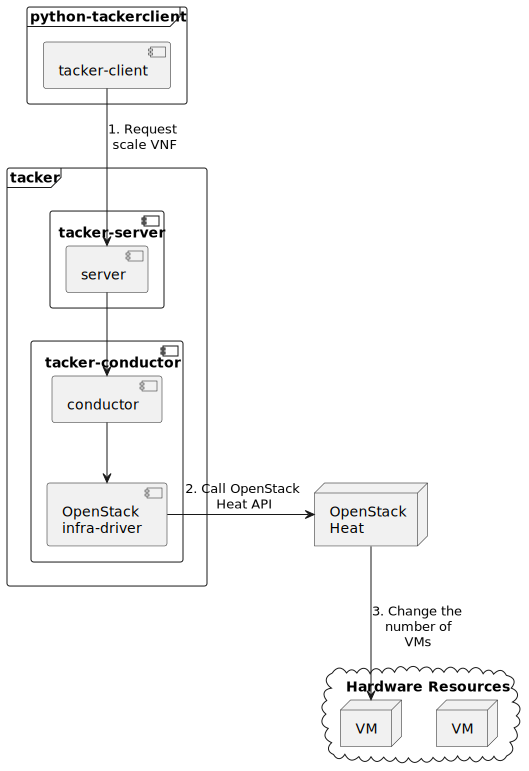

========================
ETSI NFV-SOL VNF Scaling
========================

This document describes how to scale VNF in Tacker v2 API.

Overview
--------

The diagram below shows an overview of the VNF scaling.

1. Request scale VNF

   A user requests tacker-server to scale a VNF or all VNFs with tacker-client
   by requesting ``scale VNF``.

2. Call OpenStack Heat API

   Upon receiving a request from tacker-client, tacker-server redirects it to
   tacker-conductor. In tacker-conductor, the request is redirected again to
   an appropriate infra-driver (in this case OpenStack infra-driver) according
   to the contents of the instantiate parameters. Then, OpenStack infra-driver
   calls OpenStack Heat APIs.

3. Change the number of VMs

   OpenStack Heat change the number of VMs according to the API calls.

.. note::

  Scale-in operation  deletes VNF from the last registered VM.

Prerequisites
-------------

The following packages should be installed:

* tacker
* python-tackerclient

Execute up to "Instantiate VNF" in the procedure of
:doc:`/user/v2/vnf/deployment_with_user_data/index`.
In other words, the procedure after "Terminate VNF" is not executed.

VNF Scaling Procedure
---------------------

As mentioned in Prerequisites, the VNF must be instantiated
before performing scaling.

Details of CLI commands are described in
:doc:`/cli/cli-etsi-vnflcm`.

There are two main methods for VNF scaling.

* Scale out VNF
* Scale in VNF

How to Identify ASPECT_ID
~~~~~~~~~~~~~~~~~~~~~~~~~

In order to execute scaling, it is necessary to specify
ASPECT_ID, which is the ID for the target scaling group.
First, the method of specifying the ID will be described.

ASPECT_ID is described in VNFD included in the VNF Package.
In the following VNFD excerpt, **VDU1_scale**
corresponds to ASPECT_ID.

.. code-block:: yaml

  node_templates:
    VDU1:
      type: tosca.nodes.nfv.Vdu.Compute
      properties:
        name: VDU1
        description: VDU1 compute node
        vdu_profile:
          min_number_of_instances: 1
          max_number_of_instances: 3
      capabilities:
        virtual_compute:
          properties:
            requested_additional_capabilities:
              properties:
                requested_additional_capability_name: m1.tiny
                support_mandatory: true
                target_performance_parameters:
                  entry_schema: test
            virtual_memory:
              virtual_mem_size: 512 MB
            virtual_cpu:
              num_virtual_cpu: 1
            virtual_local_storage:
              - size_of_storage: 3 GB
      requirements:
        - virtual_storage: VDU1-VirtualStorage

  ...snip VNFD...

  policies:
    - scaling_aspects:
        type: tosca.policies.nfv.ScalingAspects
        properties:
          aspects:
            VDU1_scale:
              name: VDU1_scale
              description: VDU1 scaling aspect
              max_scale_level: 2
              step_deltas:
                - delta_1

    - VDU1_initial_delta:
        type: tosca.policies.nfv.VduInitialDelta
        properties:
          initial_delta:
            number_of_instances: 1
        targets: [ VDU1 ]

    - VDU1_scaling_aspect_deltas:
        type: tosca.policies.nfv.VduScalingAspectDeltas
        properties:
          aspect: VDU1_scale
          deltas:
            delta_1:
              number_of_instances: 1
        targets: [ VDU1 ]

    - instantiation_levels:
        type: tosca.policies.nfv.InstantiationLevels
        properties:
          levels:
            instantiation_level_1:
              description: Smallest size
              scale_info:
                VDU1_scale:
                  scale_level: 0
            instantiation_level_2:
              description: Largest size
              scale_info:
                VDU1_scale:
                  scale_level: 2
          default_level: instantiation_level_1

    - VDU1_instantiation_levels:
        type: tosca.policies.nfv.VduInstantiationLevels
        properties:
          levels:
            instantiation_level_1:
              number_of_instances: 1
            instantiation_level_2:
              number_of_instances: 3
        targets: [ VDU1 ]

  ...snip VNFD...

.. note::

  See `NFV-SOL001 v2.6.1`_ annex A.6 for details about ASPECT_ID.

How to Scale Out VNF
~~~~~~~~~~~~~~~~~~~~

Execute Scale CLI command and check the number of stacks
before and after scaling.
This is to confirm that the number of stacks has increased
after Scale-out.
See `Heat CLI reference`_. for details on Heat CLI commands.

Stack information before scale-out:

.. code-block:: console

  $ openstack stack list --nested -c 'ID' -c 'Stack Name' -c 'Stack Status' \
    -c 'Parent' --os-tacker-api-version 2

Result:

.. code-block:: console

  +--------------------------------------+--------------------------------------------------------------+-----------------+--------------------------------------+
  | ID                                   | Stack Name                                                   | Stack Status    | Parent                               |
  +--------------------------------------+--------------------------------------------------------------+-----------------+--------------------------------------+
  | f4221c17-0b42-41c8-af4e-66b15a730275 | vnf-df9150a0-8679-4b14-8cbc-9d2d6606ca7c-VDU1-0-tnyubgoik7ib | CREATE_COMPLETE | cbf6a703-f8fc-441a-9e9d-4f5f723a1e69 |
  | 4533da6b-df2e-44bc-b52c-83c1db74aa3f | vnf-df9150a0-8679-4b14-8cbc-9d2d6606ca7c-VDU2-0-5whajpoqh5uh | CREATE_COMPLETE | cbf6a703-f8fc-441a-9e9d-4f5f723a1e69 |
  | cbf6a703-f8fc-441a-9e9d-4f5f723a1e69 | vnf-df9150a0-8679-4b14-8cbc-9d2d6606ca7c                     | CREATE_COMPLETE | None                                 |
  +--------------------------------------+--------------------------------------------------------------+-----------------+--------------------------------------+

Scale-out VNF can be executed by the following CLI command.

.. code-block:: console

  $ openstack vnflcm scale --type SCALE_OUT --aspect-id VDU1_scale \
    --additional-param-file param_file VNF_INSTANCE_ID --os-tacker-api-version 2

Result:

.. code-block:: console

  Scale request for VNF Instance df9150a0-8679-4b14-8cbc-9d2d6606ca7c has been accepted.

Stack information after scale-out:

.. code-block:: console

  $ openstack stack list --nested -c 'ID' -c 'Stack Name' -c 'Stack Status' \
    -c 'Parent' --os-tacker-api-version 2

Result:

.. code-block:: console

  +--------------------------------------+--------------------------------------------------------------+-----------------+--------------------------------------+
  | ID                                   | Stack Name                                                   | Stack Status    | Parent                               |
  +--------------------------------------+--------------------------------------------------------------+-----------------+--------------------------------------+
  | 10a627b8-afde-4ecc-b44a-2200b733ea2e | vnf-df9150a0-8679-4b14-8cbc-9d2d6606ca7c-VDU1-1-5vvpoq7l2c2k | CREATE_COMPLETE | cbf6a703-f8fc-441a-9e9d-4f5f723a1e69 |
  | f4221c17-0b42-41c8-af4e-66b15a730275 | vnf-df9150a0-8679-4b14-8cbc-9d2d6606ca7c-VDU1-0-tnyubgoik7ib | UPDATE_COMPLETE | cbf6a703-f8fc-441a-9e9d-4f5f723a1e69 |
  | 4533da6b-df2e-44bc-b52c-83c1db74aa3f | vnf-df9150a0-8679-4b14-8cbc-9d2d6606ca7c-VDU2-0-5whajpoqh5uh | UPDATE_COMPLETE | cbf6a703-f8fc-441a-9e9d-4f5f723a1e69 |
  | cbf6a703-f8fc-441a-9e9d-4f5f723a1e69 | vnf-df9150a0-8679-4b14-8cbc-9d2d6606ca7c                     | UPDATE_COMPLETE | None                                 |
  +--------------------------------------+--------------------------------------------------------------+-----------------+--------------------------------------+

Stack details:

.. code-block:: console

  $ openstack stack resource list --filter type=VDU1.yaml cbf6a703-f8fc-441a-9e9d-4f5f723a1e69
  +---------------+--------------------------------------+---------------+-----------------+----------------------+
  | resource_name | physical_resource_id                 | resource_type | resource_status | updated_time         |
  +---------------+--------------------------------------+---------------+-----------------+----------------------+
  | VDU1-0        | f4221c17-0b42-41c8-af4e-66b15a730275 | VDU1.yaml     | UPDATE_COMPLETE | 2023-11-10T04:16:05Z |
  | VDU1-1        | 10a627b8-afde-4ecc-b44a-2200b733ea2e | VDU1.yaml     | CREATE_COMPLETE | 2023-11-10T04:16:04Z |
  +---------------+--------------------------------------+---------------+-----------------+----------------------+

  $ openstack stack resource list --filter type=OS::Nova::Server f4221c17-0b42-41c8-af4e-66b15a730275
  +---------------+--------------------------------------+------------------+-----------------+----------------------+
  | resource_name | physical_resource_id                 | resource_type    | resource_status | updated_time         |
  +---------------+--------------------------------------+------------------+-----------------+----------------------+
  | VDU1          | 3395b07e-8c2e-4fb8-a652-f180d03ab284 | OS::Nova::Server | CREATE_COMPLETE | 2023-11-10T02:58:48Z |
  +---------------+--------------------------------------+------------------+-----------------+----------------------+

  $ openstack stack resource list --filter type=OS::Nova::Server 10a627b8-afde-4ecc-b44a-2200b733ea2e
  +---------------+--------------------------------------+------------------+-----------------+----------------------+
  | resource_name | physical_resource_id                 | resource_type    | resource_status | updated_time         |
  +---------------+--------------------------------------+------------------+-----------------+----------------------+
  | VDU1          | 3851c17e-ff76-445f-8286-12e4e1b0c125 | OS::Nova::Server | CREATE_COMPLETE | 2023-11-10T04:16:06Z |
  +---------------+--------------------------------------+------------------+-----------------+----------------------+

It can be seen that the child-stack (ID: 10a627b8-afde-4ecc-b44a-2200b733ea2e)
with the parent-stack (ID: cbf6a703-f8fc-441a-9e9d-4f5f723a1e69)
is increased by the scaling out operation.

How to Scale in VNF
~~~~~~~~~~~~~~~~~~~

Execute Scale CLI command and check the number of stacks
before and after scaling.
This is to confirm that the number of stacks has decreased
after Scale-in.
See `Heat CLI reference`_. for details on Heat CLI commands.

Stack information before scale-in:

.. code-block:: console

  $ openstack stack list --nested -c 'ID' -c 'Stack Name' -c 'Stack Status' \
    -c 'Parent' --os-tacker-api-version 2

Result:

.. code-block:: console

  +--------------------------------------+--------------------------------------------------------------+-----------------+--------------------------------------+
  | ID                                   | Stack Name                                                   | Stack Status    | Parent                               |
  +--------------------------------------+--------------------------------------------------------------+-----------------+--------------------------------------+
  | 10a627b8-afde-4ecc-b44a-2200b733ea2e | vnf-df9150a0-8679-4b14-8cbc-9d2d6606ca7c-VDU1-1-5vvpoq7l2c2k | CREATE_COMPLETE | cbf6a703-f8fc-441a-9e9d-4f5f723a1e69 |
  | f4221c17-0b42-41c8-af4e-66b15a730275 | vnf-df9150a0-8679-4b14-8cbc-9d2d6606ca7c-VDU1-0-tnyubgoik7ib | UPDATE_COMPLETE | cbf6a703-f8fc-441a-9e9d-4f5f723a1e69 |
  | 4533da6b-df2e-44bc-b52c-83c1db74aa3f | vnf-df9150a0-8679-4b14-8cbc-9d2d6606ca7c-VDU2-0-5whajpoqh5uh | UPDATE_COMPLETE | cbf6a703-f8fc-441a-9e9d-4f5f723a1e69 |
  | cbf6a703-f8fc-441a-9e9d-4f5f723a1e69 | vnf-df9150a0-8679-4b14-8cbc-9d2d6606ca7c                     | UPDATE_COMPLETE | None                                 |
  +--------------------------------------+--------------------------------------------------------------+-----------------+--------------------------------------+

Scale-in VNF can be executed by the following CLI command.

.. code-block:: console

  $ openstack vnflcm scale --type SCALE_IN --aspect-id VDU1_scale \
    --additional-param-file param_file VNF_INSTANCE_ID --os-tacker-api-version 2

Result:

.. code-block:: console

  Scale request for VNF Instance df9150a0-8679-4b14-8cbc-9d2d6606ca7c has been accepted.

Stack information after scale-in:

.. code-block:: console

  $ openstack stack list --nested -c 'ID' -c 'Stack Name' -c 'Stack Status' \
    -c 'Parent' --os-tacker-api-version 2

Result:

.. code-block:: console

  +--------------------------------------+--------------------------------------------------------------+-----------------+--------------------------------------+
  | ID                                   | Stack Name                                                   | Stack Status    | Parent                               |
  +--------------------------------------+--------------------------------------------------------------+-----------------+--------------------------------------+
  | f4221c17-0b42-41c8-af4e-66b15a730275 | vnf-df9150a0-8679-4b14-8cbc-9d2d6606ca7c-VDU1-0-tnyubgoik7ib | UPDATE_COMPLETE | cbf6a703-f8fc-441a-9e9d-4f5f723a1e69 |
  | 4533da6b-df2e-44bc-b52c-83c1db74aa3f | vnf-df9150a0-8679-4b14-8cbc-9d2d6606ca7c-VDU2-0-5whajpoqh5uh | UPDATE_COMPLETE | cbf6a703-f8fc-441a-9e9d-4f5f723a1e69 |
  | cbf6a703-f8fc-441a-9e9d-4f5f723a1e69 | vnf-df9150a0-8679-4b14-8cbc-9d2d6606ca7c                     | UPDATE_COMPLETE | None                                 |
  +--------------------------------------+--------------------------------------------------------------+-----------------+--------------------------------------+

There were two child-stacks(ID: f4221c17-0b42-41c8-af4e-66b15a730275
and ID: 10a627b8-afde-4ecc-b44a-2200b733ea2e) with
a parent-stack(ID: cbf6a703-f8fc-441a-9e9d-4f5f723a1e69),
it can be seen that one of them is decreased by the Scale-in operation.

History of Checks
-----------------

The content of this document has been confirmed to work
using the following VNF Package.

* `basic_lcms_max_individual_vnfc for 2023.2 Bobcat`_

.. _NFV-SOL001 v2.6.1: https://www.etsi.org/deliver/etsi_gs/NFV-SOL/001_099/001/02.06.01_60/gs_NFV-SOL001v020601p.pdf
.. _Heat CLI reference: https://docs.openstack.org/python-openstackclient/latest/cli/plugin-commands/heat.html
.. _basic_lcms_max_individual_vnfc for 2023.2 Bobcat:
  https://opendev.org/openstack/tacker/src/branch/stable/2023.2/tacker/tests/functional/sol_v2_common/samples/basic_lcms_max_individual_vnfc
