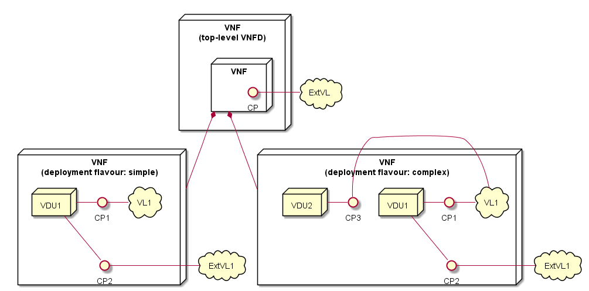

==============================================
VNF Descriptor (VNFD) based on ETSI NFV-SOL001
==============================================

This document describes how to create your VNFD files based on ETSI
`NFV-SOL001 v2.6.1`_. The VNFD is modelled by using one or more TOSCA service
template as defined in `TOSCA-Simple-Profile-yaml-v1.2`_. The VNFD is a
component of a VNF package and takes YAML format files.

The VNFD is composed of four different kinds of files:

**Type definition files** - define properties of each resource.
**Topology template files** - describe the actual design of VNF.

#. ETSI NFV types definition file
#. User defined types definition file
#. top-level topology template file
#. topology template file with deployment flavour

Example:

.. code-block::

  Definitions/
        !---- etsi_nfv_sol001_common_types.yaml
        !---- etsi_nfv_sol001_vnfd_types.yaml
        !---- vnfd_top.yaml
        !---- vnfd_df_1.yaml
        !---- ..
        !---- vnfd_df_x.yaml
        !---- vnfd_types.yaml

Deployment flavour model
------------------------

To design VNF with a VNFD, "deployment flavour model" is helpful. An example
of the model is shown below:

The *top-level topology template file* describes the abstract design of VNF.
In the example, the VNF has a Connection Point (CP) to an External Virtual
Link (ExtVL). The CP and Virtual Link (VL) are mapped to a Port and a Virtual
network, respectively.

The actual design of VNF is described in *topology template files with*
*deployment flavour*. In the example, two different deployment flavours,
"simple" and "complex" are provided. The "simple" has only a Virtualised
Deployment Unit (VDU), which represents a VM while the "complex" has two VDUs.
It is possible to design plural topologies for a VNF with deployment flavour.
The deployed topology is specified with a deployment flavour ID in the
Instantiation request parameter.

Type definition files
---------------------

Type definition files contain all required "Types" appeared in **service**
**template files**. The resources described in **topology template files** are
defined as "Types" in **type definition files**.

There are nine groups of type definition in `NFV-SOL001 v2.6.1`_.

* Data Types: ``data_types``
* Artifact Types: ``artifact_types``
* Capability Types: ``capability_types``
* Requirements Types: ``requirements_types``
* Relationship Types: ``relationship_types``
* Interface Types: ``interface_types``
* Node Types: ``node_types``
* Group Types: ``group_types``
* Policy Types: ``policy_types``

1. ETSI NFV types definition file
^^^^^^^^^^^^^^^^^^^^^^^^^^^^^^^^^

ETSI NFV provides two types definition files [1]_ which contain all defined
type definitions in `NFV-SOL001 v2.6.1`_. These files are generally imported
from *top-level service template file*.

* `etsi_nfv_sol001_common_types.yaml`_
* `etsi_nfv_sol001_vnfd_types.yaml`_

2. User defined types definition file
^^^^^^^^^^^^^^^^^^^^^^^^^^^^^^^^^^^^^

Users can extend their own types definition from `NFV-SOL001 v2.6.1`_. In most
cases, Users need to extend ``tosca.nodes.nfv.VNF`` to define your VNF node
types. The contents in the file are:

* **tosca_definitions_version** - is always "tosca_simple_yaml_1_2".
* **description** - is the description of the file.
* **imports** - are the types definition files from ETSI NFV.
* **node_types** - is the key to describe the extension of
  ``tosca.nodes.nfv.VNF`` to define your VNF.
* (optional) **data_types** - is the key to define your own data types.

The ``tosca.nodes.nfv.VNF`` type described in **node_types** field is defined
in section 6.8.1 in `NFV-SOL001 v2.6.1`_. Its required properties are:

* *descriptor_id* - is "VNFD ID" and required when creating VNF instance.
* *descriptor_version* - is version of the VNFD.
* *provider* - is name of provider who provide the VNFD.
* *product_name* - is name of the VNF.
* *software_version** - is version of the software for the VNF.
* *vnfm_info* - is identifies VNFM(s) compatible with the VNF described in
  this version of the VNFD. The default can be "Tacker".
* *flavour_id* - is ID of deployment flavour to be used in Instantiation.
* *flavour_description* - is description of the deployment flavour. The
  default can be "" (empty string).

Topology template files
-----------------------

The topology template files describe the topology of VNF. The topology is
defined with the following contents:

* **tosca_definitions_version** - is always "tosca_simple_yaml_1_2".
* **description** - is the description of the file.
* **imports** - are the types definition files from ETSI NFV and the user
  defined types definition file.
* **topology_template** - describe the topology of VNF with node templates.

The **topology_template** field is defined in section 3.9 in
`TOSCA-Simple-Profile-yaml-v1.2`_. All keys are optional, but some keys are
important to describe the topology:

* (optional) *description* - is the description of file.
* *inputs* - is a list of input parameters.
* *node_templates* - is a list of node template definitions.
* (optional) *relationship_templates* - a list of relationship templates.
* *groups* - is a list of group definitions whose members are node templates
  defined within the same topology template.
* *policies* - is a list of policy definitions.
* *outputs* - is a list of output parameters.
* *substitution_mappings* - is a declaration that exports the topology
  template as an implementation of a node type.
* (optional) *workflows* - is a map of imperative workflow definition for the
  topology template.

3. Top-level topology template file
^^^^^^^^^^^^^^^^^^^^^^^^^^^^^^^^^^^

The *top-level topology template file* describes the abstract design of VNF.
In this file, the ``node_template`` is provided with user defined VNF type
derived from ``tosca.nodes.nfv.VNF``. The file includes:

* **tosca_definitions_version**: tosca_simple_yaml_1_2
* **description**: A description of this file.
* **imports**

  * `etsi_nfv_sol001_common_types.yaml`_
  * `etsi_nfv_sol001_vnfd_types.yaml`_
  * <user defined types definition files>

* **topology_template**

  * *inputs*:

    * selected_flavour: The deployment flavour selected in Instantiation

  * *node_templates*:

    * <name of VNF>:

      * type: The user defined VNF Type derived from ``tosca.nodes.nfv.VNF``
      * properties:

        * descriptor_id: The VNFD ID created by User
        * descriptor_version: The version of VNFD
        * provider: The name of provider
        * product_name: The name of product
        * software_version: The version of VNf software
        * vnfm_info: ["Tacker"]
        * flavour_id: { get_input: selected_flavour }

      * requirements: The properties provided in lower-level topology template
        with a deployment flavour

.. note:: The required properties are defined in section 6.8.1 in
          `NFV-SOL001 v2.6.1`_. The ``flavour_description`` is provided in the
          lower-level topology template and not included here.

4. Topology template file with deployment flavour
^^^^^^^^^^^^^^^^^^^^^^^^^^^^^^^^^^^^^^^^^^^^^^^^^

The lower-level topology template provides a deployment flavour ID and its
detailed design of VNF. The abstract design of VNF with user defined VNF Type
is referred from ``substitution_mappings`` key and also added some properties
in ``node_templates``. The ``node_templates`` field contains the detailed
resources such as VDU and CP. The file includes:

* **tosca_definitions_version**: tosca_simple_yaml_1_2
* **description**: A description of this file.
* **imports**

  * etsi_nfv_sol001_common_types.yaml
  * etsi_nfv_sol001_vnfd_types.yaml
  * <user defined types definition files>

* **topology_template**

  * *inputs*:

    * descriptor_id: The VNFD ID created by User
    * provider: The name of provider
    * product_name: The name of product
    * software_version: The version of VNf software
    * descriptor_version: The version of VNFD
    * vnfm_info: The identifies VNFM(s) compatible
    * flavour_id: The deployment flavour ID
    * flavour_description: The description of deployment flavour.

  * *substitution_mappings*:

    * node_type: The user defined VNf Type
    * properties:

      * flavour_id: The deployment flavour of this file

    * requirements:

      * virtual_link_external: A list of CP and VL for external network

  * *node_template*:

    * VNF resource
    * VDU resources
    * CP resources
    * VL resources
    * Other resources

  * *policies*:

    * Scaling resources
    * Affinity resources
    * Other resources

.. note:: The requirements field in *substitution_mappings* describes external
          network topology for the abstract VNF. In the case of example in
          deployment flavour section, ``virtual_link_external`` can be a list
          of [CP, ExtVL].

.. TODO(yoshito-ito): add links to the examples of VNFD.

.. [1] https://forge.etsi.org/rep/nfv/SOL001

.. _TOSCA-Simple-Profile-yaml-v1.2 : http://docs.oasis-open.org/tosca/TOSCA-Simple-Profile-YAML/v1.2/TOSCA-Simple-Profile-YAML-v1.2.html
.. _NFV-SOL001 v2.6.1 : https://www.etsi.org/deliver/etsi_gs/NFV-SOL/001_099/001/02.06.01_60/gs_NFV-SOL001v020601p.pdf
.. _etsi_nfv_sol001_common_types.yaml : https://forge.etsi.org/rep/nfv/SOL001/raw/master/etsi_nfv_sol001_common_types.yaml
.. _etsi_nfv_sol001_vnfd_types.yaml : https://forge.etsi.org/rep/nfv/SOL001/raw/master/etsi_nfv_sol001_vnfd_types.yaml
